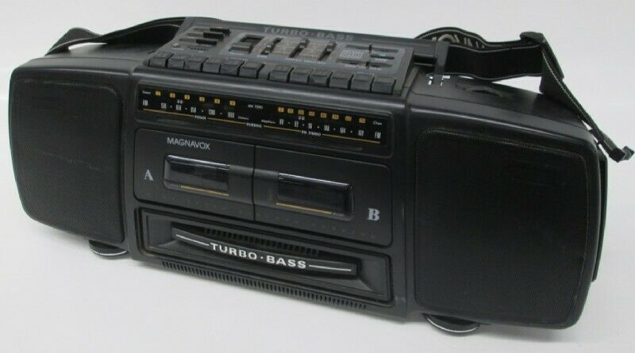
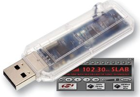
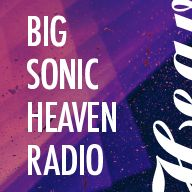
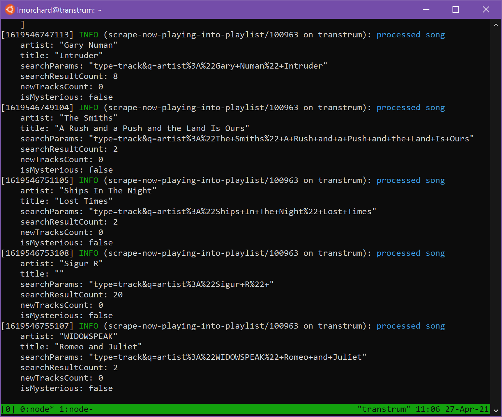

**TL;DR**: A little over a year ago, one of my favorite radio DJs, Darren Revell, started up a new streaming radio station named [Big Sonic Heaven]. I got the idea to try building [a Spotify playlist collected from the music he plays][big-sonic-heaven-spy]. My [quick & dirty program][bsh-scraper] for doing that turned 1-year-old on April 24 and the playlist has collected over 2000 songs, so far.

[Big Sonic Heaven]: https://www.bigsonicheaven.com/
[big-sonic-heaven-spy]: https://open.spotify.com/playlist/1xBbvEJrf5HycEZbwn04o1?si=NB3ytTzuQqqyIztLQf0odw

<!--more-->

<nav role="navigation" class="table-of-contents"></nav>

## The heyday of Big Sonic Heaven

Back in the mid-90s, a Detroit-area radio DJ named Darren Revell started a show called [Big Sonic Heaven][bsh-wikipedia]. It aired every Sunday night for "four sonic hours" on 96.3 FM with playlists full of shoegaze, dream pop, trip hop, and Britpop. Some electronica and Goth tunes often found their way into rotation, too.

It ran for about 8 years until 2003 and covered an interesting chunk of my life: from mid-college, through my first years as a bachelor, and ending around when I met the girl who [I'd later marry][wedding].

So, not only does the general musical space of Big Sonic Heaven claim enormous tracts of my psyche, but I have a lot of life events scored by it as well.

[wedding]: https://blog.lmorchard.com/2006/06/09/wedding-day-is-today/

Early on, I would often set up a boombox with a kitchen timer to record the show. With having to get up early for class or work on Monday mornings, I usually couldn't catch it live. But, I'd have at least part of the show ready on tape for the next day.

In the early period of the show, internet radio and MP3 downloads from the web weren't really things yet. I could sometimes find someone posting playlists from the show [on LiveJournal][bsh-livejournal], so I took notes on what to dig for whenever I hit the record store.

[bsh-livejournal]: https://bigsonic-heaven.livejournal.com/

At some point after college, I managed to acquire a USB FM radio. That let me upgrade my recording rig to .wav files dumped to my hard drive. For awhile, I had some automation to burn the show overnight as a set of 30-minute-long .mp3s to a CD-RW that I could play in the car on the way to work and on my PC at my desk.

I really wish I had saved more of those recordings, though: I tended to reuse the same CD-RW every week and wiped out the previous burn. And, since HD space was at a premium back then, I didn't keep many of the shows around anyway.

## Revivals of Big Sonic Heaven

And then, [the show was off the air][bsh-gone]. I think Darren still ran some club nights in the Detroit area for a few years, but eventually he moved off to California and I lost track of him for a long while.

[bsh-gone]: https://bigsonic-heaven.livejournal.com/5625.html

The Big Sonic Heaven shaped hole in my life kind of got filled by a few streaming stations, some of which were themselves inspired by the original. Podcasts appeared as that started to become a thing, some also inspired by Big Sonic Heaven.

In particular, I remember [Strangeways Radio], Auralgasms Radio ([now defunct][auralgasms]), and I think some stations on [RadioIO] before it became whatever it is now.

Around 2007, I heard that Big Sonic Heaven was back on the radio on Indie 103.1 out in Los Angeles. By this point, you could stream just about any terrestrial station, so it was really cool to catch the show again! Then, that station went dark.

A year or so later, in a neat little twist, Big Sonic Heaven [resurfaced briefly][bsh-strangeways] on [Strangeways Radio]. After that, it rebooted as a podcast for awhile before fading.

Then, last year - just in time for our pandemic lockdown - Darren Revell's [Big Sonic Heaven re-emerged as a 24/7 streaming radio station][Big Sonic Heaven].

[auralgasms]: https://twitter.com/auralgasms/status/7106192490
[radioio]: https://en.wikipedia.org/wiki/Radioio
[strangeways radio]: https://www.strangewaysradio.com/
[bsh-wikipedia]: https://en.wikipedia.org/wiki/Big_Sonic_Heaven
[bsh-strangeways]: http://motorcityblog.blogspot.com/2010/07/big-sonic-heaven-returns.html

## Picking up old packrat habits

Probably sounds a bit dramatic, but this music has kind of gotten me through the last year. I stopped listening to my own Spotify playlists and just put on Big Sonic Heaven in my home office every day. I spent some long hours over last summer in my backyard with my phone & laptop playing the station non-stop.

The neat thing about all the returns of Big Sonic Heaven over the years has always been that Darren doesn't just lean on old playlists. Every version of the show has been a mix of classics and new stuff he's found. Given the past few years of Big Sonic Heaven revivals never quite lasting long, I started to get kind of itchy again in an amateur-archivist way.

As it turns out, it's really impractical to try recording & squirreling away a 24/7 radio stream. But, I've spent years now [playing with Spotify playlists][my-playlists] like they're mixtapes.

I even threw one together [based on old copies of Big Sonic Heaven playlists][bsh-manual-playlist] that I'd dug up, years ago. Not a perfect substitute, but it worked pretty well.

[spotify-api-search]: https://developer.spotify.com/documentation/web-api/reference/#category-search
[spotify-api-playlists]: https://developer.spotify.com/documentation/web-api/reference/#category-playlists
[scraping]: https://www.google.com/search?q=site:blog.lmorchard.com+scraping
[recently-played]: https://widgets.autopo.st/widgets/public/DR66/recentlyplayed.php
[my-playlists]: https://open.spotify.com/user/lmorchard/playlists
[bsh-manual-playlist]: https://open.spotify.com/playlist/4Xg0WBY32T9AQkIm3rUpfq?si=pFYJz34nTW2qLtPRDOXq2w

## I miss the age of Mashups

With [this new streaming station][big sonic heaven], though, I noticed that the website added [a "Recently Played" widget][recently-played]. I could watch that to expand my old playlist with new music. But, oh wait: Why build a playlist by hand? I can make a robot do it for me!

Some things occurred to me:

1. Spotify has an API that includes [search][spotify-api-search] and [playlist management][spotify-api-playlists]
1. I am [well versed in the ways of web scraping][scraping].

Along with all this audio nostalgia, I also kind of miss [the Age of Web 2.0 Mashups from 2006 or so][web20-mashups]. So, I decided to spend a little time tinkering.

What I came up with is [a big hairball of JavaScript][bsh-scraper]. It does the following every minute or so:

1. [loads the contents of a Spotify playlist into memory](https://github.com/lmorchard/bsh-now-playing-scraper/blob/6495dd737a196498b2d82e745d58cef8006e1b81/scrape-now-playing-into-playlist.js#L26)
1. [fetches the Big Sonic Heaven "Recently Played" widget](https://github.com/lmorchard/bsh-now-playing-scraper/blob/6495dd737a196498b2d82e745d58cef8006e1b81/scrape-now-playing-into-playlist.js#L51)
1. [attempts to parse the HTML into a list of artist & title pairs](https://github.com/lmorchard/bsh-now-playing-scraper/blob/6495dd737a196498b2d82e745d58cef8006e1b81/scrape-now-playing-into-playlist.js#L56-L69)
1. [does a few arbitrary bits of cleanup from things I noticed](https://github.com/lmorchard/bsh-now-playing-scraper/blob/6495dd737a196498b2d82e745d58cef8006e1b81/scrape-now-playing-into-playlist.js#L74)
1. [tries searching Spotify for each song recently played](https://github.com/lmorchard/bsh-now-playing-scraper/blob/6495dd737a196498b2d82e745d58cef8006e1b81/scrape-now-playing-into-playlist.js#L112-L115)
1. [filters out any songs that are already in the playlist](https://github.com/lmorchard/bsh-now-playing-scraper/blob/6495dd737a196498b2d82e745d58cef8006e1b81/scrape-now-playing-into-playlist.js#L121-L123)
1. [adds any newly-seen songs to the playlist](https://github.com/lmorchard/bsh-now-playing-scraper/blob/6495dd737a196498b2d82e745d58cef8006e1b81/scrape-now-playing-into-playlist.js#L127-L134)
1. [stashes failed song searches for later review](https://github.com/lmorchard/bsh-now-playing-scraper/blob/6495dd737a196498b2d82e745d58cef8006e1b81/scrape-now-playing-into-playlist.js#L137-L141)

[bsh-scraper]: https://github.com/lmorchard/bsh-now-playing-scraper/blob/master/scrape-now-playing-into-playlist.js
[web20-mashups]: https://www.windley.com/archives/2006/05/mashups_web_dat.shtml

After just a few hours of tinkering and refinement, the thing was working well enough to set to running on a Raspberry PI in a tmux session and forget about it. I figured it wouldn't be too rude to either the Big Sonic Heaven web servers or the Spotify API, seeing as it only does its thing every minute.

I checked in on it after a week or so - and I was shocked to find it had assembled a playlist of over 1000 unique songs!

It wasn't perfect - occasionally it would mistake something for a Backstreet Boys song. But still, after the initial flood of songs, it would still pick up at dozen or so new songs every day I left it running over the course of about 8 months.

The only reason it didn't run for a full year was thanks to a power outage and my neglecting to restart the tmux session that had hosted it. I'm really good at forgetting about personal projects as I flit from shiny to shiny thing. But, a couple of weeks ago, it occurred to me to check on it and maybe give it a kick.

At this point, the playlist is up to 2177 songs - 160 hours and 39 minutes of music according to Spotify's count. And from a quick scroll through the songs, I'd say the script is doing pretty well at finding real hits.

Dang, this DJ's repetoire is ridiculous!

<iframe class="lazyload fullwidth" data-src="https://open.spotify.com/embed/playlist/1xBbvEJrf5HycEZbwn04o1" width="300" height="380" frameborder="0" allowtransparency="true" allow="encrypted-media"></iframe>

## What next?

I don't really have any next steps for this thing. It turned a year old just a few days ago and it's done it's job far better than I'd imagined it would. I wanted to collect all the songs - and that's what it did! The only thing I can think of doing is to maybe tweak the script to stash a local backup of the playlist.

But, I'm a paying Spotify customer and they haven't cut me off yet. Big Sonic Heaven is still playing 24/7 and I'm [a Patreon supporter][bsh-patreon]. The script doesn't need any care or feeding. So, I'll probably keep it running and keep [the playlist][big-sonic-heaven-spy] growing as long as I can.

Granted, a playlist is no substitute for a real DJ, but maybe you'll enjoy what 160+ sonic hours sounds like.

[bsh-patreon]: https://www.patreon.com/bigsonicheaven
