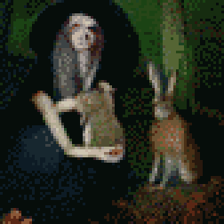

{{../../../_includes/flash-fiction-blurb.md}}

<!--more-->

Without thinking, Korrine made her father's bones whole. Only after did it occur to her that she might have made a mistake. 

She'd spent long hours alone, out in the woods, where she thought Marek couldn't see. When she sat still and closed her eyes, she could feel the life all around her. Flitting and leaping and sprinting and creeping and hiding - and often, when she opened her eyes, she was surrounded by calm, quiet animals.

Once, a hare had crawled into her lap. Docile and trusting but very ill. She stroked the hare's ears and looked inside. Life's pattern within was tangled. Sluggish and blocked. 

Korrine teased the snags apart like brushing a horse's mane. The hare's pulse quickened. Life bloomed within the little creature - the doe's own and seven more sparks all brightening. When the girl opened her eyes, the pregnant doe sprang into the air and scampered around Korrine in a circle before sprinting off into the trees. 

She felt an urge to hide what she could do. She barely understood it. She couldn't have imagined that stern Marek would look upon it kindly.

And yet, his arm healed, Marek smiled. He laughed. He even began to cry. That scared her more that anything.

"You would have brought your mother joy," said Marek. "You bring me great joy."

Then, it was Korrine's turn to cry. 

## Prompt

[Take a look at my Labyrinthos Tarot Reading!](https://app.labyrinthos.co/reading/ppf/SSTRWS/40,9,34)

