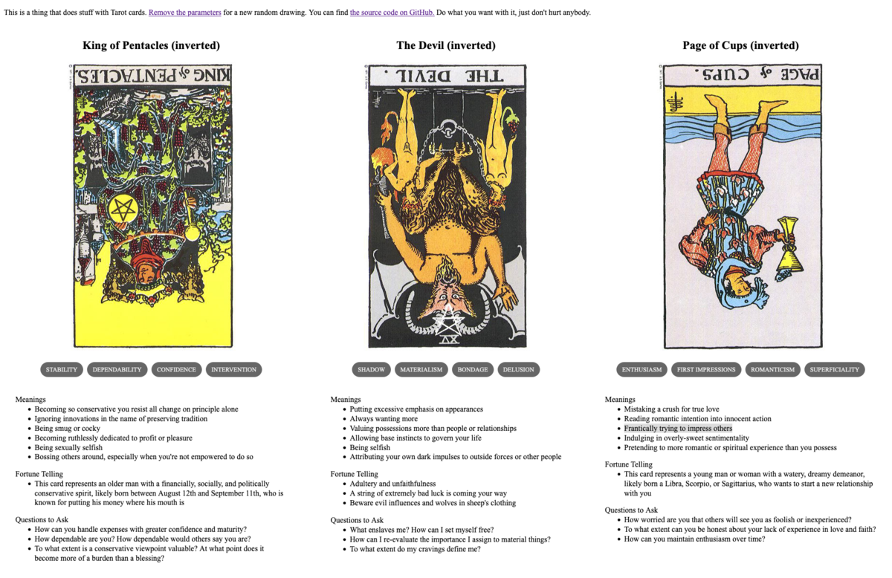

{{../../../_includes/flash-fiction-blurb.md}}

<!--more-->

<figure class="wide"></figure>

Rowan stood behind the pulpit, gazing out at 50,000 packed seats arranged in section after section radiating away from the amphitheater stage in semi-circular tiers rising to the rafters. He took an amplified breath and the crowd dropped to near silence in an instant. When he smiled, he knew even the nosebleed seats could see his head and shoulders projected as gigantic twin holograms above the stage.

"Welcome, friends," he boomed. "It heartens me so, seeing you all gathered here today as we continue the work of preparing the immortal Shards we all harbor for Reunion Day."

He swept both arms toward the congregation with palms upturned, baring his chest to all. A cheer rose up from the pews as all returned the gesture, thousands and thousands opening up to him. 

"Now," he said, the crowd again dropping instantly to silence, "some of you may have heard of a new idea out there." 

Scattered boos and hisses came in response. He smiled magnanimously and, after a few beats, waved the tumult down. 

"Yes, yes," he said, nodding and catching a few eyes. He knew the holograms above were augmented with effects to make folks feel like he saw them each, personally. Happy murmurs rose. 

"It is true: there are folks out there who do not share in our work. But, my friends, they harbor precious immortal Shards just as we all do.

"Therefore, it is our charge to grant kindness and welcome to those misguided unfortunates as well. It is our burden to ready their Shards, too—for we know the Truth of the Shattered Divine and the shame is ours to bear if we fail them on Reunion Day."

Solemn nods all around. He nodded back, gazing again from face to face.

"Now," he said, "let us read from Avery, chapter 12, verse 27 to clarify our shared resolve in the mission that lies ahead." A sussuration in the crowd as folks synced their various tablets and glasses to his text feed. 

He took a deep breath and sighed. The new individualist sect out there couldn't have come along at a better time. Seats had gone empty and donations gone flat in recent weeks. He'd actually started to worry. 

But, an Enemy was just the thing he needed. 
## Prompt

A 3-card spread from my [Tarot Thing](https://lmorchard.github.io/tarot-thing/?card=%21King+of+Pentacles&card=%21The+Devil&card=%21Page+of+Cups)

