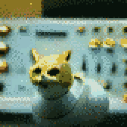

{{../../../_includes/flash-fiction-blurb.md}}

<!--more-->

The ship kept dropping out of hyperspace.

That was a problem, because it tended to happen in the middle of my sleep shift. Even worse, it tended to happen in the middle of the Captain's sleep shift.

He'd get paged by the computer—and then he'd page me. We'd both get up and go to the bridge. Maintenance bots would scatter out of our way into ducts. He'd glower over my shoulder as I paged through the logs, seeing no errors. I reviewed the bridge security cam footage, seeing only maintenance bots milling around until we showed up. Then, I'd push the button to jump back into hyperspace. The ship would continue on course and we'd go back to our respective beds.

The first time it happened, it was a surprise. The second time, a suspicious annoyance. The third time, the Captain went back to bed, but told me to keep my ass on the bridge. I pulled a boring all-nighter with three pots of coffee. We kept flying the whole time without mishap. Thinking it was a fluke, he gave me the next day off.

The fourth time it happened, the Captain was pissed. Normally, the engines were quiet and reliable. That let our little skeleton crew all sleep the same shift. But, given this new quirk, he ordered us all onto a shift rotation. That way, the bridge would stay occupied around the clock. Of course, I got the late shift.

I looked through the logs again. Before, I'd filtered for errors and warnings. This time I just skimmed through the logs without filters, calling up all the verbose debug and info events. There was something: Every time we dropped out of hyperspace, it registered as a manual command.

The next day, I called everyone into the galley and ran through the logs. Did anyone touch the controls during the night? *No.* Was anyone a sleepwalker? *No.* Did we have a stowaway? *No.* Did we have a ghost? *You're falling apart man, get some sleep.*

The next night, I fully dismantled the bridge control panels. I checked every knob and button. I replaced the entire hyperspace interface assembly. That panel ran warm, but well within spec for the computing modules mounted underneath. The Captain came on shift to find me only about half-way through reassembling everything. He gave me the stink-eye and sent me to bed.

I had plenty of quiet nights to work the problem. While the bridge was occupied, we sailed for days on end through hyperspace, no problem. What I did notice, though, was that the bridge became a pigsty. Drink bulbs and snack bar wrappers everywhere from folks on shifts before me. I picked up the mess, but it kept accumulating.

I thought about complaining to the Captain, but then it occurred to me: The ship's maintenance bots were trained to avoid the crew. They did most of the light cleaning, including picking up clutter like wrappers. I guess my crewmates had gotten used to being slobs, because the bots always took care of it. But, if the bridge was always occupied, then the bots never came around.

So, okay: people on the bridge, no bots, hyperspace worked fine. Maybe there was a connection?

Reviewing the bridge security cam footage again, I finally saw it: One of the maintenance bots trotted across the control panels, over to the hyperspace station. It circled twice—and then *curled up and laid down atop the hyperspace emergency stop plunger*. Every time we'd dropped out of hyperspace, the same bot did the same thing.

I tracked the bot down and dragged it into the workshop down in engineering. Someone—not me—had given it a firmware update. As it turned out, that someone was the Captain.

The next day, I politely requested his presence in the galley for coffee. I pointed at the bot's upgrade history on my tablet and asked, "What the fuck, sir?"

He looked sheepish and explained. He'd bought a novelty firmware. It included a behavioral model trained in part from domestic housecats. He said it was cute, this bot would chase a laser for him. It let him pet it in his lap while he wrote his trip reports. It also enjoyed lying on warm control panels every night—especially atop the hyperspace emergency stop plunger.

It might have been the sleep deprivation, but I didn't have the heart to give the bot a factory reset. The Captain really did seem smitten with it. I couldn't modify the emergency plunger, either: safety regulations required that it remain a big, red, easily smackable thing that could double as a cat pillow. 

I rummaged through some engineering spares. I found a nice resistive heating mat meant for the fuel cells. Wrapped that in a bit of fleece and set it up in the Captain's quarters. It took a bit of coaxing, but eventually that bot switched to curling up there at the foot of the Captain's bunk. Problem solved and I got some sleep.
