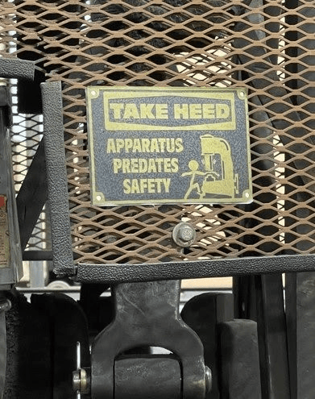

**TL;DR**: Another week, another weeknotes post. Talking about web components, Fastmail cleanup, garden irrigation, Revision 2025, and some other random crap! Someday, I'll figure out how to make these summaries more exciting!

<!--more-->

<figure class="wide">
  
  <figcaption>Yeah, I know: I keep using gen AI images. But, I like the fox, chicken, corn thing.</figcaption>
</figure>

<nav role="navigation" class="table-of-contents"></nav>

## Miscellanea

<figure class="inset right">

<figcaption>
TAKE HEED: APPARATUS PREDATES SAFETY 

(stolen from [a libi rose](https://masto.hackers.town/@rose_alibi@post.lurk.org/114387872704382637)   (stolen from [daily timewaster](https://dailytimewaster.blogspot.com/2022/05/always-watch-out-for-yourself.html?m=1)))
</figcaption>
</figure>

- Some days, I miss `cgi-bin` web development.
- I've been idly considering getting a pair of Crocs as house shoes. It just occurred to me that I could 3D print gewgaws and charms for them. This is a troublesome realization.
- These weeknotes could be broken up into multiple blog posts, budding off when various notions expand into more than bullet points. Maybe I'll think about that? I don't want to overthink the process, though.
- Been working distractedly on [Pebbling Club](https://github.com/lmorchard/pebbling-club) for about 8 months now. It's deployed and operational to the point that I've been posting [all my own bookmarks](https://pebbl.ing/u/lmorchard) with it. I've had vague designs of getting it up to snuff and inviting other folks to use it, but life and general motivation have not been amenable.
- Might be interesting to post a weekly dump of links I've bookmarked, kind like [del.icio.us did back in the day](http://localhost:9980/2006/02/08/links-for-2006-02-09/index.html) with auto-posting via XML-RPC.
- These [3D printed doors for Ikea shelves](https://www.youtube.com/watch?v=yLYvsIWRTa4) are pretty cool, and he even shared the [Kallax-compatible version on Printables.com](https://www.printables.com/model/1264555-ikea-kallax-cabinet-doors) (That could have been in a bookmark post!)
- The [Revision 2025 demoscene party](https://2025.revision-party.net/) was last weekend and it was full of awesome. <figure><iframe width="315" height="177" src="https://www.youtube.com/embed/6p0GDWiacQ8?si=NfLsIiOCWchTwunM" title="YouTube video player" frameborder="0" allow="accelerometer; autoplay; clipboard-write; encrypted-media; gyroscope; picture-in-picture; web-share" referrerpolicy="strict-origin-when-cross-origin" allowfullscreen></iframe><figcaption>This [little demo](https://demozoo.org/productions/371274/) runs in a WASM-based fantasy console called [microw8](https://exoticorn.github.io/microw8/)!</figcaption></figure>

## Sketches as Web Components

For years, I've tinkered with game development on the web. But, I haven't finished (m)any games. So, I decided to just focus more on finishing little interesting sketches of graphics and sound. This time around, I'm playing with portals—er, I mean Web Components:

What's really neat (to me) is that I took [a web sketch from a few years ago](https://lmorchard.github.io/sketches-v01/sketches/2021/vector-avatars/index.html), then [reshuffled all the code into a web component](https://github.com/lmorchard/sketches-v03/blob/main/src/sketches/VectorAvatar/VectorAvatar.js). Published that [to GitHub Pages](https://lmorchard.github.io/sketches-v03/) and now I can use it in other places. Like, in CodePens and blog posts like this one!

<figure>
<iframe height="300" style="width: 100%;" scrolling="no" title="Untitled" src="https://codepen.io/lmorchard/embed/gbbgLNN?default-tab=html%2Cresult" frameborder="no" loading="lazy" allowtransparency="true" allowfullscreen="true">
  See the Pen <a href="https://codepen.io/lmorchard/pen/gbbgLNN">Testing cross-site inclusion of my web component sketches</a> by Les Orchard (<a href="https://codepen.io/lmorchard">@lmorchard</a>)
  on <a href="https://codepen.io">CodePen</a>.
</iframe>
<figcaption>Someday, I should make my own local codepen component 🤔</figcaption>
</figure>

<figure>

<vector-avatar></vector-avatar>
<vector-avatar></vector-avatar>
<vector-avatar></vector-avatar>
<vector-avatar></vector-avatar>
<vector-avatar></vector-avatar>

<figcaption>If you view source or inspect this page, you can see I used the web component right here!</figcaption>
</figure>

The other thing I'm trying is splitting the difference on build / no-build: The external dependencies get bundled up into shared reusable modules with code splitting for cache-friendliness. The rest of my code is ES modules loaded straight up by the browser.

If, on some inevitable day, the build tools fail, I should just be able to take a snapshot of the last good bundles and keep trucking on.

## Fastmail Pobox Cleanup

Back in 2015, [Fastmail bought Pobox](https://www.fastmail.com/blog/fastmail-acquires-pobox-and-listbox/). I missed it at the time - or just forgot about it since. But, credit to all involved, because I haven't noticed a thing in the intervening decade!

Then, last year, [Fastmail decided to sunset Pobox](https://www.fastmail.com/blog/sunsetting-pobox/). This, I noticed, barely. I was a customer of both and already had a Fastmail account at the time. As part of the acquisition, they created a second new Fastmail account for me with all my Pobox email forwarding aliases carried over. Awkward, since thereafter my real inbox lived in one account but all my aliases lived in another.

Now, about 6 months later, I finally decided to try merging that second new account into the first. I managed to move over one of my domains and all my aliases except one. Turns out the last domain and alias are my most important - me@lmorchard.com

As an aside, I'm tempted to find a different email forwarding service. The main reason I used Pobox was to keep addresses separate from inbox provider. This, as an intentional egg basket load balancing move.

The path to my inbox used to go through my DNS hosting provider, email forwarding provider, and then to several email inboxes - each of those was backed by a different company. Though I have no practical complaints, I just now realize that Fastmail and Pobox merging has reduced my egg basket count. 🤔

I've heard horror stories of folks entirely dependent on Google for domain (i.e. gmail.com), address (i.e. you@gmail.com), and inbox (i.e. GMail). In this scenario, if Google bans your account - by mistake or for some reason unrelated to email - you lose access to everything everywhere. For example, [the Terraria developer who cancelled his Stadia port over losing access to everything Google](https://arstechnica.com/gadgets/2021/02/terraria-developer-cancels-google-stadia-port-after-youtube-account-ban/). Does a password reset email make a sound if you're not allowed into the woods to hear it?

Anyway, for now, I did figure out how to clean things up without a support ticket:

1) Rename second account from me@lmorchard.com to lmorchard2@fastmail.com - which they allowed in settings

2) Delete alias me@lmorchard.com on second account

3) Delete the domain lmorchard.com from the second account

4) Add the domain lmorchard.com and alias me@ to my primary account

5) Triple check that my MX, CNAME, and TXT records for lmorchard.com were all correct

All the renaming and deleting shenanigans in that specific order turned out necessary to ensure the right things were freed up at the right points in sequence. Can't add domain to first account while another account has it. Can't remove domain while aliases are still using it. Can't remove alias while account is still named after it. All in all, a minor [fox, chicken, corn puzzle](https://www.mathsisfun.com/chicken_crossing.html).

## Garden Irrigation Automation 

I've never had a particularly green thumb. But, we've got a small garden plot next to the house and we decided we want to start growing some things. Well, actually, we've been trying to do that over the past few years. A problem is that we get busy and forget to water.

Well, I discovered that the previous homeowners had installed tubing that runs from the side of the house, under a walkway, emerging up into the garden plot. Almost like they knew what they were doing.

So, I ordered a [small irrigation starter kit from Dripworks](https://www.dripworks.com/garden-bed-irrigation-kit-small) and finished setting it up this weekend. I might have gone overboard, but it's just a series of tubes. The water seems to be going where we intend and not everywhere else, so that's a good sign.

And there's a timer, so that we don't have to remember much, thus addressing the original problem. Also, it's not connected to the internet, so it won't go rogue when the AGI takeover comes. Alas, that does mean I need to go outside to check on it from time to time. I'd be lying if there wasn't a part of me tempted to find some ESP32 widget or other to at least get it on our LAN.

<image-gallery>

![[IMG_8369.jpeg]]
![[IMG_8367.jpeg]]
![[IMG_8364.jpeg]]
![[IMG_8365.jpeg]]
![[IMG_8366.jpeg]]

</image-gallery>

There goes another week! 

Anyway, that's a week. I think I like this format. Started off with random notes in Obsidian on Monday, then added a little polish and a few new web components on Friday. Hoping I can keep it up and improve over time. Going to take it week by week, but it would be nice if this stuck as a habit.
