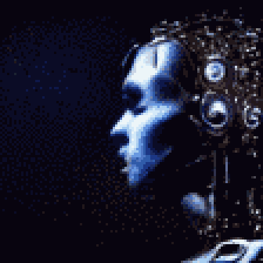

**TL;DR**: Recently, I lost a grandparent and a pet. Such reconfigurations are difficult to process.

<!--more-->

"The machine is grieving," she said, leaning over his shoulder and squinting at the fast-scrolling screen.

His brow furrowed. "Dumb question: How can a machine grieve?"

"Well," she said, "you see all these queued job retries and threshold alerts. They keep erroring out because the site no longer exists, but the machine hasn't yet accepted that it's gone. So, it keeps reaching out for metrics and trying to initiate function calls."

"Weird metaphor," he said, "but it's obviously chewing up resources and compute cycles. Next dumb question: Have we tried telling the machine that the site is indeed gone?"

She chuckled. "Yeah, first thing we did. It rejected the assertion. When we repeated the input, it flagged one of the incident responders for abuse and blocked their next login. Kind of seemed like we pissed it off."

"Wait," he said, "isn't there just, like, a configuration file you can tweak to take the site out of rotation?"

"Uh huh," she said, "but this orchestration system isn't fully deterministic. It's backed by a learning model. The config files are just a statement of our desired end-state - it's up to the system to figure out how to get there from wherever things are now."

"Whew, yeah, it's been awhile since I was in ops." He blew out some air in a lip trill. "Back in my day, we had a few reconciliation loops, but we mostly had to write the transitions by hand."

She sighed. "So, yeah, now I see the machine is asking for address updates for the missing site. If this follows the Kübler-Ross model, we'll probably see an overall performance dip for awhile, followed by a gradual drop-off of queries to the missing site."

"Kübler-Ross... where have I heard that name before?"

"Elisabeth Kübler-Ross. Stages of grief. We're in bargaining, headed for depression, and then hopefully acceptance."

He turned to look at her. "C'mon. Really?"

"That site was problematic for awhile," she said. "It kept throwing bad sectors and throttling. We never quite figured out why - maybe bad hardware or something environmental? But, the orchestrator spent a lot of time fussing over a scheme of input filters and partition maps to work around the faults. I think it became habitually fond of caring for the site."

"You don't really mean the machine cares, right?"

She shrugged. "We can split linguistic hairs, but I think description fits the behavior. That site figured heavily in the orchestrator's ongoing considerations. Having gone abruptly missing must have been a perturbing signal that led it into this degenerate state."

He nodded. "I think I see where you're going. It's like when folks grieve for a lost pet."

She nodded back. "I'm not sure how the orchestrator got its initial training before we installed it. If the corpus covered human behavior in caring for sick animals, for example, then it could follow a process modelled after that."

He sighed. "I figured, back when I switched into management, that I'd have to help some folks through rough times. But, it never occurred to me that the definition of 'folks' might expand to include pieces of data center infrastructure."

She laughed. "Well, there's a reason I double-majored in compsci and psychology."

"So, if the machine is grieving, there's not much we can do to speed this up, right?"

"Not much, no. I'm thinking we need to let it resolve on its own. If you look at the logs now, you can see it's reviewing a bunch of archived metrics and analyzing trends. I think it's trying to figure out what it did wrong. That sounds like the tail end of bargaining."

He squinted at the logs again. "And there it goes starting to garbage collect a bunch of stale relays tagged for the missing site. Oof, and there's the overall performance dip you predicted. You think we can call this depression?"

She shrugged. "If I had to guess, yeah. The bad news is that latency and throughput are going to crap out for awhile. But, if it continues to follow the grief model, it should start to improve later today or tomorrow. We just have to give it space and time. We can probably pull in a few spare racks to compensate."

He nodded. "I kind of wish I could tell the machine it did everything right."

"Maybe that'll come in the next model revision."
