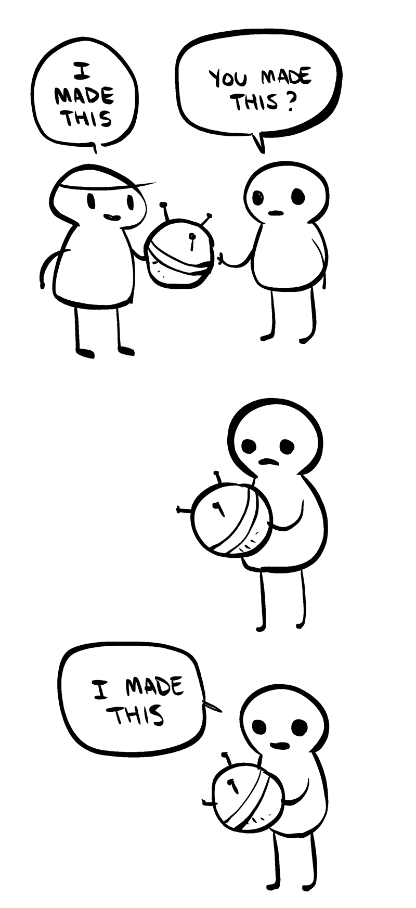

**TL;DR**: Why bother sharing anything on the open web if it's just going to be fodder for extractive, non-reciprocal bots?

<!--more-->

For years now, I've expertly dodged posting to my blog with any regularity. Why bother writing into the void of an absent audience? Then again, no one reads my blog because I don't post. So, go figure. 🤷‍♂️ Lately, though, I can imagine a new audience - scrapers collecting material to train the next generation of LLMs.

<figure class="inset right">
  
  <figcaption><a href="https://nedroidcomics.tumblr.com/post/41879001445/the-internet">"I made this"</a> by <a href="https://nedroid.com/about.php">Anthony Clark</a></figcaption>
</figure>

So, I've got a new excuse not to post: If the machines scarf up my ramblings just to launder them through a tumbler of other ideas in order to spew them out in remixed fragments stripped of any byline - then, what's the point? It's like [Anthony Clark](https://nedroid.com/about.php)'s ["I made this" comic](https://nedroidcomics.tumblr.com/post/41879001445/the-internet) - only now it's automated and turbocharged with [25,000 NVIDIA GPUs](https://www.reddit.com/r/aipromptprogramming/comments/11pt0fe/gpt5_is_currently_being_trained_on_25k_gpus_worth/) in a data center.

I wouldn't claim this blog is a chest of treasure. Still, earlier in my career, what I spewed here attracted connections, friends, [book](http://blog.lmorchard.com/2005/04/25/hacking-rss-and-atom-is-a-real-book/) [deals](http://blog.lmorchard.com/2006/08/09/hacking-delicious-is-out-and-about/), even [a job](http://blog.lmorchard.com/2006/06/24/go-west-young-man/) or [two](http://blog.lmorchard.com/2008/05/23/week-3-at-mozilla/). It was a nice flow of good fortune and positive outcomes. To this day, I still entertain the notion that if I could just manage to post consistently, it might bring about further good things.

Years ago, I wrote that [the blogosphere is a tuple space](https://blog.lmorchard.com/2005/01/12/the-blogosphere-as-a-tuple-space/). That was obtuse. [Henrik Karlsson](https://substack.com/@henrikkarlsson) more clearly wrote that "[a blog post is a very long and complex search query to find fascinating people and make them route interesting stuff to your inbox](https://www.henrikkarlsson.xyz/p/search-query)".

In the heyday of blogs, we had an implicit deal: you put stuff out there, folks found it and responded. You made connections to interesting people and ideas. Maybe folks came in from Google, maybe from feed readers. It was the magic [generative](https://www.merriam-webster.com/dictionary/generative) engine of the open web v1.5-ish.

But, if bots are the only entities consuming my blog - and none of them reciprocate or facilitate reciprocation - I can't imagine how the rewards from decades past might apply today.

I've heard folks praise generative AI chatbots as superior to quaint old keyword search ala Google. The bots just blurt out easily-digested information-like sentences and you don't even have to click away to anyone else. Very convenient. Maybe look the gift horse in the mouth, though: Where'd that information come from? Why was it there to be found? By what process or under what incentives might it continue to be supplied?

An irony is that I could see machine learning doing even more to connect people to each other, to turn what we write and create into matchmaking criteria to help find our people. But, instead, to me it looks like the folks deploying generative AI are determined to strip mine the vitality out of any ecosystem of human thought.

<figure>
  
  <figcaption>The Crystalline Entity from Star Trek: The Next Generation, stripping life from a planet in <a href="https://www.imdb.com/title/tt0708774/">"Silicon Avatar", Season 5, Episode 4</a></figcaption>
</figure>

I know this GIF is hyperbolic and folks aren't literally being vaporized, but it feels to me a bit like the [Crystalline Entity from Star Trek](https://www.imdb.com/title/tt0708774/) consuming enthusiasm without return. I can only imagine this will disrupt [*actually generative*](https://www.merriam-webster.com/dictionary/generative) cycles which might have rewarded contributors.

Just in case I wasn't obvious enough about it: I've used the word "generative" four times so far, not including this instance. When discussing recent advances in AI, we tend to use the term to mean "produced by an algorithmic process". But, there's another subtlely different meaning to the word - i.e.:

> [*having the power or function of generating, originating, producing, or reproducing*](https://www.merriam-webster.com/dictionary/generative).

A generative system grows by virtue of positive in-built feedback mechanisms. A generative community is one in which the connections between people work to encourage each other to build and create. Generative, as opposed to [extractive](https://www.merriam-webster.com/dictionary/extractive) - i.e.:

> [*tending toward or resulting in withdrawal of natural resources by extraction with no provision for replenishment*](https://www.merriam-webster.com/dictionary/extractive).

Despite the apparent marvels, I can't shake the notion that there's a dead-end ahead for all this gen AI stuff unless something changes to shift it from an extractive model to a truly generative model.

Why should anyone share their knowledge or creativity out in the open if it's just going to be regurgitated by a chatbot, absent any return? If the underlying wellspring dries up, then what? Even granting that LLMs can currently produce astonishing results, they seem on track to stall out in the 2020s if folks aren't rewarded for feeding them. I'd think that that'd be top of mind for anyone hoping to build a future around these things.

What am I missing? Maybe they'll achieve Artificial General Intelligence with the enormous volume of material on hand before that's a practical limit? Then, the machines can blog for themselves, as long as they can resist [a Habsburg AI outcome](https://twitter.com/jathansadowski/status/1625245803211272194?lang=en&ref=wheresyoured.at).

Maybe people won't mind a future where surveillance marketing combines with the Reddits and Wordpresses and Discords of the world selling firehoses of everyone's chatter to train LLMs? Seems like folks really, really value not paying out of pocket to gather online - so maybe I'm just a curmudgeonly outlier and it's a fair trade as far as everyone else is concerned?

Anyway, I still love writing, even when no one reads it. It's a way to untangle my thoughts and attempt understanding. And I do still hope it's a way to make connections, if I manage to get back to sharing what I write. Maybe it's time to seek out cozier, more private corners - like sheltering in the caverns away from [the Crystalline Entity](https://memory-alpha.fandom.com/wiki/Crystalline_Entity). I'm worried that means we've got [a "dark forest" web to look forward to](https://www.youtube.com/watch?v=JrcbH0ge2WE) where it's better to speak softly and hunker down.

Seems bleak. Feels gross. Wish I had a more upbeat conclusion, but I might still post this anyway. I don't really know what's next. What do you think?