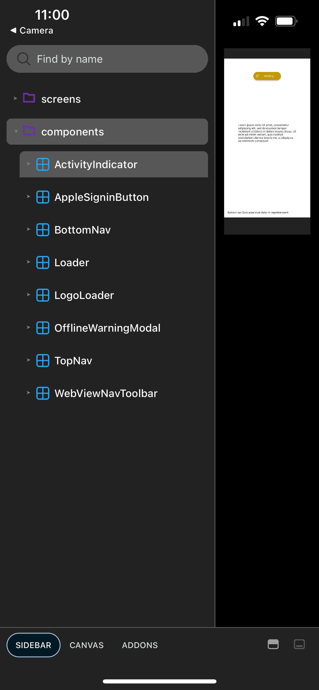

**TL;DR**: I like deploying robots to include more of the team in our core development loop

<!--more-->

Although it's very dangerously close to [Yak Shaving](https://blog.lmorchard.com/2016/08/31/yak-shaving-habits/), a thing I really enjoy doing is taking a dive deep into tools & automations for a project at work. In a job interview, I'd tell you that's because I learned the value of being a "force multiplier" from [Douglas Engelbart's ABCs of Organizational Improvement](https://dougengelbart.org/content/view/192/).

<figure class="inset right">
  
  <figcaption>A photo of my Shaven Yak figurine from Ren & Stimpy</figcaption>
</figure>

And, while that's not untrue, I also like [Rube Goldberg machines](https://en.wikipedia.org/wiki/Rube_Goldberg_machine) that tell me I did a good job - especially if there are great big green checkmarks involved. ✅

## Empowering teammates with robots

Besides getting praise from robots 🤖, I also like deploying them in systems to include more of the team in our core development loop.

For example, in web development, an evergreen problem is where you have to run the whole stack on your laptop just to get a look at work in progress.

But, there are usually other folks on the team who *don't* primarily code or fuss with servers for a living - e.g. product managers, designers, writers, researchers, et al. I'd like to empower these folks to help contribute to the development process just as easily as any coder.

## Storybook

A lightweight tool I've used toward this end is [Storybook](https://storybook.js.org/). It helps you build a browsable catalog of pre-defined scenarios for web UI components - kind of a cross between unit tests and a style guide.

<figure class="fullwidth">
  
  <figcaption>A screenshot of <a href="https://storybook.js.org/">Storybook</a></figcaption>
</figure>

The catch is that it only really exercises the client-side frontend, in isolation from the server-side backend. Still, you can mock up scenarios which might be accessible only through tediously arranged circumstances on the full application stack.

The neat trick, though, is that Storybook can [generate a static web site](https://storybook.js.org/docs/sharing/publish-storybook#build-storybook-as-a-static-web-application). That's inevitably cheaper to deploy and keep available than a full replica of a live production environment. In fact, it's so cheap that I've built GitHub Actions workflows to publish Storybook snapshots to GitHub Pages for every commit in a busy project and the system never broke a sweat.

Here's an example workflow from one of my work projects, which builds a Storybook snapshot and publishes it to GitHub Pages for a subset of branches. The only real hacky part is hitting the GitHub API to derive the base URL for the project's GitHub Pages site, but the rest is straightforward:

```yaml
name: "Build & Deploy Storybook"
on:
  push:
    branches:
      - 'main'
      - 'preview/**'
permissions:
  contents: write
  checks: write
  pages: write
  statuses: write
jobs:
  storybook:
    runs-on: ubuntu-latest
    defaults:
      run:
        working-directory: appserver
    steps:
      - uses: actions/checkout@v3
      - name: Setup Node.js
        uses: actions/setup-node@v3
        with:
          node-version: "lts/*"
          cache: "yarn"
          cache-dependency-path: "appserver/yarn.lock"
      - name: Install Dependencies
        run: yarn install
      - name: Build Storybook
        run: yarn build-storybook
      - name: Deploy Storybook
        uses: JamesIves/github-pages-deploy-action@v4
        with:
          folder: appserver/storybook-static
          target-folder: storybooks/${{ github.head_ref || github.ref_name }}/
      - name: Get Github Pages Base URL
        env:
          GITHUB_TOKEN: ${{ secrets.GITHUB_TOKEN }}
        run: |
          githubPagesUrl="$(gh api "repos/$GITHUB_REPOSITORY/pages" --jq '.html_url')"
          echo 'GITHUB_PAGES_URL='$githubPagesUrl >> $GITHUB_ENV
      - name: Create Status Check
        uses: Sibz/github-status-action@v1
        with:
          authToken: ${{ secrets.GITHUB_TOKEN }}
          sha: ${{ github.event.pull_request.head.sha || github.sha }}
          state: 'success'
          context: 'Storybook Deployment'
          description: 'Storybook Deployment for ${{ github.head_ref || github.ref_name }}'
          target_url: '${{ env.GITHUB_PAGES_URL }}storybooks/${{ github.head_ref || github.ref_name }}/index.html'
```

The great thing about a workflow like this is every commit maps to a URL with a preview of the work. Here, that's used to set a [GitHub Status Check](https://docs.github.com/en/pull-requests/collaborating-with-pull-requests/collaborating-on-repositories-with-code-quality-features/about-status-checks) result for the commit.

So, anyone on the team with a browser can click the "Details" link to preview the work and chime in with review comments. (By the way, have you clicked on the little green checkmark for a commit in GitHub? Lots of interesting info behind there.)


## React Native and Expo

So, that's all fine for web applications - but what about mobile apps? This came up for me last Fall, when our team decided to pivot from a web-based experience to [an installable iOS app in the Store](https://apps.apple.com/us/app/mozilla-didthis/id6468680088).

In building this app, I chose to go with [React Native](https://reactnative.dev/) and [Expo](https://docs.expo.dev/) as the foundation. This seemed like a good idea [to further leverage our React chops](https://blog.lmorchard.com/2015/07/22/react-multiplatform/) and [maybe even reuse some code](https://blog.lmorchard.com/2015/09/21/react-native-android/).

One of the things I've found frustrating is getting development builds onto teammates' devices on a regular cadence. Apple and Google both have mechanisms for installing in-progress app builds, but they have their quirks & limitations.

Building atop React Native, though, [Expo Updates](https://docs.expo.dev/eas-update/how-it-works/) offers some particular architectural advantages:

<figure>
  
  <figcaption>A diagram showing <a href="https://docs.expo.dev/eas-update/how-it-works/">the native and update layers of an Expo App</a></figcaption>
</figure>

One half of an Expo app is a native runtime shell that hosts the JavaScript engine and bindings to native capabilities. The other half is a bundle of JavaScript and application assets executed by the runtime shell. The runtime shell is least likely to change.

So, Expo Updates makes it easy to swap in fresh revisions of the application bundle without having to rebuild the whole application - i.e. ["Over the Air" updates](https://docs.expo.dev/eas-update/how-it-works/#publishing-an-update). Since it fetches these bundles via URL from the web, that makes deploying new bundles *almost* as easy as updating a static web site.

Maybe you can see where I'm going with this?

## Expo Go and Storybook

<figure class="inset right">
  
  <figcaption>A screenshot of Expo Go on my iPhone running a Storybook build</figcaption>
</figure>

Relatedly, [Expo Go](https://docs.expo.dev/get-started/expo-go/) is a fun utility app in this ecosystem: Since many apps use a common subset of native capabilities, it's reasonable to build a big, common kitchen-sink runtime that supports most of what you might want to use in an app.

You wouldn't really want to distribute your app with this runtime, per se. But, if you squint a certain way, Expo Go looks like a peculiar kind of web browser - it lets your device load application code on demand via URL or QR code.

And, as it turns out, [Storybook also supports React Native](https://storybook.js.org/tutorials/intro-to-storybook/react-native/en/get-started/). It provides a pre-built component that renders the browsable catalog of application scenarios right on your device. From there, you can change the component used as the entry point via an environment variable during build.

## Expo Application Services and GitHub Actions

Putting this all together led me to another set of GitHub Actions - I can build *two* app bundles for every commit: One builds the app proper, while the other builds it in Storybook mode.

Rather than publishing to GitHub Pages, though, these workflows take advantage of [Expo Application Services](https://expo.dev/eas) (or EAS). There's a lot more to it but, in a nutshell, you can use EAS to host application bundles at unique URLs tagged with various bits of metadata useful for over-the-air updates.

The really neat part, though, is that you can get a QR code for each application bundle uploaded to EAS. And that, in turn, can be automatically posted as a comment in a Pull Request - thus making it easy for any teammate to point their phone's camera at the PR to preview the work-in-progress using Expo Go! 

Here's what that looks like in a Pull Request:

<figure>
  
  <figcaption>Screenshot of a GitHub Pull Request with QR codes for Expo Go in comments</figcaption>
</figure>

These QR codes might even work for you, if you install Expo Go on your own device. Since [the app's already released](https://apps.apple.com/us/app/mozilla-didthis/id6468680088), I don't think I'm revealing any secrets by including these.

Your mileage may vary, though, by the time you read this. Our server-side APIs may have moved on from compatibility with this particular app build, or the builds may eventually get garbage collected from the EAS servers.

Here's a peek at the GitHub Actions workflow for building the normal application bundle:

```yaml
name: "Build Expo Preview for PR"
on:
  pull_request:
jobs:
  tests:
    uses: ./.github/workflows/tests.yml
  preview:
    needs: tests
    permissions:
      contents: read
      pull-requests: write # Allow comments on PRs
    runs-on: ubuntu-latest
    steps:
      - name: 🏗 Setup repo
        uses: actions/checkout@v3
      - name: 🏗 Setup Node
        uses: actions/setup-node@v3
        with:
          node-version: 18.x
          cache: yarn
      - name: 🏗 Setup EAS
        uses: expo/expo-github-action@v8
        with:
          eas-version: latest
          token: ${{ secrets.EXPO_TOKEN }}
      - name: 📦 Install dependencies
        run: yarn install
      - name: 🚀 Create preview
        id: preview
        env:
          EXPO_PUBLIC_GIT_TAG: ${{ github.sha }}
        uses: expo/expo-github-action/preview@v8
        with:
          command: eas update --auto --branch=pr-${{ github.event.number }}
          comment: false
      - name: Comment PR
        uses: thollander/actions-comment-pull-request@v2
        with:
          comment_tag: preview-app-build
          message: |
            🚀 **App** [preview update](${{ steps.preview.outputs.link }}) is ready for use with [Expo Go](https://expo.dev/expo-go):

            <a href="${{ steps.preview.outputs.link }}"></a>
```

And, here's the YAML for the Storybook workflow:

```yaml
name: "Build Expo Storybook for PR"
on:
  pull_request:
env:
  EXPO_PUBLIC_STORYBOOK_ENABLED: true
jobs:
  tests:
    uses: ./.github/workflows/tests.yml
  preview:
    needs: tests
    permissions:
      contents: read
      pull-requests: write # Allow comments on PRs
    runs-on: ubuntu-latest
    steps:
      - name: 🏗 Setup repo
        uses: actions/checkout@v3
      - name: 🏗 Setup Node
        uses: actions/setup-node@v3
        with:
          node-version: 18.x
          cache: yarn
      - name: 🏗 Setup EAS
        uses: expo/expo-github-action@v8
        with:
          eas-version: latest
          token: ${{ secrets.EXPO_TOKEN }}
      - name: 📦 Install dependencies
        run: yarn install
      - name: 🚀 Create preview
        id: preview
        uses: expo/expo-github-action/preview@v8
        with:
          command: eas update --auto --branch=pr-${{ github.event.number }}-storybook
          comment: false
      - name: Comment PR
        uses: thollander/actions-comment-pull-request@v2
        with:
          comment_tag: preview-storybook-build
          message: |
            📓 **Storybook** [preview update](${{ steps.preview.outputs.link }}) is ready for use with [Expo Go](https://expo.dev/expo-go):

            <a href="${{ steps.preview.outputs.link }}"></a>
```

You can see that these workflows are essentially identical - except for some unique IDs and flipping the `EXPO_PUBLIC_STORYBOOK_ENABLED` variable to `true` during the Storybook build.

Also, using the `comment_tag` option of the [`thollander/actions-comment-pull-request@v2`](https://github.com/thollander/actions-comment-pull-request) step with distinct values (e.g. `preview-app-build` vs `preview-storybook-build`) means the workflow will edit those existing comments on subsequent builds - rather than posting new comments every time.

The end result of these workflows were that, all along the journey of getting this app ready for [an App Store release](https://apps.apple.com/us/app/mozilla-didthis/id6468680088), everyone on the team with an iPhone could scan a QR code to pull up a preview of any branch in progress and chime in with comments and suggestions. We also got a lot of early bug reports, since everyone on the team had a slightly different device model with fun edge cases to exercise.

## Summing up

The central notion is that I like making it easier to include the whole team in review cycles during feature development. It doesn't even have to be that hard - the implementations I describe here were mainly just hacking and gluing things together. It can be quick & dirty, but the payoff can be huge for empowering everyone to contribute.
