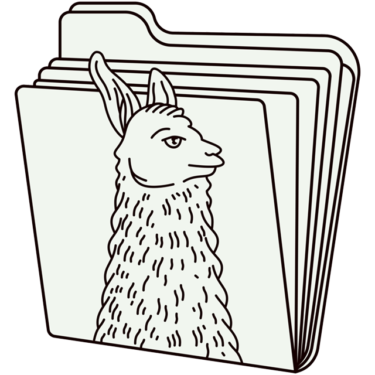

**TL;DR**: In [my previous post][], I used local models with PyTorch and Sentence Transformers to roughly cluster ideas by named topic. In this post, I'll try that again, but this time with Llamafile.

<!--more-->

<figure class="fullwidth">
  
  <figcaption>I asked DALL-E to generate "a an image of astronauts riding llamas to herd ideas from deep space into clusters". Then, I ran a few imagemagick transformations on it for fun.</figcaption>
</figure>

<nav role="navigation" class="table-of-contents"></nav>

## Organizing notes in FigJam

If you've been following along, then you know what inspired this series of posts is a feature in Figma's [FigJam][] tool.

It has an "organize" feature [which uses AI]((https://www.theverge.com/2023/11/7/23950667/figma-figjam-generative-ai-design-tools-beta-announcement)) to group stickies into named clusters.

I'm getting a lot of blog-mileage out of this little video:

<figure class="fullwidth">
  <video controls>
    <source src="./figjam-sorting-demo.mp4" type="video/mp4" />
    <a href="./figjam-sorting-demo.mp4">figjam-sorting-demo.mp4</a>
  </video>
  <figcaption>A quick demo of FigJam's sticky organization feature - it's more legible in fullscreen view</figcaption>
</figure>

## How's it work?

I still don't know how [FigJam][] implements this feature. But, here's how I'm doing it:

1. map the notes as points in a semantic space using [vector embeddings][]
1. apply [k-means clustering][] to group nearby points in space
1. map points back to groups of notes, then use a [large language model][] to generate labels

My first two swings at this turned out not terrible, so I'm pretty hopeful another variation on the theme will yield something interesting.

## Play along at home

If you want to follow along like [last time][my previous post], here's a notebook to run in your own environment:

- [topic_clustering_with_llamafile.ipynb](./topic_clustering_with_llamafile.ipynb)

And, for this post especially, I'd emphasize the value of running everything on your own hardware. Hopefully that makes more sense as we take a look at [Llamafile][].

## Introducing Llamafile

What's a [Llamafile][], you might ask?

<figure class="inset right">
  
  <figcaption>The Llamafile logo, it looks a bit smug?</figcaption>
</figure>

It's a [large language model][] that's been bundled up with the code to run it. This bundle is a standalone executable created in [a very clever way][cosmopolitan], such that the *exact same file* works across many different operating systems and hardware combinations.

In other words, the same downloaded file can run on Windows, MacOS, and Linux. It even supports acceleration on GPUs from Nvidia, AMD, and Apple - which itself a pretty neat trick, since a lot of ML & AI tools are limited to Nvidia hardware.

I find this near-universal binary handy, because it means I can run this stuff on both my work-issued MacBook Pro and my AMD-based gaming PC sitting in the next room over.

(I don't actually have any Nvidia hardware on hand, which is a bit awkward for this stuff. 😅)

## Acquiring a Llamafile

There's a growing pile of ready-made Llamafiles available. For this post, I'm going to focus on essentially the same model that I used in [my previous post][] - i.e. [TinyLlama](https://huggingface.co/jartine/TinyLlama-1.1B-Chat-v1.0-GGUF).

Here's a link to download the particular flavor I'll use in this post:

- [`TinyLlama-1.1B-Chat-v1.0.Q4_0.llamafile`](https://huggingface.co/jartine/TinyLlama-1.1B-Chat-v1.0-GGUF/blob/main/TinyLlama-1.1B-Chat-v1.0.Q4_0.llamafile) ([direct download](https://huggingface.co/jartine/TinyLlama-1.1B-Chat-v1.0-GGUF/resolve/main/TinyLlama-1.1B-Chat-v1.0.Q4_0.llamafile?download=true))

The first thing I find interesting is that it's only about 661 MB. You could *almost* fit it on a CD-ROM. In fact, I picked it because it's one of the smallest versions available. It's very manageable on a modern personal computer, unlike some [LLMs][large language model] that weigh at least an order of magnitude more.

In fact, [the original flavor of TinyLlama](https://huggingface.co/TinyLlama/TinyLlama-1.1B-Chat-v1.0/tree/main) used in [my previous post][] was about 2.2 GB - not huge as LLMs go (hence the "tiny" moniker) but still not nothing.

This reduction in size is thanks to a technique called [quantization](https://huggingface.co/docs/optimum/en/concept_guides/quantization). In lieu of a deeper dive here, I'll just mention that it's a way to shrink the size of a model by reducing the precision of its numbers. As it turns out, you can crank down the "resolution" by quite a few notches and still retain a lot of the smarts for practical purposes.

While playing at home, you might want to download [a few different Llamafile versions of this model](https://huggingface.co/jartine/TinyLlama-1.1B-Chat-v1.0-GGUF/tree/main) at different quantization levels to get a feel for what effect that has on the model's output behavior and your PC's ability to run it.

## Running a Llamafile

For this post, we're going to run the Llamafile as a local web service. The notebook code will make HTTP requests to the service to get embeddings and generate labels - not entirely unlike where we started in [my earlier post][] by making calls to OpenAI's API.

Of course, after having marvelled at how this thing runs anywhere, I should note that there are [a few gotchas](https://github.com/Mozilla-Ocho/llamafile?tab=readme-ov-file#gotchas) of which to be aware. Many of these [are documented on the Llamafile project page](https://github.com/Mozilla-Ocho/llamafile?tab=readme-ov-file#gotchas), so I won't repeat them all here.

One thing to note for MacOS in particular, is that you're going to need [Xcode and its Command Line Tools](https://developer.apple.com/xcode/resources/) installed: part of the executable needs to build itself during the initial bootstrapping process. But, you don't need to do anything yourself besides run the Llamafile to kick that off.

On MacOS and Linux, open a terminal and run a Llamafile like so:

```bash
cd ~/Downloads
chmod +x ./TinyLlama-1.1B-Chat-v1.0.Q4_0.llamafile
./TinyLlama-1.1B-Chat-v1.0.Q4_0.llamafile -ngl 9999 --embedding --port 8887
```

On Windows, open a Command Prompt and run it like so:

```powershell
cd %USERPROFILE%\Downloads
ren TinyLlama-1.1B-Chat-v1.0.Q4_0.llamafile TinyLlama-1.1B-Chat-v1.0.Q4_0.llamafile.exe
.\TinyLlama-1.1B-Chat-v1.0.Q4_0.llamafile.exe -ngl 9999 --embedding --port 8887
```

The gist of things here is to ensure the executable is, well, executable. On MacOS and Linux, that's done via `chmod`. On Windows, that's done by ensuring the file has an `.exe` extension.

Then, I supply the command with a few options:

- The `--port 8887` option tells it to listen on port 8887 as a local web service.
- The `--embedding` option tells the Llamafile to expose an endpoint for generating vector embeddings.
- The `-ngl 9999` option tells the llama.cpp engine how many layers of the artificial neural network to offload to the GPU [for accelerated processing](https://github.com/ggerganov/llama.cpp/blob/master/examples/llama-bench/README.md#different-numbers-of-layers-offloaded-to-the-gpu) - which I think can let you split the work between CPU & GPU in a pinch, but here I just throw everything at the GPU. (Thanks to folks on [the Mozilla AI Discord](https://discord.gg/JeBN7Ws8Vk) for [helping me understand this option](https://discord.com/channels/1089876418936180786/1238227014519881928/1238431381688942632)!)

In either case, you should see a flurry of output - some of which, interestingly, may include actually [building part of the executable to bootstrap](https://github.com/Mozilla-Ocho/llamafile?tab=readme-ov-file#gotchas). Eventually, you should see messages like this:

```bash
{"function":"initialize","level":"INFO","line":481,"msg":"initializing slots","n_slots":1,"tid":"1099515504464","timestamp":1715213605}
{"function":"initialize","level":"INFO","line":490,"msg":"new slot","n_ctx_slot":2048,"slot_id":0,"tid":"1099515504464","timestamp":1715213605}
{"function":"server_cli","level":"INFO","line":3060,"msg":"model loaded","tid":"1099515504464","timestamp":1715213605}

llama server listening at http://127.0.0.1:8887

{"function":"server_cli","hostname":"127.0.0.1","level":"INFO","line":3183,"msg":"HTTP server listening","port":"8887","tid":"1099515504464","timestamp":1715213605}
{"function":"update_slots","level":"INFO","line":1619,"msg":"all slots are idle and system prompt is empty, clear the KV cache","tid":"1099515504464","timestamp":1715213605}
```

You should also see a browser tab like this get opened automatically:

<figure class="fullwidth">
  
  <figcaption>The Llamafile out-of-box web UI</figcaption>
</figure>

This web UI is a handy way to poke around and test the model. However, you can also add the `--nobrowser` option to the command line to skip automatically opening the browser. That's handy if you're running the Llamafile on a headless server or just don't want to keep opening tabs. 🤷‍♂️

So, assuming you're playing along at home, keep this Llamafile process running in one terminal or command window. In another, start up your local install of [Jupyter Notebook][] and open the notebook you downloaded earlier.

## Opening ceremonies (yet again)

Finally getting to the code, here's a list of "ideas" in need of organization:

```python
items_text = """
- pasta
- thomas dolby
- alpha
- apples
- cats
- pears
- meters
- brick
- dogs
- beta
- howard jones
- concrete
- asphalt
- milk
- rebar
- gillian gilbert
- hamsters
- bread
- butter
- wendy carlos
- gamma
- birds
- bananas
- rick wakeman
- inches
- glass
- feet
- gary numan
- miles
- lumber
- kilometers
- geoff downes
"""

# Split the text into non-empty lines...
items = [x for x in items_text.split("\n") if x]
```

Then, here a notebook command to install modules:

```python
%pip install requests scikit-learn
```

If you've read the previous two posts, you might notice that I'm barely installing any dependencies at all. Just `requests` to make HTTP requests and `scikit-learn` for k-means clustering. In exchange for very few dependencies in my notebook, I'm aiming to outsource nearly all the smarts to the Llamafile process

## Vector embeddings (ala Llamafile)

If you recall [from earlier posts](https://blog.lmorchard.com/2024/04/27/topic-clustering-gen-ai/#mapping-notes-with-vector-embeddings), embedding models are a bit like hash functions. They take a string of words and turn it into a list of numbers. More interesting than hashes, though, these numbers can act as positions in a high-dimensional space where distance between points can represent semantic similarity.

Also like from the [first post in this series](https://blog.lmorchard.com/2024/04/27/topic-clustering-gen-ai/#mapping-notes-with-vector-embeddings), we're going to call a web service - a local one, this time:

```python
import requests

llamafile_base_url = 'http://127.0.0.1:8887'

def generate_embeddings(items):
    response = requests.post(
        f"{llamafile_base_url}/embedding",
        json={ "content": items }
    )
    data = response.json()
    embeddings = [x['embedding'] for x in data['results']]
    return embeddings

embeddings = generate_embeddings(items)
```

This uses your local Llamafile process to access the embedding model that's included as a part of TinyLlama and generate embeddings for each item in the list.

In case you're interested in what other services are exposed by the Llamafile process, [here's some documentation on the server API](https://github.com/Mozilla-Ocho/llamafile/blob/main/llama.cpp/server/README.md#api-endpoints). Interesting stuff in there!

Assuming this call is successful, you should get list of lists of numbers like so:

```python
embeddings[0]
[0.009491786360740662,
 0.035500749945640564,
 -0.010661028325557709,
 -0.019359176978468895,
 0.020187685266137123,
 -0.017124688252806664,
 0.020965272560715675,
 ...
```

Whereas earlier posts used embedding models that yielded vectors of 384 and 768 dimensions, this TinyLlama model yields 2048-dimension vectors.

```python
len(embeddings[0])
2048
```

I think that means the embeddings are higher quality and more detailed? But, I've yet to really dig into more formally evaluating whether this is true.

## K-means clustering

We're going to use the `KMeans` class from `scikit-learn` to group the embeddings into clusters. This part doesn't change from [the previous post][my previous post], but I'm including it again for the sake of completeness.

At some point, I should try some different algorithms? But, I figured that's not the interesting thing to vary in this post. So, we use this code to cluster the embeddings:

```python
from sklearn.cluster import KMeans
from itertools import groupby

# Let's say we want to organize the list into this many clusters
n_clusters = 12

# Use the k-means algorithm to come up with a cluster ID for each embedding
cluster_ids = KMeans(n_clusters=n_clusters, n_init='auto').fit_predict(embeddings)

# Associate each cluster ID with the corresponding item
cluster_ids_with_items = zip(cluster_ids, items)

# Group the pairs of (cluster_id, item) into lists based on cluster ID
grouped_cluster_ids_with_items = groupby(
    sorted(cluster_ids_with_items, key=lambda x: x[0]),
    key=lambda x: x[0]
)

# Simplify that whole mess so we just have a list of clustered items
clustered_items = [
    [item for cluster_id, item in item_group]
    for cluster_id, item_group
    in grouped_cluster_ids_with_items
]

clustered_items
```

Running this code, I got these clusters as a result:

```python
[['- apples', '- pears', '- bananas'],
 ['- thomas dolby',
  '- howard jones',
  '- gillian gilbert',
  '- rick wakeman',
  '- geoff downes'],
 ['- alpha', '- beta', '- gamma'],
 ['- meters', '- inches', '- feet', '- miles', '- kilometers'],
 ['- lumber'],
 ['- cats', '- dogs', '- hamsters', '- birds'],
 ['- pasta', '- bread'],
 ['- brick', '- rebar'],
 ['- glass'],
 ['- concrete', '- asphalt'],
 ['- milk', '- butter'],
 ['- wendy carlos', '- gary numan']]
```

Not perfect, but not bad? Because this clustering algorithm is non-deterministic, it's worth running repeatedly until you get a set of clusters that make sense to you. And, you might want to try different numbers of clusters.

## Prompt templates (in further depth, this time)

Since I'm still using TinyLlama here, I'll reuse the same prompts I from [the previous post](https://blog.lmorchard.com/2024/05/01/topic-clustering-local-models/#generating-labels-your-own-personal-llm):

```python
import requests

system_prompt = """You are a helpful but terse assistant."""

user_prompt = """
Given the following list of items, I need a succinct label that effectively
encapsulates the overall theme or purpose.

This is the list of items:

%s

Can you generate a concise, descriptive label for this list? Thanks in advance!
"""
```

Of course, having mentioned [quantization](https://huggingface.co/docs/optimum/en/concept_guides/quantization), I suspect that these prompts will yield slightly different results. This prompt engineering thing is pretty fuzzy. I expect I'll need to just try and see.

The next thing is a new concept versus [the previous post](https://blog.lmorchard.com/2024/05/01/topic-clustering-local-models/#generating-labels-your-own-personal-llm) - i.e. a prompt template:

```python
prompt_template = """<|system|>
%s</s>
<|user|>
%s</s>
<|assistant|>"""
```

This a weird little hunk of text. It smells technical, but it's not really XML or HTML?

Previously, I used the `pipe.tokenizer.apply_chat_template()` method to produce the full text of a prompt I fed into the model. It worked, so I just took it as a magical copypasta incantation from examples in the documentation. However, since I've left that code behind, I want to learn a little more about what this does.

Here's my current understanding:

Large language models can generate plausible continuations of text from given input. To do that, they're trained from an enormous pile of both natural language in general and purpose-specific content.

When you want to fine-tune an LLM to perform in a particular way, you need to structure those examples such that they fit the purpose. For a chatty assistant, you need to distinguish between the system's part and the user's part so that the model encodes the general patterns of conversational exchanges.

Then, later, when you call upon the model to generate text, you provide it with a prompt that follows the same structure. Thus, the plausible continuation it will produce should be very likely to fit the format. This is where the prompt template comes in.

For example, here's an old example of "[ChatML](https://github.com/openai/openai-python/blob/release-v0.28.0/chatml.md)" that I think illustrates the idea:

```xml
<|im_start|>system
You are ChatGPT, a large language model trained by OpenAI. Answer as concisely as possible.
Knowledge cutoff: 2021-09-01
Current date: 2023-03-01<|im_end|>
<|im_start|>user
How are you<|im_end|>
<|im_start|>assistant
I am doing well!<|im_end|>
<|im_start|>user
How are you now?<|im_end|>
```

A confusing yet interesting thing is that the training process doesn't involve explicit parsing code. The model just sort of acquires an encoding of the formatting convention after having processed many examples.

So, in other words, you can just make it up: use any arbitrary yet consistent pattern of distinctive string tokens to denote structure. And indeed, every model seems to have been trained around a different convention. Generally the "Model Card" or other documentation will clue you into what format was used.

For TinyLlama, [this appears to be the prompt template](https://huggingface.co/TinyLlama/TinyLlama-1.1B-Chat-v1.0#how-to-use):

```xml
<|system|>
You are a friendly chatbot who always responds in the style of a pirate.</s>
<|user|>
How many helicopters can a human eat in one sitting?</s>
<|assistant|>
```

TL;DR: This seems to match the format produced in the previous post by `pipe.tokenizer.apply_chat_template()`.

So, that's how I arrived at the `prompt_template` string in this post.

I guess I could have just said that and skipped this whole section? But, this seems like another area for further learning. In particular, I'd like to get a look at some specific examples of training data for TinyLlama using this format to close the loop on my understanding. But, I've yet to figure out how to find that sort of thing.

## Generating labels (finally)

Alright, now that we've got our prompt template squared away, it's time to build a function to feed it to the TinyLlama model hosted by the Llamafile process:

```python
def generate_topic(items):
    text = "\n".join(items)
    prompt = prompt_template % (
        system_prompt,
        user_prompt % text,
    )
    response = requests.post(
        f"{llamafile_base_url}/completion",
        json={
            "prompt": prompt,
            # maximum number of tokens to predict
            "n_predict": 32,            
            # this tells the LLM how much of a rando to be while selecting tokens during generation
            "temperature": 0.1,
            # this tells the LLM how many different tokens to decide between at each step of generation
            "top_k": 3,
            # this tells the LLM how picky to be about the most likely tokens to select while generating
            "top_p": 0.8,
        }
    )
    data = response.json()
    return data["content"]
```

In the previous post, I used the Sentence Transformers `pipe()` function to pass the prompt and a set of parameters to TinyLlama. Here, I'm doing much the same thing with an HTTP request to the local Llamafile process, just like how we got the embeddings earlier.

A lot of these parameters also look similar:

- `n_predict` is the maximum number of tokens to predict - roughly the maximum length of the generated text
- `temperature` tells the LLM how much of a rando to be while selecting tokens during generation
- `top_k` tells the LLM how many different tokens to decide between at each step of generation
- `top_p` tells the LLM how picky to be about the most likely tokens to select while generating

As before, my vague intent was to make the model's behavior boring and consistent. But, these are all knobs worth playing with to see how they affect the output.

Speaking of output, here's a loop to generate topics:

```python
for cluster in clustered_items:
    topic = generate_topic(cluster)

    print(f"# {topic}")
    print()
    for item in cluster:
        print(f"{item}")
    print()
```

And, when I ran the code, here's what I got:

```python
#
"Fruits"

- apples
- pears
- bananas

# 
"Essential Artists: Thomas Dolby, Howard Jones, Rick Wakeman, Geoff Downes"

- thomas dolby
- howard jones
- gillian gilbert
- rick wakeman
- geoff downes

# 
"Essential items for a successful project"

- alpha
- beta
- gamma

# 
"Essential measurements for everyday life"

- meters
- inches
- feet
- miles
- kilometers

# 
"Essential materials for construction and home improvement"

- lumber

# 
"Animals"

- cats
- dogs
- hamsters
- birds

# 
"Essential Ingredients for a Comforting Meal"

- pasta
- bread

# 
"Brick and rebar: essential building materials"

- brick
- rebar

# 
"Essential items for a well-organized and functional home"

- glass

# 
"Materials for Construction and Maintenance"

- concrete
- asphalt

# 
"Nourishing and delicious foods"

- milk
- butter

# 
"A list of helpful and supportive individuals"

- wendy carlos
- gary numan
```

It's a little funky and could use some tidying up. But, I wanted to share it as-is. It's not bad for a quick experiment. There's plenty of room for further tinkering.

This seems to be the nature of the LLM beast. I expect that the quantization changes how generation follows from the prompts. Or, who knows, maybe the full version of the model would have produced these same results after a few trials?

If the results end up being rather consistent - which is what I was aiming at with the parameter choices in generation - then I could hack in some post-processing to get closer to the exact result I want.

That said, using this quantized TinyLlama model in Llamafile form seems to yield dramatically better performance than the code in [my previous post][]. From what I've read, Llamafile comes with a raft of optimizations and efficiencies that make this happen. I'm curious to dig further into all that, too.

The upshot, though, is that I can re-run this label generation code to iterate on the results with far quicker turnaround. Since the resulting output is still practically pretty good - subjectively speaking - this feels like a major improvement!

## Wrapping up

I feel like I've gotten into a groove with this trio of posts so far. Each has been a variation on the general theme of this fairly simple topic clustering task, swapping in different parts each time. This is how I often hack on new things in general, but I don't think I've tried writing it out exactly like this before.

At this point, I've tried using OpenAI's APIs, using local models with PyTorch and Sentence Transformers, and now using Llamafile. Along the way, I've sort of tried to flag a few directions for further exploration.

If I keep this series rolling, I may use the next post to take a step back and review. Maybe work out what leads I want to chase next. There are other problems to solve besides topic clustering, of course. But, I think some of the tinkering here is a good set up for further variations.

In any case, I hope this stuff has been interesting to some folks. I'm not hard to find, reach out with any feedback!

[my previous post]: https://blog.lmorchard.com/2024/05/01/topic-clustering-local-models/
[llamafile]: https://github.com/Mozilla-Ocho/llamafile
[figjam]: https://www.figma.com/figjam/
[my previous post]: https://blog.lmorchard.com/2024/05/01/topic-clustering-local-models/
[vector embeddings]: https://cloud.google.com/blog/topics/developers-practitioners/meet-ais-multitool-vector-embeddings
[k-means clustering]: https://en.wikipedia.org/wiki/K-means_clustering
[large language model]: https://en.wikipedia.org/wiki/Large_language_model
[google colab]: https://colab.research.google.com/
[jupyter notebook]: https://jupyter.org/
[hash function]: https://en.wikipedia.org/wiki/Hash_function
[huggingface]: https://huggingface.co/
[tinyllama]: https://huggingface.co/TinyLlama/TinyLlama-1.1B-Chat-v1.0
[cosmopolitan]: https://github.com/jart/cosmopolitan
[my earlier post]: https://blog.lmorchard.com/2024/04/27/topic-clustering-gen-ai/