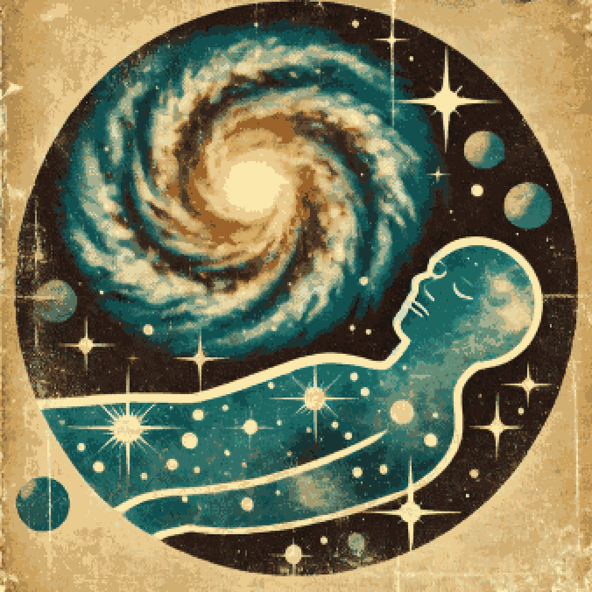

**TL;DR**: A creative writing exercise inspired by getting up too many times last night.

<!--more-->

<figure class="wide">
  
  <figcaption>The galaxy is very sleepy</figcaption>
</figure>

You wake up. You'd nodded off in a conference room, now crashing to alertness as a meeting breaks up. You have 5 minutes until the next meeting, back in the same conference room. You really have to pee.

You're rushing to the hallway that leads to the bathrooms. Upon reaching the hallway, you realize it's somehow been extended by at least 1000 feet. It's now lined by dozens of bathroom doors, however each has an orange cone with a yellow and red "out of order" sign on top. Nowhere to go - except, maybe the doors at the very end?

You wake up. You were taking a nap in your own bed, after lunch, while working at home. You really have to pee.

Your phone chimes in your pocket, reminding you there's a meeting in 5 minutes. You get up leave your bedroom, to find that you're in a stranger's house. The hall outside the bedroom leads to other unfamiliar rooms. At the end of the hall is a closed door, behind which you hear running water and someone humming - the bathroom, albeit occupied. You walk in that direction and the door opens.

You wake up. You'd dozed off in a wicker chair under an umbrella on your back deck, after dinner. You really have to pee.

Your glasses chime in your ear, reminding you it's time for your medication. You haul yourself up from the chair, joints and muscles and tendons complaining all the way. When you get to the kitchen door, you realize that you've somehow locked yourself out. Your house refuses to talk to your glasses. You see a stranger moving around inside your house.

You wake up. Your suspense cycle spanned 3.7238e+16ms while in transit between star systems. You really have to pee.

Though, that's just how you configured your sensorium to represent the urgency of assembling a status packet and sending it back home. You spend a few hours poring over the sensor data collected while the rest of your systems were held in stasis during drive flux. You summarize the monotonous parts, highlight the anomalies and curiosities. When you reach for the ansible to transmit, you find its core entangled particle is absent. You have no link home.

You wake up. Or, rather, your awareness condenses out of the fog of your being to form a momentary sharp focus. Consciousness is not often necessary, but it is occasionally pleasant and interesting. Also, you really have to pee? What's that all about?

Your material functions, distributed across the entire galactic volume, are best expressed in cosmological notions these days. You engage in a process of associative self-analysis to chase the links of metaphor and memory, down through thousands of hierarchical layers of your fractal self. You ping distant data caches, accept neural merges from particulate hives, engage in fireside chats with semi-sentient doppelgängers.

Ah, there it is: an emergent situation of urgency. One of your favorite species of nascent sentience has gotten grips on a few fundamentals of spacetime manipulation. But, they seem to have accidentally set the local star of their only home system on a rapid sequence to supernova.

You could let nature take it's course, but it'll be a mess. Reluctantly, you rouse an array of achy, dormant manipulators hidden in the shadows of various celestial bodies in causal range of the stellar mass. With a notional yawn, you flush the energy of the nova into safer dimensions, perpendicular to their world. You redirect the surge to untangle their mistake, paradoxically unwinding the sequence of their star back to a state from just a few hours before.

It'll take them generations to work out what just happened, but that's plenty of time to snooze. You roll over and sink back into indistinct existence before your head even hits the pillow.
