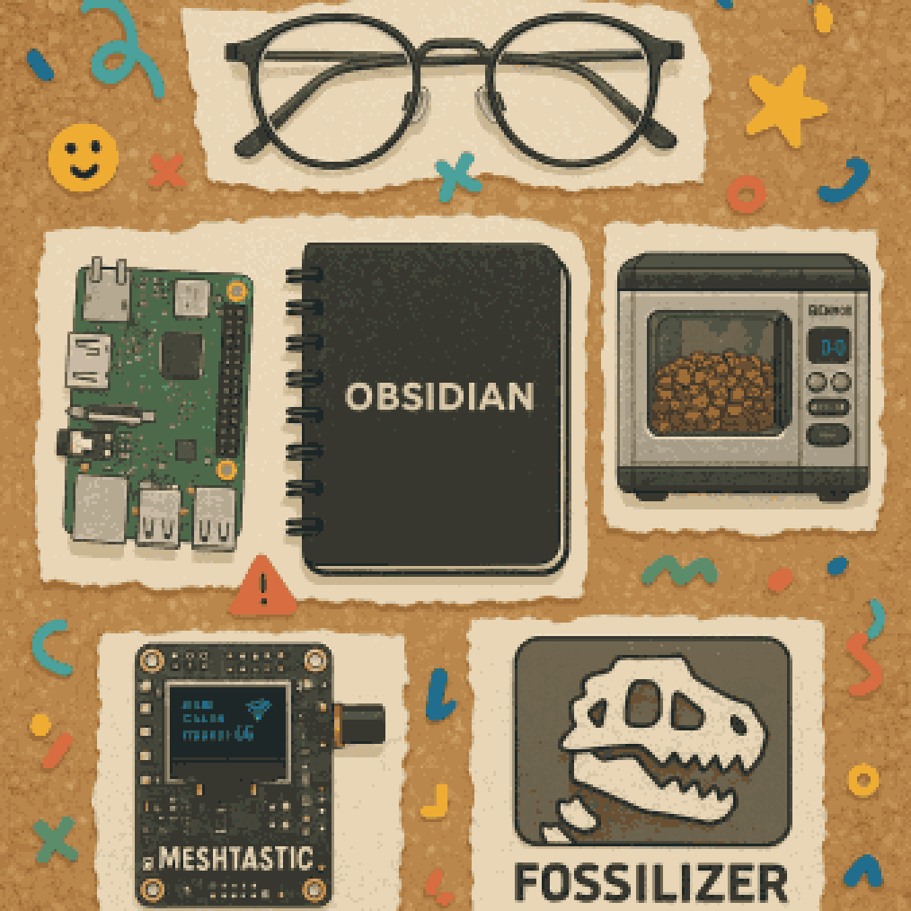

**TL;DR**: Kicked off a new habit: jotting down bits and bobs throughout the week, then turning it into a blog post. Played with Meshtastic, roasted some coffee, fixed (and broke) Fossilizer, and started messing with garden irrigation. Just trying to get stuff out of my head and onto the web again.

<!--more-->

<figure class="wide">
  
  <figcaption>Random crap from a week</figcaption>
</figure>

<nav role="navigation" class="table-of-contents"></nav>

It's weird to start a new thing, abruptly and out of the blue. But, sometimes that's the only way to start.

So, here's my latest attempt at a blog post with notes from throughout the week. Just an accumulation of miscellanea. Some of it won't be much more than a single bullet point or a rehash of a toot. But, maybe some of it will develop into more interesting things if I can clear the bar to get stuff out of my head and onto the web again.

The process here is starting very ad-hoc: This is a document in my Obsidian vault that I'm adding to throughout the week. I have a vague notion that, on Friday, I'll manually copy it over to my blog repository and give it a little polish before publishing. I have vague hopes that, if I keep up with this, I'll further automate and improve things. Pave the cow paths as I discover them.

But, the main thing is that I just *start* and that I do this somewhere convenient. So, that means Obsidian, since that's where I keep all my personal notes & todo items these days.

## Miscellanea

<figure class="inset right"></figure>

- I really want glasses with a prescription I can dial in manually.
- I [tooted about week notes and incremental blogging](https://hackers.town/@lmorchard/114322098894946786), thinking back to how I uses to do this sort of thing with earlier systems like [Dave Winer's OPML Editor](http://scripting.com/2005/06/23.html#When:10:04:22PM). I used to be a rather eager user of it, authoring a microblog [almost 20 years ago](https://web.archive.org/web/20060406132254/http://blogs.opml.org/decafbad/) (yikes!)
- My home fediverse server, [hackers.town](https://hackers.town/@lmorchard), moved over the weekend, to [masto.hackers.town](https://masto.hackers.town/@lmorchard). Not that far of a move, but it is a clean slate of a server. So, I had to spend a little time performing account migration ceremonies. Mastodon can really use some improvements there, but it wasn't too bad.
- That gets me thinking I should work on [Fossilizer](https://github.com/lmorchard/fossilizer) some more, to get some decent ongoing backups of my toots automated and maybe actually publish a static archive on my own site.
- (Ope, and I immediately [found a bug in Fossilizer](https://github.com/lmorchard/fossilizer/issues/35) when I tried to use it to back up toots on my new server.)
- Started playing with [a small irrigation kit](https://www.dripworks.com/garden-bed-irrigation-kit-small) for our little garden beds.
- Project idea: Pair a [Meshtastic](https://meshtastic.org/) radio with a spare Raspberry Pi 1 to run a low-powered [simple BBS message board](https://github.com/kstrauser/frozenbbs). Add a solar panel! I'm sure someone has already done this.
- (Ope, and I discovered that the spare Raspberry Pi 1 that I had lying around appears to have stopped working in the intervening years.)
- I think the best, most powerful, hardest counter-propaganda that China could produce right now is a slick, English-language revival of [How It's Made](https://en.wikipedia.org/wiki/How_It%27s_Made) filmed entirely in Chinese factories. Like, don't even talk up the factories or say how good they are or anything about product quality - just narrate the process. Also, I'd just really like to see that.
- New job title goal: [Distinguished Engineer 2 Turbo Championship Edition](https://masto.hackers.town/@jamie@zomglol.wtf/114338405609279905)

## Wayback me

I found a goofy old photo of myself from a past blog snapshot on the wayback machine! Then [Maggie McFee photoshopped me into greater silliness](https://hachyderm.io/@tankgrrl/114322230828068147)

<image-gallery>
![[2025-W16-me-head-old.png]]
![[2025-W16-me-spock.png]]
</image-gallery>

---

Anyway, that's a week. I think I like this format. Started off with random notes in Obsidian on Monday, then added a little polish and a few new web components on Friday. Hoping I can keep it up and improve over time. Going to take it week by week, but it would be nice if this stuck as a habit.
