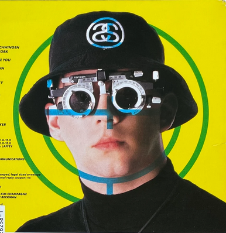

**TL;DR**: Assorted notes for week 16 of 2025

<!--more-->

<nav role="navigation" class="table-of-contents"></nav>

It's weird sometimes to start a new thing, abruptly and out of the blue. But, sometimes that's the only way to start.

So, here's my latest attempt at a blog post with notes from throughout the week. Just an accumulation of miscellanea. Some of it won't be much more than a single bullet point or a rehash of a toot. But, maybe some of it will develop into more interesting things if I can clear the bar to get stuff out of my head and onto the web again.

The process here is starting very ad-hoc: This is a document in my Obsidian vault that I'm adding to throughout the week. I have a vague notion that, on Friday, I'll manually copy it over to my blog repository and give it a little polish before publishing. I have vague hopes that, if I keep up with this, I'll further automate and improve things. Pave the cow paths as I discover them.

But, the main thing is that I just *start* and that I do this somewhere convenient. So, that means Obsidian, since that's where I keep all my personal notes & todo items these days.

## Miscellanea

<figure class="inset right"></figure>

- I really want glasses with a prescription I can dial in manually.
- I [tooted about week notes and incremental blogging](https://hackers.town/@lmorchard/114322098894946786), thinking back to how I uses to do this sort of thing with earlier systems like [Dave Winer's OPML Editor](http://scripting.com/2005/06/23.html#When:10:04:22PM). I used to be a rather eager user of it, authoring a microblog [almost 20 years ago](https://web.archive.org/web/20060406132254/http://blogs.opml.org/decafbad/) (yikes!)
- My home fediverse server, [hackers.town](https://hackers.town/@lmorchard), moved over the weekend, to [masto.hackers.town](https://masto.hackers.town/@lmorchard). Not that far of a move, but it is a clean slate of a server. So, I had to spend a little time performing account migration ceremonies. Mastodon can really use some improvements there, but it wasn't too bad.
- That gets me thinking I should work on [Fossilizer](https://github.com/lmorchard/fossilizer) some more, to get some decent ongoing backups of my toots automated and maybe actually publish a static archive on my own site.
- (Ope, and I immediately [found a bug in Fossilizer](https://github.com/lmorchard/fossilizer/issues/35) when I tried to use it to back up toots on my new server.)
- Started playing with [a small irrigation kit](https://www.dripworks.com/garden-bed-irrigation-kit-small) for our little garden beds.
- Project idea: Pair a [Meshtastic](https://meshtastic.org/) radio with a spare Raspberry Pi 1 to run a low-powered [simple BBS message board](https://github.com/kstrauser/frozenbbs). Add a solar panel! I'm sure someone has already done this.
- (Ope, and I discovered that the spare Raspberry Pi 1 that I had lying around appears to have stopped working in the intervening years.)
- I think the best, most powerful, hardest counter-propaganda that China could produce right now is a slick, English-language revival of [How It's Made](https://en.wikipedia.org/wiki/How_It%27s_Made) filmed entirely in Chinese factories. Like, don't even talk up the factories or say how good they are or anything about product quality - just narrate the process. Also, I'd just really like to see that.
- New job title goal: [Distinguished Engineer 2 Turbo Championship Edition](https://masto.hackers.town/@jamie@zomglol.wtf/114338405609279905)

## Wayback me

I found a goofy old photo of myself from a past blog snapshot on the wayback machine! Then [Maggie McFee photoshopped me into greater silliness](https://hachyderm.io/@tankgrrl/114322230828068147)

<image-gallery>
![[2025-W16-me-head-old.png]]
![[2025-W16-me-spock.png]]
</image-gallery>

## Roasting coffee

I've been roasting coffee at home, off and on for years now. I roasted some more last weekend.

<image-gallery>
![[IMG_8277.jpeg]]
![[IMG_8280.jpeg]]
![[IMG_8281.jpeg]]
![[IMG_8283.jpeg]]
![[IMG_8285.jpeg]]
</image-gallery>

It started as a kind of ADHD enthusiasm hobby about 15 years ago. I read a dozen books, fell down the rabbit hole of forums and docs online. My first few dozen batches were carefully logged. I tried filling my head with details of varietals and roasting profiles. This was serious scientific business! Until I got bored of that, at which point I stopped being careful.

These days, I mostly just wing it and push the buttons on [the Behmor toaster oven](https://www.sweetmarias.com/behmor-2000ab-plus-roaster.html). I hang out and watch to make sure nothing catches on fire. I listen for the cracks and sniff the air to decide when to end the roast.

It takes about 20 minutes, all told, and the coffee ends up plenty good enough for a week of daily drinking. And, given the current era of tariff madness, green coffee beans end up a little cheaper and have a relatively long shelf life that make them worth buying in bulk and hoarding in the basement pantry.

## Playing with Meshtastic

I've been hearing a bunch more lately about the [Meshtastic](https://meshtastic.org) mesh networking project across TikTok, YouTube, and the Fediverse.

<image-gallery>
![[2025-W16-heltec-v3-desk.jpeg]]
![[IMG_8274.jpeg]]
![[IMG_8275.jpeg]]
![[IMG_8292.jpeg]]
![[IMG_8303.jpeg]]
![[IMG_8304.jpeg]]
![[IMG_8305.jpeg]]
![[2025-W16-meshtastic-case-parts.png]]
![[IMG_8327.jpeg]]![[IMG_8326.jpeg]]![[IMG_8328.jpeg]]
</image-gallery>

Did a quick bit of looking around and discovered it was super cheap to dive in, so I made an impulse purchase of a couple [Heltec V3 boards](https://www.amazon.com/dp/B0D7HSHTNX?ref=ppx).

Flashed the firmware and plonked a node onto my desk in my upstairs office. After a few minutes, the thing had found over 180 other nodes in the mesh around town.

I repurposed the factory box into a case with a few snips of the plastic. That was good enough to stash the rig into one of the saddle bags on my bike and go take a ride around town. Wasn't really sure what I'd see happen with the thing, but it did pick up another dozen or so new nodes.

The USB power bank is rather bulky. But, it turns out the board has a connector for battery. So, I ordered some [LiPo batteries](https://www.amazon.com/dp/B0D7LLB53Z?ref=ppx)! Now, it no longer fits in the makeshift case.

So, I started looking through [3D printable case models that fit my Heltec V3](https://www.printables.com/search/models?q=heltec+v3) board and hopefully this 3000mAh battery. Most of them were designed for a smaller battery, but I found [a model that was big enough](https://www.printables.com/model/561389-heltec-v3-case-for-meshtastic).

Seeing that this case model fits my hardware, I decided to bust out some fancier filament and print some snazzier versions.

I still don't really know what to do with this thing. Maybe screw around with the APIs and build a bot? Maybe a thing that responds to pings with cat facts? I dunno. Maybe I can make a few friends?
