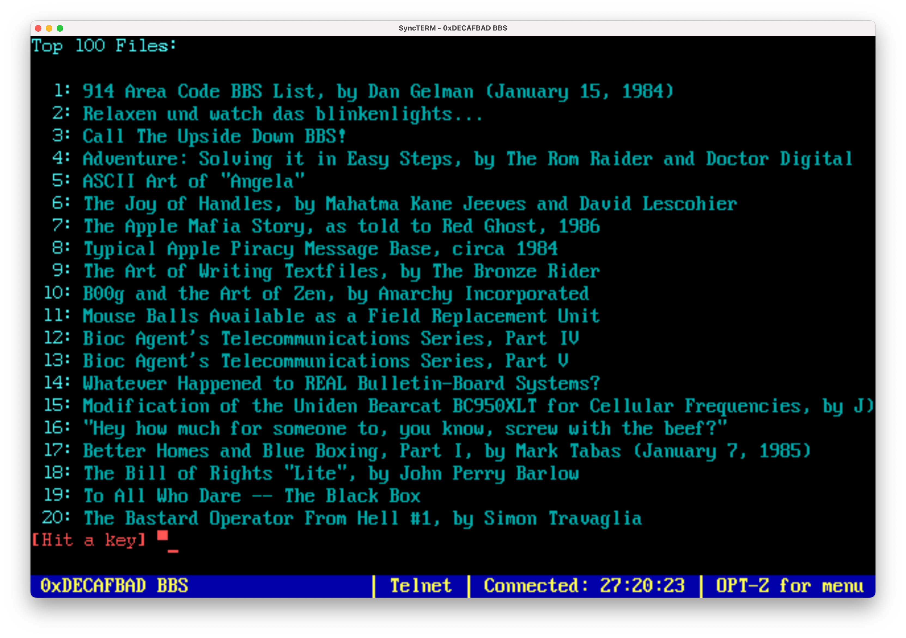

**TL;DR**: Wrestled with my Synology NAS trying to get a Debian VM running, started learning Kubernetes and Argo Workflows, watched Catsby and Miss Biscuits become friends, populated my BBS with text files from textfiles.com. Also: no, I don't need to build a BBS Door that controls Home Assistant lights. (But maybe I do?)

<!--more-->

<nav role="navigation" class="table-of-contents"></nav>

## Cat Updates

I think [Catsby and Miss Biscuits](https://masto.hackers.town/@lmorchard/115390903621986311) are getting along:

Our cats [just love a thing-on-a-thing](https://masto.hackers.town/@lmorchard/115386573977854708). Blanket on a blanket? Sold. Envelope that fell off a desk to land on a rug? Occupied. TV remote on a pillow? Incubated.

## Adventures in Synology VMs

I've got a Synology DS723+ NAS. It's been [okay as a file server](https://masto.hackers.town/@lmorchard/115385530642316129), but part of why I got it was because it claims to support Docker and running VMs.

Well, it *does* run Docker. But it runs Docker Engine v24 wrapped up in their own proprietary management package. Upstream is at v27 and I can't upgrade it. Also their management package locks up in weird ways and has been unreliable.

It also runs virtual machines. But every time I try to install a simple Debian 13 VM, it ends up freezing on boot. No idea why.

So I dunno, [maybe I expected too much](https://masto.hackers.town/@lmorchard/115385535225418506) from the thing. This is my 3rd Synology NAS, the previous two have only served as network file servers and done fine at that. This is the first one I thought might do a lil more. I think the next replacement for this thing will just be a plain old Linux server on a surplus PC.

I think these Synology devices are ["apple-like"](https://masto.hackers.town/@lmorchard/115385556194581318) insofar as they should "just work" but otherwise they're a nightmare to get anything not-Synology running on them as an OS. Ironically, I started getting Synology NASes years ago because I was tired of running my own Linux machines at home. Now the turntables have turned, I guess.

**Update:** Oh hey! I [got a Debian 13 VM running](https://masto.hackers.town/@lmorchard/115387852121623925) on my Synology NAS. It only took the extremely intuitive step of changing the video card setting from "vmvga" to "vga", which I didn't at all try at random. So, success, I guess?

## Learning Kubernetes

Because I want to [make a bunch of computers](https://masto.hackers.town/@lmorchard/115392122917690377) do a bunch of things, I'm learning me a Kubernetes and an Argo Workflows. I think I might be on the right track. I think my near-future path is [getting a better old PC](https://masto.hackers.town/@lmorchard/115386524093278575) to run Proxmox on. I have it on an old underpowered PC just to play with it, but I need to upgrade.

This, not coincidentally, is also why I'm trying to shoehorn some VMs onto my NAS. I might try to press one or more into service as Kubernetes nodes for fun and frustration.

## BBS Text File Hoard

While [waiting for tests to run](https://masto.hackers.town/@lmorchard/115391815918349408), I, an enormous old dork, figured out how to leech text files from textfiles.com and shove them into the text files section on [my BBS](https://bbs.decafbad.com). Don't tell him but I think some dude named Sketch the Cow uploaded his whole site to this hot new Torrent tracker called [archive.org](https://archive.org/details/textfiles-dot-com-2011). Only got a [couple directories unpacked](https://masto.hackers.town/@lmorchard/115391837360404256), but I think I might noodle around with dumping in a bunch of the rest just to have them around.

## Miscellanea

- Oh no: I have [installed Megabonk](https://masto.hackers.town/@lmorchard/115393847159542230).
- I took a nap and [dreamed there was](https://masto.hackers.town/@lmorchard/115381582995478461) a Buckaroo Banzai convention.
- No, Les, you [don't need to build](https://masto.hackers.town/@lmorchard/115381327181880766) a Door application for your BBS that lets you turn lights on and off in Home Assistant. (But... maybe?)
- I've been buying Sonoff S31 smart plugs because they're [relatively easy to reflash](https://masto.hackers.town/@lmorchard/115407551073647611) with ESPHome. But if for a buck or two more I can get a Kauf plug that's already had that done, I'll be a happier camper.
- Ross Wintle: [Software can be finished](https://rosswintle.uk/2025/10/software-can-be-finished/?ref=sidebar). "There is a utopia where we write correct, bug-free, fast, secure, statically-built software with zero dependencies that does its job and will continue doing its job as long as the platform it's written for endures."
- Suff Syed: [The Design Leaders Are Lying to You](https://www.suffsyed.com/futurememo/the-design-leaders-are-lying-to-you). "Every designer now faces a choice... recognize that the paradigm has already shifted. That the work determining design's future is happening now, in rooms where most designers are not present."
- Suff Syed (again): [Designers Have to Move from the Surface to the Substrate](https://www.suffsyed.com/futurememo/designers-have-to-move-from-the-surface-to-the-substrate). "We're still arguing about 'does Figma Make augment creativity' while the actual decisions... are being made in rooms we're not invited to."
- [How I Reversed Amazon's Kindle Web Obfuscation](https://blog.pixelmelt.dev/kindle-web-drm/) Because Their App Sucked. "Decided to reverse engineer their obfuscation system out of spite. Discovered multiple layers of protection including randomized alphabets. Defeated all of them with font matching wizardry."
- [Nanodjango](https://nanodjango.dev/): Full Django in a single file.
- Eskild Hustvedt: [The joy of rediscovering Perl](https://blog.zerodogg.org/2025/10/13/the-joy-of-rediscovering-perl/). "Lately I've gotten a lot back into Perl-programming, and it has honestly been an absolute delight."
- [pointerpointer.com's use of voronoi, canvas, and javascript](https://www.youtube.com/watch?v=Z2ZXW2HBLPM). Can't believe I'd never seen [Pointer Pointer](https://pointerpointer.com/) before, back in the day!
- Truffle Security: [Removing Jeff Bezos From My Bed](https://trufflesecurity.com/blog/removing-jeff-bezos-from-my-bed). Eight Sleep smart bed found to contain an exposed AWS key and a likely backdoor.
- [feedfilter](https://github.com/cdzombak/feedfilter/tree/main): RSS feed filtering tool in Go.
- The False Dawns album [Our Tanks, Your Lawn!](https://thefalsedawns.bandcamp.com/album/our-tanks-your-lawn) - jangly indie-pop's "Bard of the socio-politico polemic."
- [Get your Pocket Casts data](https://www.mikestreety.co.uk/blog/get-your-pocket-casts-data-using-the-unofficial-api-and-php/) using the unofficial API. Also: [pocketcasts Node.js client library](https://github.com/coughlanio/pocketcasts).
- [The Greatness of Text Adventures](https://entropicthoughts.com/the-greatness-of-text-adventures): "Text adventures are weird. They are so weird I don't know how to write this article."
- Empire interview: [Michael J Fox And Christopher Lloyd On Back To The Future At 40](https://www.empireonline.com/movies/news/back-to-the-future-40-michael-j-fox-christopher-lloyd-interview/). "We live in a bully culture right now... In this movie, Biff is a bully. Time is a bully. For me personally, Parkinson's is a bully."
- Simon Collison: [Eno on AI](https://colly.com/journal/eno-on-ai). "All my misgivings about AI really are to do with the fact that it's owned by a group of people that I don't trust at all."
- Simon Willison: [Claude Code for web—a new asynchronous coding agent](https://simonwillison.net/2025/Oct/20/claude-code-for-web/#atom-everything) from Anthropic. Also: [Don't let Claude Code delete your session logs](https://simonwillison.net/2025/Oct/22/claude-code-logs/) - add `"cleanupPeriodDays": 99999` to settings to delay deletion for 274 years.

