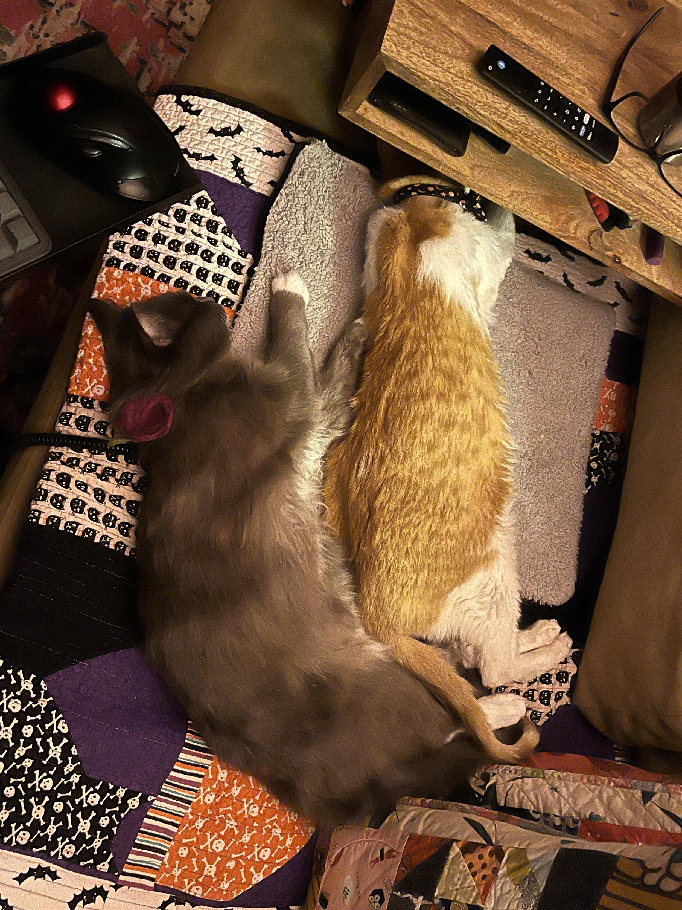
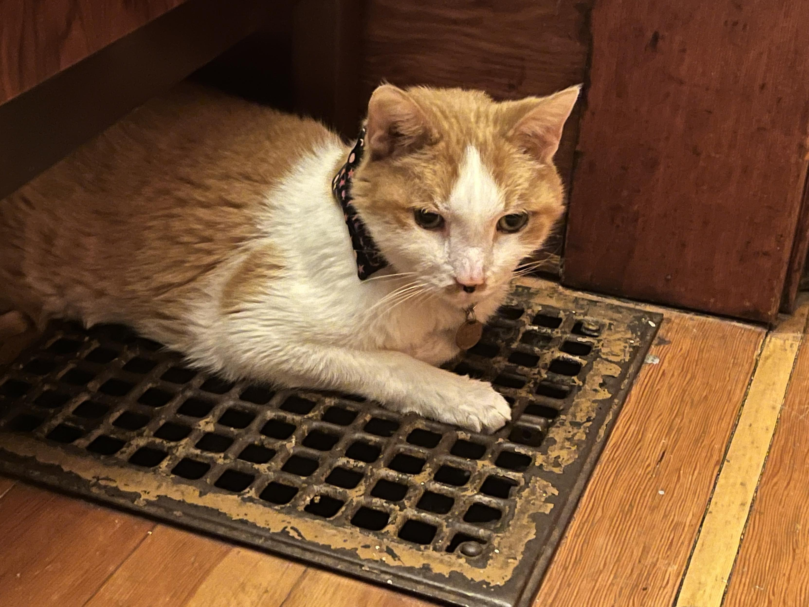
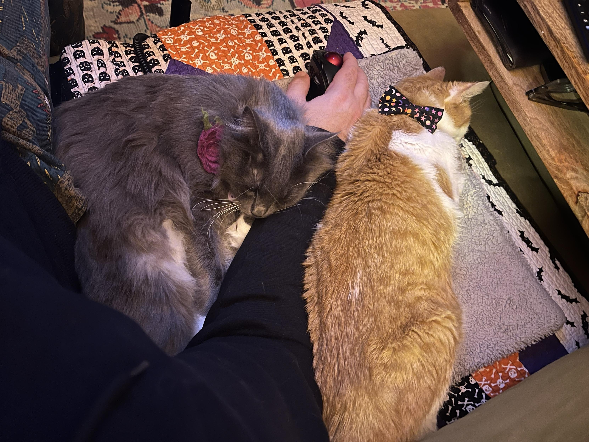
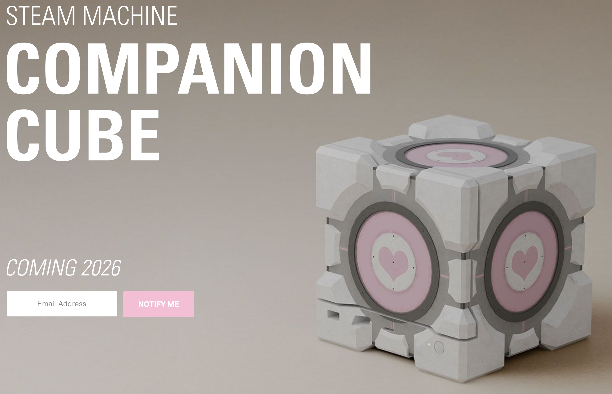

TL;DR: This week I [revived the weeknotes](https://masto.hackers.town/@lmorchard/115549652496623030) habit with some tooling tweaks, fell down rabbit holes about BBS-era writing styles getting mistaken for ChatGPT output, dealt with Catsby feeling under the weather (but Miss Biscuits providing excellent nursing care), discovered some wild musical connections between Feist and Peaches, got excited about build-free JavaScript, and bookmarked way too many things about AI (as usual).

<!--more-->

<nav role="navigation" class="table-of-contents"></nav>

## Weeknotes Are Back

So I'm [trying to make](https://masto.hackers.town/@lmorchard/115549652496623030) this weeknotes thing happen again. I realized I'm just not going to do daily blogging consistently, even though I've made it dead simple for myself to post. A bunch of this is kind of a copypasta rehashing of toots and bookmarks I've posted throughout the week, but reticulated and frobnicated into prose. Kind of a [PESOS](https://indieweb.org/PESOS) thing (Publish Elsewhere, Syndicate to your Own Site), but with a little more editing and narrative.

Also I'm happy because I think I [might have debugged](https://masto.hackers.town/@lmorchard/115549662324463878) rendering on my inline photo galleries, so that should make it easier and nicer to stuff cat updates into every weeknotes post! Speaking of which...

## Cat Updates

Catsby felt like hot garbage all last weekend—got him to the vet and he's on meds for stomach and nausea. I also felt rather garbage, so we were a [pair of couch lumps](https://masto.hackers.town/@lmorchard/115563418843266894) together. He snoozed while I managed to get my brain happily hyperfocused on playing [BALL x PIT](https://www.ballxpit.com/) for hours. [Miss Biscuits](https://masto.hackers.town/@lmorchard/115563432281093001) has been keeping him company and well-bathed. She really just likes to bathe everyone, including me occasionally.

Also, you know what's pretty cool? When one of your cats [shows up](https://masto.hackers.town/@lmorchard/115551106942458949) and demands attention after being somewhere else in the house for hours. Like, that critter woke up or was in the middle of something and suddenly decided "hey, I wonder what that big human guy is up to? I need a pet." 

Apropos of that, I found myself [trapped under cats](https://masto.hackers.town/@lmorchard/115568928478275860), proving the trackball is a superior pointing device. (You know, I don't think I really trust anyone who's [never experienced](https://masto.hackers.town/@lmorchard/115568936011517838) being trapped under a friendly critter before.)

<image-gallery>

</image-gallery>

## BBS Kids vs. ChatGPT

I saw a [post spotlighted in r/bestof on Reddit](https://www.reddit.com/r/bestof/comments/1ovxrk6/uquick_butterfly_4571_passionately_explains_why/) that tried to explain why 80s nerd kids who had dial-up BBSes as social media get mistaken for ChatGPT:

> We were so amazed to find out there were other people similar to us, and we had to write to each other in long form in order to communicate effectively: we were only connected to our peers by a slow shitty modem for 25-30min a day, if we were very lucky. Some of us only got online a day a week. Those kids wrote replies the length of short stories.
> 
> So, when you got online, you pulled or copied or saved all your messages, drafted up what was...essentially an essay of a response — trying to anticipate follow up questions or points of confusion. You planned it ahead of time. You studied your ass off to equip yourself with knowledge in the hopes of getting some replies off the same day you read them (it sounds stupid now, but that was fucking incredible — send and receive a letter same day!? Eesh. I am getting old). 

This takes me back to Jr. High and High School, when I'd download [QWK packets](https://en.wikipedia.org/wiki/QWK_(file_format)) from BBSes in the morning (because that's the only time I didn't get a busy signal), I'd spend all night after homework drafting essay-length responses. Conversations would sometimes talk past each other unless we waited and took turns, but full-on essays were common.

## Musical Discoveries

TIL that Feist was [roommates with Peaches](https://en.wikipedia.org/wiki/Peaches_(musician)#1990%E2%80%931999:_Mermaid_Cafe,_Fancypants_Hoodlum,_The_Shit) in Toronto, above a sex shop, back in 1999. Feist used to rap at shows with Peaches as "[Bitch Lap Lap](https://www.youtube.com/shorts/5wptQoGiEKI)". Like... [this Feist](https://www.youtube.com/watch?v=ABYnqp-bxvg)?

<iframe width="560" height="315" src="https://www.youtube.com/embed/ABYnqp-bxvg" frameborder="0" allow="accelerometer; autoplay; clipboard-write; encrypted-media; gyroscope; picture-in-picture" allowfullscreen></iframe>

And [this Peaches](https://www.youtube.com/watch?v=6rRIIWo_JeA)?!

<iframe width="560" height="315" src="https://www.youtube.com/embed/6rRIIWo_JeA" frameborder="0" allow="accelerometer; autoplay; clipboard-write; encrypted-media; gyroscope; picture-in-picture" allowfullscreen></iframe>

Speaking of Feist, that [reminded me](https://masto.hackers.town/@lmorchard/115568025116096120) of Beck's performance of [Colourbox](https://en.wikipedia.org/wiki/Colourbox)'s 1983 song "Tarantula" with Feist, Natasha Khan (Bat for Lashes), Inara George and Alex Lilly as backup singers on James Corden back in 2019. I was obsessed with this throughout early peak COVID lockdown times. Still makes me stop whatever I'm doing whenever I hear it.

<iframe width="560" height="315" src="https://www.youtube.com/embed/gUqrjyB44h4" frameborder="0" allow="accelerometer; autoplay; clipboard-write; encrypted-media; gyroscope; picture-in-picture" allowfullscreen></iframe>

## Music to Get Through Things

I really like Stereolab. Like, they're a band where, whenever they [come up on shuffle](https://masto.hackers.town/@lmorchard/115589581547606742) or a streaming station, I'm like oh I like this - oh of course, it's Stereolab.

<iframe width="560" height="315" src="https://www.youtube.com/embed/NgGkUMCixH0" frameborder="0" allow="accelerometer; autoplay; clipboard-write; encrypted-media; gyroscope; picture-in-picture" allowfullscreen></iframe>

And then there's [Killing Joke](https://masto.hackers.town/@lmorchard/115589590308641461):

<iframe width="560" height="315" src="https://www.youtube.com/embed/qV-cYH8udSk" frameborder="0" allow="accelerometer; autoplay; clipboard-write; encrypted-media; gyroscope; picture-in-picture" allowfullscreen></iframe>

Sometimes you just need [the right sounds](https://masto.hackers.town/@lmorchard/115589591793480651) to keep going. Big Sonic Heaven radio was [making me happy](https://www.bigsonicheaven.com/), Friday afternoon.

## Build-Free Web Development

I was genuinely excited about the Django team [posting about](https://www.djangoproject.com/weblog/2025/nov/19/going-build-free-with-native-javascript-modules/) going build-free with native JavaScript modules. As a fan of build-free webdev, [this was](https://masto.hackers.town/@lmorchard/115577759820703793) a triumph. I'm making a note here: "Huge success." It's hard to overstate my satisfaction with this direction.

## Companion Cube + Steam Machine

Incidentally, dbrand is [teasing a Companion Cube skin](https://dbrand.com/shop/limited-edition/companion-cube) for the upcoming Steam Machine cube and I am SCREAMING.

## IoT Death Watch: Nest Thermostats Edition

Oh hey, remember how I was [grousing about IoT stuff](https://blog.lmorchard.com/2025/11/13/w46/#tech-longevity) and our dead solar inverter? This week, support finally ran out for the 2nd gen Nest thermostat that came with our house. There's an offer to get a discount on a new-gen Nest, but fuck that. It'll be a dumb thermostat until/unless I find one that works with Home Assistant without any cloud integrations.

(Also, the "OFFLINE about 24 days ago" message is funny, because I was controlling this with the app on my phone yesterday.)

Like, yes, I know: [Google announced this awhile ago](https://masto.hackers.town/@lmorchard/115589081333075950). But also, I forgot what generation this Nest thermostat was - and why should I care? It was working, and now it's lost most of its functionality. And not because a part in the device failed, but because the vendor decided to turn off some servers. And they want me to step on that rake again by buying an upgraded device? Eat a whale.

I would [almost feel better](https://masto.hackers.town/@lmorchard/115589107851859272) if they labeled these things up front with a limited lifespan - like, say, fire alarms after 10 years. They'd have to acknowledge that they're disposable, but that would affect the gadget price I guess. But fire alarms at least have an excuse: the sensors in them physically degrade over time. In the case of my Nest thermostat, it's that the vendor chose to apply bitrot to their services.

The funny thing is that [I've never actually bought](https://masto.hackers.town/@lmorchard/115589148180473450) a Nest thermostat. I've just bought & lived in a few houses over the years where the previous owner did that. So, I guess I've never really been a Nest customer, per se. But, like, that's how houses work. Maybe in the future we'll make a stink about old IoT installations during inspection like a roof or a water heater that's at end-of-life?

Oh, and the cherry on top: apparently, Google is still [collecting troves of data](https://www.theverge.com/news/820600/google-nest-learning-thermostat-downgraded-data-collection) from downgraded Nest thermostats despite turning off remote control functionality.

## Laptop Adventures

I have this old Dell XPS 15" laptop I bought from work a few years ago. Just [realized](https://masto.hackers.town/@lmorchard/115568151816903810) the palm rest is covered in a rubberized coating that's starting to goo-ify. Ugh. Some Dell support forum post suggested rubbing it with baby powder, but that just seems like compounding the problems.

I'll probably just cover it in stickers and hope that holds.

Anyway, this is the last machine in my house running Windows—been leaving it that way just in case. But getting very tempted to [pave over it](https://masto.hackers.town/@lmorchard/115568180073861136) with [Aurora Linux](https://getaurora.dev/en). That seems like the dev-oriented cousin to [Bazzite Linux](https://bazzite.gg/), which I've been very happy with.

## Miscellanea

* [bentendo's Roaming Library project](https://masto.hackers.town/@benbrown/115549517058712194) is almost ready to escape the lab—a portable BBS-like system built on an ESP32 with a micro-SD card. Very punk, very necessary.

* Mastodon's Eugen Rochko [stepped down as CEO](https://blog.joinmastodon.org/2025/11/my-next-chapter-with-mastodon/), transferring ownership to the non-profit. After nearly 10 years, he's centering himself less in outward communications to ensure the project remains true to its values. "There are too many examples of founder egos sabotaging thriving communities."

* The [invalid 68030 instruction](https://www.downtowndougbrown.com/2025/01/the-invalid-68030-instruction-that-accidentally-allowed-the-mac-classic-ii-to-successfully-boot-up/) that accidentally allowed the Mac Classic II to boot is the kind of retrocomputing story that makes my day.

* [DEC Mini](https://decmini.tin.cat/) builds are gorgeous—3D-printable retro terminals. Also saw this [build video](https://www.youtube.com/watch?v=KLdEn2B49mk) with the MiSTer Pi, and weirdly the filament was made in Troy, MI!

  <iframe width="560" height="315" src="https://www.youtube.com/embed/KLdEn2B49mk" frameborder="0" allow="accelerometer; autoplay; clipboard-write; encrypted-media; gyroscope; picture-in-picture" allowfullscreen></iframe>

* Microsoft and Activision [open-sourced Zork I, II, and III](https://opensource.microsoft.com/blog/2025/11/20/preserving-code-that-shaped-generations-zork-i-ii-and-iii-go-open-source) under the MIT license. The goal: placing historically important code in the hands of students, teachers, and developers.

* Dwarf Fortress bugs are legendary: "babies are born worshipping unknown gods" is [one of the most incredible](https://www.reddit.com/r/dwarffortress/comments/1oxdxuu/comment/nowwrov/) I've heard. Also: vampires pinning crimes on babies, rain killing everything, sleeping on melting icebergs resulting in waking up as a demon.

* [Dependency cooldowns](https://blog.yossarian.net/2025/11/21/We-should-all-be-using-dependency-cooldowns) are a free, easy way to mitigate supply chain attacks. More projects should use tools like Dependabot and Renovate to apply them.

* [The Platonic Case Against AI Slop](https://www.palladiummag.com/2025/11/14/the-platonic-case-against-ai-slop/): "The harm lies less in the content itself than in the long-term training of attention and appetite."

* "Shrimps is bugs" [graffiti all over Portland](https://www.portlandmercury.com/i-anonymous/2025/11/18/48130357/to-whomever-is-tagging) led someone on a "rabbithole of scientific and taxonomic discovery." There's one of these tags on my usual bike ride route. 😅

* My blog is apparently getting noticed because I [just got 6 inquiries](https://masto.hackers.town/@lmorchard/115588866506480541) into guest posts overnight, each proposing topics I've never really posted about before. Like, "your tech blog is impressive and covers a range of issues with great writing, would you consider accepting a guest post on industrial-scale organic farming from my client?" Online media empire, here I come.

* Overheard from a UPS driver's podcast blaring from phone speakers: ["I DON'T HAVE TO WORRY ABOUT MY BALLS ANYMORE BRO"](https://masto.hackers.town/@lmorchard/115589196017029902). I have no context. Is this a bro-y bit? Have the bros discovered bottom surgery accidentally? Are the layers of irony too deep for me to comprehend? 

