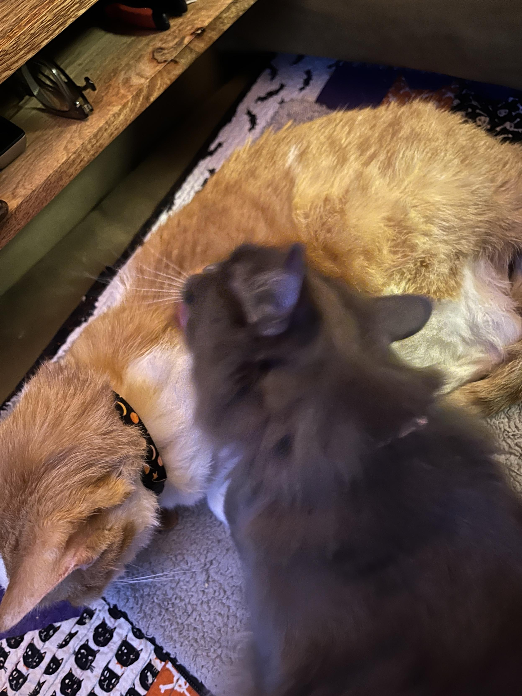
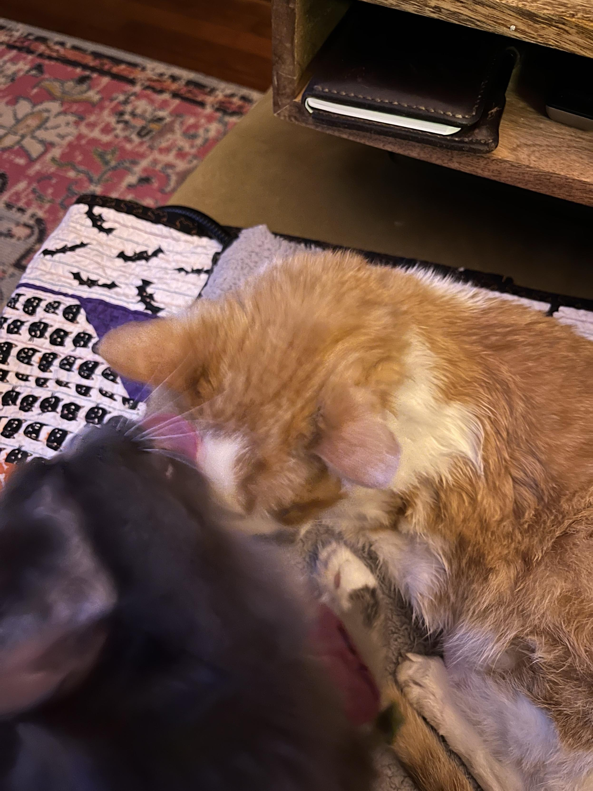
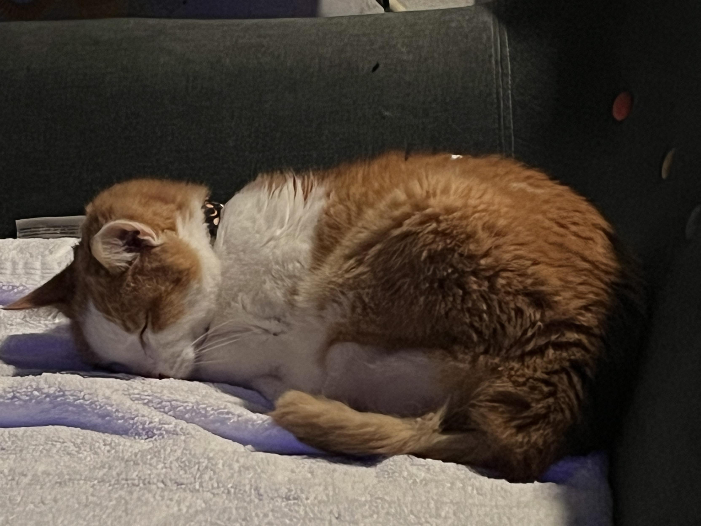
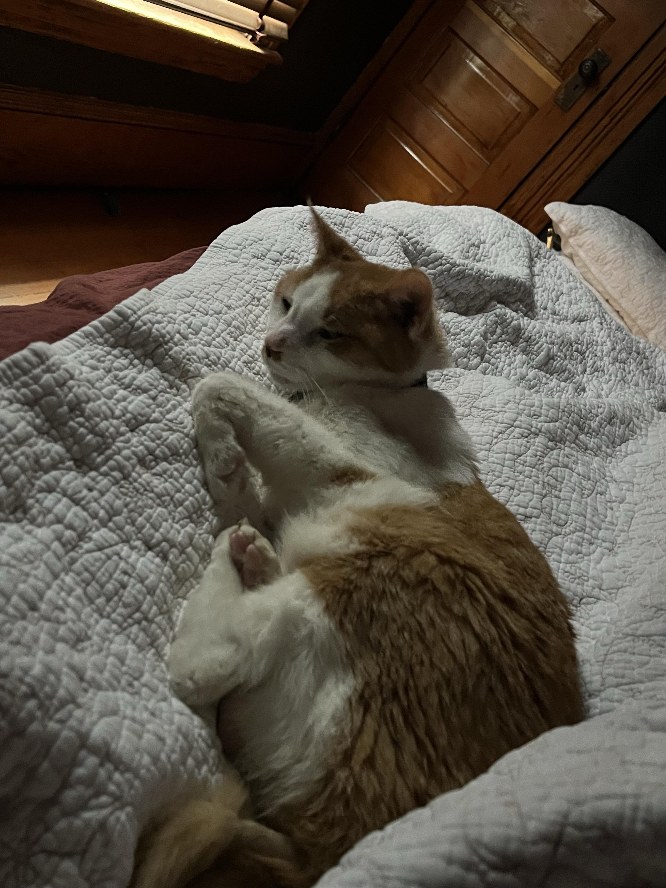
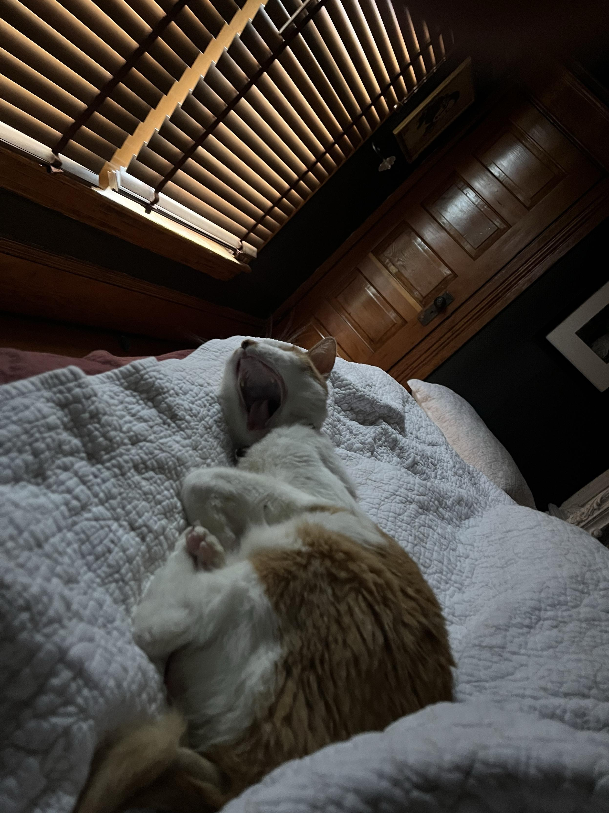
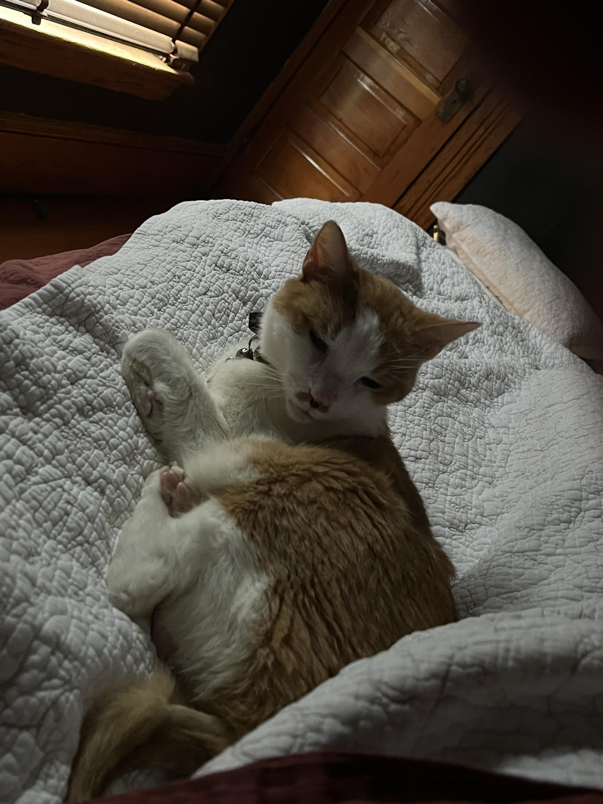
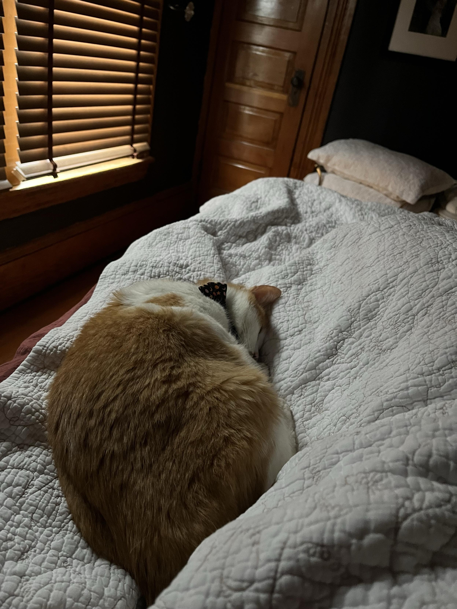
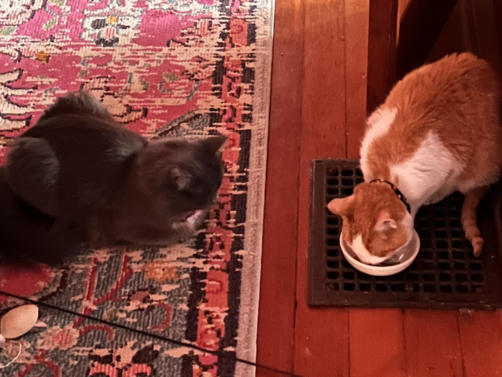
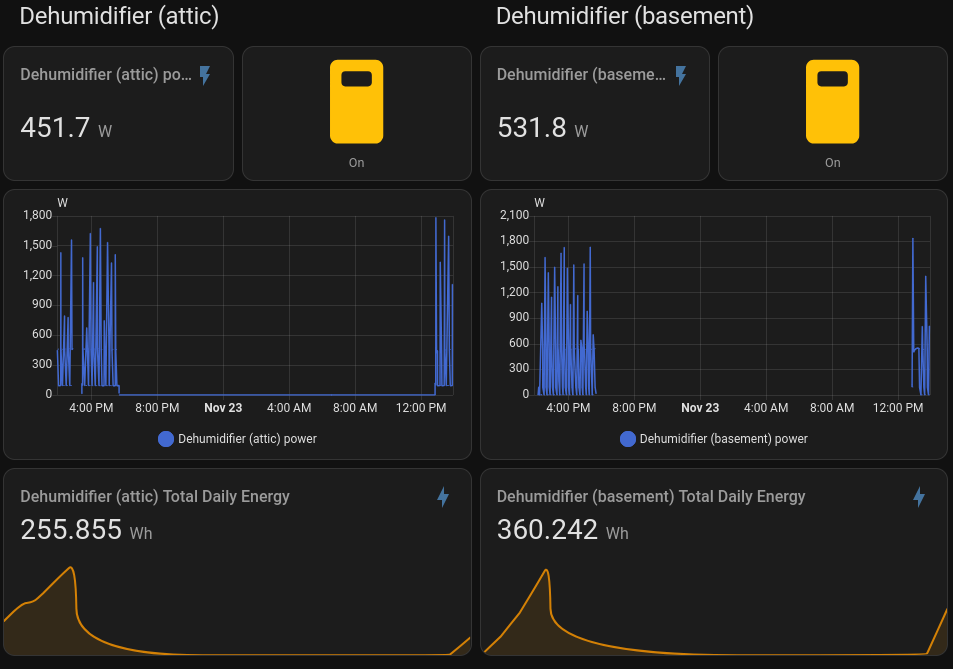

TL;DR: This [short week](https://masto.hackers.town/@lmorchard/115591745342855635) was dominated by Catsby feeling unwell (but with Miss Biscuits [providing excellent](https://masto.hackers.town/@lmorchard/115592121200229706) nursing care), a deep dive into Home Assistant dashboard shenanigans to track dehumidifier power usage, discovering new games (Demonschool and Wanderstop), and [revisiting](https://masto.hackers.town/@lmorchard/115611507309273002) whether Neil Peart was actually Canada's best rapper all along.

<!--more-->

<nav role="navigation" class="table-of-contents"></nav>

## Catsby Updates

I kinda want to keep these weeknotes light, but we had a rough span of days with Catsby. Last Thursday, he stopped eating and we ended up hospitalizing him at the vet's overnight. We got him back Friday evening, pretty doped up and with a not-so-great diagnosis wherein we're not sure we have a long time left with him.

So, as a [programming note](https://masto.hackers.town/@lmorchard/115601500974332340): this blog will most likely be delivering elevated levels of Catsby photos for the foreseeable future. I love all our critters, but Catsby is my best friend, he's my pal, he's my homeboy, my rotten soldier, my sweet cheese, my good time boy. (That's a [WWDITS reference](https://www.youtube.com/watch?v=7ohtCmSoLl4), FWIW.)

<image-gallery>

</image-gallery>

But, Catsby's got good company. Miss Biscuits immediately [got to work](https://masto.hackers.town/@lmorchard/115592121200229706) bathing the vet smell off him. Saturday night was a bit rough, but Cosmo hung out with us. 

By Sunday, things turned around—Catsby [had a better day](https://masto.hackers.town/@lmorchard/115601455359843820), ate a bunch, and was even purring on a heating pad. That morning, he'd [come to bed](https://masto.hackers.town/@lmorchard/115601486054544783), so naturally I stayed put for another hour watching TikToks. Priorities.

By Sunday evening, things felt [much better](https://masto.hackers.town/@lmorchard/115602860201944627)—Catsby was back on the couch with Miss Biscuits and me. And of course, [every cat here](https://masto.hackers.town/@lmorchard/115605459293512886) loves a churu (including the campaign for [unlimited churu treats](https://masto.hackers.town/@lmorchard/115596215689670546)).

And, of course, if Catsby [wants to eat](https://masto.hackers.town/@lmorchard/115612592439573165) in weird places—say, atop a furnace vent—he gets to eat atop a furnace vent. Miss Biscuits remains confused by this arrangement.

## Home Assistant Shenanigans

No, *you* [spent a stupid amount](https://masto.hackers.town/@lmorchard/115601250074066008) of time puttering in Home Assistant to gin up some dashboard shenanigans to better see how much power the dehumidifiers are using.

I was [really surprised](https://masto.hackers.town/@lmorchard/115601391107407136) to see how much power those things gobble up!

Context: We [had a mold problem](https://masto.hackers.town/@lmorchard/115601264679032234) in the attic that we remediated over the summer, but it still needs fairly constant attention from a dehumidifier to keep at bay. The basement also benefits from some drying out. Overall, we want to see how much running this is costing us so we might tweak cost vs goal humidity.

Really though, [this stuff](https://masto.hackers.town/@lmorchard/115601286274583961) just lets me roleplay as Geordi LaForge and pretend that I'm doing real starship engineering.

## Games Worth Playing

[Started playing](https://masto.hackers.town/@lmorchard/115592062716976128) Demonschool. Faye sure does want to punch some fightable faces! The game has this great tactical RPG vibe mixed with demon-hunting high school drama.

<youtube-embed video-id="P_aaE_vmSx0" title="Demonschool - Launch Trailer" thumbnail="238aff293759.jpg"></youtube-embed>

Then on Monday I [started playing](https://masto.hackers.town/@lmorchard/115603130870354661) Wanderstop and, dang, does the idea of tea sound ever more appealing. It's from the same creative team behind *A Psalm for the Wild-Built* (as someone [pointed out](https://a2mi.social/@ryanvis/115604997901717437), they really should have used that in the marketing).

<youtube-embed video-id="SGohBkrnUJM" title="Wanderstop - Launch Trailer" thumbnail="2121b3e88a35.jpg"></youtube-embed>

Both games hit different cozy vibes—one's all about punching demons, the other's about making tea and processing emotions. Perfect weekend balance.

## Geddy Lee's Secret Rap Career

For the longest time, [I thought](https://masto.hackers.town/@lmorchard/115611507309273002) it was Neil Peart rapping on Rush's "[Roll the Bones](https://www.youtube.com/watch?v=mmIynF-59YE&t=197s)". Thus, in my mind, at least, making him Canada's best rapper. (We don't talk about Drake.)

But, [it turns out that was actually Geddy Lee](https://www.youtube.com/watch?v=lnod-gtREQQ&t=455s) with vocal effects. They were all sneaky about it during the tour 1991-1992 tour: I remembered they'd [turn the lights down for that section](https://www.youtube.com/watch?v=pTiVuJRZS9A&t=231s) and you couldn't really see who (if any of them) was doing the spoken word / rap part.

<youtube-embed video-id="lnod-gtREQQ" time="455" title="Rush - Roll The Bones Radio Special Interview (1991) " thumbnail="a291479dfbaa.jpg"></youtube-embed>

## Miscellanea

* [Cory Doctorow in 1995](https://www.youtube.com/watch?v=Y0EXga2hEIs) on CBC predicting video on demand—it's a delight.
  <youtube-embed video-id="Y0EXga2hEIs" title="How to use the internet, 1995 - Cory Doctorow on CBC" thumbnail="cac78f9a3a2f.jpg"></youtube-embed>
* Ladytron has a new album coming out (*Paradises*) and the video for "[Kingdom Undersea](https://www.youtube.com/watch?v=U1r3d7wR9is)" is gorgeous—["shot inside an analogue contraption originally built for The KLF, all cathode-ray glow and distorted color"](https://post-punk.com/ladytron-submerge-into-an-icy-cathode-ray-glow-in-video-for-kingdom-undersea-new-album-paradises-announced/).
  <youtube-embed video-id="U1r3d7wR9is" title="Ladytron - Kingdom Undersea" thumbnail="a58c354ae53b.jpg"></youtube-embed>
* Stumbled across [QUANTENT](https://quantent.io/), which promises "Content That Literally writes itself" with "no oversight required from your team." I [don't think](https://masto.hackers.town/@lmorchard/115607452141390868) it's exactly what it seems (calling their support line was... fun).
* [*Social media isn't chalk milk*](https://maya.land/monologues/2023/08/12/social-media-chalk-milk-guess.html#fnref:cavalier) - A thoughtful piece on why stigmatizing low-barrier social connection isn't the answer.
* [LLM APIs are a Synchronization Problem](https://lucumr.pocoo.org/2025/11/22/llm-apis/) - Armin Ronacher argues the local-first movement already solved the hard parts of distributed state synchronization that LLM APIs are struggling with.
* [QWK Packets and the Muffled Spark](https://archive.org/details/muffled-spark/page/n13/mode/2up) - Jason Scott's deep dive into the QWK packet and its revolutionary impact on BBS culture.
* [Shuffling a CSS grid using custom properties](https://christianheilmann.com/2025/11/24/shuffling-a-css-grid-using-custom-properties/) - Christian Heilmann with a clever approach to reordering grid items without DOM manipulation.
* [Sōzu HTTP reverse proxy](https://github.com/sozu-proxy/sozu) - A lightweight, fast, always-up reverse proxy server built in Rust.
* [EPSON MX-80 Fonts](https://mw.rat.bz/MX-80/) - Perfect for retro printout simulation or program listings.
* [Hacking an old Kindle](https://hackaday.com/2025/11/24/the-unexpected-joys-of-hacking-an-old-kindle/) - The true hacker way: taking consumer e-waste and turning it into a useful learning platform.
* [USBSID-Pico](https://github.com/LouDnl/USBSID-Pico) - A Raspberry Pi Pico-based board for interfacing MOS SID chips over USB. Peak retrocomputing.
* [Rule #18: Life is just an experience](https://rulestolive.substack.com/p/rule-18-life-is-just-an-experience) - Scott Berkun on living to make stories rather than achieve greatness.

