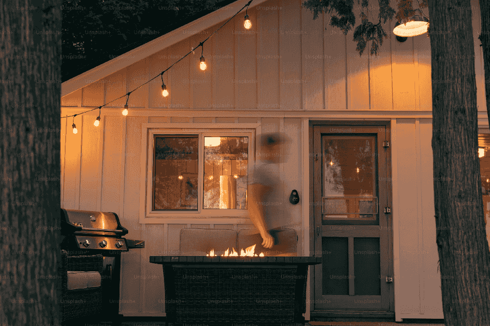

TL;DR: This is a short story I've had kicking around since 2020. Trying to decide if there'll be more to it? The blurb: In a world where an App manages pandemic dating through risk budgets and timed social events, delivery cyclist Cameron reluctantly accepts a Halloween party invite—his last chance before winter isolation.

<!--more-->

 <h1>Mermaid Diagram Web Component Test</h1>
                                                                                                                                                                                                                                                         
  <!-- Full customization -->                                                                                                                                                                                                            <h2>Example 1: Simple Flowchart</h2>
 <figure>

  <mermaid-diagram>
graph LR
  A[Start] --> B{Decision}
  B -->|Yes| C[Action 1]
  B -->|No| D[Action 2]
  C --> E[End]
  D --> E
  </mermaid-diagram>
</figure>

  <h2>Example 2: Sequence Diagram</h2>
  <mermaid-diagram>
sequenceDiagram
  participant Alice
  participant Bob
  Alice->>Bob: Hello Bob, how are you?
  Bob-->>Alice: Great!
  Alice-)Bob: See you later!
  </mermaid-diagram>

  <h2>Example 3: State Diagram</h2>
  <mermaid-diagram>
stateDiagram-v2
  [*] --> Still
  Still --> [*]
  Still --> Moving
  Moving --> Still
  Moving --> Crash
  Crash --> [*]
  </mermaid-diagram>

  <h2>Example 4: Class Diagram</h2>
  <mermaid-diagram>
classDiagram
  Animal <|-- Duck
  Animal <|-- Fish
  Animal : +int age
  Animal : +String gender
  Animal: +isMammal()
  class Duck{
    +String beakColor
    +swim()
    +quack()
  }
  class Fish{
    -int sizeInFeet
    -canEat()
  }
  </mermaid-diagram>

<figure class="wide">
  
  <figcaption><a href="https://unsplash.com/photos/a-man-walking-into-a-house-with-a-fire-pit-in-front-of-it-qS54xIVe8iw">A man walking into a house with a firepit in the backyard</a> from Unsplash</figcaption>
</figure>

When the Halloween invite on the App buzzed his glasses, Cameron wasn't feeling it. He'd just finished his last delivery and had locked his bike up in the shed. He planned to spend the weekend staring at a wall, his brain and body pureed after a week at work.

But, it was probably the last decent match he'd see until well into spring. Holiday shifts and life in general would chew up the risk balance he'd banked for the year. And he still remembered last New Year's Eve, when he'd settled for a party outdoors in chilly December drizzle. That had left him with a hangover, a hacking cough, and zero new contacts. Better just to accept winter as a wash.

So, Halloween it was. On the bright side, the invite didn't insist on a costume. Cameron squinted at the text, muttered out loud: "What the hell is 'dirtbag casual'?"

"Go as you are," replied the App. "Maybe take a shower, but I wouldn't worry about it." It spoke in his own voice—like a bad voicemail greeting he forgot he'd recorded—but it usually gave solid advice.

"Well," sighed Cameron, "if they can't take me like this, it's not worth the upkeep."

He rolled the bike back out of the shed. He swung onto seat and kicked off into the street, thumbing on the battery assist to get up to speed. The address for the party was only about ten minutes away, but he was already fashionably late by an hour.

The neighborhood streets were empty. He remembered when the sidewalks would be full of little monsters running past screaming for candy. He'd even been one of them, once, albeit stuck in a fairy princess costume when all he'd wanted was to be a knight. He'd hated that costume but always loved Halloween.

Royal court position notwithstanding, at least there'd been a quest to find the legendary house with full-sized chocolate bars. These days, except for a few half-hearted attempts at socially-distanced candy distribution via makeshift slides and PVC pipes down front porch stairs, most folks only celebrated in their indoor bubbles, if at all.

As he pulled up to the house and emerged from reverie, he realized he'd been there before, pretty regularly even. It was a little white bungalow in the middle of a block of the same. It had a tiny lawn and a short driveway off to the side. The front window had a border of lavender string lights on at night, which was how he recognized it. He'd always just dropped off groceries or take-out or whatever and sprinted off without meeting anyone face-to-face.

"Go ahead and pull your bike to the corner of the house by the drive," said the App in his ear. "There's a fence post where you can lock it up. The party's in the back yard, as you can probably hear. Timer starts when you pass through the yard gate."

Cameron rolled toward the house and found the fence pole. He crouched down to secure the bike against it with a u-lock. Then, he pulled his respirator out of his hip pack. He took a deep breath of cool fall air, caught a whiff of wood smoke. He pressed the silicone mask to his face and pulled the straps tight behind his head before walking down the driveway. Ambient electronic music grew louder and the yard came into sight.

Warm lights wound around clotheslines crisscrossed overhead, providing most of the illumination as dusk fell. Just over a dozen folks were there, shy of an uncomfortable crowd. A handful sat around a pit with a small fire crackling away, while the rest broke up into a huddles around card tables or singles leaning against the fence bordering the yard.

He took a deep breath, then stepped forward to enter the yard.

"Social exposure event starts now," intoned the App. In the upper left corner of his vision, dim amber numbers started ticking down from 35 minutes. Across the yard, halos appeared over heads, covering a range of hues from neon green to pale yellow to dim red. Some heads turned, registering Cameron. He couldn't see his own halo, but he knew everyone saw a different color according to profile match.

The brightest emerald halo shone from the back corner of the yard, over an indistinct figure sitting alone, cross-legged in the dim lit grass. Cameron shrugged and started heading that way.

A chair scuffed on a patio block and an orange-amber halo crossed Cameron's path.

"Hey," said the guy beneath the halo, "Cameron, right? I'm Aiden. This is my house."

Aiden looked like a friendly lumberjack, with a camel canvas jacket over a red flannel. He had close-cropped black hair and a disposable respirator on his face, white with yellow elastic. He extended a hand. After an awkward beat, Aiden formed a fist and Cameron gently bumped it. Aiden's halo dimmed a few degrees toward red.

"Hey," said Cameron, brightening his eyes but sizing Aiden up. "Thanks for hosting, man."

"Happy to be a host," said Aiden. "And I thought I recognized you! Thanks for the burrito last night."

"Bail out," the App whispered. "Small talk. Clock's ticking."

"Oh," said Aiden. His App must have relayed the same: he slumped a little. "I'll let you go. Thanks for coming!"

Cameron nodded and Aiden shuffled off. Five minutes had ticked down. Polite as it was to at least acknowledge the host, Cameron knew Aiden got at least a bit of a kickback in personal risk budget for facilitating the shindig.

He looked around for the emerald halo again, but couldn't find it. Most of the crowd tended toward orange and red. There were some pale greens hanging out around the fire, chatting away and laughing. He could at least bank some connections for winter, better than leaving empty-handed. He shrugged and headed toward the glow of the fire.

He got a few steps further into the yard when he heard a femme voice behind him.

"Did I hear your name was Cameron?"

Cameron turned to find the emerald green halo. He blinked: They absolutely towered over him. At around five-foot-three, it wasn't like he was unused to looking up. But, this person had to have been at least a full head and shoulders taller.

"Hi," they said, "I'm Jasper. You want to hang out?"

Cameron crinkled his eyes and nodded. *I want to climb you like a rock wall*, he thought.

The App lit up Cameron's vision with details:

<pre class="wrapped">
> Jasper, they/them, 28, software engineer
> Match rating: 94%
> Risk profile: Cautious, vaxxed/boosted x7
> First outdoor social event this year
> Prefers: Indoor hangouts, co-op gaming not PvP
> Loves cats, collects retro handhelds
> Makes terrible puns, green hair is not a phase
> ⚠️ Allergic to small talk, but will explain COBOL at parties
</pre>

He knew Jasper was seeing a similar profile scroll by, since he'd given the nod. Twenty minutes remaining.

Jasper had chin-length straight hair, dyed green like the halo. Eyes rimmed in black, sparkling purple shadow flashed when they blinked. They wore a charcoal hoodie over broad shoulders, their arms rolled in toward their chest like they didn't want to occupy space. They wore a silicone respirator mask with black filter media and a maroon frame all decorated in little metallic stars.

"Bike delivery, huh," said Jasper. "I bet that keeps you in shape."

Conversational suggestions slid into Jasper's lower vision:

- *It does.* `(neutral disinterest, not advised)`
- *Yeah, it's like doing fetch quests in the city.* `(gaming interest, meh)`
- *I want to climb you like a rock wall.* `(gratuitous flirt, go for it)`

*This thing knows too much about me*, thought Cameron. *Well, fuck it.*

"It does," said Cameron. "And I want to climb you like a rock wall."

Jasper's eyes went wide and they made a little choked noise. "Holy hell, did the App tell you to say that?"

Cameron nodded and shrugged.

"Well," said Jasper, rocking on their feet, "I just want to wear you like a little backpack all day around town."

Cameron blinked. "Shit," he said, laughing, "this thing doesn't like us wasting time, does it?"

Jasper opened their mouth to respond, but Aiden's raised voice made everyone turn.

"No," said Aiden, "you can't be here, man. Not after—not tonight. Just go back home. I'm trying to have a thing here."

"C'mon, man, it's me," said a new guy—an ex-, maybe, from the vibe of Aiden's body language—standing just outside the yard gate. He had a bag of chips in one hand, a case of beer dangling from the other. "There's nothing wrong with me. It's not like I got the plague. I just wanted to see you."

"You can't just show up like this, Frank," said Aiden, pleading and pushing at the space between them but keeping his distance. "Not without—you know you can't just show up."

Frank took a step forward, into the yard.

"Social exposure event aborted," said the App—his bad-voicemail voice, hollow and cold, with an edge that reminded him of his Dad. It made his skin crawl. "Leave now. Do not approach unregistered guest." The timer in Cameron’s vision turned red and reset to sixty seconds.

"Oh, shit," said Cameron, "can't go out the way we came in."

"This way," said Jasper, "over the fence."

The yard erupted in controlled chaos. Everyone moved with practiced efficiency, like they'd drilled for this. The folks by the fire abandoned their drinks, scattering toward the edges of the yard. Someone's folding chair clattered to the ground. The music sped off into the distance, someone running off with the speaker still playing away.

"Forty-five seconds," the App warned. "Maintain six feet minimum distance from unregistered contact."

Jasper grabbed Cameron's wrist and tugged him toward the back corner of the yard. Their hand was warm through Cameron's sleeve, solid and sure despite the panic. The fence loomed higher than it had looked from across the yard—basic chain link, but easily six feet tall.

"I'll boost you," Jasper said, already crouching and lacing their fingers together into a step.

"You first," Cameron countered. 

Behind them, Frank's voice rose, slurring slightly: "What's everyone running for? It's just a beer! I've been careful!"

"Thirty seconds. Risk of account suspension increasing."

"No time to argue," Jasper said. Their eyes crinkled behind their mask—amused even now. "Unless you can boost me?"

Cameron stepped into their interlaced hands and Jasper lifted him like he weighed nothing. He scrambled over the fence with zero grace, catching his hip pack on the top bar and landing hard on the other side. His ankle twinged, but he stayed upright.

"Fifteen seconds," the App announced, its tone shifting to something almost shrill. "Failure to maintain distance will result in fourteen-day account suspension."

Through the chain link, Cameron watched Jasper take a running leap, catch the top bar, and haul themselves up with surprising agility for someone their size. They swung one long leg over, then the other, dropping down beside Cameron with a soft grunt.

"Your bike," Jasper panted. "Where—?"

"This way." Cameron grabbed their hand properly this time, no pretense, and ran.

They rounded the corner of the house at a dead run, Cameron's hand still wrapped around Jasper's. His bike waited where he'd locked it, the cargo bucket gleaming under the streetlight. Cameron fumbled with the U-lock, his fingers shaking with adrenaline.

"Account suspension avoided," the App announced, returning to its usual casual tone. "Nice hustle. Initiating contact trace for all party attendees."

Jasper looked at the cargo bike, then at Cameron. "Is that—am I supposed to—?"

"Get in," Cameron said, swinging his leg over the seat. "Unless you've got a better idea?"

Jasper folded themselves into the cargo bucket with a laugh, all knees and elbows. "This is ridiculous," they said, but they were grinning behind their mask. "I haven't been in one of these since I was a kid doing a bike bus thing!"

Cameron kicked off, wobbling slightly under the unfamiliar weight distribution. The battery assist hummed to life and they picked up speed, Jasper letting out a small "whoop" as they cornered onto the main street.

"Emergency contact protocol activated," both their Apps announced in unison. "Due to potential exposure at compromised event, you have been assigned as a temporary isolation unit. Duration: thirty days, effective immediately."

"Well, shit," Jasper said, but they didn't sound upset. They twisted around to look back at Cameron. "Turn left at the next light. I should grab some stuff from my place."

Cameron glanced down at them, curled up in the bucket like some oversized cat. "Thirty days, huh?"

"Terrible news," Jasper deadpanned. "Absolutely devastating. Hey, do you have a decent internet connection? And maybe a second controller?"

The bike path stretched out ahead of them, empty and well-lit. Cameron found himself grinning. "Yeah, I've got both."

At Jasper's building—a converted warehouse split into probably too many units—they didn't even try to go inside. Jasper made a quick call, their roommate's sleepy voice audible through the phone: "Again? Seriously?"

"Just toss the go-bag out the window," Jasper said. "The black one by my desk."

A few minutes later, a duffel bag dropped from a third-story window into Jasper's waiting arms. They caught it easily, like this was routine.

"That was smooth," Cameron said, impressed. "You've done this before."

"Twice this year, though the company sucked both times," Jasper admitted, climbing back into the cargo bucket with their bag. "I thought maybe an outdoor thing would go better. I'm really bad at parties, turns out. Your place?"

Cameron pushed off again, the familiar route home feeling different with Jasper's weight in front, their occasional commentary about the neighborhood mixing with the whir of the wheels. His house wasn't that far, but he took the long way anyway, following the river path where the air smelled like fallen leaves and wood smoke.

"Temporary isolation unit status confirmed," the App chimed as they pulled into Cameron's driveway. "Remember: shared space protocols apply. Maintain your bubble integrity."

Inside, Cameron's small house felt different with another person in it—especially someone who pointedly had to duck to clear the doorway. Jasper unlaced their boots by the door, pulled down their mask, and looked around with curious eyes. Without the mask, their face was all angles—sharp jawline, a small scar through one eyebrow Cameron hadn't noticed before.

"Nice place," Jasper said. "Very... lived in."

"Thanks?" Cameron said, suddenly aware of the bike parts on the coffee table and the laundry folded but not put away on the couch. "I wasn't exactly expecting company."

"Right. Thirty days." Jasper stood in the middle of the living room, go-bag still in hand, seeming uncertain for the first time all night as the adrenalin and adventure seemed to fade. They were trying to take up less space again, shoulders rolled forward. "Look, if this is weird—I could probably figure something else out. My roommate's got a friend with—"

"No," Cameron said, surprising himself with how quickly he answered. He pulled off his own mask, caught Jasper really looking at him for the first time. "No, this is... we'll figure it out. Are you hungry?"

The question broke something. Jasper's shoulders relaxed. "Starving, actually. I was going to eat at the party before..."

"Before Frank ruined everything?"

"Before Frank ruined everything," Jasper agreed, "Goddamn it, Frank." They both laughed.

An hour later, they were deep in puzzle-solving mode, empty takeout containers on the coffee table (ordered through the App, left on the porch, retrieved after the delivery person cleared the safe zone). Jasper had shed their hoodie, revealing a worn T-shirt for some band Cameron didn't recognize. They played with intense focus, providing running commentary on the game's physics engine between terrible puns that made Cameron groan and laugh simultaneously.

"You know," Jasper said during a loading screen, "this is way better than the party."

Cameron looked at them—really looked. Without the mask, he could see the way they bit their lip when concentrating, the dimple that appeared when they grinned at their own terrible puns, how their green hair fell across one eye.

"Yeah," he agreed, turning back to the screen. "Way better."

The App had gone quiet in his peripheral vision—no suggestions, no timers, no warnings. Just the game, and Jasper’s warm presence beside him. The silence felt strange, but better. Real.

Outside, Halloween night continued without them. Inside, they started a new level.

