TL;DR: Grilled a whole turkey for Thanksgiving, fell deep into the smart litter box telemetry rabbit hole for Catsby's health monitoring, reinstalled Fortnite and got weirdly fascinated by their copyright mashup achievement, published my short story "Emerald Halo", and spent way too much mental energy worrying about ADHD and creative writing schedules.

<!--more-->

<nav role="navigation" class="table-of-contents"></nav>

## Turkey Day Grilling

I [grilled a turkey](https://masto.hackers.town/@lmorchard/115624381653163622) on Thanksgiving, for the fourth year in a row. Set up the charcoal grill outside, and even as it [got dark](https://masto.hackers.town/@lmorchard/115624808399294384) and started misting rain, I kept at it. Something about standing out there in the damp Oregon evening, tending the fire, felt at least a bit restorative.

When we first moved from Michigan to Oregon, I was worried I'd be depressed by the rain. Turns out I [like it](https://masto.hackers.town/@lmorchard/115624551448499130) being all damp and mossy for winter instead of snowy and dead. The "moisturizing season," as I told someone on Mastodon.

Eventually the [turkey entered the building](https://masto.hackers.town/@lmorchard/115624992583963750), though I still can't carve for crap. The rest went into the stock pot for Future Soups. (That [sounds like](https://masto.hackers.town/@lmorchard/115625427679131798) a good band name, honestly.)

<image-gallery>

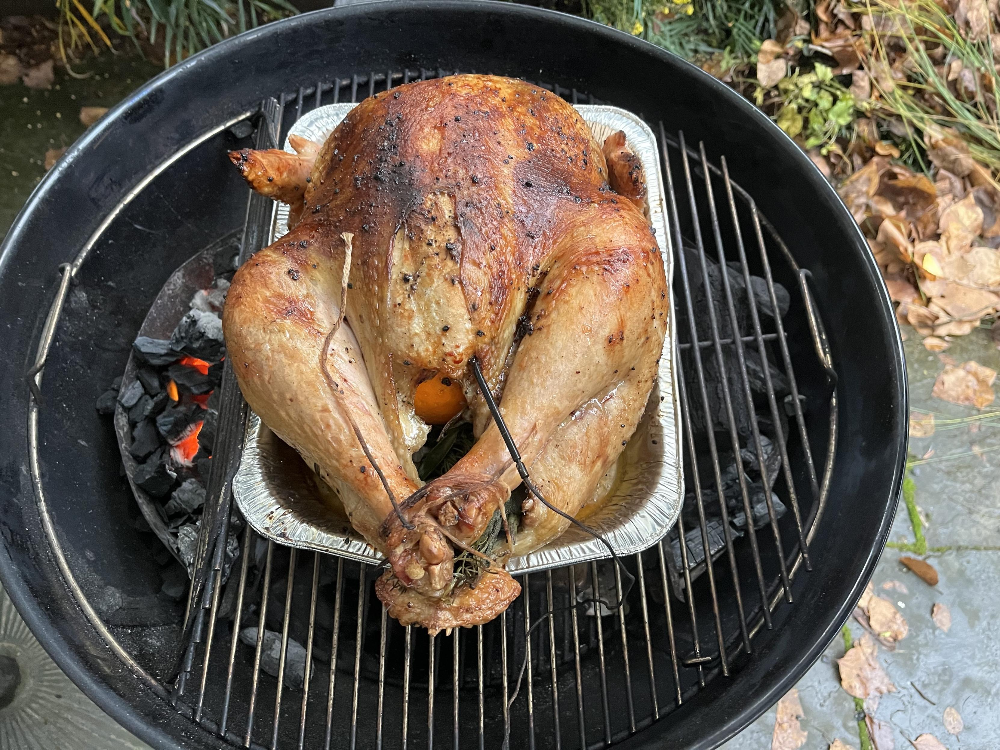

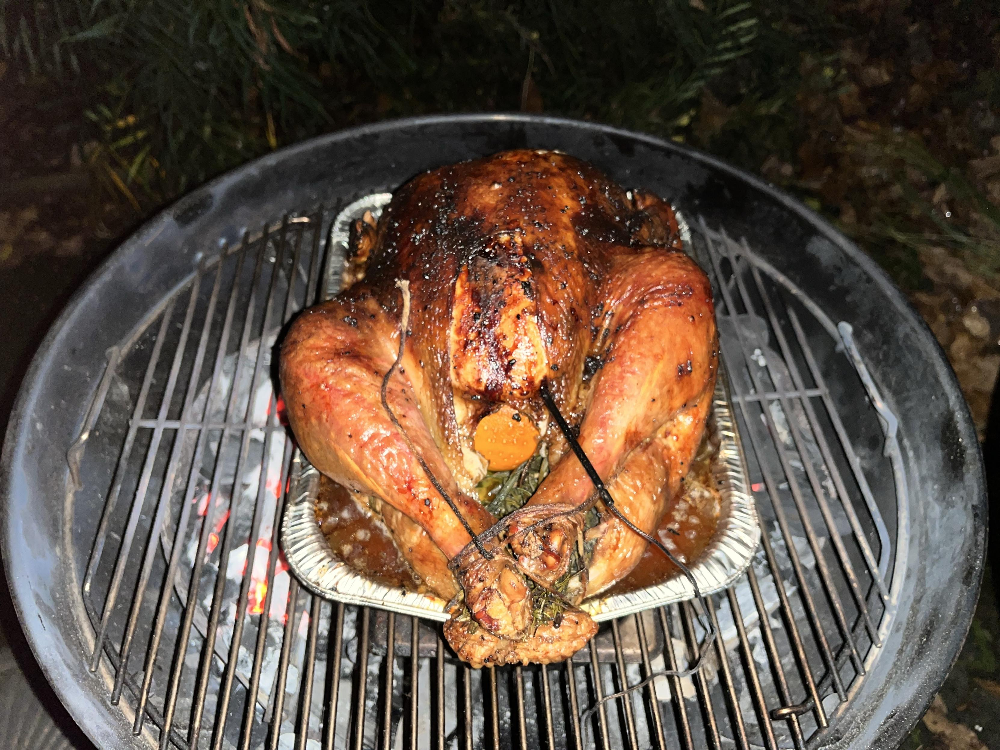

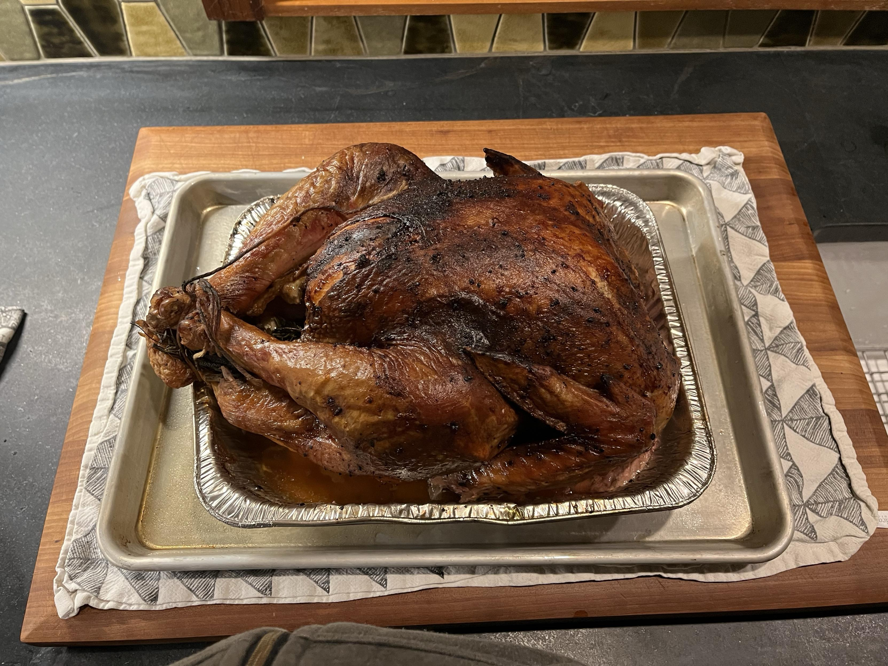

</image-gallery>

## Writing and Creative Schedules

[I published "Emerald Halo"](https://blog.lmorchard.com/2025/12/02/emerald-halo/) to my blog this week—a short story I've had kicking around since 2020. Still getting up the gumption to get myself out to some writing groups, maybe take some [creative writing classes at PCC](https://www.pcc.edu/programs/writing/). Until then, I think I might keep trying to post things I've managed to finish to my blog.

Next thing I'm [eyeing up](https://masto.hackers.town/@lmorchard/115653146481340423) is a 9000 word story that I'm considering serializing, if only to break up the parts and play with serialized stories as a format on my blog.

I've been trying to carve out a mid-day hour on Tuesdays and Thursdays for creative writing. But [today](https://masto.hackers.town/@lmorchard/115663258033672207), I'm just not feeling it. Part of me fears if I skip it and don't make myself do it, I'll stop doing it altogether—as is my ADHD wont. Another part of me fears if I make myself do it, I'll burn out on it—as is my ADHD wont. 😬

## Cat Poop Telemetry

In less appetizing news: Thanks to a trio of [Petivity Smart Litter Box Monitor devices](https://www.petivity.com/products/smart-litter-box-monitor) sheepishly acquired from Black Friday sales, we now have complete litter box telemetry coverage. I [posted](https://masto.hackers.town/@lmorchard/115646454913822842) about how one of our litter boxes sends me a push notification when Catsby poops, which is useful under current circumstances. This is not the future I expected.

Along with this, there are a non-zero number of litter box pictures going around in texts between my wife and I right now. I promise I won't share those here (or anywhere).

Now I just need to figure out how to [get the data out](https://masto.hackers.town/@lmorchard/115659969450359576) of the [closed app](https://blog.lmorchard.com/2025/11/13/w46/#internet-of-cat-pee) before the Purina company abandons these gadgets. (See previous rants on [Nest thermostats](https://blog.lmorchard.com/2025/11/21/w47/#iot-death-watch-nest-thermostats-edition) and [solar inverters](https://blog.lmorchard.com/2025/11/13/w46/#tech-longevity).)

Anyway, hope you enjoy some further cat pictures as a palate cleanser for the poop talk.

<image-gallery>

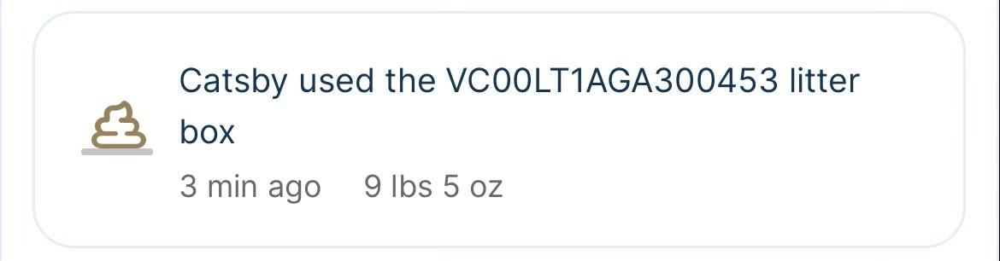

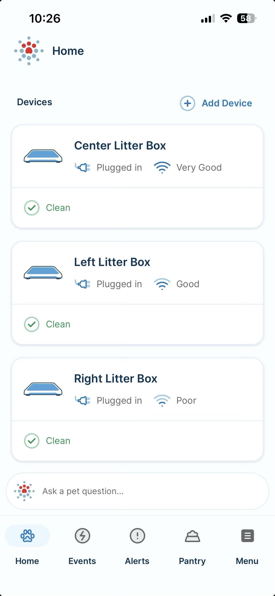

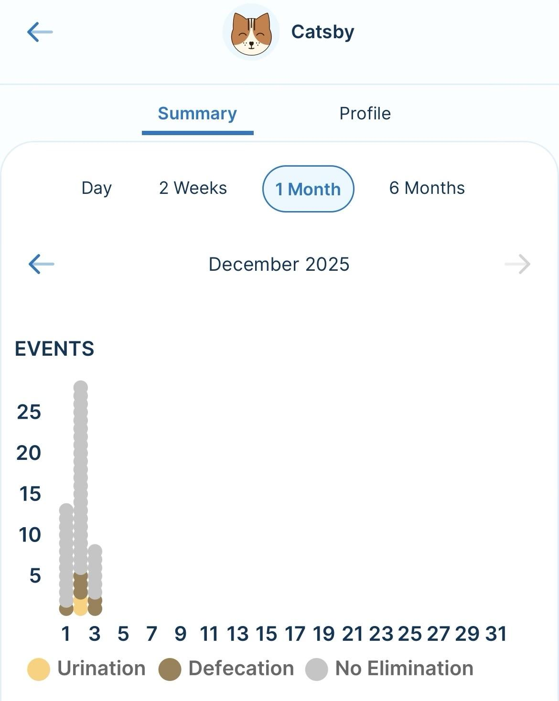

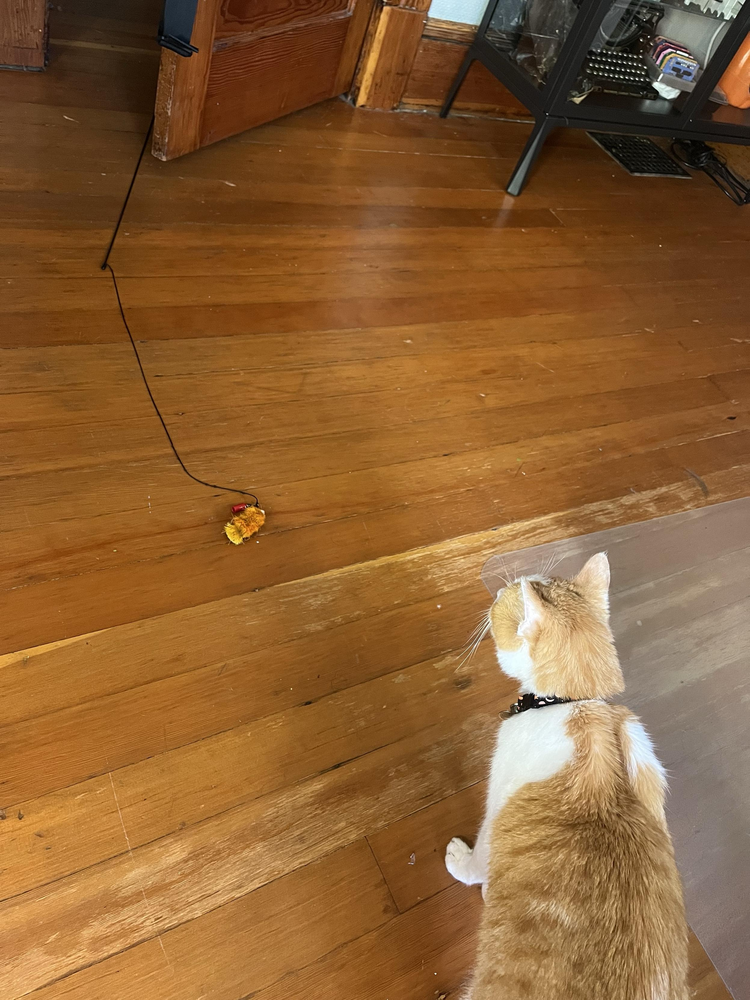

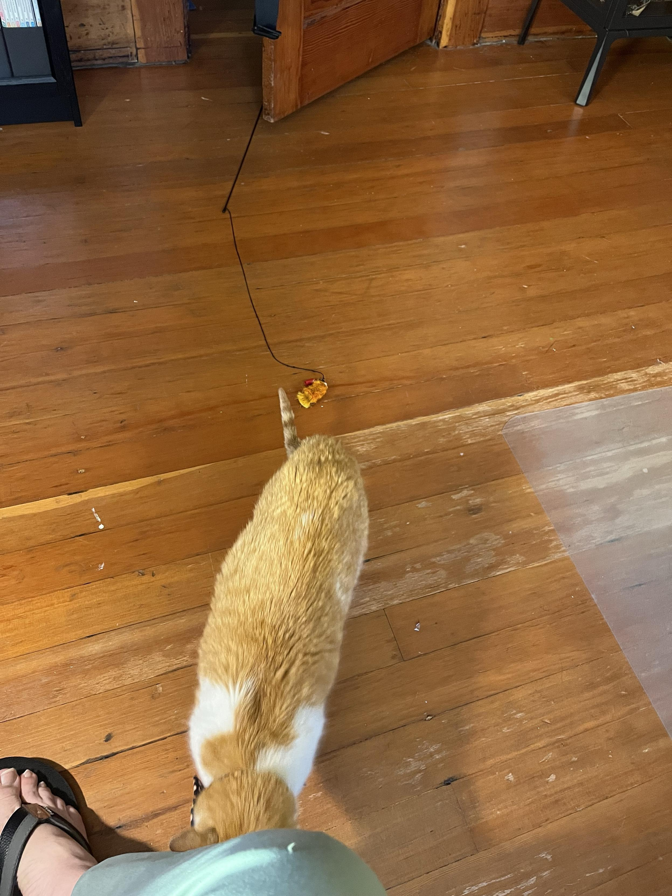

</image-gallery>

## Fortnite Copyright Thunderdome

Oh no, I [reinstalled Fortnite](https://masto.hackers.town/@lmorchard/115643189223384023).

Wait... how the hell did they manage to license "Surfin' USA" by the Beach Boys as the drop-in music? I'm absolutely [astonished](https://masto.hackers.town/@lmorchard/115643195969546692) on the regular at the copyright/trademark/brand mashup they've assembled. Like, do they pay for all of that? Do they get paid to include some of it? Do they just have a Thunderdome of lawyers bashing away at each other?

[Where else](https://masto.hackers.town/@lmorchard/115643201564998667) can I blast Homer Simpson in his underwear with a shotgun, only for Marty McFly to shiv me in the back with a sword from Kill Bill? And then you can go watch King Kong, Godzilla, Hatsune Miku, Iron Man, Giant Homer Simpson, and Voltron beat up on another kaiju.

I ended up [ponying up](https://masto.hackers.town/@lmorchard/115643291316029460) for the Battle Pass. By Tuesday I had, myself, [become Marty McFly](https://masto.hackers.town/@lmorchard/115654417337750479). I'm not particularly good at the game, but they do a good job at giving you stuff to do while running and hiding.

<youtube-embed video-id="j9rLrRYLu3U" title="Godzilla & Miku Miku Beam During Zero Hour Live Event!"></youtube-embed>

## Music Stuff

For some reason, I was in a sudden intense mood to binge on [Mother Mother](https://masto.hackers.town/@lmorchard/115646953570536047) albums. Really like them, though they seem like a band that should be problematic, but I just haven't heard why yet. A lot of bands I really like end up that way.

<youtube-embed video-id="3VTImtygBhI" title="Mother Mother - Make Believe (Official Lyric Video)"></youtube-embed>

Another weird nostalgia moment: I had a distinct memory this week of [listening to](https://masto.hackers.town/@lmorchard/115647087117828402) Aphex Twin on a really low bit rate RealAudio stream on terrible headphones in a university computer lab around the fall of 1995. Sounded like a transmission from space.

<youtube-embed video-id="lyXgX7OmCuA" title="Aphex Twin - 4"></youtube-embed>

From [a cool TikTok on *Creating Unique '80s-Style Graphics with Fairlight CVI*](https://www.tiktok.com/@seanstle/video/7578659984330804494?_r=1&_t=ZP-91tHE1j9Btu), I got Jean-Michel Jarre's "Zoolookologie" stuck in my head:

<youtube-embed video-id="iIeAt5invw0" title="Jean-Michel Jarre's - Zoolookologie"></youtube-embed>

The band [Brighter Than A Thousand Suns](https://linktr.ee/btatsband) is pretty dang keen:

<youtube-embed video-id="Gy52WN9NrGs" title="Brighter Than A Thousand Suns - Break Through the Noise"></youtube-embed>

I haven't really bothered paying much attention to Sabrina Carpenter. But I've seen a bunch of TikToks using clips of "Manchild"—to the point that I've been going "heh, oh boy" all day as a lil verbal stim noise.

So I finally [looked up the song](https://masto.hackers.town/@lmorchard/115652684859966256) on YouTube... I think this might be one of the absolute best music videos I've seen in a very long time. I would totally watch a [whole season](https://masto.hackers.town/@lmorchard/115652691714672227) of TV based on this video.

<youtube-embed video-id="aSugSGCC12I" title="Sabrina Carpenter - Manchild (Official Video)"></youtube-embed>

Also saw Goldfrapp's ["Alive"](https://masto.hackers.town/@lmorchard/115654425595656141) for the first time, thanks to [victordancer on Twitch](https://www.twitch.tv/victordancer)—aerobercizing vampires in 80s sparkly spandex? What in the Olivia Newton John is this?

<youtube-embed video-id="8F9xyKUmwk8" title="Goldfrapp - Alive (Official HD Video)"></youtube-embed>

Speaking of Twitch, I know the year-end "wrapped" things are all passe now, but peeking at my 2025 recap: I pretty much just [watch DJs](https://masto.hackers.town/@lmorchard/115654463017782547) and maybe Tennocon for Warframe. Oh yeah, and [Rifftrax](https://www.twitch.tv/rifftrax). But I watch DJs almost every night?

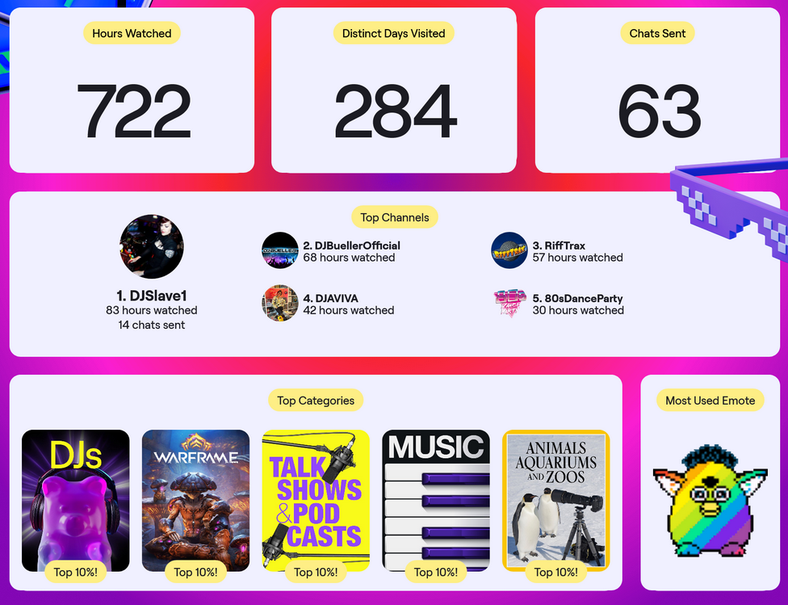

## Humble Bundle Image Comics

This [looks like](https://masto.hackers.town/@lmorchard/115657036459209975) an enormously great collection of comics—all of Black Science and Saga and Sex Criminals and a pile of other stuff I've been meaning to read in the [Humble Bundle Image Comics collection](https://www.humblebundle.com/books/image-comics-in-10s-books).

I will say the download experience is [abysmal](https://masto.hackers.town/@lmorchard/115657086609407718) though. I tried bulk-downloading the PDF versions of everything—the site starts queuing up each individual item as a separate PDF, each of which (and there are 175 items) opens as a new tab in my browser. In case anyone else tries to download this and uses Firefox, there is a [setting](https://masto.hackers.town/@lmorchard/115657122768876021) to disable this behavior.

Humble Bundle also offers BitTorrent as a download option—but each of the 175 items is a [*separate torrent*](https://masto.hackers.town/@lmorchard/115657169960395117).

Also, a bunch of the [CBZ format versions](https://masto.hackers.town/@lmorchard/115657107892552233) are just 22 bytes? That seems... incorrect.

So yeah, [tl;dr](https://masto.hackers.town/@lmorchard/115657151675591732): looks like a great collection of comics but Humble Bundle has a completely abysmal UI for downloading them. I still bought the bundle, but I've seen pirated comic collections offer a way friendlier experience.

## Squirrel!

Randomly: a [napping squirrel](https://masto.hackers.town/@lmorchard/115634951933672500) on our deck, which felt like a gift.

<image-gallery>

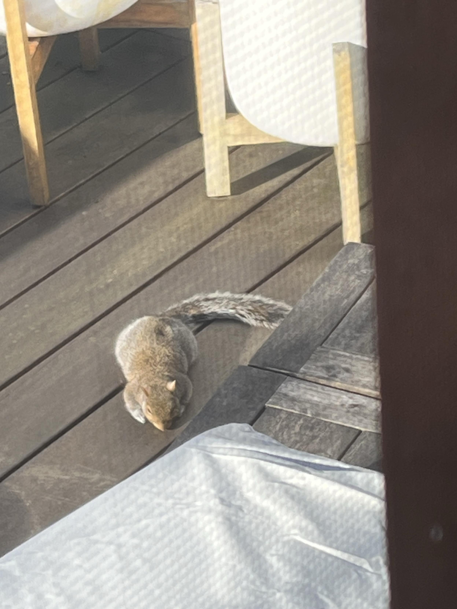

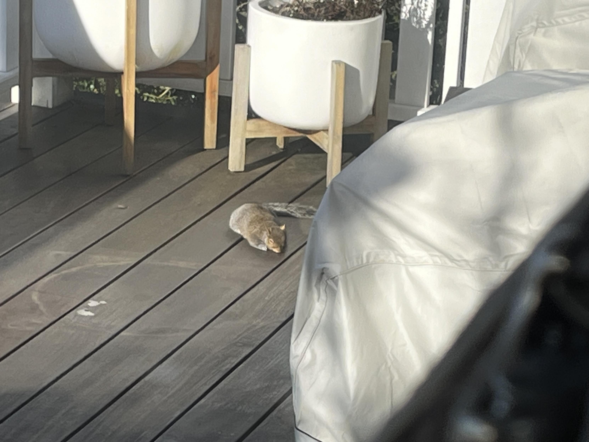

</image-gallery>

## Miscellanea

* [*A Larger Reality: Ursula K. Le Guin*](https://www.oregoncontemporary.org/a-larger-reality) exhibition at Oregon Contemporary. Need to get out there to see this.

* [*Fake Courtesy Machine*](https://www.tiktok.com/@stoccafisso_production/video/7577728538451741974?_r=1&_t=ZP-91mVmYRuBaB) — a crank-driven wooden automaton that endlessly types "I hope this email finds you well" on a laptop. Peak art.

* [*Max Headroom quotes*](https://www.youtube.com/watch?v=nt56RMbpq_0) from the 80s—still holds up weirdly well.

* [*Why use React?*](https://clearleft.com/thinking/why-use-react) — genuinely asking, as a web dev question.

* [*Nothing Feels Authentic Anymore Because Everything is an Ad*](https://hannahglenn.substack.com/p/nothing-feels-authentic-anymore-because) — I have ad fatigue too.

* [*The indie web is here to make the internet weird again*](https://www.theverge.com/column/829831/indie-web-geocities-neocities) from The Verge. Hell yeah.

* [Engineers repurpose a mosquito proboscis](https://techxplore.com/news/2025-11-repurpose-mosquito-proboscis-3d-nozzle.html) to create a 3D printing nozzle. "Necroprinting" is [pretty brutal](https://masto.hackers.town/@lmorchard/115645999760670114) and metal.

* [*Datacenters in space are a terrible idea*](https://taranis.ie/datacenters-in-space-are-a-terrible-horrible-no-good-idea/) — comprehensive teardown of why this doesn't work.

* [*Custom Asidenotes*](https://meyerweb.com/eric/thoughts/2025/10/29/custom-asidenotes/) — Eric Meyer on turning parenthetical comments into sidenotes with web components.

* [*Using CSS nesting*](https://developer.mozilla.org/en-US/docs/Web/CSS/Guides/Nesting/Using) — now supported in browsers, parsed natively unlike preprocessors.

* [*Hello blog*](https://nobloat.org/articles/2025-07-01-hello-blog.html) — a blog generated by 400 lines of handwritten Go code.

* [*RoboCop Statue Arrives In Detroit*](https://www.dailydetroit.com/first-look-the-robocop-statue-arrives-in-detroit/) — 15 years after the [viral tweet](https://masto.hackers.town/@lmorchard/115663055243635155), Detroit has its 10-foot bronze RoboCop.

* [*Zoppi, the lighter to quit smoking*](https://makerworld.com/en/models/1178015-zoppi-the-lighter-to-quit-smoking#profileId-1187535) — when ignited, a miniature 3D-printed hand extends a middle finger. Clever.

* [*The AI boom is based on a fundamental mistake*](https://www.theverge.com/ai-artificial-intelligence/827820/large-language-models-ai-intelligence-neuroscience-problems) — LLMs emulate communication, not cognition.

* [Scientific study](https://www.nature.com/articles/s41598-025-23444-7?utm_source=FuckOff&utm_medium=FuckOff&utm_campaign=FuckOff) comparing parrots and starlings on imitating R2-D2 sounds. Starlings win.

* [*Stellar Harvest*](https://www.postnatural.org/stellar-harvest?utm_source=FuckOff&utm_medium=FuckOff&utm_campaign=FuckOff) — using telescope light to grow phytoplankton off starlight.

* [Victoria Rose Richards' embroidery work](https://victoriaroserichards.co.uk/work/?utm_source=FuckOff&utm_medium=FuckOff&utm_campaign=FuckOff) — aerial and non-aerial embroideries, completely handmade.

* [*Durable Consumables*](https://travers.fyi/durables?ref=sidebar) — "I just wonder what we lose when fewer objects around us are built with the assumption that they'll still be here... decades from now."

* [*On Factory Tours*](https://www.scopeofwork.net/on-factory-tours/?ref=sidebar) — making the case that factory tours inspire young people to build.

* [*How It's Made*](https://www.youtube.com/playlist?list=PL39_ud5aKSvnYDhKdB7wTDUZRiE8RaJat) YouTube playlist — from aluminum foil to contact lenses.

* [*Cover letters used to mean something*](https://leaddev.com/hiring/cover-letters-used-to-mean-something?utm_source=FuckOff&utm_medium=FuckOff&utm_content=FuckOff&utm_campaign=FuckOff) — AI has flooded the pool with sameness.

* [*Vibe Coding: Empowering and Imprisoning*](https://www.anildash.com/2025/12/02/vibe-coding-empowering-and-imprisoning/) by Anil Dash — "The past is a prison when you're inventing the future."

* [*The Long Linguistic Journey to 'Dagnabbit'*](https://www.atlasobscura.com/articles/what-does-dagnabbit-mean) — on taboo deformation and avoiding true names.

* [*Telepath: building a new kind of computer*](https://uniquehazards.com/2025/12/04/telepath-building-a-new-kind.html) — startup building ML-powered computing freed from decades of assumptions.

* [3D-printed spinning Christmas tree toy](https://cults3d.com/en/3d-model/game/xmas-tree-spinning-toy) — elegant and oddly meaningful (also NSFW if you look closely).

* [*Being of the Web*](https://cogdogblog.com/2011/08/being-of-the-web/) — classic post on making content available, findable, and persistent.

* [*Of the web*](https://werd.io/of-the-web/) — most web apps are on the web, but not of it.

