TL;DR: Catsby's on 7 different medications that I'm now managing with 3D-printed pill organizers, I cried my way through two incredibly emotional books about not belonging and noodle-making robots, accidentally won two Fortnite Victory Royales by being a chaotic coward, finally got the MiSTiGRis ADVENT calendar running on my BBS (only 11 days late), suffered through work travel while battling senioritis and hotel fragrance overload, and discovered that Kim Deal and Tanya Donelly sang on my favorite This Mortal Coil track.

<!--more-->

<nav role="navigation" class="table-of-contents"></nav>

## Meta

Not sure if anyone's really reading these, but I'm still puttering with the format. There's a lot in these posts - I'm trying to remix & repurpose my bookmarks and posts from throughout the week. I seem to post and bookmark a lot. Maybe going back to a few smaller posts every day or two would work better, even if I just ended up spewing them out at day's end?

Also, this was kind of a weird week. I was away for a work trip, but really just wanted to be home with my cat.

## Cat Updates

On weekends, I've been sleeping in a lot lately. It is, alas, illegal to get up when Catsby is snuggled up and comfortable. During the week, though, I was away for a work trip. So, [no naps with my cat](https://masto.hackers.town/@lmorchard/115697669863524874). But, I got updates from home.

<image-gallery>

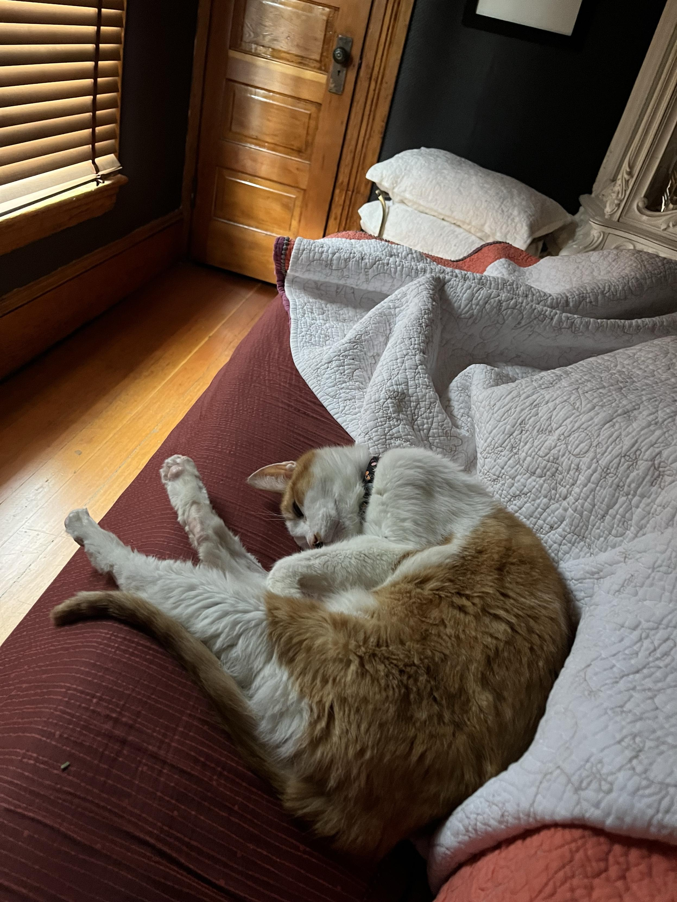

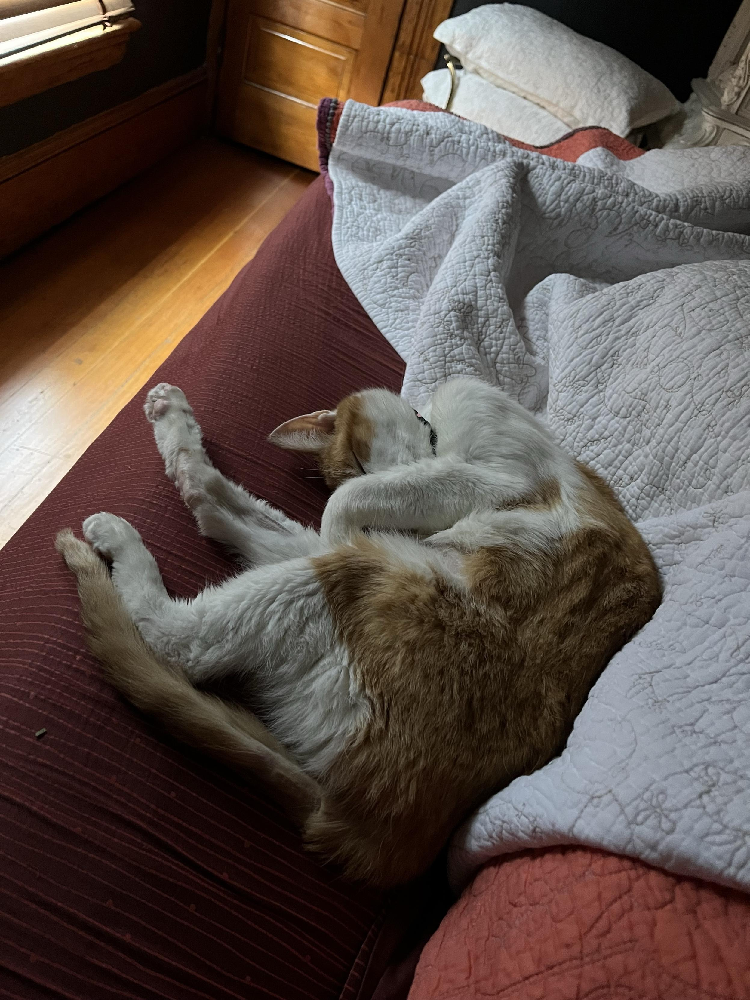

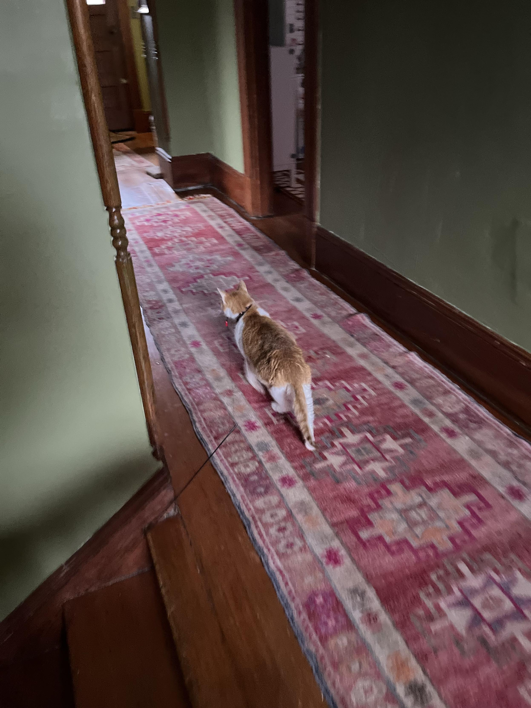

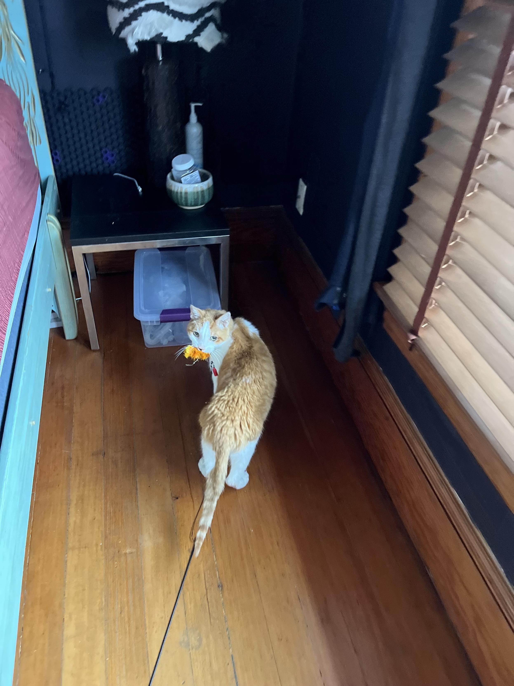

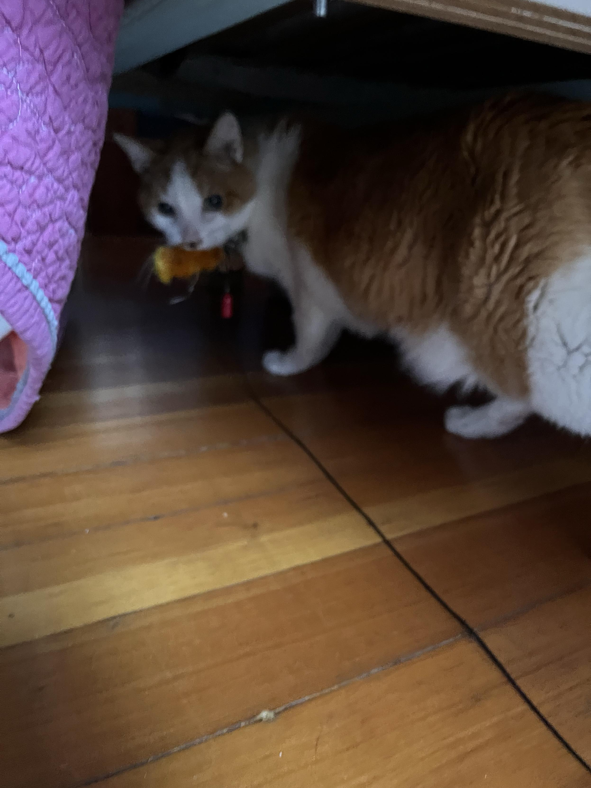

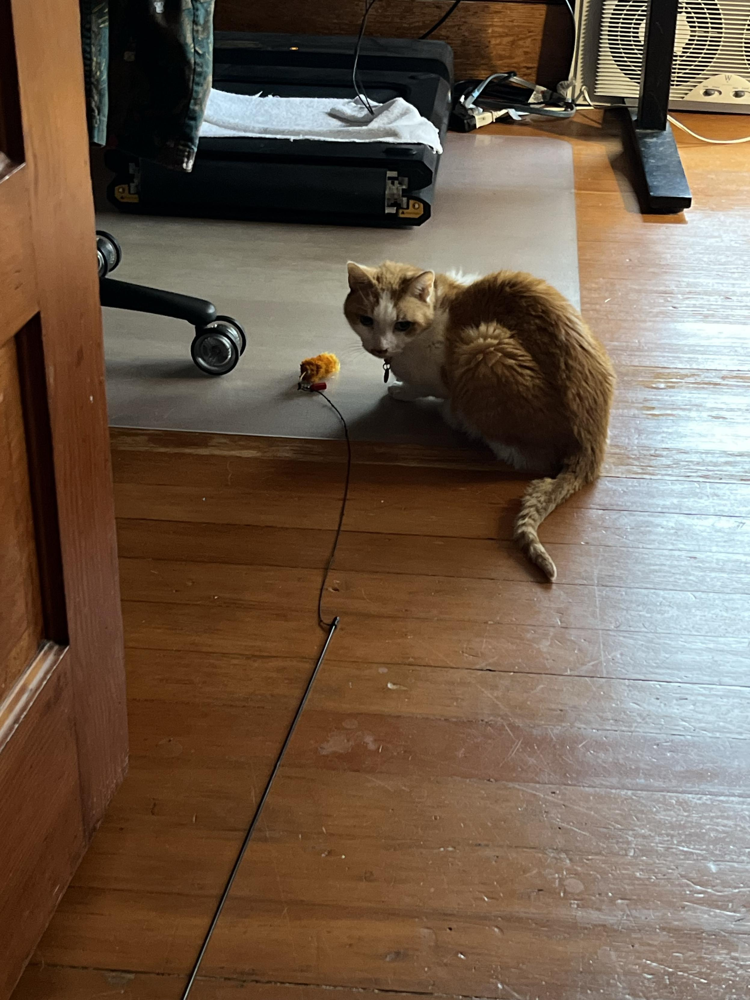

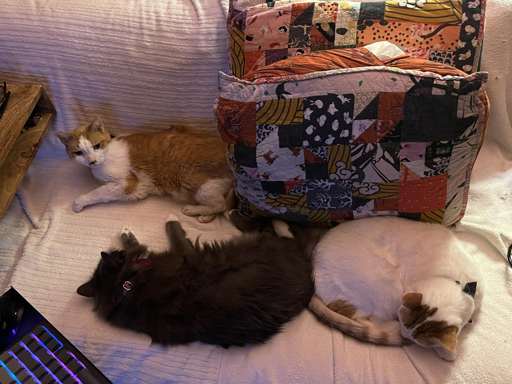

</image-gallery>

And here's an especial flashback to 2017 with [Cosmo kitten](https://masto.hackers.town/@lmorchard/115685832157332573) & Catsby big bro posing for their album cover:

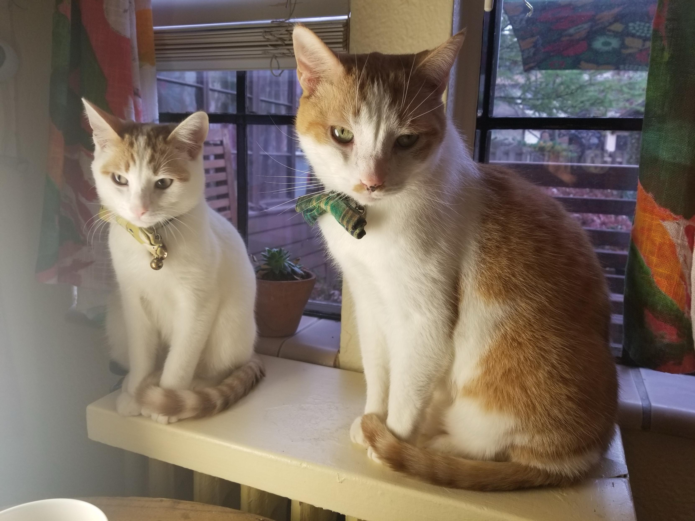

We're trying to keep Catsby as healthy and comfortable as possible in whatever time we have left with him. Right now, that means a regimen of 7 different medications, split between AM and PM doses. Each one needs to be whole or 1/2 or 1/4 of a pill. All of them cause him to foam at the mouth if any touch his tongue.

So far, what's been working to keep it consistent and easy are these two [3D-printed pill organizers](https://www.printables.com/model/11355-weekly-pill-case-organizer-with-personalized-monog) and lots of empty gelatin capsules. I do all the pill cutting, then repackage everything into neutral capsules that seem to bypass his sensitivity. The combo's been giving him rather good days. Catsby is a critter [with most of his sensitivity dials turned up to 11](https://masto.hackers.town/@lmorchard/115682217688798537). I can relate.

<image-gallery>

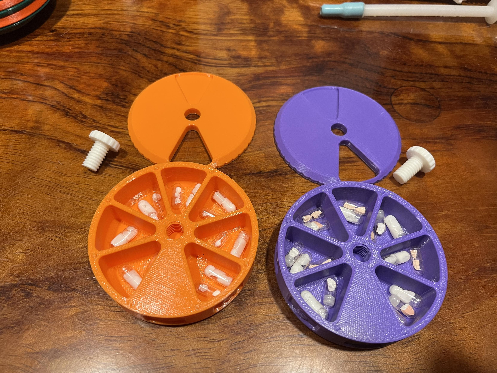

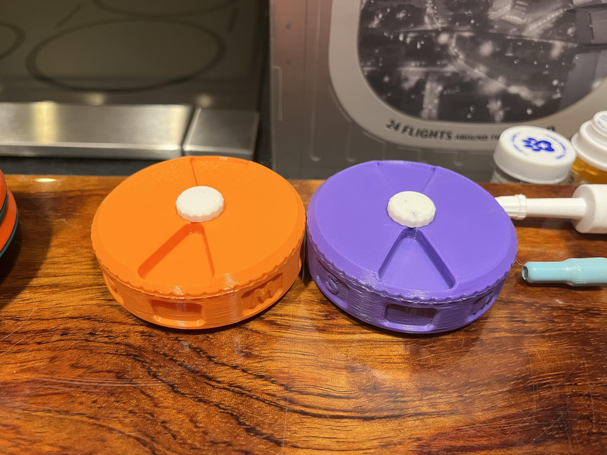

</image-gallery>

## BBS for the Holidays

I'm 11 days late, but I [finally got](https://masto.hackers.town/@lmorchard/115704975005479721) the [MiSTiGRiS ADVENT calendar](https://github.com/robbiew/mg_advent/tree/main) running on [bbs.decafbad.com](https://bbs.decafbad.com) 🎉 (It's under Games & Apps (X), Favorites (1), MiSTiGRis Advent (6)). My BBS is [enormously neglected](https://masto.hackers.town/@lmorchard/115705044449601218), but every now and then I remember it and do something fun.

<image-gallery>

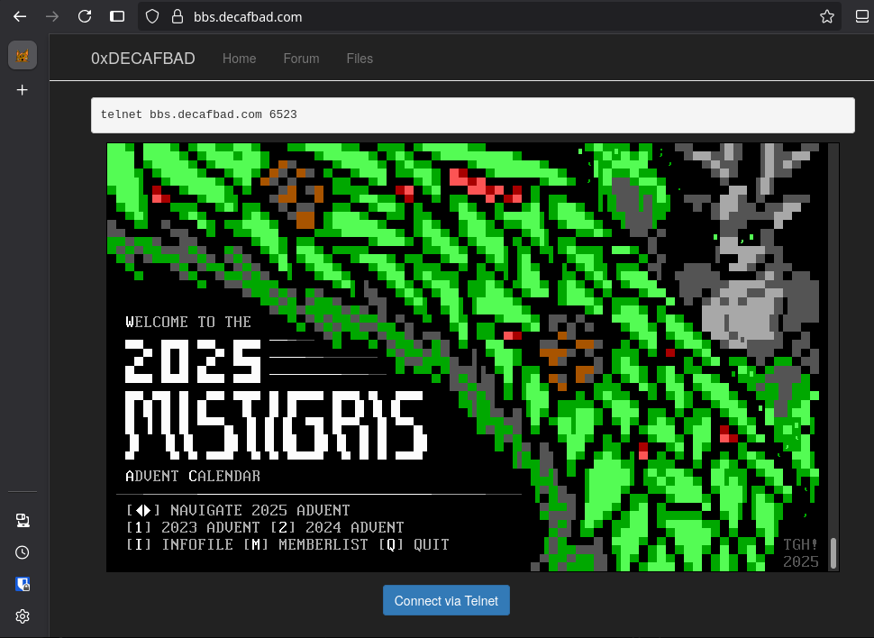

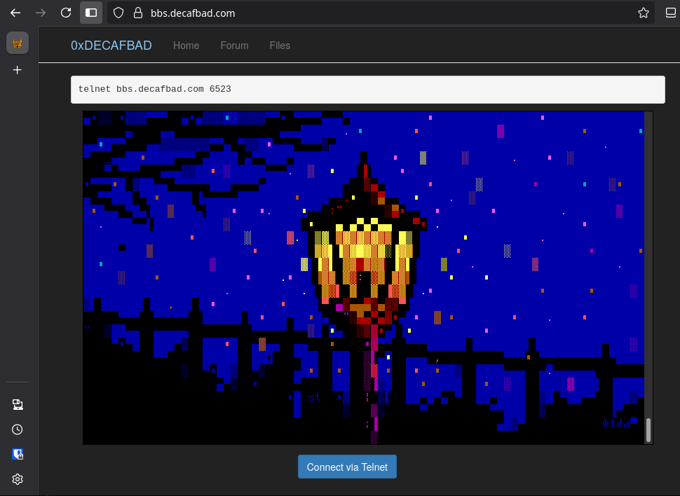

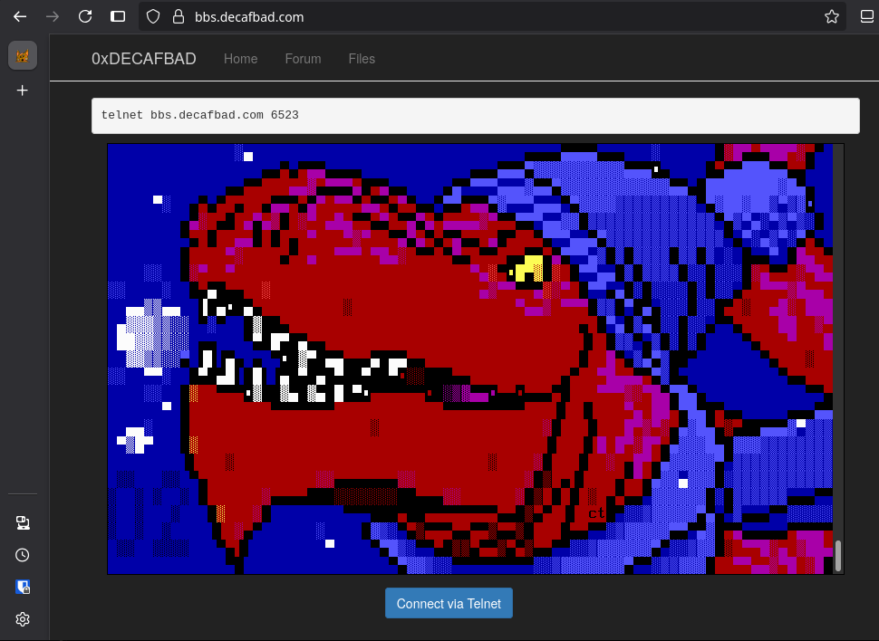

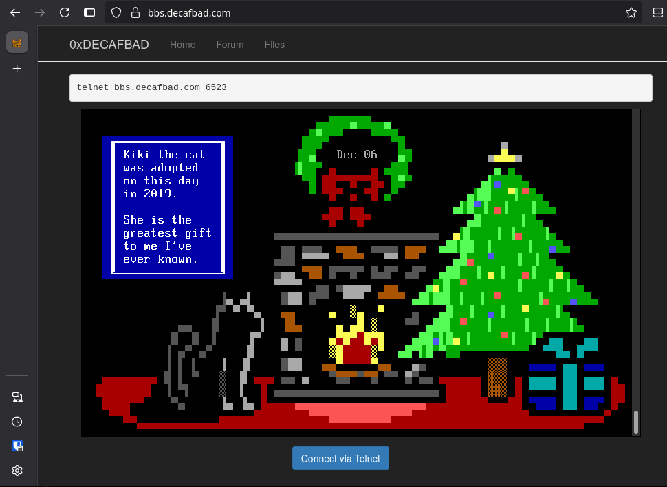

</image-gallery>

## Accidental Fortnite Champion

Like [I mentioned last week](https://blog.lmorchard.com/2025/12/05/w49/#fortnite-copyright-thunderdome), I've been playing Fortnite again. The dopamine's held out longer than I expected! 

I even [got a Victory Royale](https://masto.hackers.town/@lmorchard/115681322786146077). Figures it'd happen when I was doing everything but trying. I spent a good 15 minutes driving around the island in cars honking the horn repeatedly. Also rode a hot air balloon around for a while. Then all of a sudden there were 3 people left and I ran the other two over while they were in an intense firefight. 

I'm not saying I'm actually good at the game—I'll probably never repeat this. But I am also that guy who tried to get the Splatter Spree medal as often as possible in Halo by mowing everyone down zooming around in a Ghost.

The next day? [Another Victory Royale](https://masto.hackers.town/@lmorchard/115682669781248919). This time, I was hiding in a bush like a coward and a Godzilla came sliding into the bush with me. So, I shot Godzilla in the ass and he exploded. 🎺🎺🎺

## Reading

I skipped a work function this week to hide in my hotel room and stave off a nascent migraine. While hiding, I read [_The Gift of Not Belonging: How Outsiders Thrive in a World of Joiners_ by Rami Kaminski MD](https://www.hachettebookgroup.com/titles/rami-kaminski-md/the-gift-of-not-belonging/9780316576086/?lens=little-brown-spark) in one sitting. 

All the validation made me weepy. Later I [downloaded my Kindle highlights](https://masto.hackers.town/@lmorchard/115692488641125944) to Obsidian and apparently captured half the dang book (6,664 words, 41,529 characters).

Then at the airport, I [finished](https://masto.hackers.town/@lmorchard/115702769372741318) reading [_Automatic Noodle_](https://us.macmillan.com/books/9781250357465/automaticnoodle/) by [Annalee Newitz](https://wandering.shop/@annaleen) in basically a single go. That got me teary again, desperately hungry for noodles, and wanting [merch](https://www.automaticnoodle.website/shop). The story of noodle-making robots and found family hit me right in the feelings.

## Music

I just last night realized that it's [Kim Deal and Tanya Donelly](https://masto.hackers.town/@lmorchard/115707879829085788) of The Breeders singing on "You and Your Sister" from [This Mortal Coil's album "Blood"](https://en.wikipedia.org/wiki/Blood_(This_Mortal_Coil_album))? Like, I always thought the voices sounded familiar, but I never looked the song up? 😱

<youtube-embed video-id="YwRzdCkzRHE" thumbnail="8b4c99809205.jpg"></youtube-embed>

Also, while listening to [DJSlave1 on Twitch](https://www.twitch.tv/DJSlave1), "Sin" by NIN came on. There was the line "I gave you my purity, and my purity you stole" and I was [like wait](https://masto.hackers.town/@lmorchard/115682753433299152), which is it Trent? Did you give it or did I steal it? Is this like an inverse cake-and-eat-it-too scenario?

<youtube-embed video-id="5bwE5IU4pzA" thumbnail="9fb03bac0408.jpg"></youtube-embed>

I've seen so many drum solos from Neil Peart. I'll never get tired of seeing drum solos from Neil Peart. Here's one more where he "blew the roof off the dump" on Letterman:

<youtube-embed video-id="qw6aWbXL5Mc" thumbnail="64e9dc019f8d.jpg"></youtube-embed>

And, finally, having "[HERE COMES THE HURRICANE, BITCH! KATRINA KATRINA KATRINA](https://masto.hackers.town/@lmorchard/115690802226907362)" stuck in my head apropos of nothing before a work function makes for a challenging headspace to simulate a professional persona for the day.

<youtube-embed video-id="GMKaa_q1eCg" thumbnail="e8a7e3e505af.jpg"></youtube-embed>

## Miscellanea

* [*The Neighborhood That Broke Portland's Street Grid*](https://www.youtube.com/watch?v=XXw43ykWbJs) - Exploring Ladd's Addition and its unusual diagonal streets. <youtube-embed video-id="XXw43ykWbJs" thumbnail="268ff109c1c1.jpg"></youtube-embed>

* [*1984 Toys "R" Us Christmas Sale Circular*](https://www.retroist.com/p/1984-toys-r-us-christmas-sale-circular) - Just in time for the holidays, historical artifacts that take you right back to being a kid. 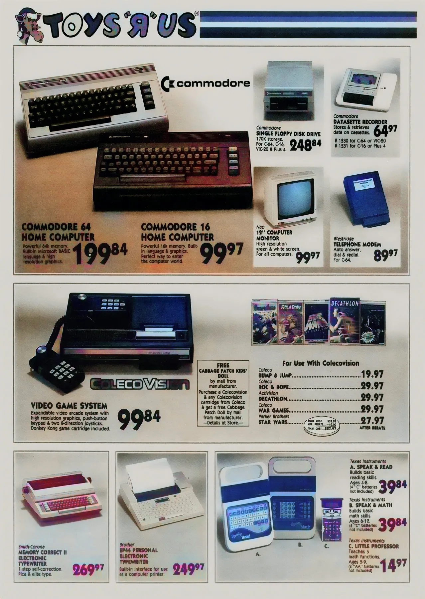

* [*bltMuos*](https://github.com/nvcuong1312/bltMuos) - I can finally use Bluetooth headphones with [MuOS](https://muos.dev/) on my Anbernic [gamedads](https://gamedad.club/).

* [*Resonant Computing Manifesto*](https://resonantcomputing.org/) - Five principles for software that works for you: Private, Dedicated, Plural, Adaptable, Prosocial. This feels important.

* [*Emulate ROMs At 12MHz With Pico2 PIO*](https://hackaday.com/2025/12/06/emulate-roms-at-12mhz-with-pico2-pio/) - ROM emulator based on Raspberry Pi Pico2 for retrocomputing projects. Seems so weird that you can just kind of bit-bang fast enough to get a microcontroller to pretend to be a ROM for a retro machine.

* [*Melting Spoons and Autistic Burnout*](https://www.metafilter.com/211325/Melting-Spoons-and-Autistic-Burnout#8790866) - "It is very hard work, running a body this way... This is at the core of autistic burnout."

* [*Don't Become a Connoisseur*](https://www.joanwestenberg.com/dont-become-a-connoisseur/?ref=westenberg-newsletter) - "If you could take a pill that would make cheap wine taste exactly as good to you as expensive wine, would you take it?"

* [*The Same Game, Twice*](https://www.museumofplay.org/blog/the-same-game-twice/) - How the Strong Museum preserves arcade games as "living traditions." Thoughtful approach to conservation.

* [*Two Years of Building AI in Firefox*](https://blog.ziade.org/2025/12/05/two-years-of-ai-at-mozilla/) - Retrospective on shipping multiple AI features that mostly run on-device.

* [*Useful patterns for building HTML tools*](https://simonwillison.net/2025/Dec/10/html-tools/) - Simon Willison's collection of patterns for single-file HTML applications. Over 150 built, almost all written by LLMs.

* [*If You're Going to Vibe Code, Why Not Do It in C?*](https://stephenramsay.net/posts/vibe-coding.html) - "Wouldn't a language designed for vibe coding naturally dispense with much of what is convenient and ergonomic for humans?"

* [*The AI Wildfire Is Coming*](https://ceodinner.substack.com/p/the-ai-wildfire-is-coming-its-going?r=6ljom&utm_medium=ios&triedRedirect=true) - "AI won't crash—it will burn. Like every tech cycle, the fire will clear the brush, redistribute talent, and leave infrastructure to power what comes next."

* [*DREAM RECORDER*](https://dreamrecorder.ai/) - A portal to your subconscious. The magical bedside device catches your nightly visions and plays them back as vivid, cinematic reels. (This is delightfully weird.)

* [*Why RSS matters*](https://werd.io/why-rss-matters/) - "RSS offers a simple, durable way for publishers to keep control of their distribution and for readers to keep control of their attention."

* [*Oprah Pursues Dr. Phil On Ship Through Arctic*](https://theonion.com/oprah-pursues-dr-phil-on-ship-through-arctic/) - The Onion doing Frankenstein. "Winfrey alleged the pursuit was instigated after Dr. Phil strangled her beloved Stedman..."

* [*ZINEDROP*](https://zinedrop.com/) - A community directory for independent zines. Submit publications, discover new work.

