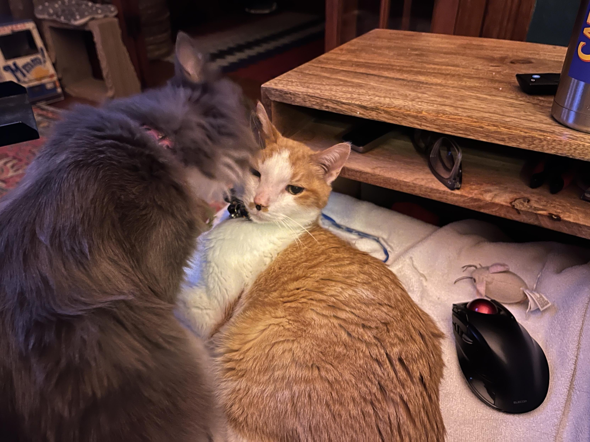
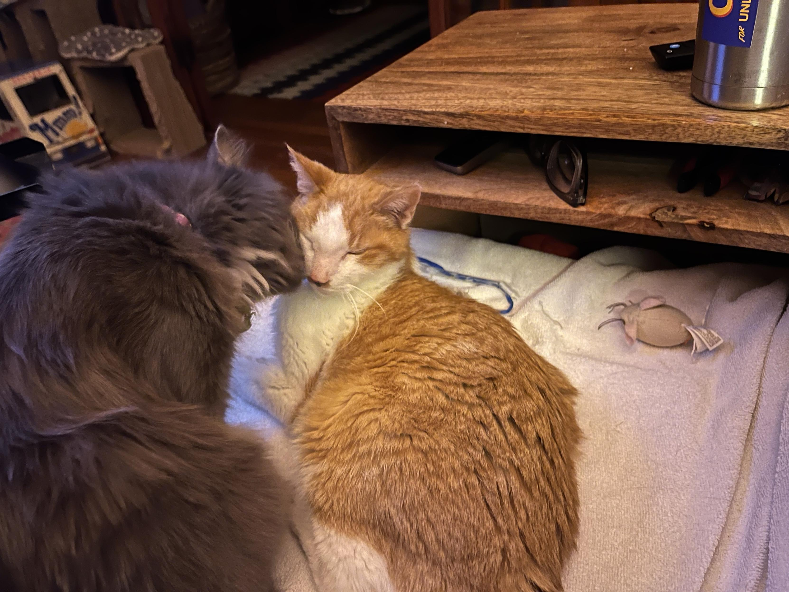
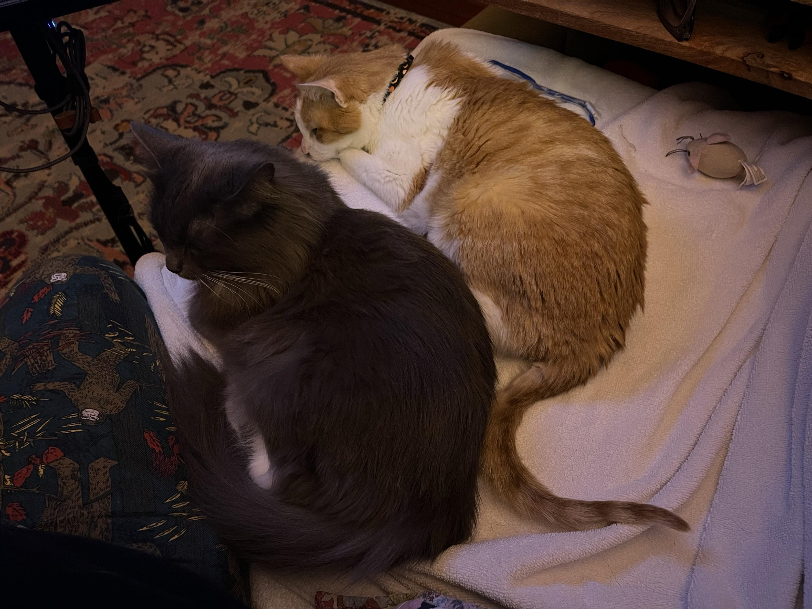
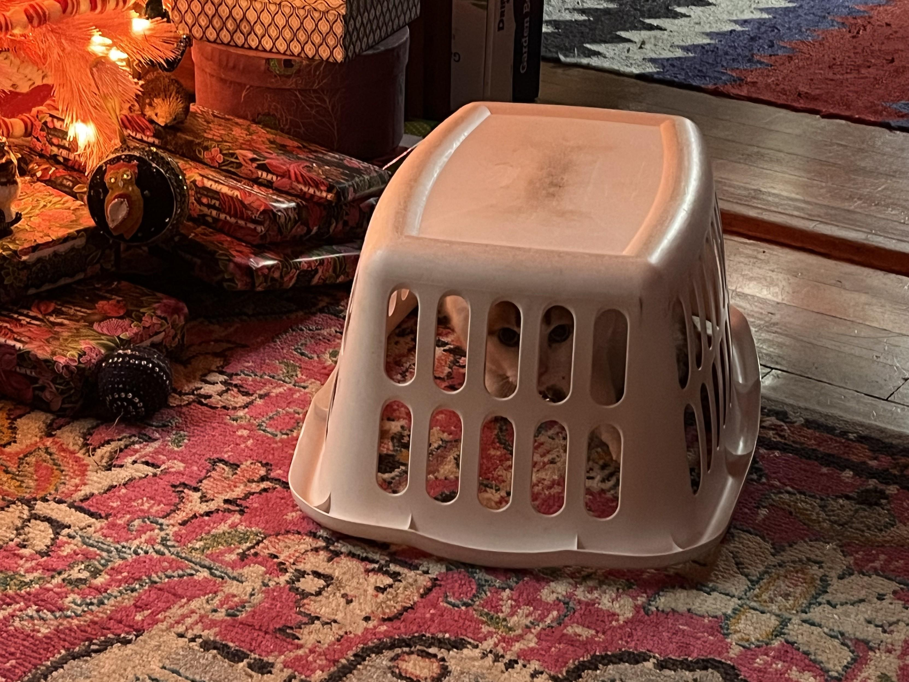
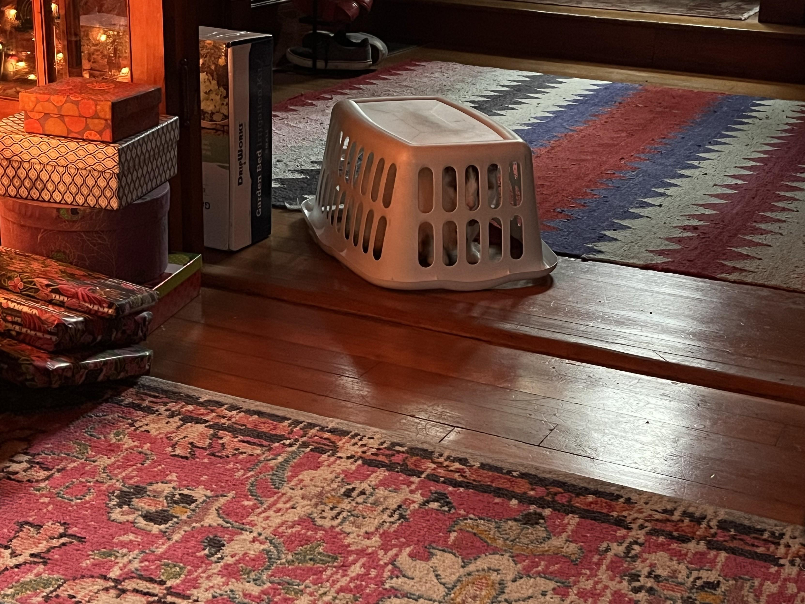
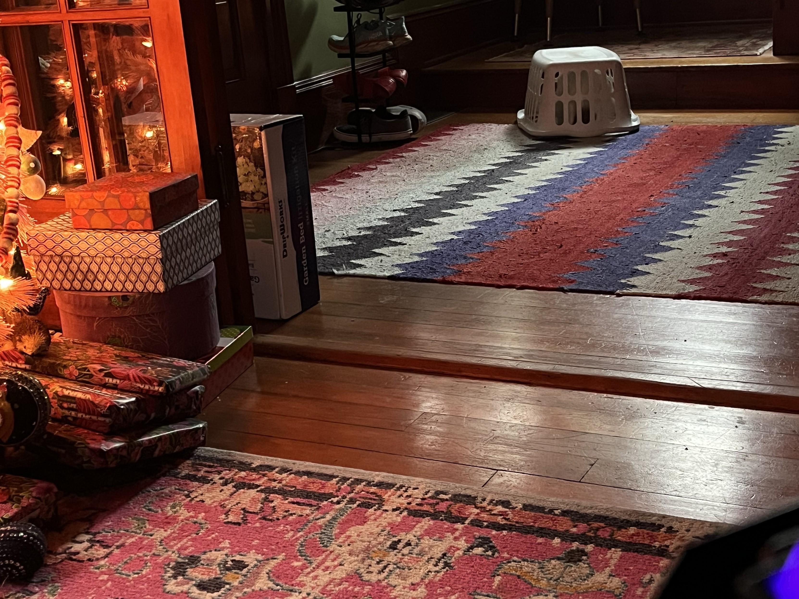
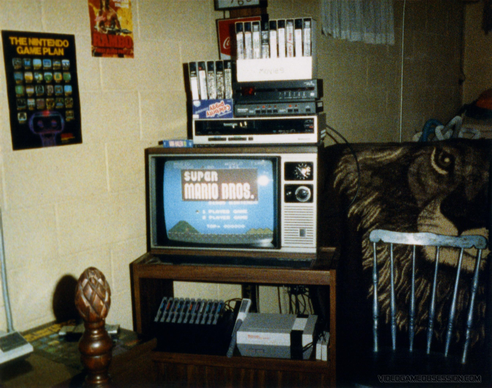
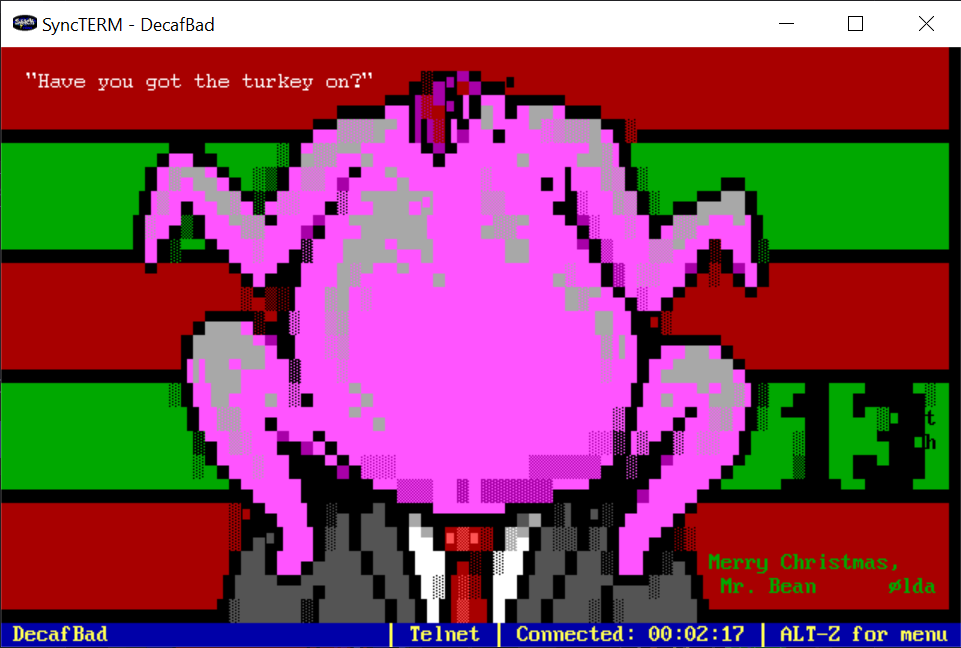
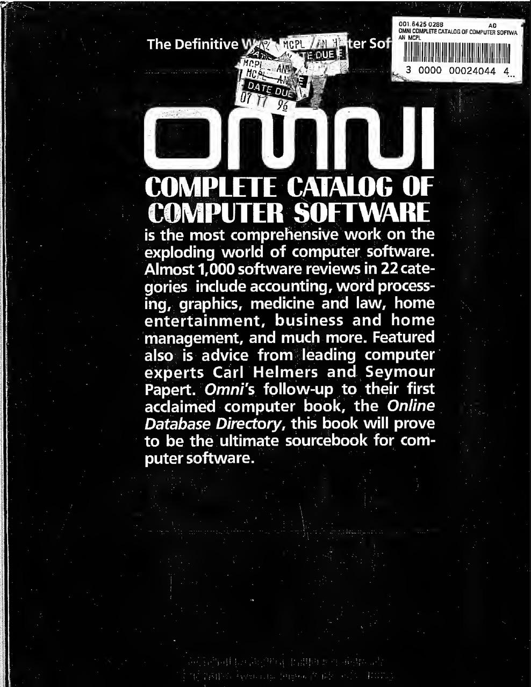

8<--- { "title": "Miss Biscuits Plays Nursemaid", "slug": "miss-biscuits-nursemaid", "tags": ["cats"], "time": "07:14:00-08:00" }

Miss Biscuits has been taking excellent care of Catsby lately. I [caught them](https://masto.hackers.town/@lmorchard/115722346727654705) last night with her giving him a thorough bath while he lounged next to me on the couch.

She hasn't been here long, but she's turned into the queen-slash-mother of the house. Watching her methodically clean his face while he just accepts it with that resigned cat expression is pretty heartwarming. Especially given all the medical adventures Catsby's been through this year.

<image-gallery>

</image-gallery>

8<--- { "title": "Not Feeling the Season", "slug": "holiday-mood", "tags": ["personal", "holidays"], "time": "18:34:00-08:00" }

Someone asked about holiday plans, and I [realized](https://masto.hackers.town/@lmorchard/115725018188354238) my honest answer would be "I intend to be placed into a medically-induced coma for the next 6 months to a year." Practically speaking, I'll probably just stay home on the couch and eat a lot of carbs for the next couple of weeks.

This follows this weekend's Christmas tree adventure where I put it up, I screwed with some lights that weren't working, Cosmo climbed it and knocked the whole thing over, and we just... [took it back down](https://masto.hackers.town/@lmorchard/115720172799224561) and put it away without decorating it. I think we're just not feeling it this year.

JR Conlin [mentioned](https://mindof.jrconlin.com/@jrconlin/statuses/01KCFEDKSPT7ETWSR3EGZ4273J) he's seeing the same thing - decorated out of habit rather than desire, fewer houses with lights up in his neighborhood. The weather just serves as a reminder of dark times. That resonates.

Here's to finding some sanguinity and warmth anyway. Or at least some silly that brings a bit of joy.  For what it's worth, [here's a flashback to our Christmas tree from 2024](https://masto.hackers.town/@lmorchard/115730512394486825). We tried to put Cosmo Kitten into cat jail with a laundry basket - but he turned it into a cat mech.

<image-gallery>

</image-gallery>

8<--- { "title": "Miscellanea for 2025-12-15", "time": "23:59:00-08:00", "type": "miscellanea", "slug": "miscellanea", "tags": ["miscellanea"] }

- Hello world!

- Woke up from a [dream](https://masto.hackers.town/@lmorchard/115724227485384310) where humans started metabolizing microplastics to become Lego people. Several people thought this sounded like one of the better outcomes of the whole microplastics mess.

- [This short story about AI and creative writing](https://sightlessscribbles.com/the-colonization-of-confidence/) is great and angry and captures something important: 
    > It chose 'stone' because statistically, in the petabytes of training data scraped without consent from the internet, the word 'stone' appears in proximity to 'lump in throat' with a probability of 0.04 percent. It isn't a choice. It's a math problem. It is predicting the next token based on mediocrity.

- Millie's [take on software completion](https://infosec.exchange/@millie/115719943870742405):
    > We need to normalize declaring software as finished. Not everything needs continuous updates to function. In fact, a minority of software needs this. Most software works as it is written. The code does not run out of date.

- Joan Westenberg on [Thin Desires Are Eating Your Life](https://www.joanwestenberg.com/thin-desires-are-eating-your-life/): 
    > You'll spend an afternoon doing something that cannot be made faster, producing something that you could have bought for four dollars, and in the process you'll recover some capacity for patience that the attention economy has been methodically stripping away.
    This resonates with the whole "declare software finished" sentiment above.

- [Polyglot AI Agents: WebAssembly Meets the JVM](https://blog.mozilla.ai/polyglot-ai-agents-webassembly-meets-the-java-virtual-machine-jvm/) - Mozilla.ai exploring how to combine WASM's performance benefits with Java's ecosystem maturity for agentic frameworks.

- Been seeing [this 1987 gaming setup](https://mastodon.social/@moshboy/115710634627272651) making the rounds - NES on a CRT with Rambo and Nintendo posters. I've totally been in this room. 

- The [Mr. Bean ADVENT calendar art](https://oldbytes.space/@mistfunk/115714717223593435) from Mistigris continues to delight. Also doesn't hurt that I got it running on [my own neglected bbs.decafbad.com](https://bbs.decafbad.com). :) 

- [Mark Damon Hughes posted](https://appdot.net/@mdhughes/115724213595964236) the OMNI Complete Catalog of Computer Software from 1984 and I'm hit with nostalgia. There's a whole [archive.org copy](https://archive.org/details/Omni_Complete_Catalog_of_Computer_Software_1984_Omni_Publications_International/) to browse through. 
    > Goddamn I loved OMNI. And the techno-optimism that software was the way into The Science Fiction Future and not, you know, the Torment Nexus that it actually became.

    
