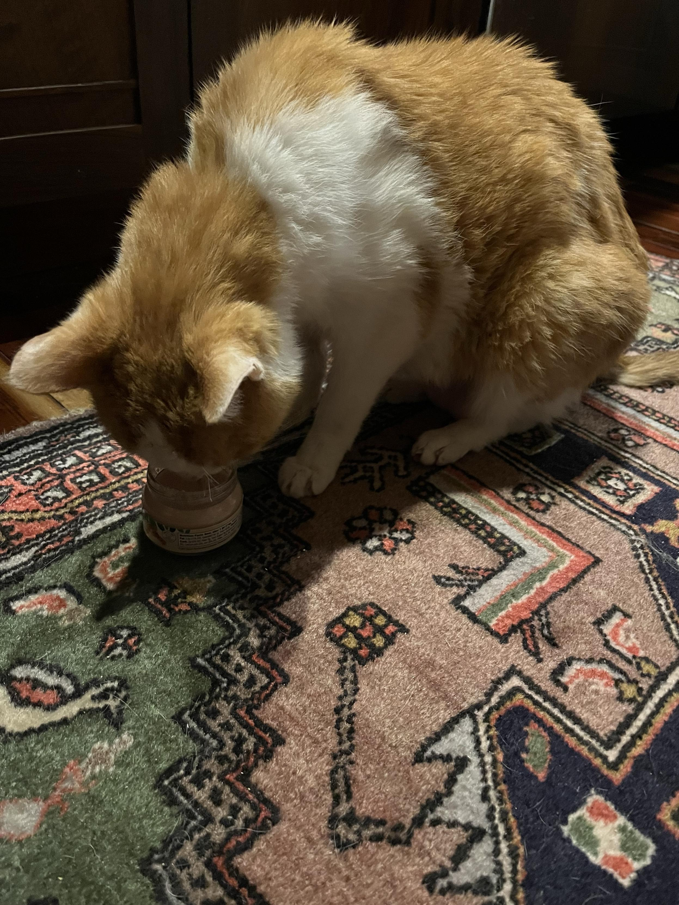
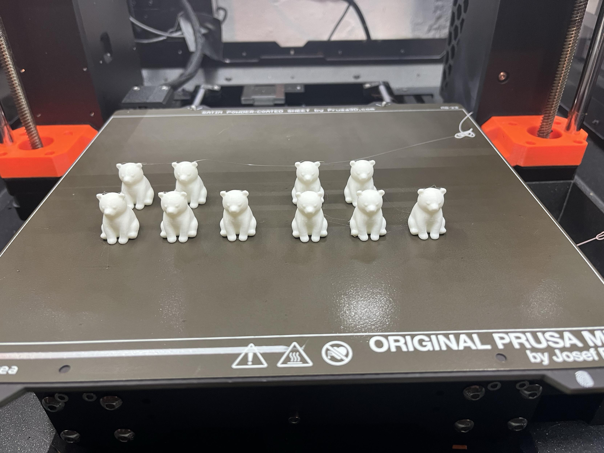
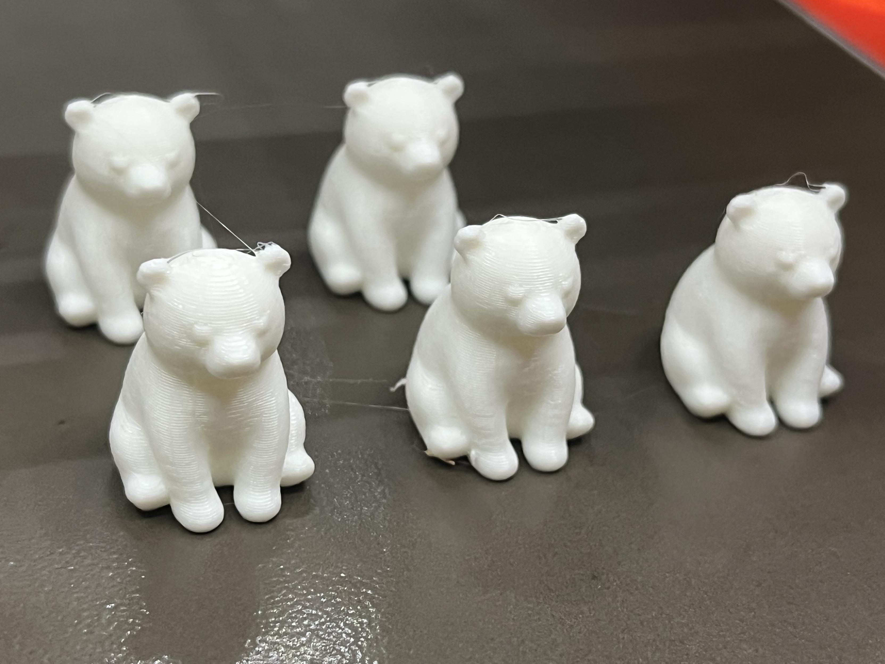
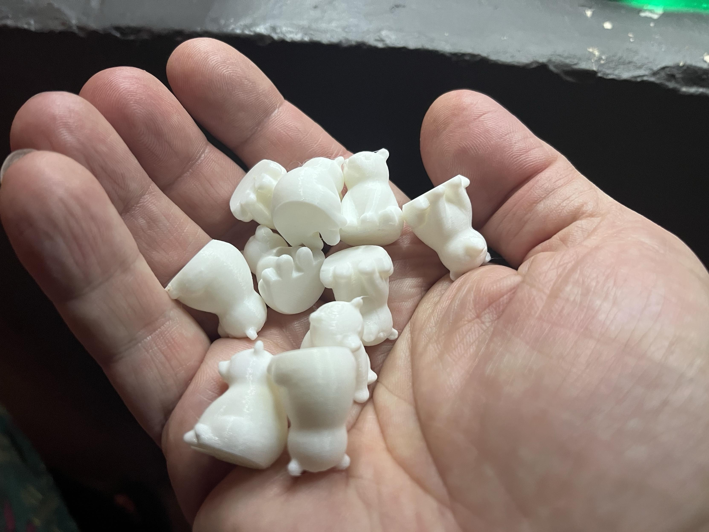
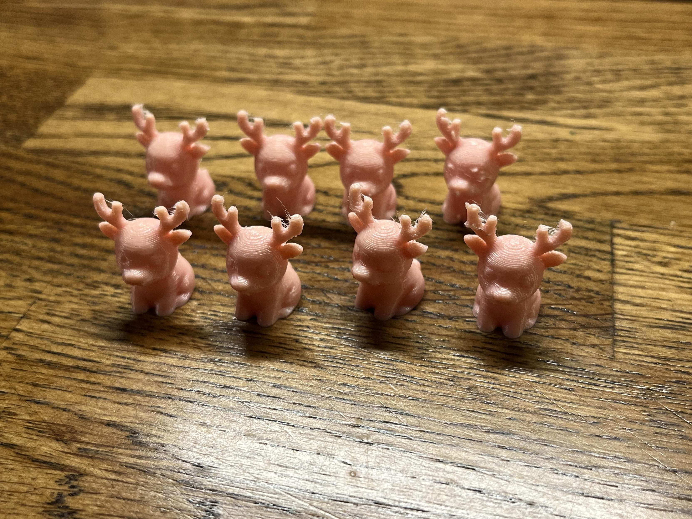
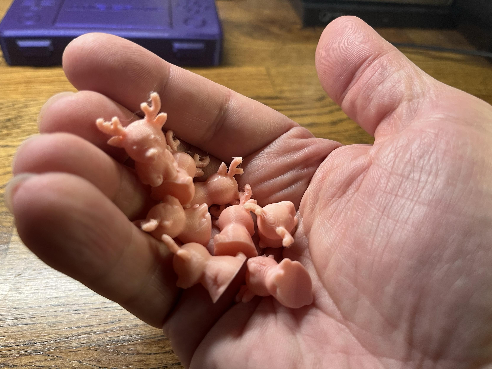

TL;DR: Weeknotes continue! Tried to write daily posts but only managed one before the week happened. Catsby finally found food he loves (baby food in a jar), printed an army of tiny polar bears and fleshy-looking pink reindeer, friendship ended with Fortnite and now Warframe is my best friend, and spent way too much time thinking about game streaming with Sunshine & Moonlight while pondering whether to turn my gaming PC into a basement server.

<!--more-->

<nav role="navigation" class="table-of-contents"></nav>

## Meta

Well, here's another weeknotes post! I'd thought maybe I would start doing some semi-daily posts again, but I only managed [one miscellanea post](https://blog.lmorchard.com/2025/12/15/miscellanea/) and a couple others before the rest of the week happened. 

## Catsby's Baby Food Discovery

The big cat news this week: Catsby hasn't been eating well lately, and he's lost weight. Then I [offered him a jar](https://masto.hackers.town/@lmorchard/115744536141129826) of chicken and broth baby food. I don't think I've seen him happier in years. He gobbled down 3/4 of it and even batted at the other cats to keep it to himself.

I got a [picture of him](https://masto.hackers.town/@lmorchard/115744953660574975) shoving his muzzle into the jar when I gave him a sniff—gave him a bowl when it looked like he was into it:

The one problem: Cosmo cleans up the leftovers and has gained the pound that Catsby lost. So now I have to watch for when Catsby's done eating and [scoop up what's left](https://masto.hackers.town/@lmorchard/115746960742880390).
## Tiny Plastic Animals

I now have a [tiny polar bear army](https://masto.hackers.town/@lmorchard/115743016115605525):

<image-gallery>

</image-gallery>

Here's the [model](https://www.printables.com/model/1505635-mini-polar-bear-christmas-mini-figure-figure-figur). I'm [tempted](https://masto.hackers.town/@lmorchard/115743031866779517) to print a bunch more, shove some in my pockets, and leave them random places around town if I have to do any last minute shopping next week.

And now I have a [herd of tiny pink reindeer](https://masto.hackers.town/@lmorchard/115743250864395962):

<image-gallery>

</image-gallery>

Here's the [model for these](https://www.printables.com/model/1505642-mini-reindeer-christmas-mini-figure-figure-figurin), though I think I might have to putter around with supports or some setting to make the antlers less prone to spaghettify. I'm trying to decide if they look [slightly unsettling](https://masto.hackers.town/@lmorchard/115743261705366423) rendered in stringy pink? Like they're oddly fleshy, almost like axolotls.

## Friendship Ended With Fortnite, Warframe is now Best Friend

That said: [friendship ended with Fortnite](https://masto.hackers.town/@lmorchard/115727878887637958). Now Warframe is my best friend.

I've been getting [social anxiety](https://masto.hackers.town/@lmorchard/115727875882513200) doing trading in Warframe, a video game. You have to message folks, meet them in the game, and exchange stuff. Everyone's been nice, though. My brain feels super broken most days. 🙃 But like, even if someone is a jerk to me in Warframe, I can [block them and/or log out](https://masto.hackers.town/@lmorchard/115727888743207343)? Why brain.

I will say, though, Warframe is where I've gotten [hassled the least](https://masto.hackers.town/@lmorchard/115727900494683733) of all multiplayer games for when I don't know what I'm doing.

## Stupid Slothmas Project Idea

I was considering picking up one of those little Dell office PCs to play with as a server. But then another idea [occurred to me](https://masto.hackers.town/@lmorchard/115742815292541742): what if I moved my gaming PC to the basement, stuck Proxmox on it, then used a Dell office PC as a game streaming client at the couch with Sunshine & Moonlight? I could also make the gaming PC be a server when I'm not gaming all the time. I could also stream games to a Mac laptop or my phone or maybe my Nintendo Switch?

[Why would I do this?](https://masto.hackers.town/@lmorchard/115742819192758738) Because my gaming PC has been working fine for far too long as-is.

I've been trying it out this week—[streaming with Sunshine/Moonlight](https://masto.hackers.town/@lmorchard/115743429329268604) from my Linux gaming machine downstairs to a MacBook Pro upstairs. Using an Xbox controller in bluetooth on the laptop and a wired network connection, playing smooth as can be. It's working surprisingly well?

## Miscellanea

* [Woke up from a dream](https://masto.hackers.town/@lmorchard/115724227485384310) where humans started metabolizing microplastics to become Lego people

* My god, how is ["Things Can Only Get Better" by Howard Jones](https://masto.hackers.town/@lmorchard/115743422935542232) seeing its 40th anniversary? <youtube-embed video-id="0fKOaz5dxPU" thumbnail="8480ec8a971b.jpg"></youtube-embed>

* I'm a lil sad because I [lost one of my earbuds](https://masto.hackers.town/@lmorchard/115737927479752084) when I was on that work trip last week. But, not too sad, because they only cost $15. Splurged a little and got a new pair of Moondrop Space Travel 2 for $30. Maybe I'm just blessed with poor taste, but I've been really pretty satisfied with all but the very cheapest of ear buds? I've given AirPods a shot, but couldn't really tell a 5-10x improvement

* Out of the corner of my eye, birds are [flitting around and through the branches](https://masto.hackers.town/@lmorchard/115741942183414765) of a hawthorn tree just outside my office window, feasting on berries. A part of my brain keeps interpreting the motion as notifications sliding away on one of my monitors, inducing repeated tiny panics. (what have they done to us?!)

* [*The Long, Knotty, World-Spanning Story of String*](https://hakaimagazine.com/features/the-long-knotty-world-spanning-story-of-string/) - Without string, our ancestors could not have domesticated horses and cattle or efficiently plowed the earth to grow crops

* [*Toaster vs Washing Machine*](https://www.youtube.com/shorts/QDqrzo_6z6A) - When you buy appliances, always ask yourself: toaster or washing machine? Toaster is an invitation to use more tech for its own sake. Washing machine is tech that transforms life

* [*China's Clean Energy Push*](https://www.nytimes.com/interactive/2025/12/17/climate/china-hefei-clean-energy-drones-evs-robots.html) - flying taxis, food delivery drones, and China's ambition to dominate clean energy technologies

* [*The Web Platform is a Triumph of Object-Oriented Programming*](https://thathtml.blog/2025/12/the-dom-is-a-triumph-of-object-oriented-programming/) - every web API you have ever used is designed specifically within the OOP paradigm

* [*Prompt caching: 10x cheaper LLM tokens*](https://ngrok.com/blog/prompt-caching/) - It turns out that the math done for the first part of a promtp doesn't change as you add stuff to the end of it. So, you can cache all that math for common context and prompt prefixes.

* [*Reinventing the dial-up modem*](https://saket.me/dtmf-tones/) - "We needed a way to send data to our server without an internet connection. A team member came up with this fantastic idea of using DTMF tones!"

* [*Diabaig*](https://conornally.itch.io/diabaig) - a traditional turn-based ASCII roguelike where you are never more than a few mistakes away from death

* [*The handleEvent() method*](https://gomakethings.com/the-handleevent-method-is-the-absolute-best-way-to-handle-events-in-web-components/) - a platform-native method for managing all of the events on your Web Component

* [*My HTML Web Component boilerplate for 2026*](https://gomakethings.com/my-html-web-component-boilerplate-for-2026/) - everything I've learned from working on Kelp UI

* [*Your job is to deliver code you have proven to work*](https://simonwillison.net/2025/Dec/18/code-proven-to-work/) - We need to deliver code that works—and we need to include proof that it works as well

* [*Introducing Ringspace*](https://taggart-tech.com/ringspace/) - a proof-of-concept for how we might modernize the webring concept with asymmetric cryptography to provide trust within small human communities

