TL;DR: Took two weeks off to play Warframe and drink eggnog. Catsby's thriving on baby food. PG&E's power blips forced me to finally get a UPS. Also melted failed 3D prints into stinky artifacts, disassembled a boom box, and installed a doorbell camera to watch the neighbor's cat. Bookmarked too many AI coding articles. Happy new year!

<!--more-->

<nav role="navigation" class="table-of-contents"></nav>

## Metablogging

Still mulling over whether this is a worthwhile format of blog posts. This particular one's going to be rather long, but hopefully the pictures are nice to look at. We'll see if I keep it up long into the new year.

I suspect shorter posts are better - i.e. every section here should probably be its own thing. But, I keep bouncing off any daily habits, despite my best efforts earlier last year where [I made it so much easier to post](https://blog.lmorchard.com/2025/06/02/obsidian-rube-goldberg/). Maybe I should just rattle out a series of tiny posts at the end of the week? Might seem weird.

## Nog Time

For the end of the year, I took a couple weeks of staycation. I kicked it off with MFNT (motherfuckin nog time). I also got to see [a rainbow](https://masto.hackers.town/@lmorchard/115748978762189137) just as I was shutting down the work laptop, which was a nice send-off.

<image-gallery>

</image-gallery>

## Cat Updates

Catsby is still with us. This was not entirely expected, but I'm definitely grateful. Over the break, he's been demonstrating his commitment to the "if I fits, I sits" philosophy by completely [ignoring the soft heated bed](https://masto.hackers.town/@lmorchard/115810867637805123) in favor of somersaulting into a too-small cardboard box.

<image-gallery>

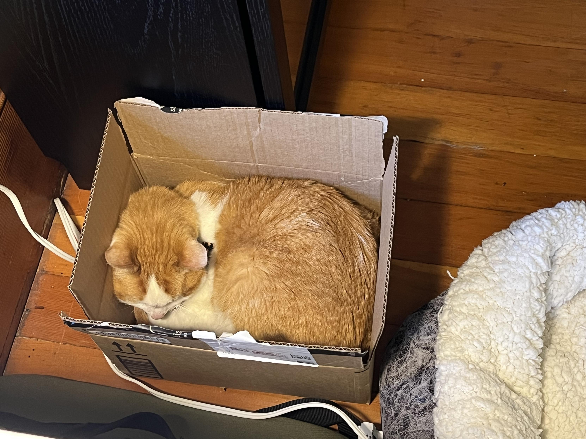

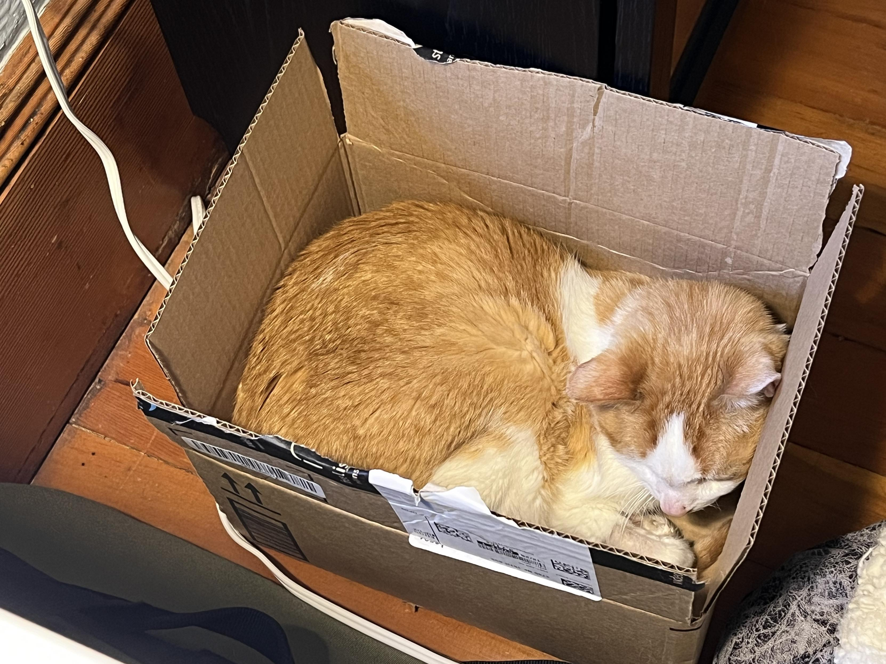

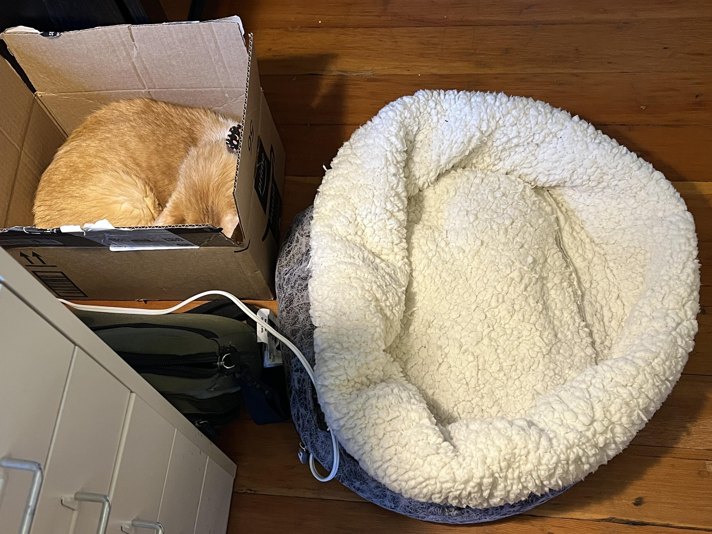

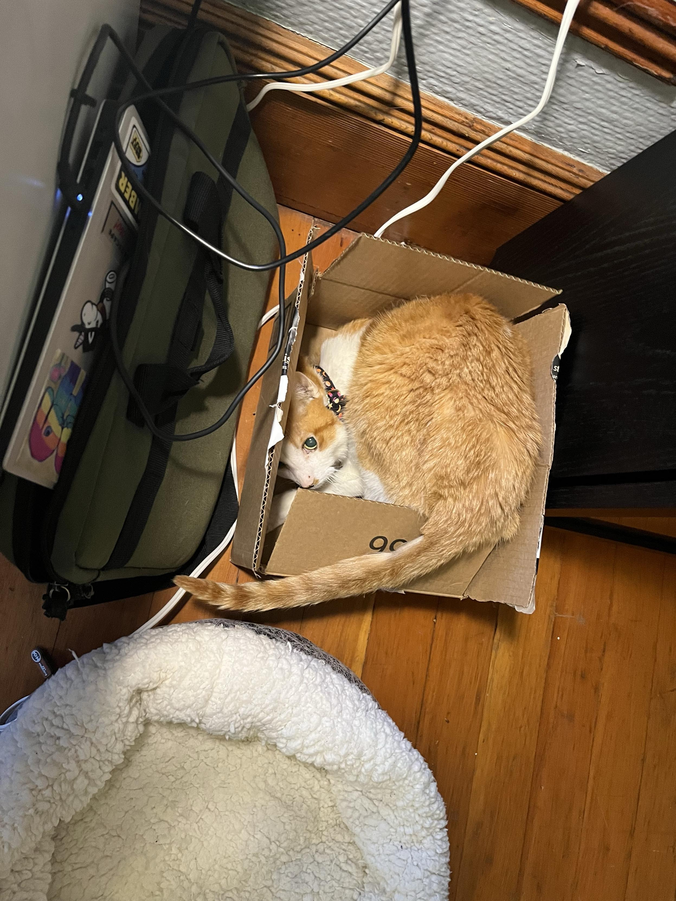

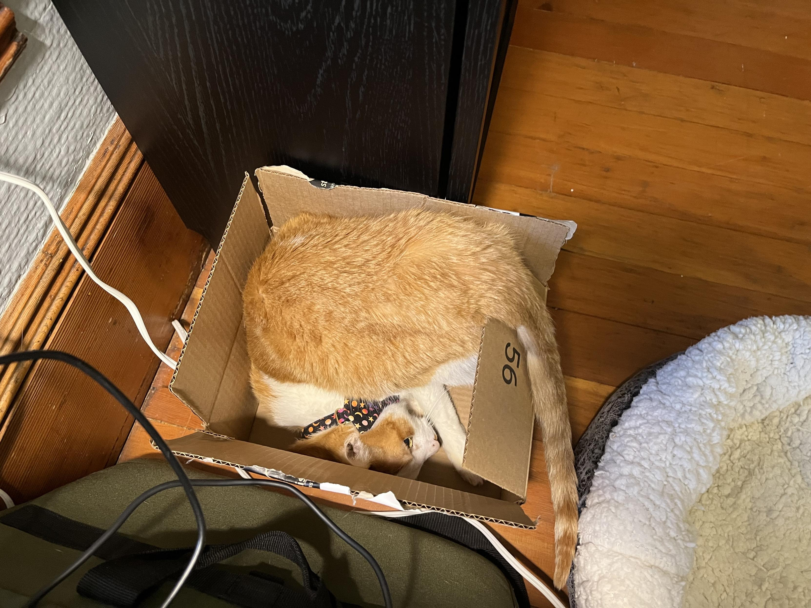

</image-gallery>

Miss Biscuits, for one, [prizes comfort](https://masto.hackers.town/@lmorchard/115822448496532318). Then Cosmo [arrives to occupy](https://masto.hackers.town/@lmorchard/115822505997258171) the box and annoy her (she likes it though):

<image-gallery>

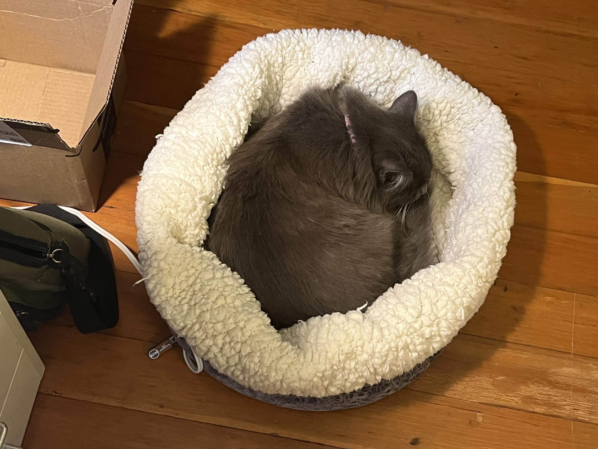

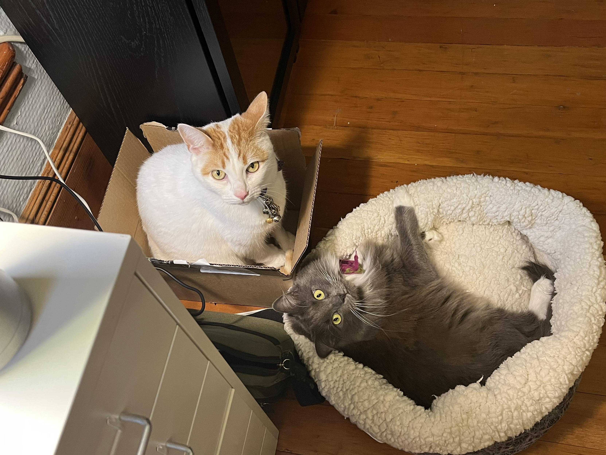

</image-gallery>

At one point, when I sat down for some writing over lunch, I had [many friends](https://masto.hackers.town/@lmorchard/115810886715336058):

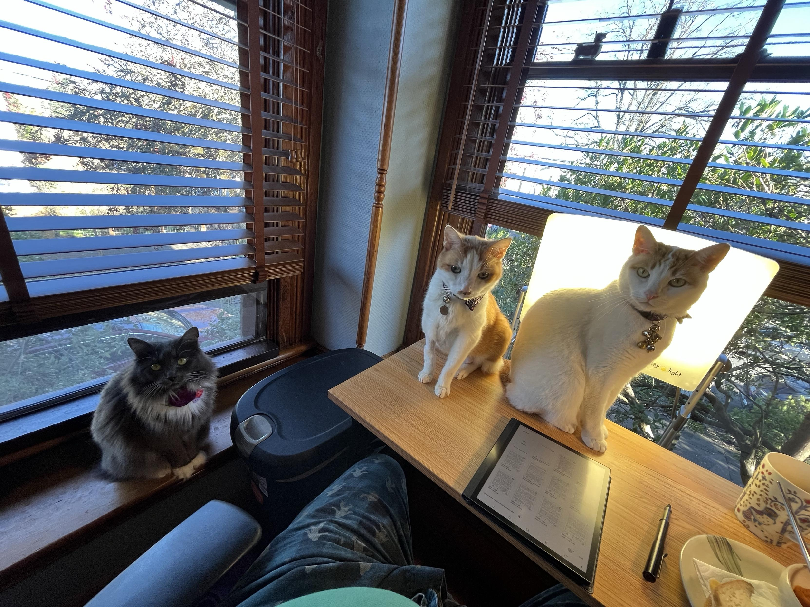

## Doorbell Camera

Also got a doorbell camera as a gift (not Ring, thank [Bob](https://en.wikipedia.org/wiki/J._R._%22Bob%22_Dobbs)). Still fiddling with it. [Did you know](https://masto.hackers.town/@lmorchard/115798544194254423) that IR lights attract swarms of flying insects and they make the motion alert go off all night? 🪰 [Funny part is](https://masto.hackers.town/@lmorchard/115798555145133242) the camera motion classification kept labeling the bugs as "pet." We also get all squirrels labeled as pets, which isn't entirely false.

After a bit of configuration, the bugs don't come around anymore. But, [it does now email me](https://masto.hackers.town/@lmorchard/115804085168073407) whenever the neighbor's cat hangs out on our front step. This happened 8 times in one night. Sometimes he looks mournfully at our door and meows. We'd let him in, except the current cat residents would riot.

I think other neighbors on the block have let him into their houses before, which is probably why he thinks our house should let him in too. He's a very friendly lil guy and we've occasionally taken care of feeding him when the neighbors are off on vacation.

<image-gallery>

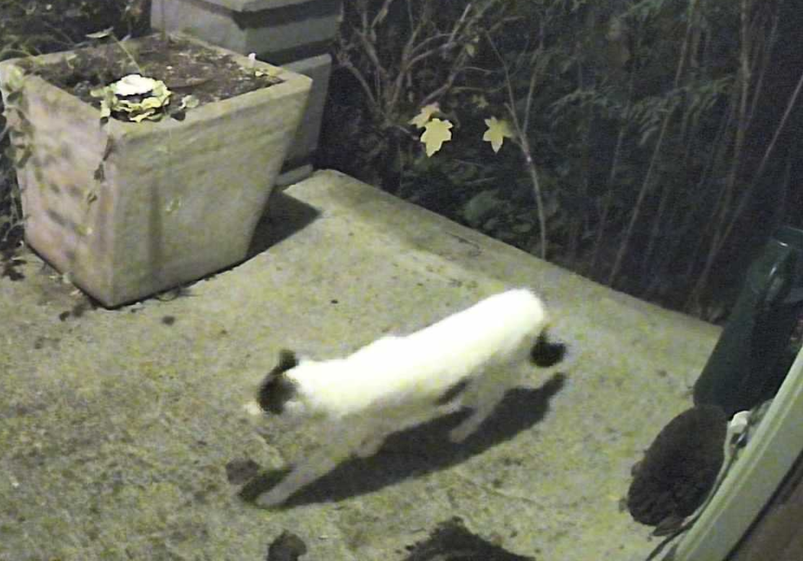

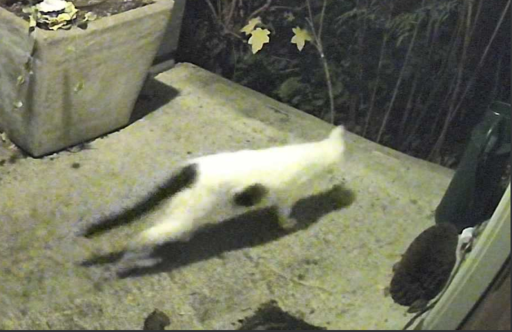

</image-gallery>

## Power Blips

PG&E has apparently decided to [try to fry](https://masto.hackers.town/@lmorchard/115809967698353357) every device I own. We had 6 or 7 one-second power outages over the course of 90 minutes one night. That was a record, but we've also been getting at least 1 one-second blip every night or two at around 5:30pm for the past couple months.

The GPU on my gaming PC glitched and froze up—hoping that's not on its way out. I also had a handful of cheap Tasmota RGB smart bulbs from AliExpress that [apparently had their firmware](https://masto.hackers.town/@lmorchard/115809979990226647) and settings wiped after the power blips? Like, they reverted to some version of Tasmota that thinks it's a z-wave bridge rather than a lightbulb? Computers are fun.

The power outages also [exposed me](https://masto.hackers.town/@lmorchard/115810060238006452) to a new (to me) failure mode for Docker! Apparently, you can get some local KV database corruption and need to do some crude rocket surgery before restarting all the containers. Learning every day.

So I ordered Baby's First UPS in hopes that I can maybe keep network & server gear from getting blipped to death. [Should have done that a long time ago.](https://masto.hackers.town/@lmorchard/115816509794093323) Got everything plugged into it and got a NUT server running on my Home Assistant Pi. Lots of other gadgets can query status from that server. The Synology sends me email when there's a power outage now. I think I like the doorbell emails better.

That said, I unplugged the UPS and just started cackling madly as everything just kept running—the power company can't stop me now! Muahahaha!

## 3D Printing & Material Recycling Experiments

I [repeatedly tried](https://masto.hackers.town/@lmorchard/115767652498342871) re-slicing and re-printing a lil #3dprinting project with various settings tweaks, but it kept spaghettifying almost immediately. Feeling real dumb as I finally notice that, except for a lil protrusion, the bulk of main object is hovering 0.5mm above the print bed. Flipping it over fixes it. 🤦

Speaking of failed prints: I got some cheap silicone molds as a gift, along with a heat gun. So, I [took a shot](https://masto.hackers.town/@lmorchard/115834155122385496) at melting a bunch of 3D printed discards into the molds. Not a very successful attempt. Heat control all over the place. Seemed like I couldn't get the material flowing into the mold—or I went straight to burning it. Everything stinks.

[I managed to make an odd Artifact](https://masto.hackers.town/@lmorchard/115838923035376974) in a silicone cup. Progress? Sorta. Not really. Still stinks. I might give it another try, but could be better off if I got an old toaster oven from a thrift store.

<image-gallery>

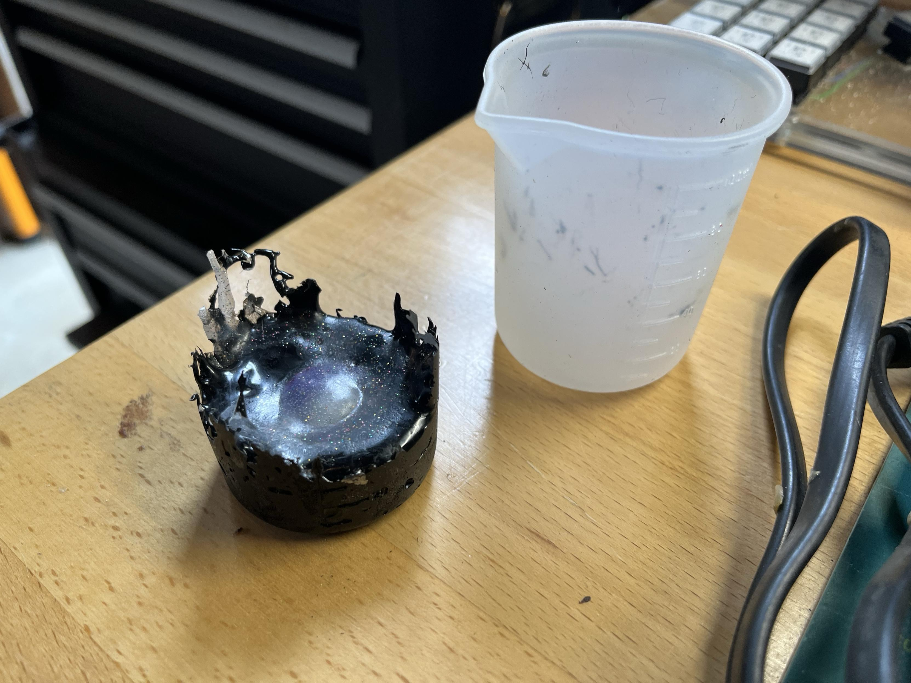

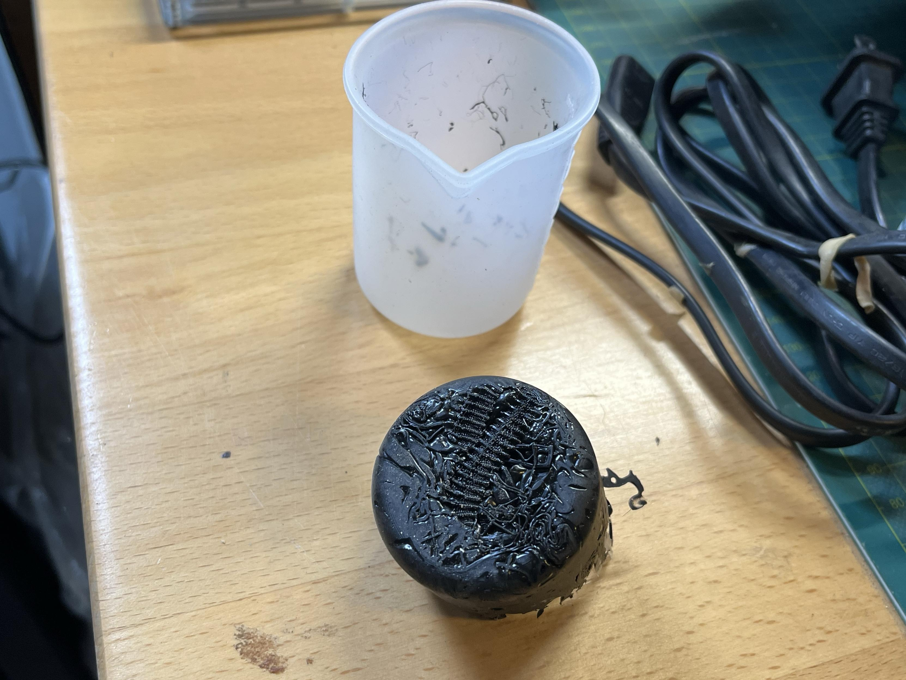

</image-gallery>

## Boom Box Resurrection

Hey, remember when [I bought that boom box off eBay back in November](https://blog.lmorchard.com/2025/11/13/w46/#nostalgia-acquisition)? Because it was the same model I had growing up? I [took it apart](https://masto.hackers.town/@lmorchard/115839411680241919).

Believe it or not, even though it looks like I dropped it off a bridge, it's working better now. At least the FM radio part. Haven't tried the cassette decks yet.

Sprayed contact cleaner into the volume control and all the EQ sliders - they're working great now. Considering replacing capacitors on the amplifier and power boards. Also tempted to liberate the rest of the electronics from the casing and literally hose off all the plastic.

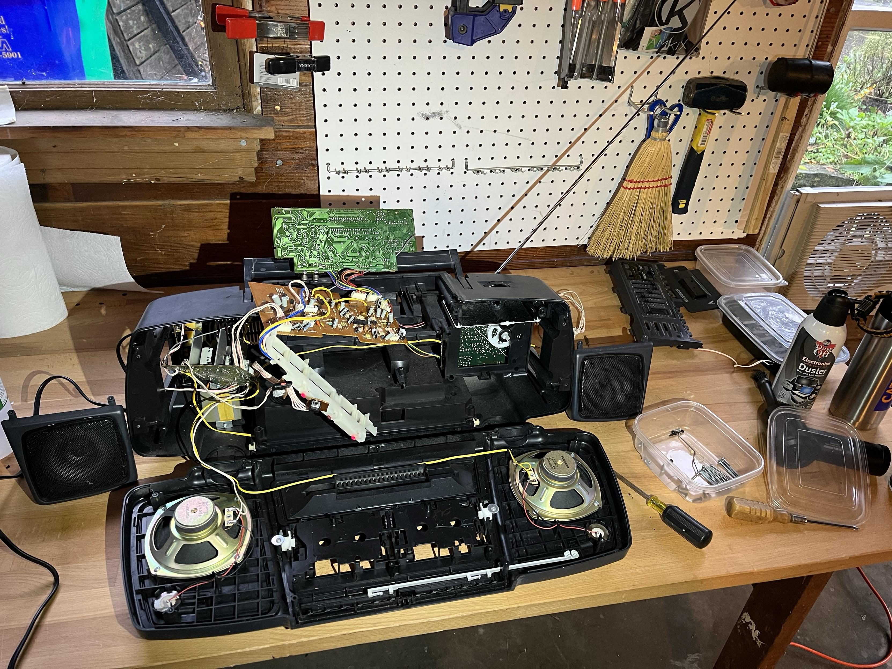

## Slothframe

Once the couch time really set in, I spent an absurd number of hours playing Warframe. Like, an embarrassing number of hours. It felt fantastic to just absolutely waste a day (or several).

I managed to do this the year before, too, in time for the [Warframe: 1999 expansion](https://www.warframe.com/1999). I used to reach for World of Warcraft for this kind of deep sloth, but it just doesn't hit the same these days. 

There's something therapeutic about grinding through missions with no other goal than "make number go up" and "ooh, shiny new weapon." No thinking required, which was perfect since all I [wanted to do](https://masto.hackers.town/@lmorchard/115747581966746123) was drink eggnog and nap.

[I really need](https://masto.hackers.town/@lmorchard/115762168883680183) to take more time off, more often.

## Miscellanea

I guess the theme for the past two weeks of links is a mix of AI opinion ping-pong (including [my own post about it](https://blog.lmorchard.com/2025/12/19/computer-fun/)), some webdev stuff, and a sprinkling of retrocomputing.

* [Writing Code Is Fun](https://davidcel.is/articles/writing-code-is-fun) - "Why in the world would I ever surrender [the fun parts of coding] to AI?"

* [What happens when the coding becomes the least interesting part of the work](https://obie.medium.com/what-happens-when-the-coding-becomes-the-least-interesting-part-of-the-work-ab10c213c660) - "When I spend time actually typing code these days with my own fingers, it feels like a waste of my time."

* [Web development is fun again](https://ma.ttias.be/web-development-is-fun-again/) - "It's not the typing of code that I really enjoy... it's the fact you get to build something out of nothing."

* [all the code are belong to claude*](https://blog.ziade.org/ai/2025/12/20/all-the-code-are-belong-to-claude/) - Tarek's take on discipline when using Claude Code.

* [My LLM coding workflow going into 2026](https://addyo.substack.com/p/my-llm-coding-workflow-going-into) - Addy Osmani's take on AI as force multipliers. (I got a tiny waterfall-related mention in there.) "The human engineer remains the director of the show."

* [2025: The year in LLMs](https://werd.io/2025-the-year-in-llms/) - "We're going to see a real split between people who are outcome-driven and people who are process-driven."

* [The rise of AI denialism](https://bigthink.com/the-present/the-rise-of-ai-denialism/) - "We are not watching a bubble expand. We are watching a planet form from churning magma."

* [How Rob Pike got spammed with an AI slop "act of kindness"](https://simonwillison.net/2025/Dec/26/slop-acts-of-kindness/#atom-everything) - "The one thing AI agents can never have is true agency."

* [How To Dynamically Install Custom Elements](https://heydonworks.com/article/dynamically-loading-custom-elements/) - Heydon deep-dives into one very specific topic in excruciating technical detail.

* [You can make up HTML tags](https://maurycyz.com/misc/make-up-tags/) and browsers will handle them just fine. If you include hyphens, you can guarantee your tag won't appear in future HTML versions.

* [The Silicon Valley Stack Doesn't Work Here](https://paulallies.medium.com/the-silicon-valley-stack-doesnt-work-here-why-africa-will-lead-the-post-bloat-web-e7c34b577c61) - Why Africa will lead the post-bloat web by embracing SSR and lightweight libraries.

* [Can a Commodore 1541 disk drive be used as a general purpose computer?](https://www.youtube.com/watch?v=6loDwvG4CP8&t=327s) - Modified the KIM-1 kernel to run on a bone stock 1541 with zero hardware modifications.

* [Adventure 751 (1980)](https://bluerenga.blog/2026/01/01/adventure-751-1980/) - The most sought-after variation of Crowther/Woods Adventure has been found!

