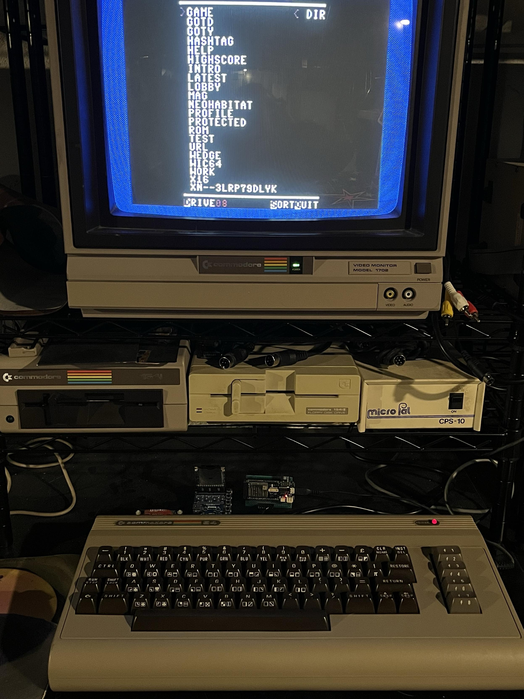
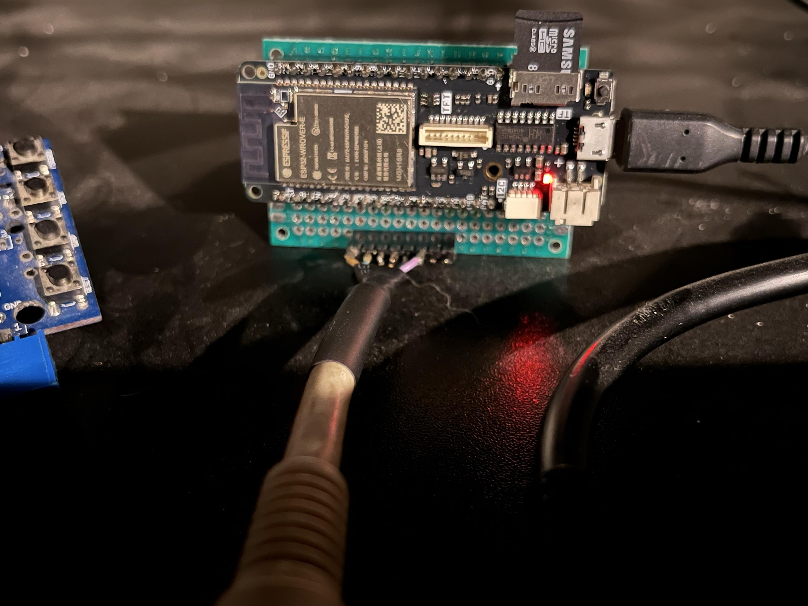
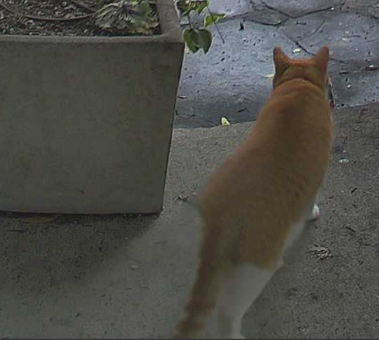
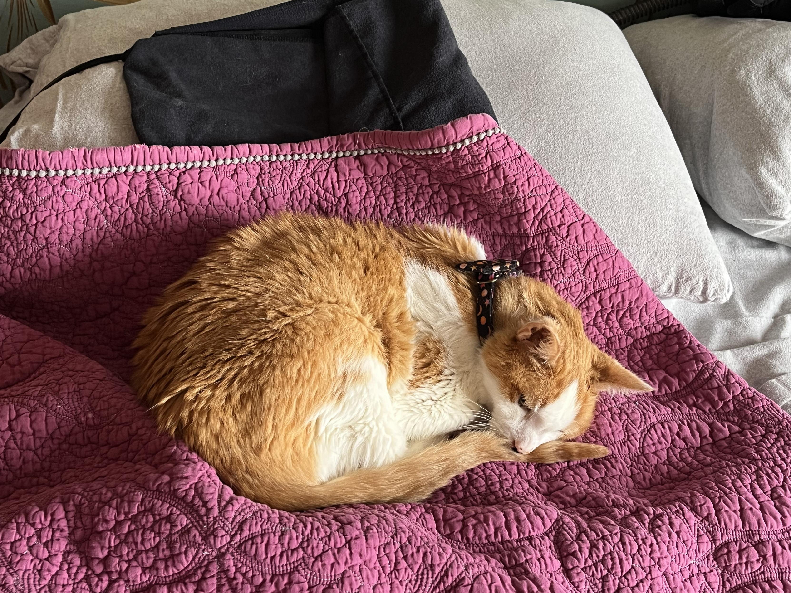

TL;DR: Built a Meatloaf for my C64, but the SID chip croaked. Synology backup woes (turn it off and on again works). Exploring IndieWeb comment systems. Reading "Status and Culture" like an alien anthropologist. TikTok addiction. Moar cats. Catsby's still here, still purring.

<!--more-->

<nav role="navigation" class="table-of-contents"></nav>

## Meatloaf for the C64

I [made a Meatloaf](https://masto.hackers.town/@lmorchard/115841156887759743) for my C64 and played a bunch of Crossroads II. Forgot how cool that game was - especially for a magazine type-in.

<image-gallery>

</image-gallery>

The [Meatloaf](https://masto.hackers.town/@lmorchard/115841169770684567) was surprisingly easy to build - just 6 wires from a sacrificial IEC cable and a particular ESP32 dev board. Also played some Lazy Jones, which I think of as the Warioware of the 80s.

Then, of course, the original SID chip in my nice breadbin C64 [apparently croaked](https://masto.hackers.town/@lmorchard/115846151914040623). Dang it. I do have a couple 64Cs too, but I know at least one of those has a bum SID too. Thinking I may start to explore the world of SID replacements.

I also [found](https://masto.hackers.town/@lmorchard/115846744403166974) printable [Crossroads II characters on Printables](https://www.printables.com/model/671508-crossroads-ii-pandemonium-c64-game-characters), because why not?

## ESP32 Tinkering

Speaking of that Meatloaf, it uses one of these [LOLIN D32 Pro V2.0.0 ESP-32](https://www.aliexpress.us/item/2251832696801305.html) dev boards. Seems like a really capable little widget? It's got wifi, bluetooth, a micro-SD slot, battery management, connectors for a TFT touch screen and I2C devices.

Like, I [already have](https://masto.hackers.town/@lmorchard/115849933237916261) a small pile of ESP-32 dev boards that I should do something with. But none of them have SD card readers or battery stuff or screen connections. The SD card thing seems especially handy.

## Cats

Miss Biscuits has gotten [very comfortable](https://masto.hackers.town/@lmorchard/115846731123276598) since we adopted her this past fall:

The doorbell camera also continues to provide entertainment. Our household's [new favorite hobby](https://masto.hackers.town/@lmorchard/115849472151406680) is rushing to watch the "pet" notifications - usually the next door neighbor's cat, but often squirrels or other neighborhood cats.

Part of me is [very tempted](https://masto.hackers.town/@lmorchard/115861580646193186) to make a feed of the cats who visit our front door:

## Backup Failures

[Ugh](https://masto.hackers.town/@lmorchard/115856388583799410): My Synology NAS suddenly stopped being able to see this external USB HDD that I've been using for rotating off-site backups for a few years now. Hoping [power blips](https://blog.lmorchard.com/2026/01/05/w52-w01/#power-blips) didn't somehow curse the USB controller on this thing.

After some reboots and random jiggerypokery with no joy, I finally just tried turning the NAS off entirely. Waited 10 minutes. Then, started it up again. For some reason, that did the trick: the USB HDD is mounted now. Okay. I guess, remember that for next time.

And [just since](https://masto.hackers.town/@lmorchard/115856487344537703) I'm poking at backups, I tried checking on my Backblaze data. Ope: "We're performing site maintenance" well, that's comforting.

I've been [tempted](https://masto.hackers.town/@lmorchard/115856583814890083) to shift off-site backups for our home NAS to AWS, but they seemed significantly more expensive. I might have to re-explore that and see if I was just "holding it wrong" - i.e. not using S3 Glacier classes or whatever.

So, I embarked on a grand new adventure: trying out [Kopia](https://kopia.io/) to back up my crap to Amazon S3 with "intelligent-tiering" storage class. I will say one thing: having [mostly reliable](https://masto.hackers.town/@lmorchard/115856956903491497) gigabit internet really seems to speed them backup bits into the cloud.

Kopia has some neat features - I may want to blog about it further. I had it installed via docker compose and backing up to S3 in under 15 minutes. One of the backups finished in 3 hours. And now I can mount that remote backup snapshot as a drive via fuse on a different machine? Neato!

## Reading: Status and Culture

I've started reading ["Status and Culture"](https://masto.hackers.town/@lmorchard/115849591037105183) by W. David Marx and feeling like a space alien reviewing a dossier on a first contact species.

I don't want to fool myself that I'm not personally affected or motivated by social status, but dang do I bristle when I read things like "we all" and "this is universal" in a book like this. There are other ways of being.

This feels like kind of a counterpoint with respect to "The Gift of Not Belonging" by Rami Kaminiski that I read last month.

## TikTok Addiction

In an attempt to better regulate my tendency to fall into the TikTok scrolling dopamine snare, I [set](https://masto.hackers.town/@lmorchard/115866303763900299) a 15-minute screen-time limit on the app.

The problem, though, is that the limit screen has a 15-minute snooze button. My finely-trained gaming reflexes enable my thumb to strike that target faster than my "hey now wait a minute" higher brain functions can engage.

Perhaps I should construct an electrified phone case that will jolt the device from my hand. Or, you know, I could uninstall the app like a bunch of folks recommend. 😅

## Indieweb Rabbit Hole

One of the things I've been meaning to do forever is to get rid of the Disqus comments widget at the bottom of every post and migrate to something either self-hosted or at least more indieweb-flavored. Thinking about this led me down a bit of a rabbit hole and to these links:

* [Various ways to include comments on your static site](https://darekkay.com/blog/static-site-comments/) - summarizes different options for comment sections on static sites
* [A Quick Guide to Webmentions](https://reillyspitzfaden.com/wiki/tutorials/webmention-tutorial/) - personal websites can interact with each other without the inflammatory aspects of social media
* [EchoFeed](https://echofeed.app/) - cross post your RSS feed to Mastodon, Bluesky, Micro.blog, Discord, and more - I already kind of [have this implemented for myself](https://gts.lmorchard.com/@blog), but EchoFeed looks like a neat option.
* [IndieLogin.com](https://github.com/aaronpk/IndieLogin.com) - sign in with your domain name by linking to existing authentication providers

Got some work to do around here, but I may see about getting Webmentions properly flowing around here. And then see about self-hosting a different set of features to accept comments and responses.

## Catsby

Been mostly avoiding writing or posting much about this, but Catsby continues to [decline](https://masto.hackers.town/@lmorchard/115866836219756657). He's still here, but not for much longer. Treatment is palliative. Trying not to make anything harder on him or overly fuss with him. I hate everything about this - except that he still manages to get to bed at night before me and he purrs when I show up. Catsby is a very good cat.

## Miscellanea

* [The Death of the Browser](https://www.youtube.com/watch?v=pznpsgZqlGQ) - keynote by Rachel-Lee Nabors about AI agents and "the web as the API". The perspective here is interesting, considering *why* you might want an LLM-powered agent to browse the web for you. It has a lot in common with why we first started using ad blockers. <youtube-embed video-id="pznpsgZqlGQ" thumbnail="1df563b92133.jpg"></youtube-embed>
* [How to have a career in tech in 2026](https://www.anildash.com/2026/01/05/a-tech-career-in-2026/) - we care a lot, even as the assholes are taking hammers to it all
* [How Markdown took over the world](https://www.anildash.com/2026/01/09/how-markdown-took-over-the-world/) - most people making tech are still normal and generous, just overshadowed by bosses building rocket ships
* [Software craftsmanship is dead](https://www.pcloadletter.dev/blog/craftsmanship-is-dead/) - maybe the people who focus on the craft are retiring or getting run off
* [Return to office mandates](https://thewalrus.ca/return-to-office-mandates/) - "If people weren't locked up in offices, they might have time to caramelize onions for a leisurely dinner with their friends—and God, what a frightful world that would be"
* [Relax for the same result](https://sive.rs/relax) - all that exhausting push-push-push gave only a 4% boost
* [A field guide to sandboxes for AI](https://www.luiscardoso.dev/blog/sandboxes-for-ai) - run hostile code in something you can delete
* [What happened to WebAssembly](https://emnudge.dev/blog/what-happened-to-webassembly/) - seems like WASM is just quietly appearing everywhere as library-level infrastructure. I keep meaning to play with it more.

