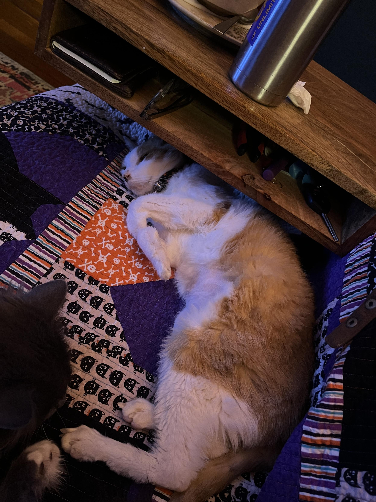
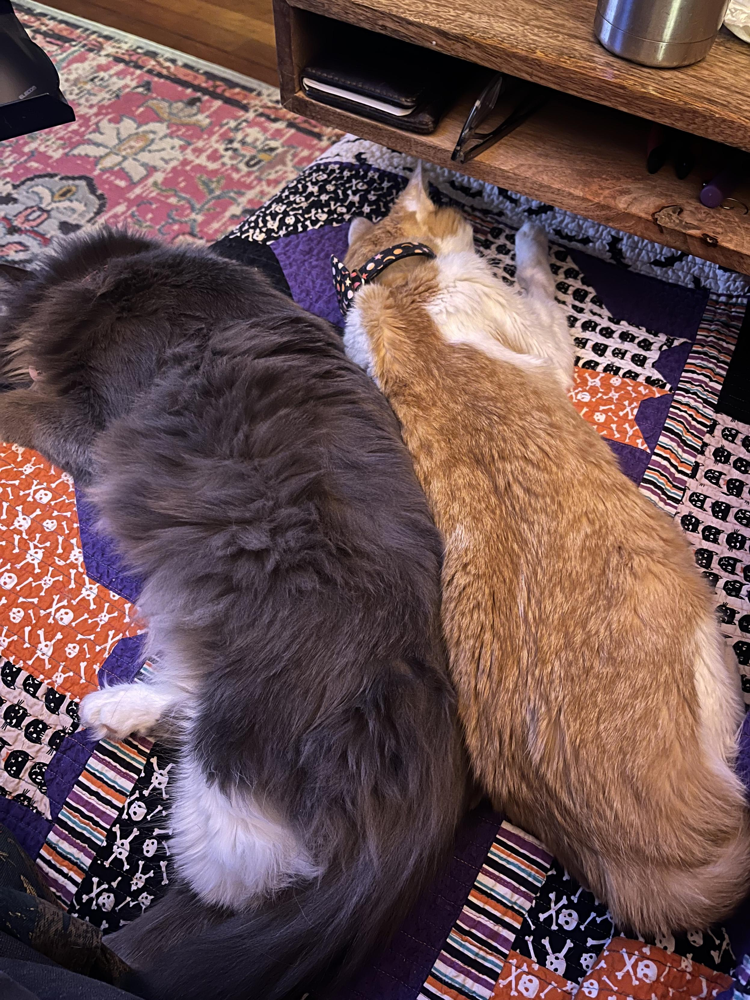
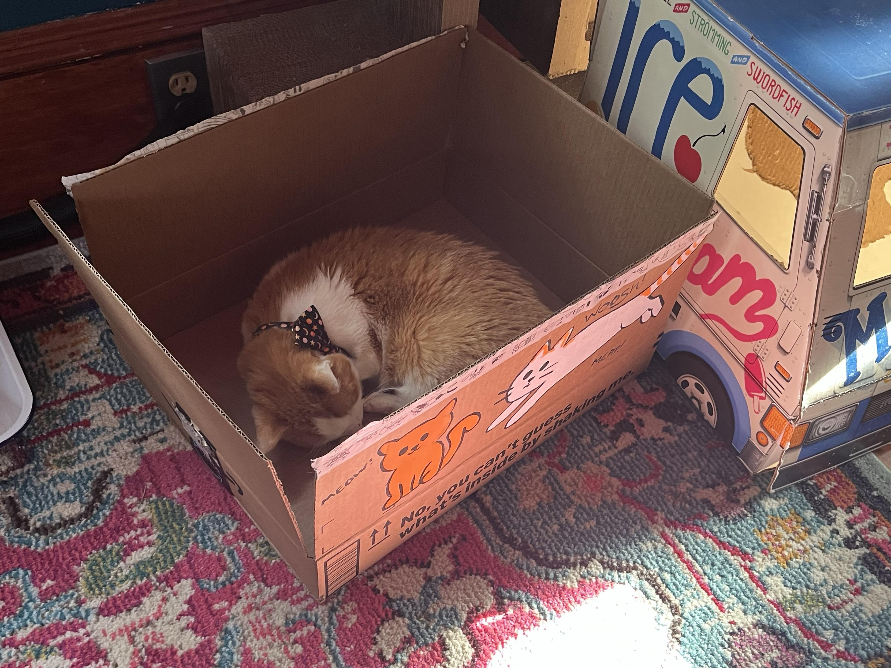
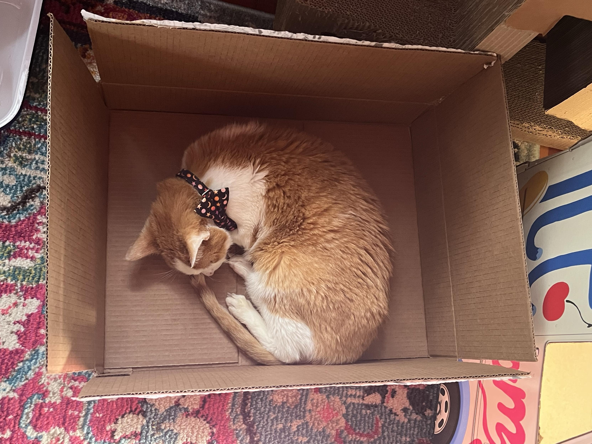
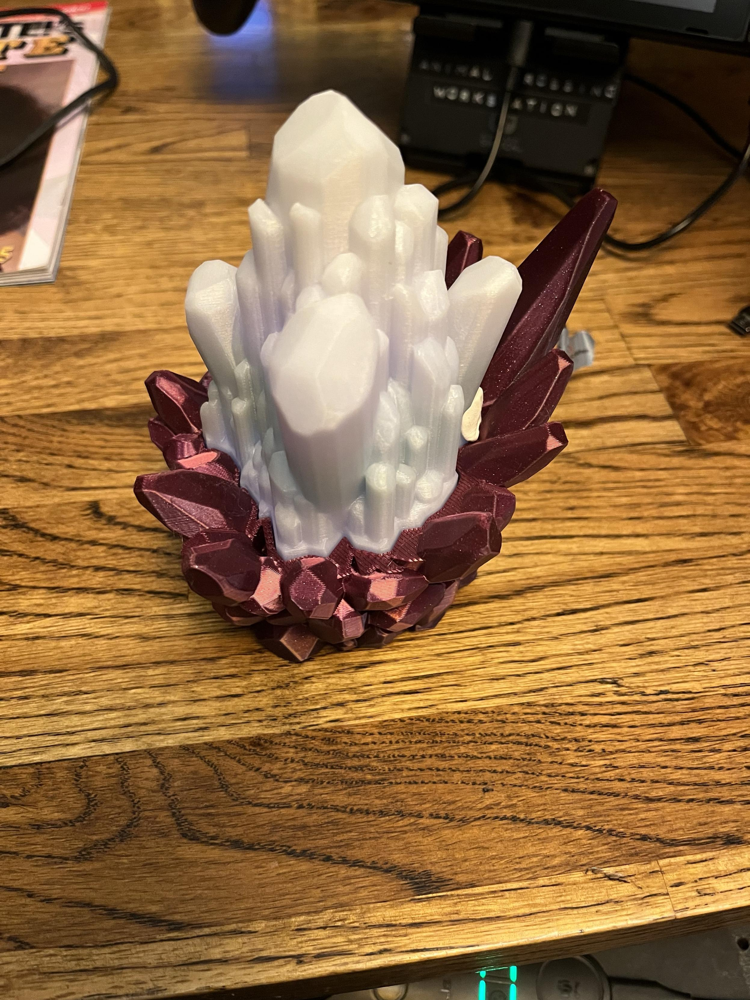
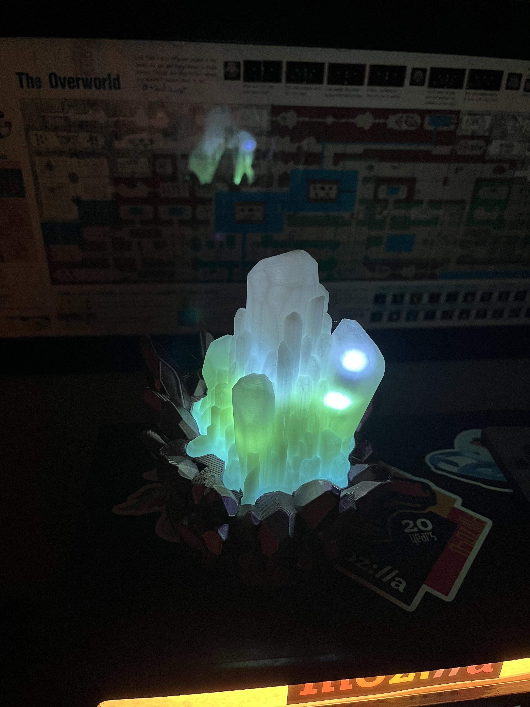
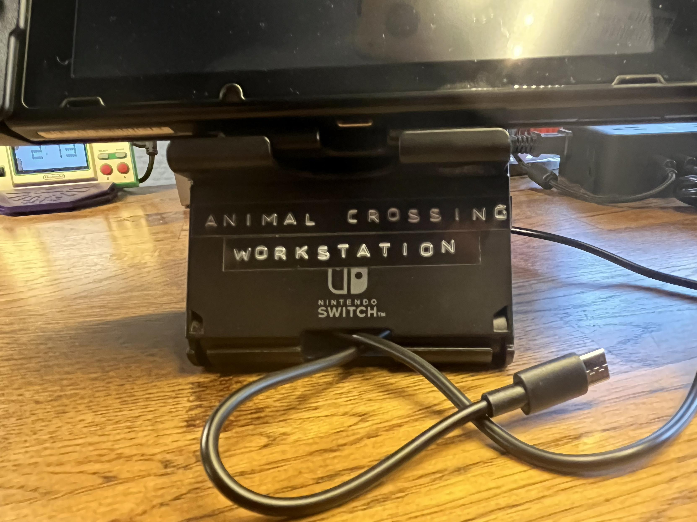

TL;DR: We lost Catsby, which sucks completely. 3D printing experiments with glow-in-the-dark filament and blacklight LEDs. Discovered Pangolin for homelab tunnel magic. Pondering SID chip replacements for the C64. Brief flirtations with Animal Crossing and Persona 5. Links about woodworking, AI slop, silicon ice age nightmares, and other assorted topics.

<!--more-->

<nav role="navigation" class="table-of-contents"></nav>

## Catsby

We [lost Catsby](https://masto.hackers.town/@lmorchard/115885206436086983), last week, on Monday afternoon. He'd gotten a cancer diagnosis, back in November. It turns out they were right. All we could do was make him comfortable for as long as possible, until it wasn't possible any longer. Fuck cancer.

Part of me wants to write a long goodbye post, like I did [almost 11 years ago for Puck](https://blog.lmorchard.com/2015/04/15/goodbye-puck/). I haven't quite been able to do it. A section in the weeknotes isn't amazing, but it's something. I did write a half-dozen pages in my private journal, though. I'm in no rush to make that public.

Over the years, Catsby turned into as a close a pal as Puck. He was a great cat. Followed us through 5 house moves and a cross-country trek. He was with me all day, most days. Slept with me most nights, too. To say I'm wrecked to lose him is an understatement. 

<image-gallery>

</image-gallery>

He got [one last good face bath](https://masto.hackers.town/@lmorchard/115885206436086983) from Miss Biscuits the night before, some good couch time, and [one last flop into a box](https://masto.hackers.town/@lmorchard/115885211549451512). I got to baby him for a little while before bed, and he managed a bit of purring - which was a surprise since he hadn't been much in a mood for that in his last week or so. That rally was brief, though.

The morning after was [rough](https://masto.hackers.town/@lmorchard/115889009829419807) - woke up to the usual raft of reminder alarms to shovel meds into Catsby and had to have a good sit & stare for awhile. Then, the smart litter boxes [sent me an alert](https://masto.hackers.town/@lmorchard/115902825611956588) that they hadn't seen Catsby in a while. Mind you, we got those smart litter box scales mainly to keep tabs on Catsby.

I've been through this multiple times over the years with multiple pets, but it [never gets easier](https://masto.hackers.town/@lmorchard/115889079951503528). Keep thinking I might learn how to get through it better, but no. I know this kind of stuff will keep coming up, like stubbing my brain on all the hard corners in a dark room. 

It gets better eventually, I guess.

## Random Life Bits

Took a walk to the park on a sunny day - realized it's been months for various reasons. Surprised that [all the crows](https://masto.hackers.town/@lmorchard/115901495222712831) still remembered me. That, or they pester anyone who looks like they might have peanuts in their bag. Luckily, I did have peanuts in my bag.

Also: another night where I [started a thing](https://masto.hackers.town/@lmorchard/115914557130648491) on the big screen, paused it to start a thing on the medium screen, paused that to watch something on the small screen. This is fine.

Just finished [Lessons in Magic and Disaster](https://us.macmillan.com/books/9781250867346/lessonsinmagicanddisaster/) by Charlie Jane Anders - loved this book. All of it. From the notions of magic in forgotten places to the mess of family trying not to be a mess to the experience of being an academic dork. Just a lovely book.

## 3D Printing Adventures

Because making stuff makes me feel less terrible, I got some glow-in-the-dark filament and some blacklight LED strips and [made a lil lamp](https://masto.hackers.town/@lmorchard/115931693370401850). Here's the [model I printed](https://www.printables.com/model/585901-glow-in-the-dark-crystal-night-lights-self-emissiv) - it's designed to work with glow-in-the-dark filament and UV LEDs.

<image-gallery>

</image-gallery>

The glow-in-the-dark PLA was a bit challenging to work with - had a few jams, it was brittle and broke in the feeder tubes once or twice. Not sure if that's the [cheap filament sampler](https://www.amazon.com/dp/B0BZ8G33Q6) I bought, my new nozzle, or my filament handling system. But I *did* manage to get it to print with some coaxing, so it's been a fun experiment.

I'm also [thinking about](https://masto.hackers.town/@lmorchard/115926106190554446) trying to print with ASA or ABS in my Prusa MK4S enclosure. That means I need a recirculating filter since the setup is in my basement and not near a window. Looking at this [LunchBox HEPA + carbon filter](https://www.printables.com/model/468166-lunchbox-hepacarbon-filter-for-prusa-enclosurebamb) design - any friendos in #3dprinting world have experience with something like this?

## Homelab: Pangolin for Tunneling

I [discovered Pangolin](https://pangolin.net/), which seems pretty cool for the inadvisable hobby of hosting internet-exposed services from a homelab. I'd been doing this with an unholy combination of Caddy, Tailscale, and reverse SSH tunnels. Pangolin seems way easier.

Got it running on one of my cheap cloud VMs in 10 minutes. Got a couple of my homelab servers talking to it in another 5 minutes. Had a site with an SSL cert from Let's Encrypt [running in 30 seconds](https://masto.hackers.town/@lmorchard/115909019096617946) after that. I'm looking for the catch.

One thing I'm not quite sold on: Pangolin sticks the admin web UI out on the cloud VM, and outbound tunnel daemons connect to it from my homelab servers. Not a ton different from using Tailscale, functionally. But I'd [rather have](https://masto.hackers.town/@lmorchard/115912121144208880) the cloud VM be as stupid as possible and get marching orders from a control node behind my firewall. That said, the Pangolin frontend does offer SSO gateway features with auth-related HTTP headers, which could be [handy](https://masto.hackers.town/@lmorchard/115912146176833352) for semi-private homelab apps.

## Retrocomputing: SID Replacement Options

Since the SID chip in my breadbox C64 croaked (as mentioned in last weeknotes), I've been [looking into](https://masto.hackers.town/@lmorchard/115918617180940785) replacement options. Anyone around here played with a SIDKick Pico or an ARMSID? Leaning toward the ARMSID. Also tempted to start looking into other mods like video fixes on this thing.

## Gaming

Spent some quality time with [No Way Home](https://masto.hackers.town/@lmorchard/115902117217577192) - a decent twin-stick space shooter with exploration and loot progression. Got through it in about 7 hours. Only $10 on Steam, pretty good value.

[Dusted off my Switch](https://masto.hackers.town/@lmorchard/115895732829385773) with intent to maybe try some Animal Crossing - my whole village vibe is locked into Halloween 2021. But I ended up [spending an hour](https://masto.hackers.town/@lmorchard/115939936924212304) on Persona 5 Royale instead. Huh.

Once upon a time during peak COVID, when I was meeting with coworkers in their Animal Crossing villages and had recently bought a new label maker:

## Hardware Scares

[Thought my GPU died](https://masto.hackers.town/@lmorchard/115919688068305779) after recent power outages. Started mulling over getting an older AMD 5800 XT replacement, or maybe Steam Deck time?

Whew, good news: Seems like it was [the HDMI cable](https://masto.hackers.town/@lmorchard/115920390119064471). Three of my HDMI cables, actually. Started setting up a spare laptop, found none of the cables I tried with the PC worked with the laptop either. Found a 4th cable that *did* work with the laptop, then tried that cable with the PC. It worked.

No idea what happened, since the bad cable had been working for over a year and seemed undamaged. I'd blame bunnies, but nothing seems chewed?

## Miscellanea

* [*I absolutely LOVE woodworking*](https://a.wholelottanothing.org/i-absolutely-love-woodworking/) - Matthew Haughey on picking up a new skill and having it be a refuge when the news gets to be too much - I'm taking notes for my own shop

* [*Scenes from O'Reilly ETCon 2002*](https://www.globalnerdy.com/2026/01/11/scenes-from-oreilly-etcon-2002/) - trove of photos from the early 2000s tech scene

* [*What the World Got Wrong About Autistic People*](https://www.psychologytoday.com/us/blog/positively-different/202601/what-the-world-got-wrong-about-autistic-people) - researchers measured autistic people against neurotypical expectations and called every difference a deficit - kinda funny how a strong sense of justice and focused interests gets described as maladaption

* [*What Happened To WebAssembly*](https://emnudge.dev/blog/what-happened-to-webassembly/) - it's quietly becoming infrastructure everywhere, I keep meaning to play more with it

* [*Postal Arbitrage*](https://walzr.com/postal-arbitrage) - why send a postcard when you can send actual stuff via Amazon Prime with a note?

* [*How to Make a Damn Website*](https://lmnt.me/blog/how-to-make-a-damn-website.html) - our perception of what websites should be has changed dramatically

* [*How to know if that job will crush your soul*](https://www.anildash.com/2026/01/12/will-that-job-crush-your-soul/) - timeless questions to help judge whether a job will be soul-crushing

* [*The identity industrialists*](https://designobserver.com/the-identity-industrialists/?utm_source=orbitaloperations.beehiiv.com&utm_medium=newsletter&utm_campaign=minimum-viable-newsletter) - manufacturing human beings the way earlier generations manufactured steel - they're trying it, we have to decide whether to reward it

* [*ChatGPT as a Digital Wellbeing Tool*](https://riggraz.dev/chatgpt-digital-wellbeing.html) - ChatGPT with web search as a new UI for the web that respects users' time

* [*Humanizing AI Is a Trap*](https://www.nngroup.com/articles/humanizing-ai/?ref=sidebar) - focus on usability and utility rather than artificial personalities

* [*Slop doesn't slop itself*](https://brilliantcrank.com/slop-doesnt-slop-itself/?ref=brilliantcrank-newsletter) - slop is the result of humans actively deciding to take shortcuts

* [*Codeless: From idea to software*](https://www.anildash.com/2026/01/22/codeless/) - smart systems let coders control fleets of dozens of coding bots to deliver entire features from plain-English descriptions

* [*A Software Library with No Code*](https://www.dbreunig.com/2026/01/08/a-software-library-with-no-code.html) - the whenwords library contains no code, just specs and tests, several big steps beyond just vibing

* [*My answers about porting open source code with LLMs*](https://simonwillison.net/2026/Jan/11/answers/#atom-everything) - publishing AI-generated libraries as "alpha slop" until they're production-ready

* [*Majority of CEOs report zero payoff from AI splurge*](https://www.theregister.com/2026/01/20/pwc_ai_ceo_survey/) - despite this, PwC concludes more investment is required

* [*'I'm very stupid': SF tech founder jailed in Davos*](https://sfstandard.com/2026/01/22/tech-dude-davos-bomb-lookalike-device/) - left a janky, non-functioning, vibe-coded hardware prototype unattended in a hotel lobby in Davos, detained for 13 hours

* [*The Zurich protocol*](https://werd.io/the-zurich-protocol/) - fictional scenario planning about mitigating a hypothetical newsroom raid

* [*The world is one bad decision away from a silicon ice age*](https://www.theregister.com/2026/01/12/silicon_shield_versus_silicon_winter/) - American doctrine for Taiwan's fabs: 2,000 lb kinetic contaminants via B-2 bomber - pretty much a nightmare scenario

