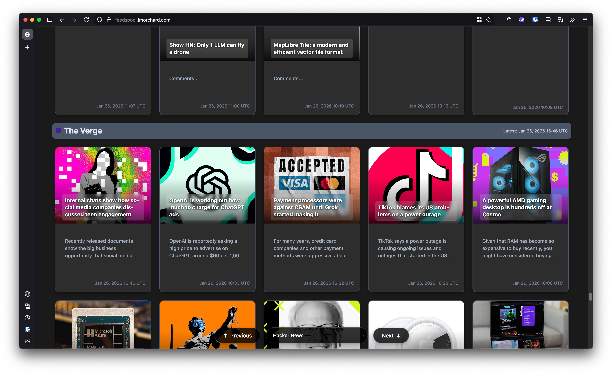
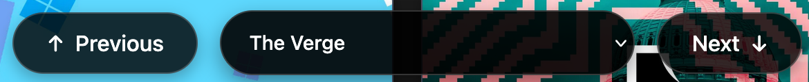

*TL;DR*: Released v0.2.0 of feedspool-go, my static-site RSS reader. Added features to keep infrequent feeds from vanishing and an over-engineered web component lazy-loading system that progressively loads content as you scroll.

<!--more-->

<nav role="navigation" class="table-of-contents"></nav>

## What is feedspool-go?

I started this thing last fall, but I don't think I've blogged about it much yet.

[feedspool-go](https://github.com/lmorchard/feedspool-go) is a CLI tool I built for fetching & reading RSS feeds. It takes OPML & text lists of feeds, fetches those feeds periodically into a SQLite database, and produces static HTML as a reading interface. 

The "spool" part is [inspired by Usenet](https://en.wikipedia.org/wiki/Spooling#Other_applications) and the "-go" part is because I've [started and abandoned](https://github.com/lmorchard?tab=repositories&q=feedspool&type=&language=&sort=) several iterations of this thing in other languages over the years. Maybe this one will stick and I'll more creatively rename it later. 😅

This runs every 15 minutes on one of my machines at home. If the web server's running, you might be able to read my news at [feedspool.lmorchard.com](https://feedspool.lmorchard.com/).

Here's a screenshot from mid-scroll:

<figure>
  
  <figcaption>feedspool-go main reading view screenshot</figcaption>
</figure>

### River of News vs Inbox Model

The key thing is this: I don't want an inbox of unread items. I want to scroll through a personal newspaper of recent content from the web - I stop reading when I see stuff I saw before. This basically does that.

This follows what Dave Winer calls the ["River of News"](http://scripting.com/2014/06/02/whatIsARiverOfNewsAggregator.html) pattern, which is fundamentally different from inbox-style RSS readers:

- **No read/unread flags** - no state to manage, no guilt about unread counts
- **No deleting or archiving** - content flows by from new to old
- **No inbox zero pressure** - scroll until you see familiar stuff, then stop
- **Ephemeral by design** - old content ages out, the database is just a cache

Many RSS readers treat feeds like email - every item is a task to process. That makes me anxious and feel like I have make number go down. The river model is liberating: you dip in, catch up on what's new, move on.

Where I riff on Dave's usual river design is that I like to more strictly group items from the same feed together. And, I really like the card layout with preview images. But, it's basically inspired by his idea.

## What's new in v0.2.0?

I'd mostly left this thing alone since an initial burst of hacking last fall. I've been using it daily, but accumulated a few wishlist items over time. Decided this past weekend I had time to tackle a some of them. Then, I figured that was worth a new [v0.2.0 release](https://github.com/lmorchard/feedspool-go/compare/v0.1.0...v0.2.0). 

This release has a two major themes: ensuring infrequently updated feeds don't disappear, and adding navigation features to make browsing more pleasant.

## The Problem with Quiet Feeds

The main driver for this release was [issue #20](https://github.com/lmorchard/feedspool-go/issues/20): when you filter feeds by timespan (e.g., "show me feeds updated from the last 24 hours"), feeds that update infrequently just vanish. My favorite once-a-week blog gets completely hidden when more active feeds dominate the view.

### Minimum Items Per Feed

My solution was adding `--min-items-per-feed` to the render command. Now the query logic ensures I see `MAX(items in timespan, minimum items)`. So if a feed has zero items in the last 24 hours, I'll still see its 5 most recent items. The purge command got similar treatment with `--min-items` to protect history for quiet feeds during cleanup operations.

I sort the overall display by last-updated time of each feed, so the quiet feeds show up toward the bottom of the scroll. But, I can still see them. I'm considering adding another page devoted to just these feeds, though.

## Progressive Loading with Web Components

The part where I really fell down a webdev rabbit hole in this release was with the lazy loading architecture. Currently, feedspool-go is primarily a static site generator - it renders everything to HTML files during the `render` command. But with hundreds of feeds and thousands of items, loading everything at once would be painful.

The key is scrolling, though: that's my main signal to the web UI that I want to read more. So, I wanted to build a UI that responded to that signal.

### The Architecture

The Go program generates:
- An `index.html` with skeleton structure
- Individual `feeds/{id}.html` files for each feed
- `feeds/page-{n}.html` files when pagination is enabled

But here's the clever bit: the index.html doesn't embed much content at all. Instead, it wraps each feed (or page of feeds) in a custom `<link-loader>` web component as a stub:

```html
<feed-navigator>
  <link-loader>
    <h2>My Favorite Blog</h2>
    <a href="feeds/123.html#feed-123">Read more...</a>
  </link-loader>
  <!-- More link-loaders... -->
</feed-navigator>
```

### The link-loader Component

The [`link-loader` custom element](https://github.com/lmorchard/feedspool-go/blob/main/internal/renderer/assets/js/link-loader.js) is pretty simple, but does a lot of heavy lifting. When it appears in the viewport (detected via [IntersectionObserver](https://developer.mozilla.org/en-US/docs/Web/API/Intersection_Observer_API)), it:

1. Fetches the URL from its child anchor tag
2. Parses the HTML response
3. Extracts the fragment (the element matching the `#feed-123` anchor)
4. Inserts that content into the DOM in place of itself
5. Removes itself from the DOM

It's essentially progressive enhancement for static HTML - you get the anchor link as a fallback, but JavaScript hijacks it to load inline on demand just before it scrolls into view.

#### Shared Singleton Observers

One optimization worth highlighting: instead of each `link-loader` creating its own IntersectionObserver, they all share singleton instance created at the module level where the web component is defined. 

```javascript
let sharedObserver = null;

function getSharedObserver() {
    if (!sharedObserver) {
        sharedObserver = createLazyLoadObserver(...);
    }
    return sharedObserver;
}`
```

This is more efficient than creating hundreds of observers for each link-loader. The browser can optimize intersection calculations across all elements at once, and it reduces memory overhead. Each component just registers itself with the shared observer when it mounts, and unregisters when it unmounts.

### The LoadQueue: Generic Resource Loading

Another challenge from here: you can't fire off hundreds of fetch requests simultaneously. Well, you can, but the browser gets a bit cranky. So, I built [a generic `LoadQueue` class](https://github.com/lmorchard/feedspool-go/blob/main/internal/renderer/assets/js/utils/load-queue.js) that manages queued loads with tuneable concurrency:

```javascript
class LoadQueue {
  constructor({
    maxConcurrent = 1,  // How many loads at once?
    isVisible,          // (function) Is this item currently visible?
    isLoaded,           // (function) Already loaded?
    startLoad,          // (function) How to load it
  }) { /* ... */ }
}
```

#### Double-Check Visibility Optimization

A subtle but important optimization: when a `link-loader` triggers an IntersectionObserver event, it gets enqueued immediately. But the queue doesn't start fetching right away - it waits its turn based on concurrency limits. The clever bit is that the LoadQueue re-checks visibility when it's actually time to fetch:

```javascript
process() {
  while (this.currentlyLoading.size < this.maxConcurrent && this.queue.length > 0) {
    const item = this.queue.shift();

    // Check visibility RIGHT NOW, not when enqueued
    if (!this.isVisible(item)) {
      continue;  // Skip and try next item
    }

    // Actually start loading
    this.startLoad(item, onComplete);
  }
}
```

Why does this matter? Because earlier loads in the queue inject content into the DOM, which pushes subsequent elements down the page. An element that was near-visible when it entered the queue might be way off-screen by the time its turn comes up. This re-check prevents wasted fetches for content that was scrolled away while waiting in the queue.

Before I implemented this, I'd get dozens of feeds loading into the page unseen, just because their narrow stubs were briefly visible before they got pushed down. I actually managed to crash the browser on my phone with this, a few times. Now, only the stuff I actually scroll to gets fetched.

### The feed-navigator Component

Since I group items from the same feed together, I wanted a way to easily skip to the next feed once I started seeing familiar content. So, I built [a `feed-navigator` component](https://github.com/lmorchard/feedspool-go/blob/main/internal/renderer/assets/js/feed-navigator.js) that wraps all the feed loaders and provides prev/next buttons and a dropdown to jump to specific feeds.

<figure>
  
  <figcaption>feed-navigator UI screenshot</figcaption>
</figure>

The `<feed-navigator>` also uses a CSS trick worth mentioning: [`display: contents`](https://css-tricks.com/get-ready-for-display-contents/), which I only really learned about when I started wrestling more with custom elements.

This is perfect for wrapper components that add behavior but shouldn't affect layout. The `feed-navigator` wraps all the feed loaders in the DOM tree, giving it control over them, but it doesn't create a containing block or participate in layout. It's completely transparent to CSS.

The component itself:
- Uses [IntersectionObserver](https://developer.mozilla.org/en-US/docs/Web/API/IntersectionObserver) to track which feed is currently at the top
- Uses [MutationObserver](https://developer.mozilla.org/en-US/docs/Web/API/MutationObserver) to detect when new feeds are loaded
- Provides prev/next buttons and a dropdown selector for navigation
- Updates button state based on current position

### Two-Level Loading: Pages and Feeds

When pagination is enabled for large feed collections like mine, there's a two-level hierarchy:

1. **Page loaders**: Load chunks of ~10 feeds at a time from `page-{n}.html` files
2. **Feed loaders**: Load individual feed content from `feeds/{id}.html` files

When a page loader fires, it injects more `link-loader` elements (for individual feeds) into the DOM. The feed navigator's [MutationObserver](https://developer.mozilla.org/en-US/docs/Web/API/MutationObserver) detects these new elements and starts observing them too.

I found this two-level system works really well for my use case, to help spread out the feed loading. The initial page load is super fast since only a few page stubs are loaded. As I scroll, more pages load, and within those pages, individual feeds load as I approach them.

## Other Miscellanea

- Fixed handling of duplicate items ([looking at you, BBC feeds](https://github.com/lmorchard/feedspool-go/pull/26))
- Added `--max-items` option for capping rendered items
- Fixed GitHub Actions workflows and Docker builds for proper static linking

## Summing up

This release makes feedspool-go more comfy for my daily RSS reading. The minimum items feature solves a real pain point, and the lazy loading system makes it snappy even with a large feed collection.

Next up: I'm thinking about keyboard shortcuts and maybe further specialized feed pages. Also considering tinkering with some more advanced stuff with the database, like running items through an embedding model so I can do some topical clustering or search.

I might also just wander off and do nothing else with this until summer. Who knows?

Anyway, the full changelog for v0.2.0 is [on GitHub](https://github.com/lmorchard/feedspool-go/compare/v0.1.0...v0.2.0). Maybe someone else will find this handy too!
