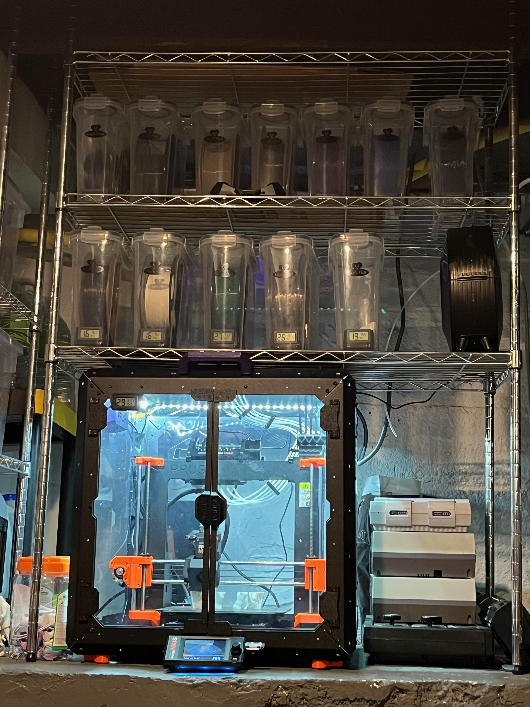

TL;DR: Miss Biscuits is 90% fluff, 3D printed ghosts instead of guns, snarfed down three Adrian Tchaikovsky books at hyperfocus speed, shipped feedspool-go v0.2.0 with over-engineered lazy loading, learned about GitHub Actions cross-repo triggers, got obsessed with a TR/ST song on repeat, and caught up on Classic Doctor Who featuring cyborg Loch Ness monsters.

<!--more-->

<nav role="navigation" class="table-of-contents"></nav>

## Caturday

Happy [#caturday](https://masto.hackers.town/@lmorchard/115951934847343916) from Miss Biscuits who is 90% fluff:

## 3D Printing Shenanigans

Ended up in a fun thread with folks about my 3D printer setup. I'd [shared a photo](https://masto.hackers.town/@lmorchard/115941752477887639) of my basement rig - Prusa MK4S in an enclosure with cereal canisters full of filament spools as dry boxes. The whole thing's enclosed as much as possible because... cats.

I also saw a thread about ghost guns and 3D printed parts. I mentioned that I just skipped the gun part and [printed some ghosts](https://masto.hackers.town/@lmorchard/115945739613034261), because that's more fun.

## Reading

Over the last weekend, [I finished reading](https://masto.hackers.town/@lmorchard/115948845590213477) *Children of Ruin* by Adrian Tchaikovsky after getting more and more hyperfocused on snarfing it down.

Struck me as a wild mix of Vinge's *A Deepness in the Sky*, Brin's Uplift series, Stephenson's *Seveneves*, Hawley's *Alien: Earth*, and odd bits of Star Trek optimism. Somehow it all worked fabulously for me. Oh yeah, and there are bits of exposition straight out of nature documentaries and I was eating all that up too.

One thing I [really like](https://masto.hackers.town/@lmorchard/115948934538922821): the author managed to build some narrative [Necker cubes](https://en.wikipedia.org/wiki/Necker_cube) in this series. That is, from one perspective, something reads like horror - but with a few more details, the perspective flips and it's suddenly the complete opposite.

On Monday, [I started reading *Children of Memory*](https://masto.hackers.town/@lmorchard/115985858437989585), the next book in the series, and just absolutely housed that down in a day or two.

After that, I picked up *Elder Race* (also by Adrian Tchaikovsky) and snarfed it down in a day since it was about half the length. I've gotten through [7 of his books](https://masto.hackers.town/@lmorchard/115985858437989585) since last spring. I guess I have a new favorite author.

Now I'm like, do I chase the ADHD serial enthusiasm and get into more of his books or try something else?

## feedspool-go v0.2.0

[Spent some time](https://masto.hackers.town/@lmorchard/115960007581716485) hacking on my feedspool last weekend. Found a bug that I realized was making me miss a whole lot of feed items. Fixed that, which made it start rendering a whole lot more items. So I fell down a rabbit hole of making the web UI aggressively lazily loaded.

Now I've got a statically generated news stream that incrementally loads as I scroll down the page of feeds, only loading as much as I want to see, just before I want to see it. The whole thing is a static site with a 5kb index.html, which is good because I [accidentally linked](https://masto.hackers.town/@lmorchard/115960024345359433) to my personal feedspool rather than the project page and brought down the Mastodon orbital link-unfurler laser on my homelab.

I [should probably](https://masto.hackers.town/@lmorchard/115960076778611261) rig this thing up to publish to GitHub Pages so I can leech off their static hosting bandwidth. One problem: the static site generator produces a lot of file churn that [does terrible things](https://masto.hackers.town/@lmorchard/115960127879384963) in a git repository. Eventually throws a wrench into GitHub Pages.

The whole thing is inspired by Dave Winer's River of News concept, which I [wrote about](https://masto.hackers.town/@lmorchard/115980378076368873) in the [v0.2.0 release post](https://blog.lmorchard.com/2026/01/26/feedspool-go-v0-2-0/). It's me trying to build the RSS reader I actually want to use.

## GitHub Actions Cross-Repo Triggers

[TIL](https://masto.hackers.town/@lmorchard/115975607446237067) you can trigger GitHub Actions workflows in one repo via workflows in another repo with the proper access token and the [`repository_dispatch` event](https://docs.github.com/en/actions/reference/workflows-and-actions/events-that-trigger-workflows#repository_dispatch).

So I can kinda build a whole CI / evaluation system in a separate repo, even make it reusable between a few different related projects. This seems like it could be handy for maintaining a bunch of related Go CLI tools.

## Random Media

[Suddenly obsessed](https://masto.hackers.town/@lmorchard/115980634374193472) with repeating a playlist that just keeps going back & forth between "[Dressed for Space](https://www.youtube.com/watch?v=mjwM0eIQ6Rc)" by TR/ST and the [Ari Mason cover](https://www.youtube.com/watch?v=TGPJiWYPXXU).

<youtube-embed video-id="mjwM0eIQ6Rc" thumbnail="./trust-dressed-for-space.png"></youtube-embed>

<youtube-embed video-id="TGPJiWYPXXU" thumbnail="e8721bc58227.jpg">/youtube-embed>

Also: [had a song](https://masto.hackers.town/@lmorchard/115946947090706522) from Muse's album *The 2nd Law* come up on shuffle today. I was like, "oh, I haven't heard their new album in awhile." That album came out in 2012. They've had several more since then, including one I missed in 2022. My brain keeps doing this to me. Stop it, brain.

<youtube-embed video-id="EF_xdvn52As" thumbnail="7bcdd845a531.jpg">/youtube-embed>

What else? Oh yeah, I was watching [the Classic Doctor Who channel on Pluto TV](https://pluto.tv/us/live-tv/5ce4475cd43850831ca91ce7), [playing](https://masto.hackers.town/@lmorchard/115959738894720785) *Terror of the Zygons* wherein I forgot it's about tentacle aliens who deploy a cyborg Loch Ness monster to wreak havoc on Tom Baker. ["You can't explode depth charges in Loch Ness, Brigadier!"](https://masto.hackers.town/@lmorchard/115959774367840738)

## Miscellanea

* [*Deprecation Notice*](https://asolitarycabin.org/deprecation-notice.html) - fictional piece about transitioning to a fully autonomous development pipeline

* [*Please Don't Say Mean Things about the AI*](https://www.mcsweeneys.net/articles/please-dont-say-mean-things-about-the-ai-that-i-just-invested-a-billion-dollars-in) - McSweeney's satire on AI investment defensiveness

* [*Meet the Alaska Student Arrested for Eating an AI Art Exhibit*](https://www.thenation.com/article/society/alaska-student-arrested-eating-ai-art-exhibit/) - performance art meets protest: "AI chews up and spits out art made by other people"

* [*AI companies will fail*](https://www.theguardian.com/us-news/ng-interactive/2026/jan/18/tech-ai-bubble-burst-reverse-centaur) - Doctorow on what we'll salvage from the wreckage: cheap GPUs, open-source models, applied statistics expertise

* [*A Codeless Ecosystem*](https://www.anildash.com/2026/01/27/codeless-ecosystem/) - orchestrating dozens of AI bots to build software without directly touching code

* [*Your App Subscription Is Now My Weekend Project*](https://rselbach.com/your-sub-is-now-my-weekend-project/) - vibecoding is 100% viable for personal stuff: we now have apps on demand

* [*Why Designers Can No Longer Trust the Design Process*](https://www.youtube.com/watch?v=4u94juYwLLM) - Jenny Wen from Anthropic explains why the traditional research-first design process no longer fits modern reality

* [*I don't write code anymore - I sculpt it*](https://www.jerpint.io/blog/2026-01-24-i-dont-write-code-anymore-i-sculpt-it/) - shifting from writing code to sculpting Claude Code outputs, removing excess, making pieces fit and reusable

* [*The head chef model for AI-assisted development*](https://thenewstack.io/the-head-chef-model-for-ai-assisted-development/) - your role shifts from implementation to orchestration, from programming to validating

* [*The Five Levels: from Spicy Autocomplete to the Dark Factory*](https://www.danshapiro.com/blog/2026/01/the-five-levels-from-spicy-autocomplete-to-the-software-factory/) - five clear tiers of AI code automation

* [*Subagents, Commands and Skills Are Converging*](https://www.vivekhaldar.com/articles/claude-code-subagents-commands-skills-converging/) - buried in recent Claude Code releases is a fundamental shift in extensibility

* [*AI tribalism*](https://nolanlawson.com/2026/01/24/ai-tribalism/) - a lot of developers burying their heads in the sand, refusing to acknowledge the truth in front of their eyes

* [*DOOMBUDS*](https://doombuds.com/) - running the 1993 classic DOOM on an earbud, then connecting it to the internet for remote play

* [*Porting DOOM to WASM*](https://irreducible.io/blog/porting-doom-to-wasm/) - stress testing a WebAssembly VM implementation with a DOOM port, because of course

* [*Submitted for Your Approval*](https://intertwingly.net/blog/2026/01/28/Twilight-Zone.html) - Rails application running full stack in browser via WebContainers, Action Cable over BroadcastChannel, Active Record over IndexedDB

* [*Broadcast Channel API*](https://developer.mozilla.org/en-US/docs/Web/API/Broadcast_Channel_API) - basic communication between browsing contexts on the same origin

* [*Use RSS to read newsletters*](https://www.kryogenix.org/days/2025/02/08/use-rss-to-read-newsletters/) - if I want to read someone's newsletter, what I'm actually subscribing to is their RSS feed

* [*Phantom Obligation*](https://www.terrygodier.com/phantom-obligation) - why do RSS readers look like email clients?

* [*Feedsmith*](https://feedsmith.dev/) - fast JavaScript feed parser and generator for RSS, Atom, RDF, and JSON Feed

* [*Many Small Queries Are Efficient In SQLite*](https://www.sqlite.org/np1queryprob.html) - SQLite runs in the same process, so N+1 queries aren't the problem they are with client/server databases

* [*Using 3D Printing And Copper Tape To Make PCBs*](https://hackaday.com/2026/01/28/using-3d-printing-and-copper-tape-to-make-pcbs/) - interesting technique for custom PCBs with just a 3D printer and copper tape

* [*Making a Factory Out Of LEGO That Builds LEGO*](https://www.youtube.com/watch?v=eQe1hxpRBKs) - turning a LEGO car factory into a general pick-and-place machine

