*TL;DR:* Enjoyed a 4-day weekend and completely forgot about weeknotes, spent way too much time troubleshooting a Tempest arcade machine that's been broken for 6 years (might actually be making progress?), dealt with the sad news that our favorite Portland bar closed, got Cosmo back from the vet looking very spaced out, started planning a Catsby tattoo, and collected yet another pile of bookmarks about AI coding agents while the cats increasingly tolerate each other.

<!--more-->

<nav role="navigation" class="table-of-contents"></nav>

## Meta

Had a nice 4-day weekend, last week. So, I totally forgot about weeknotes. That's fine, I can double up this week. Still trying to keep these semi-regular posts going while I eventually hope to write some more interesting standalone posts. Until then...

## Tempest Repairs

Ope, so I [realized](https://masto.hackers.town/@lmorchard/116066631981771595) it's been 6 years since I last tried troubleshooting this Tempest machine. Six years. That's... honestly embarrassing?

The thing is, I thought I'd have to go bit by bit through the PCB and schematic to diagnose it. And I only sorta know what I'm doing. But this time something weird happened: I took the PCB out, jiggled things around, hooked up the oscilloscope, and suddenly something works?

<image-gallery>

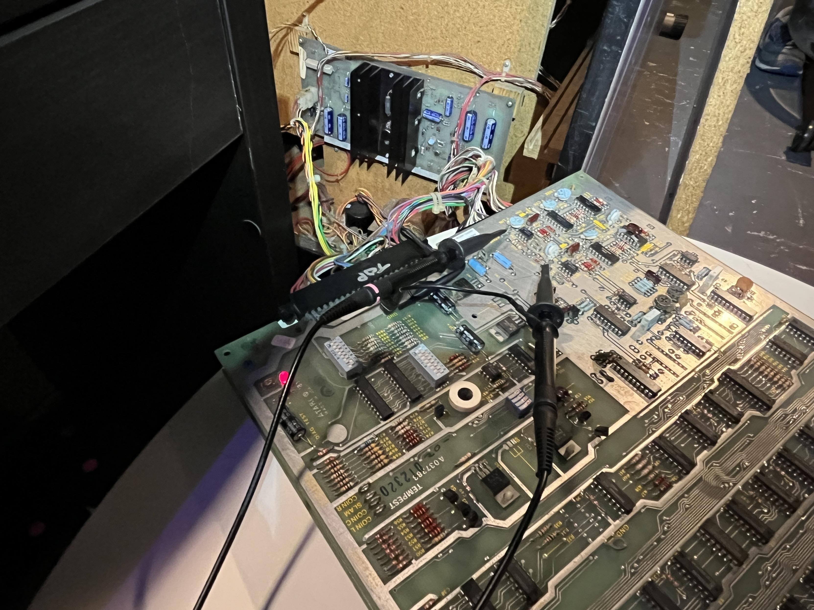

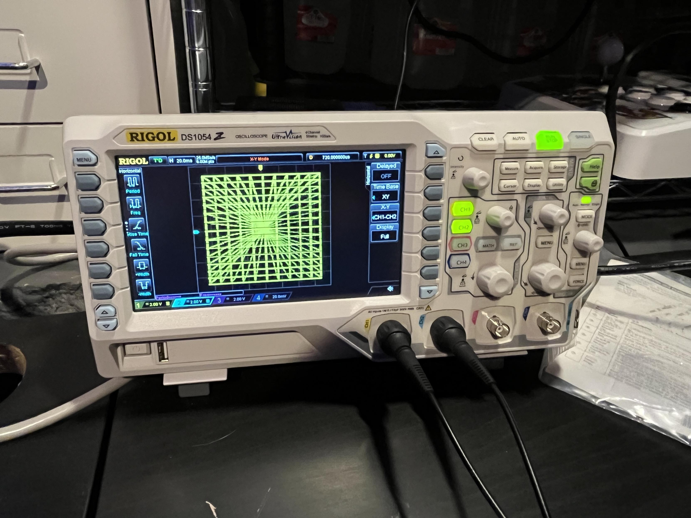

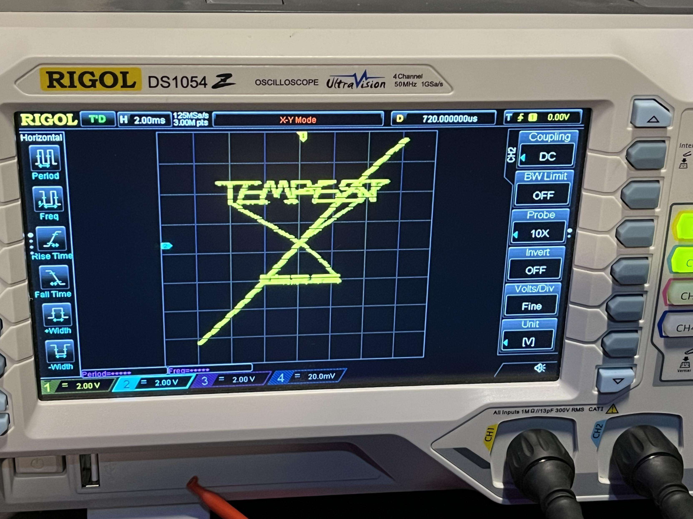

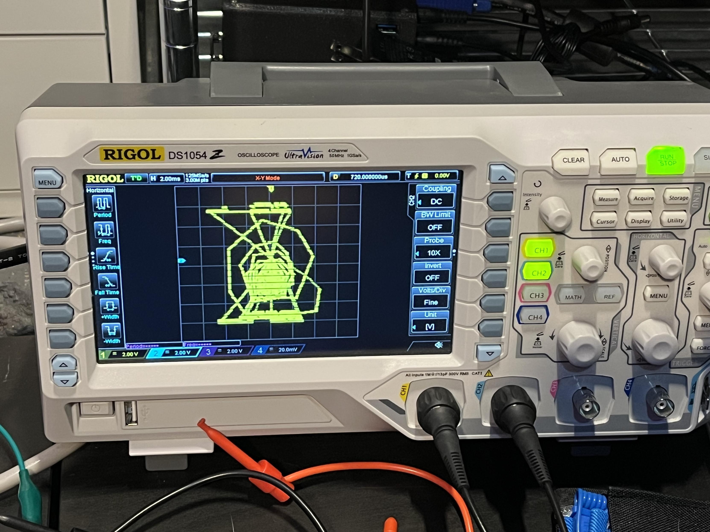

</image-gallery>

It [definitely wasn't](https://masto.hackers.town/@lmorchard/116066643734285648) doing this before, according to my notes from my last go round with this thing. I suspect there's a bad PCB trace or IC socket somewhere - which will be a pain to track down, but seems less dire than I'd previously expected.

Next challenge will be the monitor. Through testing via [instructions in the WG6100 FAQ](https://www.vectorlist.org/Documents/6100_faq.pdf), I [figured out](https://masto.hackers.town/@lmorchard/116072527554717880) one of the big frame transistors is bad. Good news is: I know how to replace that part. Hopefully that fixes the monitor, though I'm going to poke at some other components to see if there's not a further underlying cause. Nice thing is that I've fixed this monitor before by replacing half the parts, so I'm mildly optimistic I can do that again worst case.

Then of course I found [another problem](https://masto.hackers.town/@lmorchard/116082548162507274): one of the potentiometers broke right off the PCB. Which, you know, they do that sometimes if you're not very careful. I thought I had a spare, but I do not.

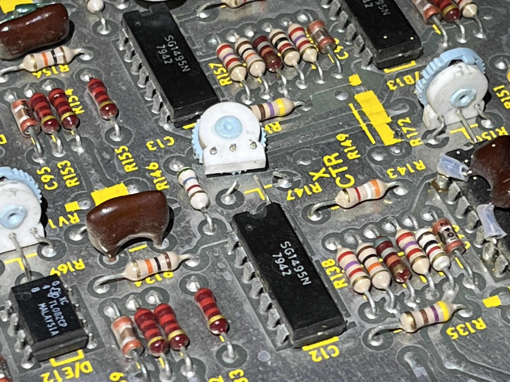

Rather than just fix this one pot, I think I'll order a whole new set of sealed flat pots and install them with [these 3d-printed adapter plates](https://forums.arcade-museum.com/threads/pots-for-a-tempest-main-pcb.407833/#post-5066997) I just saw on the KLOV forums.

Meanwhile, this is me waiting for my Digikey order for those parts:

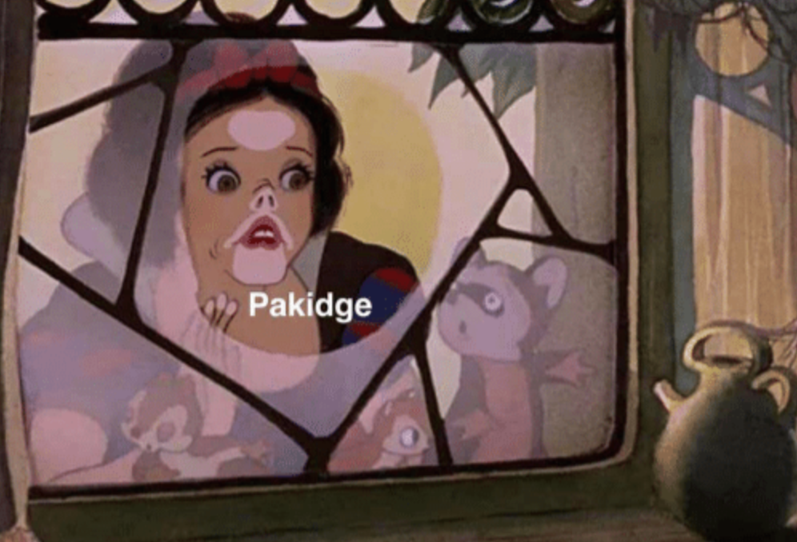

## Cat Update

Cosmo went to the [vets today](https://masto.hackers.town/@lmorchard/116059852945203516) for a checkup and some chest xrays to see if he has asthma. He got some sedation and just stared into space for 20 minutes. Later that evening, he had a nice time hanging out with Miss Biscuits:

<image-gallery>

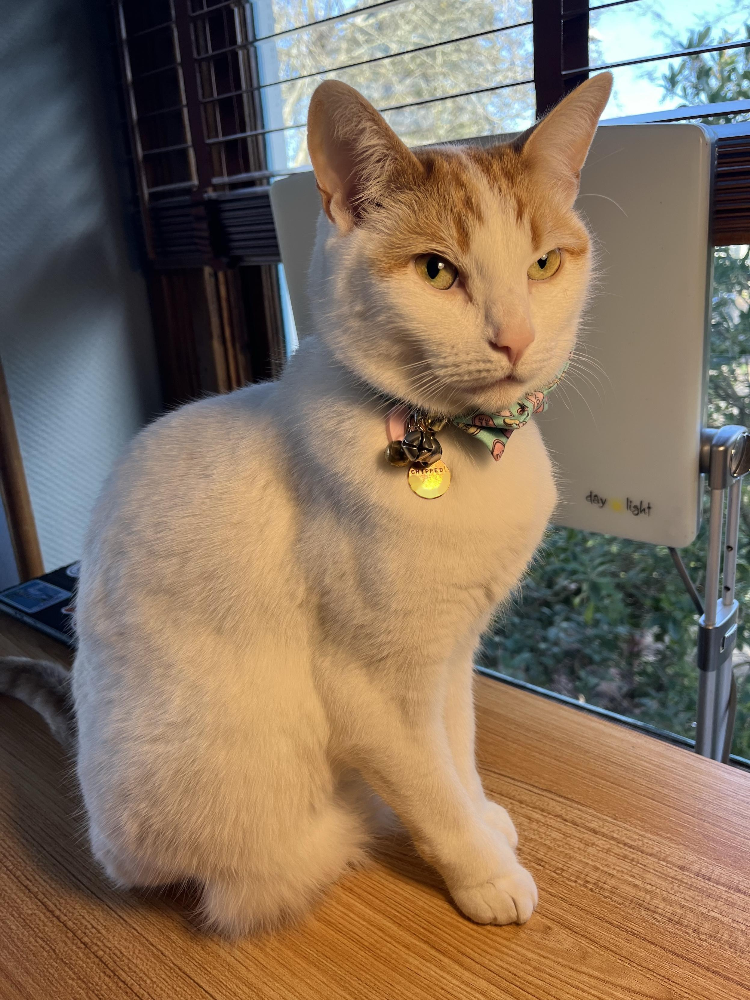

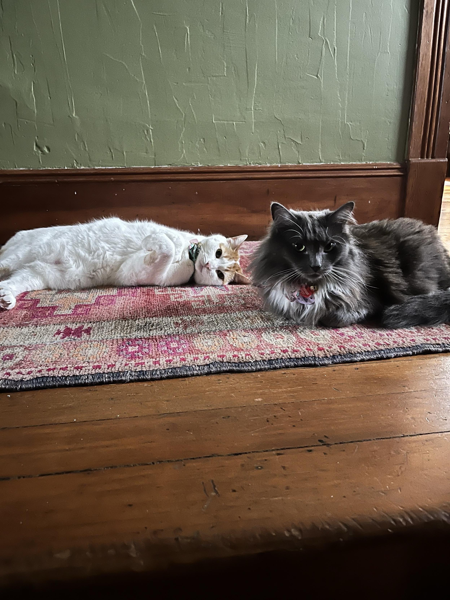

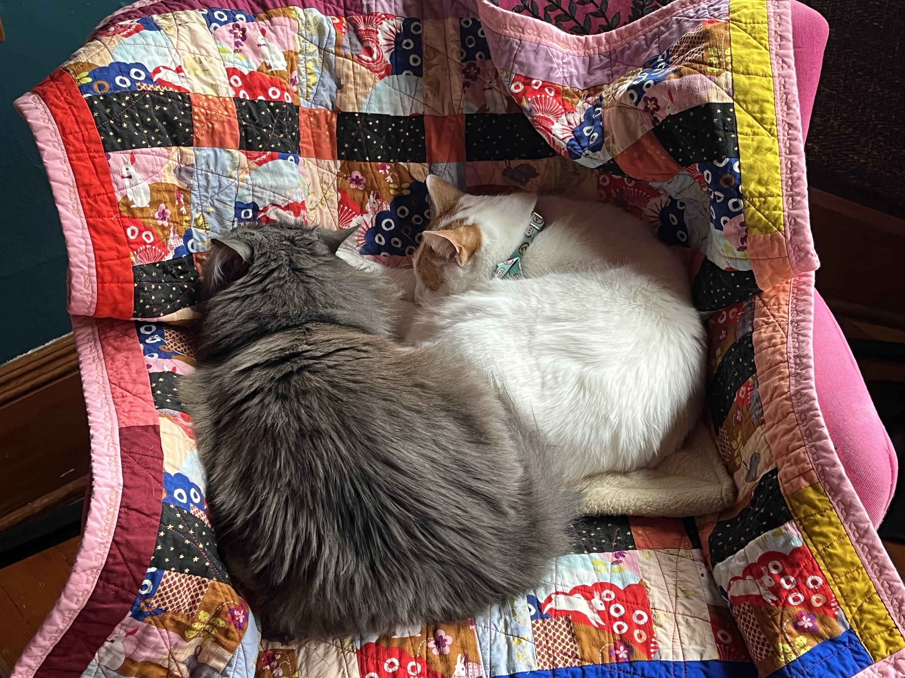

</image-gallery>

I also got a [response](https://masto.hackers.town/@lmorchard/116060390337146815) from my wife's tattoo artist from a few years ago. Looks like I might find a spot on her books in the next few months. Time to start digging through Catsby photos, which is happy / sad.

This is the [kind of vibe](https://masto.hackers.town/@lmorchard/116060549349176773) I'll be aiming for - Catsby was a big fan of hanging out in that window with the plants. Also bonus photo from about 7 years ago when Cosmo was little:

<image-gallery>

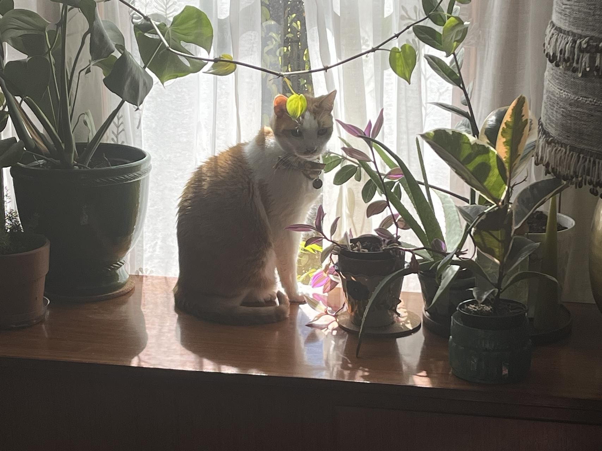

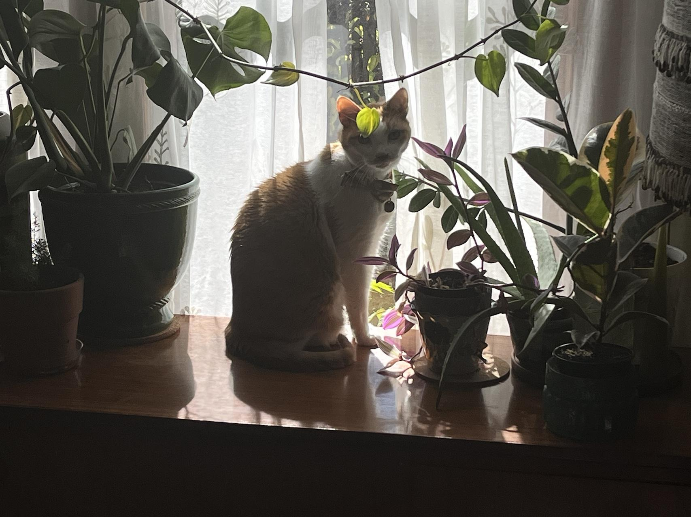

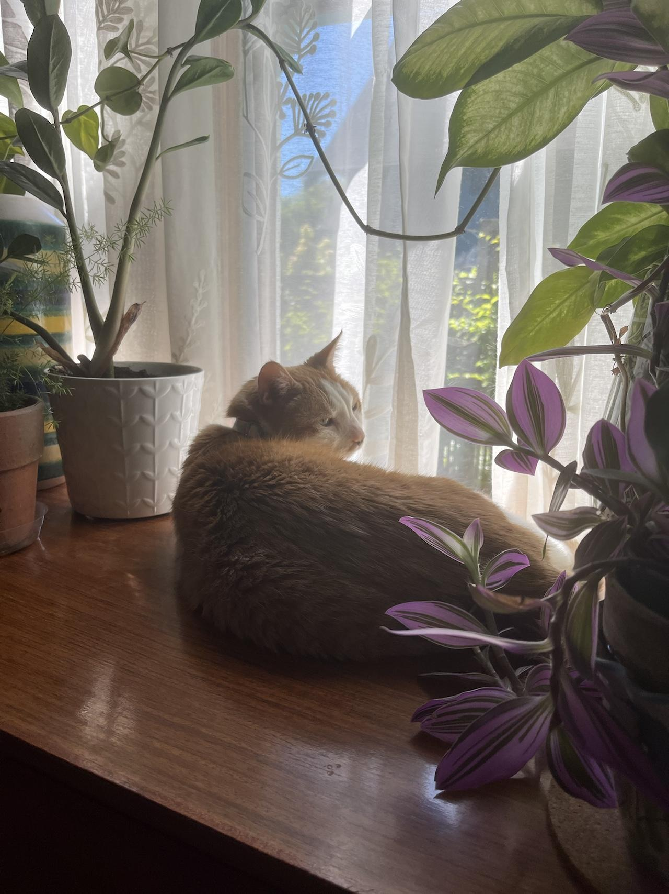

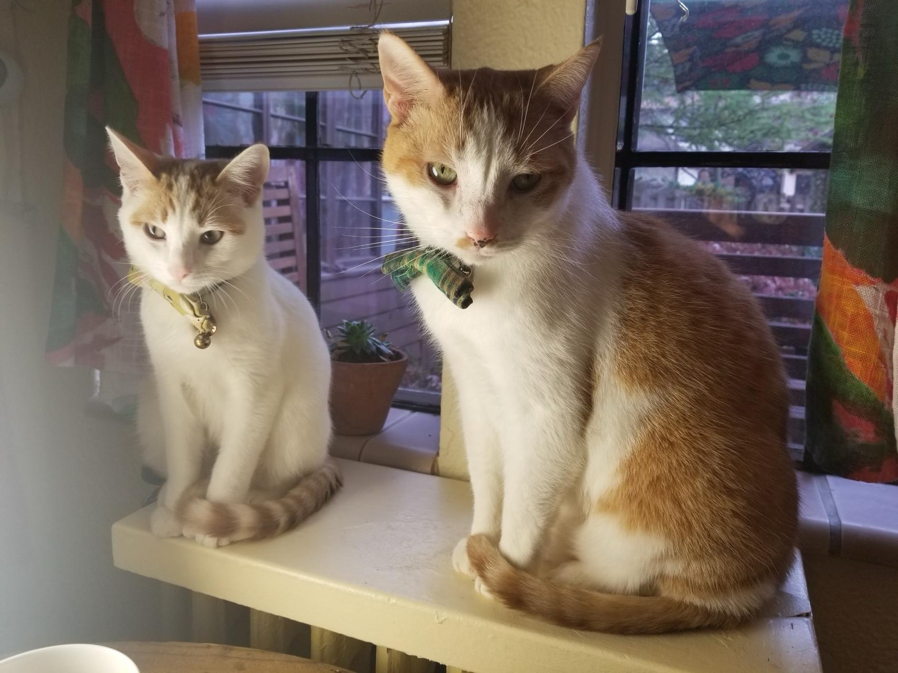

</image-gallery>

## Closing Time

[Damn it](https://masto.hackers.town/@lmorchard/116054230495997128): I think Expatriate, our most favorite bar in Portland, [has closed](https://www.reddit.com/r/Portland/comments/1r1kb30/expatriate_is_closed/).

Actually [really sad](https://masto.hackers.town/@lmorchard/116054237988076590) about this, since it was one of the few places we'd found in good walking distance with a vibe that managed to get us out of the house on a regular basis. There are probably other places, but expeditions are hard.

We weren't on first-name basis with all the folks who worked there, but I [wish](https://masto.hackers.town/@lmorchard/116065610150564285) I could like follow wherever they all go next like members of a band after it breaks up. And I do really hope they all end up somewhere good. Never had a bad experience there, just all lovely folks.

## Miscellanea

* One thing I [miss](https://masto.hackers.town/@lmorchard/116021782435583667) about living in Michigan is "poonchki" season (and yes, I saw all the [Paczki Day memes](https://io.mwl.io/@mwl/116086229616846876) too)
* [*One vaccine may provide broad protection*](https://med.stanford.edu/news/all-news/2026/02/universal-vaccine.html) - Imagine getting a nasal spray that protects you from all respiratory viruses including COVID-19, influenza, RSV, the common cold, bacterial pneumonia, and early spring allergens
* [*A wood Commodore 64 case*](https://www.reddit.com/r/c64/comments/1r0igy4/a_friend_has_commissioned_me_to_make_a_wood/) - gorgeous woodworking project for a C64
* Firefox is [getting WebSerial support](https://bugzilla.mozilla.org/show_bug.cgi?id=2010930)!
* [*gradient.horse*](https://gradient.horse/) - "Honestly I just wanted to play around with gradients. But gradients without anything on the horizon lack something, so I added horses"
* [*Virtual Scrolling for Billions of Rows*](https://rednegra.net/blog/20260212-virtual-scroll/) - Techniques from HighTable for displaying billions of rows while keeping good performance
* Cloudflare's [*Markdown for Agents*](https://blog.cloudflare.com/markdown-for-agents/) - fetch the markdown version of any page by adding Accept: text/markdown
* [*The Great Markdown Rebranding Of 2026*](https://tedium.co/2026/02/17/markdown-growing-influence-cloudflare-ai/) - There seems to be a nonzero chance that Markdown might become the new RSS
* [*Current*](https://www.terrygodier.com/current) by Terry Godier - An RSS reader where every source has a half-life: how long its articles stay visible before fading out
* [*What, then, are we paying for?*](https://quinnkeast.com/writing/software-is-problem-ownership?ref=sidebar) - Paying for software isn't paying for a solution. It's paying for someone else to own a problem
* [*Programming is Dead*](https://hamptonmakes.com/blog/2026/02/06/programming-is-dead.html) - "this is the worst these tools will ever be. They will only get better"
* [*Code has always been the easy part*](https://laughingmeme.org//2026/02/09/code-has-always-been-the-easy-part.html) by Kellan Elliott-McCrea - "The cost of code is going to zero. That's genuinely neat, and mind blowing, and going to require reinventing so many things. It was still never the hard part"
* [*Dorodango*](https://blog.fsck.com/2026/02/10/dorodango/) - software Dorodango: taking the big ball of mud output from coding agents and polishing it into something beautiful
* [*AI Doesn't Reduce Work—It Intensifies It*](https://simonwillison.net/2026/Feb/9/ai-intensifies-work/#atom-everything) - "we've just disrupted decades of existing intuition about sustainable working practices"
* [*I miss thinking hard*](https://www.jernesto.com/articles/thinking_hard?ref=sidebar) - "Vibe coding" satisfies the Builder but has drastically cut the times I need to come up with creative solutions
* [*Nobody Rips Out the Plumbing*](https://regionallyfamous.com/nobody-rips-out-the-plumbing/) - Nobody rips out the plumbing. But the smartest homeowners upgrade their fixtures every chance they get
* [*My AI Adoption Journey*](https://mitchellh.com/writing/my-ai-adoption-journey) by Mitchell Hashimoto - A measured, nuanced take on AI tooling evolution
* [*Something Big Is Happening*](https://shumer.dev/something-big-is-happening) - "We're past the point where this is an interesting dinner conversation about the future. The future is already here"
* [*Coding agents as the new compilers*](https://www.anildash.com/2026/02/11/coding-agents-as-the-new-compilers/) by Anil Dash - "this is one area where the people who actually make things are ahead of the big platforms"
* [*Power Prompts in Claude Code*](https://hvpandya.com/power-prompts?ref=sidebar) - Claude Code doesn't need you to be precise. You can describe what you want the way you'd explain it to a colleague
* [*No Coding Before 10am*](https://michaelxbloch.substack.com/p/no-coding-before-10am) - "Six months from now, there will be two kinds of engineering teams: ones that rebuilt how they work from first principles, and ones still trying to make agents fit into their old playbook"
* [*AI is going to kill app subscriptions*](https://nichehunt.app/blog/ai-going-to-kill-app-subscriptions) - For apps that run locally, subscriptions make no sense anymore
* [*Agentic Engineering*](https://addyosmani.com/blog/agentic-engineering/?ref=sidebar) by Addy Osmani - "AI-assisted development actually rewards good engineering practices more than traditional coding does"
* [*ESP8266 WiFi Analog Clock*](https://github.com/jim11662418/ESP8266_WiFi_Analog_Clock) - Uses an ESP8266 module to display local time on an inexpensive analog quartz clock
* [*PC6502*](https://github.com/TechPaula/PC6502/) and [*LT6502*](https://github.com/TechPaula/LT6502) - 6502 projects in PC104 formfactor and a 6502-based laptop design
* [*Rice Theory: Why Eastern Cultures Are More Cooperative*](https://www.npr.org/sections/thesalt/2014/05/08/310477497/rice-theory-why-eastern-cultures-are-more-cooperative) - Growing rice tends to foster cultures that are more cooperative and interconnected
* [*Discovering Negative-Days with LLM Workflows*](https://spaceraccoon.dev/discovering-negative-days-llm-workflows/) - monitoring for open-source vulnerabilities before CVE publication
* [*Why Vampires Live Forever*](https://machielreyneke.com/blog/vampires-longevity/) - "Dracula operated in silence for centuries. He didn't have a podcast. He didn't track his erection quality on a public dashboard"
* [*Wes Cook and the Centralia McDonald's Mural*](https://cabel.com/wes-cook-and-the-mcdonalds-mural/) - Cabel Sasser's deep dive into a found mural and lost artist (as always, worth the read)
* Timeplast makes [*3D printing filament that's also soap*](https://www.timeplast.com/store/p/soap), [*toilet bowl cleaner*](https://www.timeplast.com/store/p/timemass-toiletcolor), and [*glow-in-the-dark sticky stuff*](https://www.timeplast.com/store/p/timemass-stick-glow). I wonder if I could [print a Wacky Wall Walker](https://masto.hackers.town/@lmorchard/116093922180700488) with the sticky glow filament?

