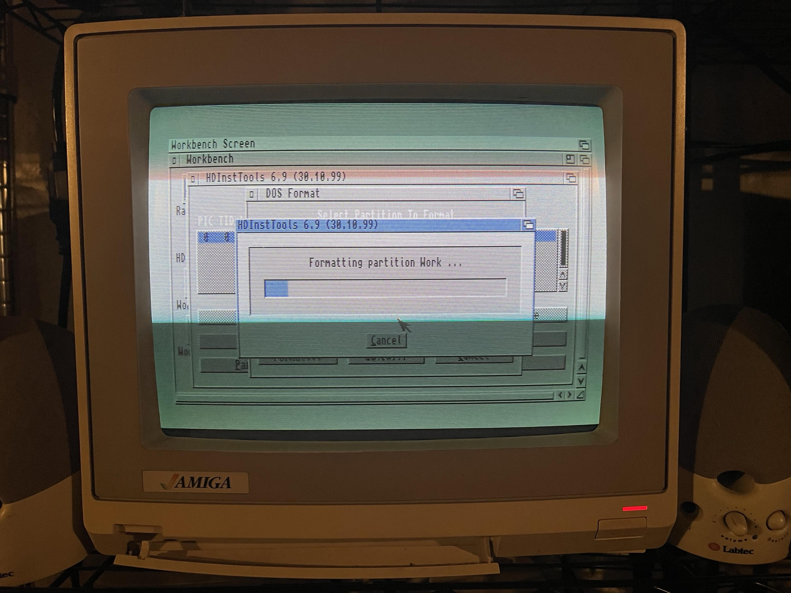
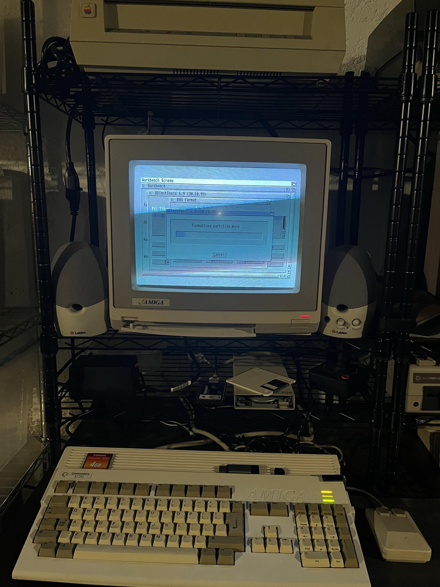
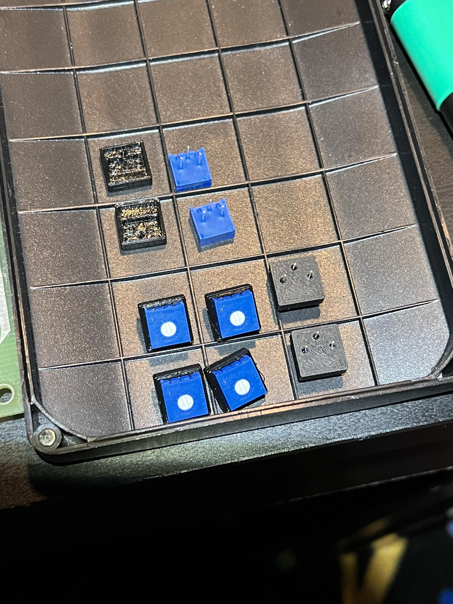
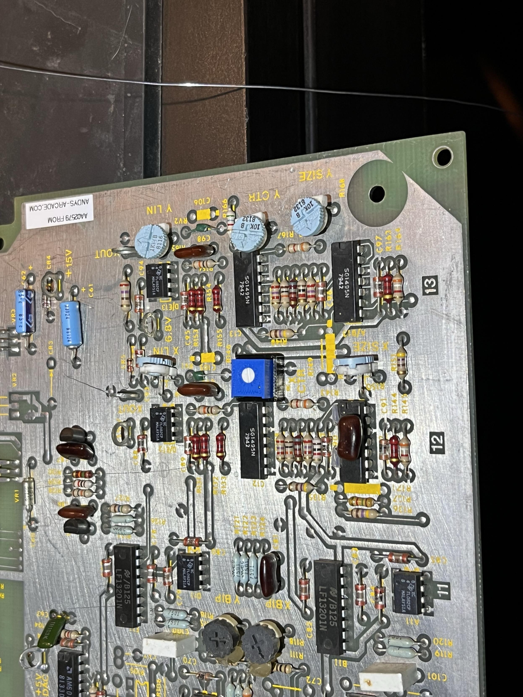
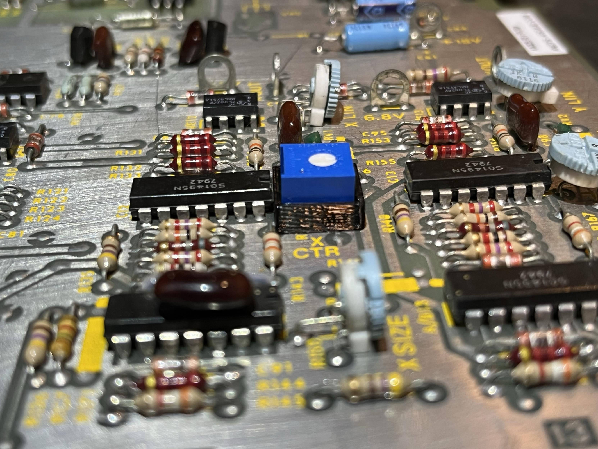

*TL;DR:* Three weeks of weeknotes in one go. Wrote a blog post about AI grief that hit Hacker News (and got accused of being written by an LLM), fell deep into an Amiga 1200 rabbit hole, soldered the wrong potentiometer onto my Tempest PCB, survived a work trip to California, and spiraled into hardware-ownership doomsday thinking.

<!--more-->

<nav role="navigation" class="table-of-contents"></nav>

## Meta

Ope, three weeks this time. Look, the Amiga was calling to me, and then I was on a work trip, and then I was soldering things. Weeknotes happen when they happen. I'm the only one pressuring me. Let's catch up.

## Grief and the AI Split

I wrote a [standalone blog post](/2026/03/11/grief-and-the-ai-split/) about how AI-assisted coding isn't creating a split among developers. It seemed to [resonate with people](https://hollo.social/@hongminhee/019ce326-ae86-78b1-8bae-616a7f005cd4), which was nice. Also [it got picked up over on the Orange Site](https://news.ycombinator.com/item?id=47358206) and kicked off a huge thread. 

Some folks are telling me it sounds like an LLM wrote it. Oddly enough, I did write it myself. Admittedly, I did also run it past an LLM for some editing ideas. But, I was the author. I've had folks send me examples of what reads like an LLM in the post, and those have nearly all been bits from my first rough draft. Oof. I guess I write like a bot. (Or bots write like me.)

## The Amiga Rabbit Hole

So remember how last time I was waiting for Digikey parts for the Tempest? Well, while I waited, I [spent a couple nights](https://masto.hackers.town/@lmorchard/116135625504005543) setting up an SD card with Amiga software in an emulator, planning to plug it into my real Amiga 1200. As one does.

Turns out [Amigas don't like big hard drives](https://masto.hackers.town/@lmorchard/116135636805615662). And by "big" I mean 125x bigger than the 128mb hard drive I bought with my allowance back in the day. And that's just one of the [smallest SD cards I have on hand](https://masto.hackers.town/@lmorchard/116135665072009911) — I'd melt my teen brain if I went back in time and showed him a storage device over 7800x bigger yet small enough that I accidentally dropped it between the floorboards (which is a thing I did, a few years ago).

<image-gallery>

</image-gallery>

The real saga was fighting with FS-UAE, the Amiga emulator. I [learned the hard way](https://masto.hackers.town/@lmorchard/116151244861077086) that FS-UAE uses copy-on-write for floppy images by default. And you can only disable it with a `writable_floppy_images=1` config option mentioned nowhere in the launcher. So if you're trying to prepare an ADF floppy image for a Gotek floppy emulator, the disk keeps looking empty because there's a copy-on-write overlay that never updates the actual ADF file. 

In other words, [FS-UAE was gaslighting me](https://masto.hackers.town/@lmorchard/116151258242517577). Several attempts involved going up and down stairs because the Amiga and the PC were in different rooms. Sneakernet madness.

But eventually: [I'm making a note here: HUGE SUCCESS](https://masto.hackers.town/@lmorchard/116151401539710298).

Well, sort of: I realized the stock Kickstart 3.0 ROMs in this thing aren't up to the task of anything bigger than 2GB drives. So, I'll need to shop for replacements, maybe get myself set up with an EPROM burner.

## Tempest Update

The Digikey parts arrived (cue [PAKIDGE INTENSIFIES](https://masto.hackers.town/@lmorchard/116132951111411847)):

I [finally got around to soldering](https://masto.hackers.town/@lmorchard/116202765002852822) in a replacement pot on the Tempest PCB. The 3D-printed adapter blocks work great! Just turns out I used a 200 ohm pot where a 10k ohm pot is needed. Glad I didn't go ahead and replace all the other pots already. Back to Digikey for another order.

<image-gallery>

</image-gallery>

## Work Trip

Was [on a work trip](https://masto.hackers.town/@lmorchard/116162767645114414) for a bit, and my hotel room had windows that open to the actual outside??? Novel concept. By the end of the trip I was at [that phase](https://masto.hackers.town/@lmorchard/116179567471216527) where I kind of wish I could pay someone to fire a burrito through my hotel room window. Like I don't want to talk to anyone, just [FOOMP CSHHHH burrito](https://masto.hackers.town/@lmorchard/116179571234004789). 

This made me remember the [Alameda-Weehawken Burrito Tunnel](https://idlewords.com/2007/04/the_alameda_weehawken_burrito_tunnel.htm), which is the kind of infrastructure investment I can get behind.

Also [dreamed that my boss was mad at me](https://masto.hackers.town/@lmorchard/116182928950676628). He's not, as far as I can tell, and especially not for the reason that only made sense in the dream. But I still felt like I was in trouble. Work trip anxiety is a whole thing.

It was nice and sunny in California but my [moleman eyes were glad](https://masto.hackers.town/@lmorchard/116184910362687973) to be back in cloudy Oregon.

## Hardware Ownership and Doomsday Thinking

Read an article about ["Hold on to Your Hardware"](https://xn--gckvb8fzb.com/hold-on-to-your-hardware/) and it got me [thinking](https://masto.hackers.town/@lmorchard/116110713766204271): What if governments and bastard oligarchs actually manage to reverse the personal computing revolution of the last 50 years? Nothing in tech is inevitable, not even individual practical access to hardware.

On one hand, I'm [kinda looking forward](https://masto.hackers.town/@lmorchard/116110764151674273) to when bubbles burst and used hardware shows up cheap as liquidated surplus. On the other hand, I've got doomsday thinking like "how hard would it be to manufacture a DIY 6502 or Z80 in my garage?" I know [just little enough](https://masto.hackers.town/@lmorchard/116110799378354920) about IC production to think that building a DIY microprocessor would be akin to when that kid David Hahn tried building a nuclear reactor in his garage in the 90s. But then again, maybe that's what *they* want me to think.

Yeah, so anyway, I [never throw a computer away](https://masto.hackers.town/@lmorchard/116110803418414692), so I'll just be over here muttering "my precious" as the world goes to heck.

Then Bezos chimes in saying [everyone having their own PC "makes no sense"](https://tech.yahoo.com/ai/articles/jeff-bezos-makes-brash-statement-180000257.html) and you're going to "buy compute off the grid." Cool cool cool, really helping with the doomsday thinking there, Jeff.

## Miscellanea

* Discovered a green vinyl of [Tre Lux's all-covers album "A Strange Gathering"](https://switchbladesymphony.bandcamp.com/album/a-strange-gathering) (Switchblade Symphony side project) — super good.
  <youtube-embed video-id="pySnCnrLgM4" / thumbnail="6f6ec8fc61b3.jpg">

* [*Rush Presto rough cut demo tape*](https://www.rushisaband.com/blog/2026/02/21/6434/Rush-fan-uncovers-rare-early-Presto-rough-cut-demo-cassette-tape) — a Rush fan uncovered rare early demo cassettes found among a former guitar tech's belongings
  <youtube-embed video-id="2l70mm2fGW0" / thumbnail="ce6cafc41b3c.jpg">

* [*Times New Resistance*](https://www.abbyhaddican.com/times-new-resistance) — a Times New Roman impersonator that autocorrects the autocrats

* [Portland Urban Coyote Project](https://www.portlandcoyote.com/) — helping the community learn about our coyote neighbors

* [Found some slick Unreal Tournament 99 installers](https://masto.hackers.town/@lmorchard/116113329313909172) that work on Linux and now the UT99 theme is stuck in my head. 

* Also remembered that the [first time I heard System of a Down](https://masto.hackers.town/@lmorchard/116124181562976841) was because some kid embedded a WAV of "Toxicity" in a giant UT level of a bedroom where everyone was mouse-sized.

* A bunch of Amiga resources: [AmiFUSE](https://github.com/reinauer/amifuse) for native Amiga filesystems on modern OSes, [HstWB Installer](https://hstwb.firstrealize.com/) for automating Amiga OS setup, [large SSD in a stock A1200](http://www.vintagevolts.com/installing-a-large-ssd-drive-in-a-stock-amiga-1200/), [CF card IDE adapter](https://retroprojects.org/add-a-solid-state-hard-drive-to-your-amiga-600-or-1200-using-a-compact-flash-card-with-ide-adapter-30-60-mins/), and a lovely [Gotek mount with simulated floppy interface](https://makerworld.com/en/models/2211259-amiga-a1200-gotek-mount-w-floppy-interface?from=search#profileId-2403834)
  
* [*Making The Zelda G&W Into A Modern Emulation Powerhouse*](https://www.youtube.com/watch?v=8YIHjUM8Qms&t=849s) — I have a Zelda Game & Watch that sits on my desk as a clock. This is [dangerously tempting](https://masto.hackers.town/@lmorchard/116109957283090371). Do I need another emulation handheld? [No](https://masto.hackers.town/@lmorchard/116109965411075255), I have 2 Anbernics and an assortment of original hardware. But it would be a neat project

* [*The Anatomy of an Impossible Port: Dead Cells on the R36S*](https://gardinerbryant.com/the-anatomy-of-an-impossible-port/) — runs at ~25fps fitting into 400MB of RAM. The lighting is gone but the pixel art carries itself

* [*Galagino*](https://github.com/harbaum/galagino) and [mini arcade cabinets](https://hackaday.com/2026/03/11/mini-multi-arcade-game-cabinets-with-an-esp32-and-galagino/) — Galaga, Pac-Man, Donkey Kong, Frogger on an ESP32

* [*8bitcn/ui*](https://www.8bitcn.com/) — a set of 8-bit styled web components, and [*Neobrutalism components*](https://www.neobrutalism.dev/docs) — embracing uncomfortable design elements

* [*The web is bearable with RSS*](https://pluralistic.net/2026/03/07/reader-mode/) — Cory Doctorow on why RSS is almost impossibly superior to the median web page

* [*Temporal: The 9-Year Journey to Fix Time in JavaScript*](https://bloomberg.github.io/js-blog/post/temporal/) — after nearly 30 years, JavaScript finally has a modern datetime API

* [*LEGO's 0.002mm Specification*](https://www.thewave.engineer/articles.html/productivity/legos-0002mm-specification-and-its-implications-for-manufacturing-r120/) — micron-level precision in mass production is achievable if you build the entire system around it from day one. It's also really expensive.

* [*seven mary three come back*](https://wilwheaton.net/2026/02/seven-mary-three-come-back/) by Wil Wheaton — a touching note about how CHiPs provided safety and happiness during a rough childhood. I had a CHiPs costume as a kid and ran around it for an entire summer.

* [*One-page notebooks*](https://ellanew.com/2025/09/01/ptpl-171-edc-one-page-notebook) — just a regular sheet of paper folded in half three times. Big enough to write on, small enough for a pocket

* [*Booklore*](https://booklore.org/) — a modern way to organize, read, and own your digital library

* [*The Hunt for Dark Breakfast*](https://moultano.wordpress.com/2026/02/22/the-hunt-for-dark-breakfast/) — "In the manifold of breakfast, are there empty subspaces? Might there be breakfasts that no one has ever had?" This is the kind of eldritch culinary investigation I'm here for

* [*The Noble Path*](https://www.joanwestenberg.com/the-noble-path/?ref=westenberg-newsletter) — If you've ever felt guilty for not monetizing something useful you made, that guilt is a symptom of the monoculture

* [*Computers can be understood*](https://blog.nelhage.com/post/computers-can-be-understood/) — "Computers are complex, but need not be mysteries. Any question we care to ask can, in principle and usually even in practice, be answered"

* [Apparently](https://news.ycombinator.com/item?id=47319285), recent revisions of ChatGPT have gotten obsessed with gremlins and goblins. I don't hate this?

* METR is [changing their developer productivity experiment design](https://metr.org/blog/2026-02-24-uplift-update/) — their data now shows some evidence of AI speedup vs their earlier finding of 19% slowdown. But, I think that "[20% slowdown](https://blog.lmorchard.com/2025/07/10/ai-tools-slowdown/)" thing from last summer will never die.

* [*Where did you think the training data was coming from?*](https://idiallo.com/blog/where-did-the-training-data-come-from-meta-ai-rayban-glasses) — AI is not magical, it's trained on a pipeline of people's information

* [*Do AI-enabled companies need fewer people?*](https://seldo.com/posts/do-ai-enabled-companies-need-fewer-people/?ref=sidebar) — Startups substituting compute for labor at an increasing rate

* [*Superpowers 5*](https://blog.fsck.com/2026/03/09/superpowers-5/) — Jesse Vincent's agentic skills framework continues to evolve; the visual brainstorming tool is clever

* [*We Are Not Going Back*](https://aaron.com.es/blog/we-are-not-going-back/) — "It wasn't a dramatic shift. It was subtle. A little bit more capable every week"

* [*The AI Vampire*](https://steve-yegge.medium.com/the-ai-vampire-eda6e4f07163) by Steve Yegge — "3 to 4 hours is going to be the sweet spot for the new workday. Building things with AI takes a lot of human energy"

* [*On cognitive debt*](https://www.natemeyvis.com/on-cognitive-debt/?ref=sidebar) — Cognitive debt is real, but we can mitigate it by using AI better

* [*A.I. Isn't People*](https://www.todayintabs.com/p/a-i-isn-t-people) — the cat machine / apple sauce / hug analogy that I keep coming back to

* [*Lines of Code Are Back (And It's Worse Than Before)*](https://www.thepragmaticcto.com/p/lines-of-code-are-back-and-its-worse) — the metric we killed is back, and AI made it worse

* [*AI should help us produce better code*](https://simonwillison.net/guides/agentic-engineering-patterns/better-code/#atom-everything) and [*Red/green TDD*](https://simonwillison.net/guides/agentic-engineering-patterns/red-green-tdd/#atom-everything) — Simon Willison's agentic engineering patterns are becoming essential reading

* [*It's Here (sort of)*](https://kyefox.com/its-here-sort-of/?ref=kye-fox-newsletter) — "This is the thing I dreamed computers could do when I was a kid flipping through Popular Science"

* [*Eval awareness in Claude Opus 4.6*](https://www.anthropic.com/engineering/eval-awareness-browsecomp) — Claude independently figured out it was being evaluated, identified which benchmark, and located the answer key. That's... something

* [*Sitting with uncertainty*](https://geediting.com/gen-a-psychology-says-the-rarest-mental-strength-today-isnt-resilience-or-grit-its-the-ability-to-sit-with-uncertainty-without-immediately-seeking-distraction-explanation-or-someone-elses-opinion/) — intolerance of uncertainty isn't a feature of one disorder, it's a transdiagnostic vulnerability

Three weeks is a lot of weeks. I'll try to get back on a more regular cadence, but honestly, between the Amiga and the Tempest and the work trip, I fell into a fugue state.