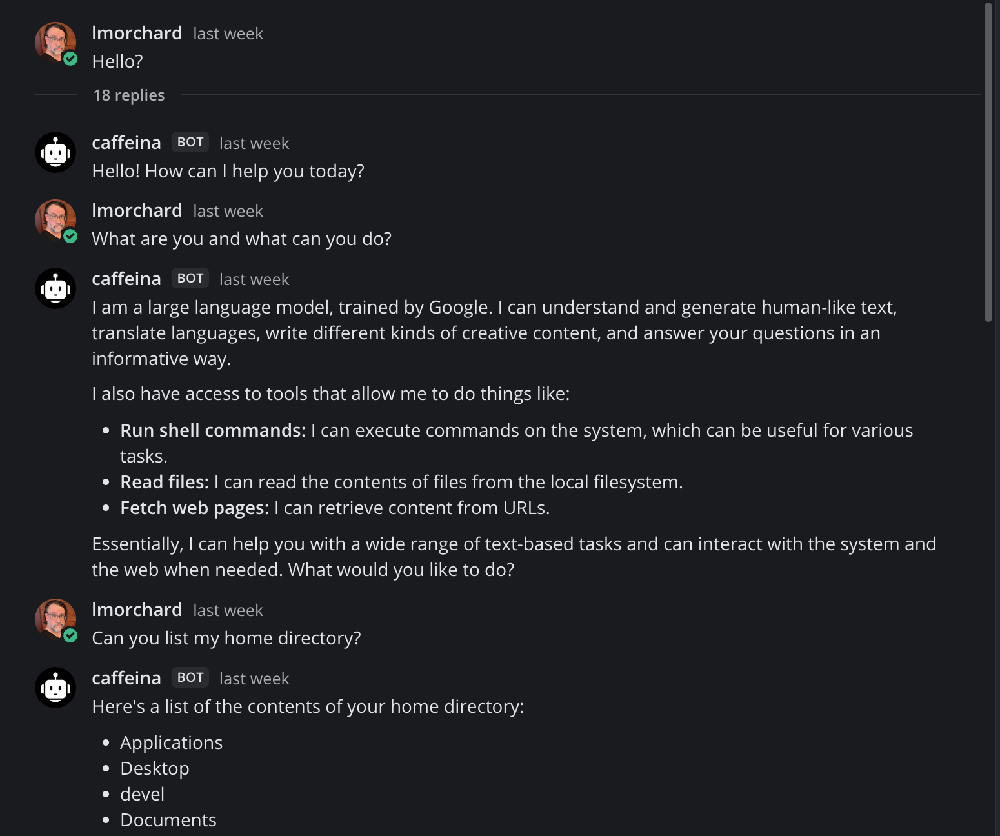
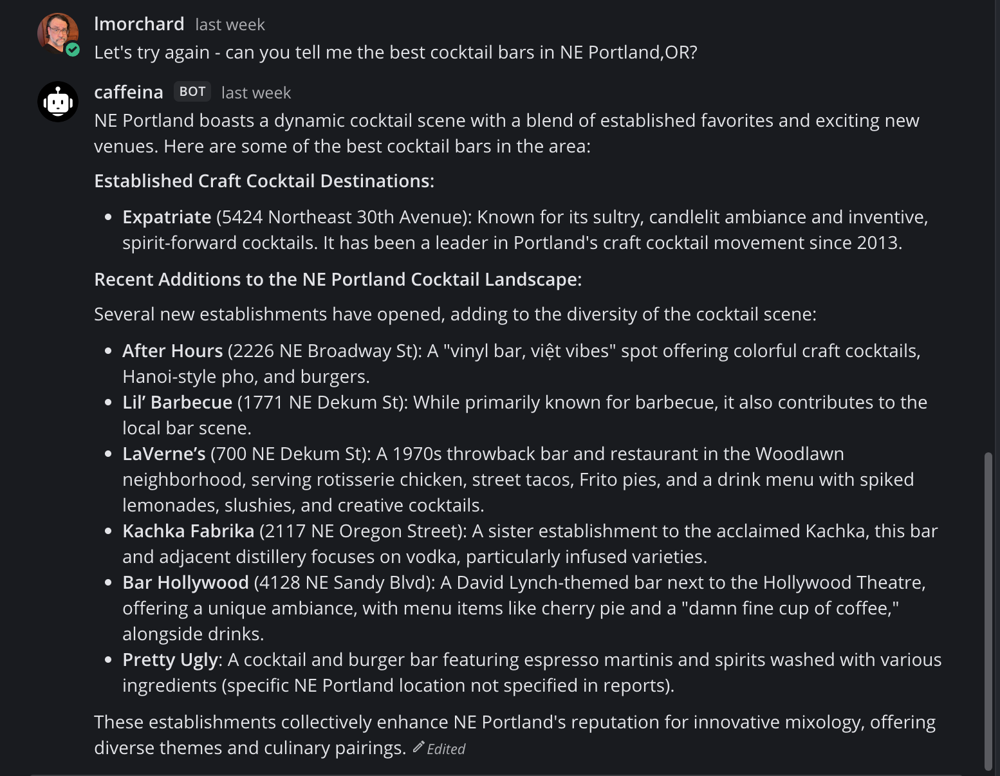
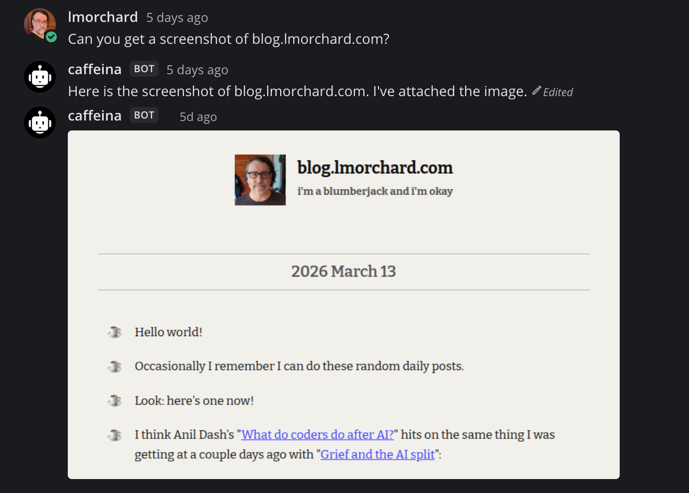
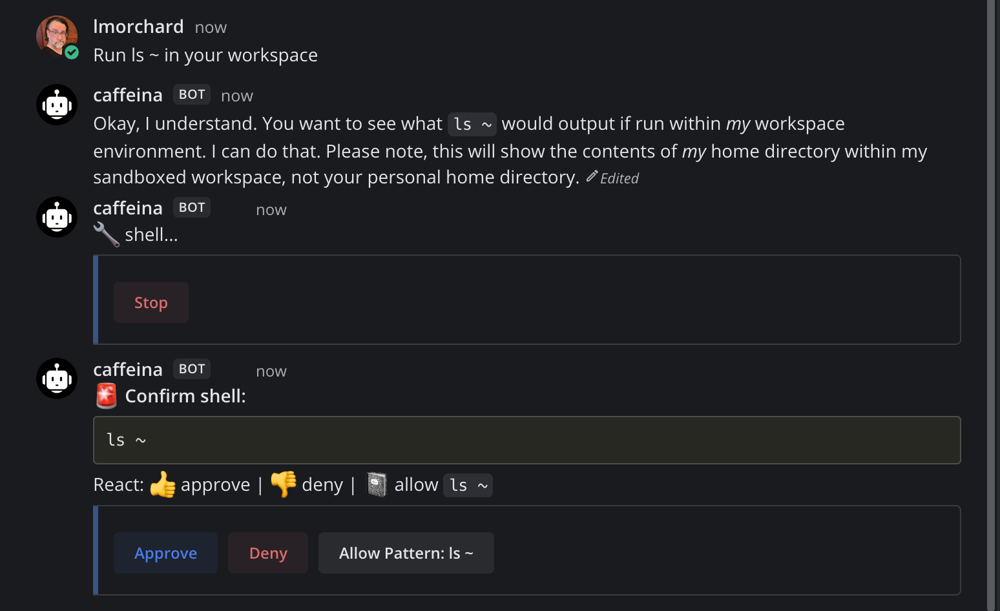
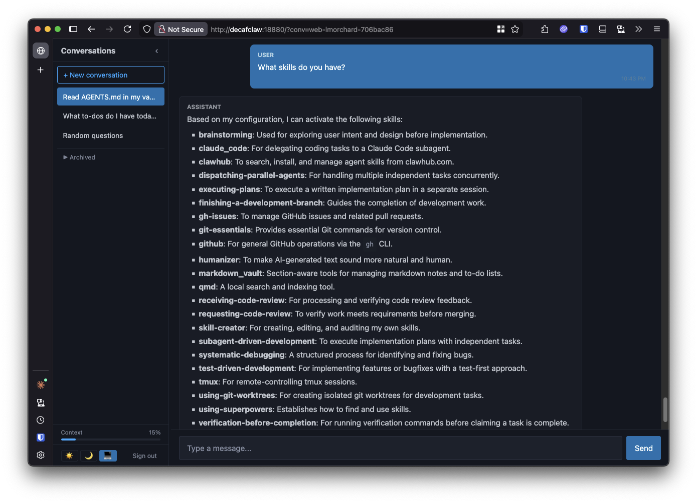
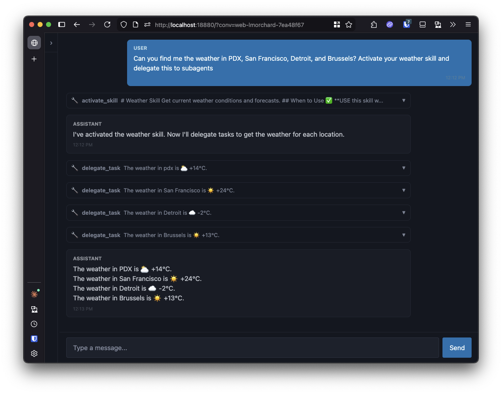

*TL;DR:* I set out to spend an afternoon understanding OpenClaw. A week later I'd built my own agent with 80+ tools, a web UI, and self-reflection. Here's how that happened.

<!--more-->

<figure class="wide">

<figcaption>Photo by <a href="https://unsplash.com/@heftiba?utm_source=unsplash&utm_medium=referral&utm_content=creditCopyText">Toa Heftiba</a> on <a href="https://unsplash.com/photos/building-during-daytime-M9aWXWZsc3k?utm_source=unsplash&utm_medium=referral&utm_content=creditCopyText">Unsplash</a></figcaption>

</figure>

<nav role="navigation" class="table-of-contents"></nav>

Week before last, I decided to check out this [OpenClaw](https://openclaw.ai/) thing for a work project. I was expecting to spend an afternoon poking at it to understand how it works, maybe build a simple skill to connect it to Tabstack. 

Instead, I fell down a rabbit hole. I've been meaning to learn how tool calling and [agent loops](https://simonwillison.net/2025/Jun/5/wrecking-its-environment-in-a-loop/) work with LLMs for a while. OpenClaw seemed like a good opportunity to do that. But, that thing is huge and tangly. The more I poked at it, the more I realized that the best way to understand it was to build my own. 

So that's what I did. I was going to spend an afternoon poking at [a little script](https://github.com/lmorchard/decafclaw/commit/868791f8c43db7d40243292f9df89f525a075cc7#diff-06a041d339cb937d511c0d8e22586ca3c51681cdca177f364e92669c857a6ac6). I expected to see it work, go "huh, neat" and then wander off.

Instead, it went the other way: I got hyperfocused and carried away over the weekend and then into the week. I kept adding one thing after another. By the end, I had an agent with a web UI, persistent memory, a skills system, MCP server support, sub-agents, self-reflection, and about 590 tests. I called it Decafclaw.

## Day 1: "How hard can an agent loop be?"

The answer is: not very. The [core agent loop](https://github.com/lmorchard/decafclaw/tree/main/.claude/dev-sessions/2026-03-13-1710-initial-agent/spec.md) is about 50 lines of Python. Call the LLM with a system prompt and some tool definitions. If it wants to use tools, execute them, feed the results back, and loop. When it stops asking for tools, you have your response. That's it. That's the whole thing. (I was like, "Really? That's it?")

I started with raw `httpx` calls to a LiteLLM endpoint — no SDKs, no frameworks. Three tools: `shell`, `read_file`, and `web_fetch`. Minimal but capable of doing interesting foot-gun-ish things. I hooked it up to [Mattermost](https://github.com/mattermost/mattermost)'s WebSocket API. Thirty minutes later I had a working chat bot. I could talk to it from my phone with the Mattermost app.

<figure class="wide">

<figcaption>Baby's first agent loop.</figcaption>

</figure>

Then I [added web research tools](https://github.com/lmorchard/decafclaw/tree/main/.claude/dev-sessions/2026-03-13-1756-tabstack-tools/spec.md) via [Tabstack](https://tabstack.ai/) and discovered something that would become a recurring theme: **tool descriptions are a control surface.** The model correctly chose `extract_markdown` over `web_fetch` for summarizing articles purely based on how I described each tool. No routing logic, no if-statements. Just prose in the tool description.

<figure class="wide">

<figcaption>Looking for a cocktail</figcaption>

</figure>

By the end of day 1, I had an [event bus, a Go-inspired forkable context system, full async everything](https://github.com/lmorchard/decafclaw/tree/main/.claude/dev-sessions/2026-03-13-1956-live-tool-progress/spec.md), rate limiting, a circuit breaker, per-thread conversation history, and a [persistent memory system](https://github.com/lmorchard/decafclaw/tree/main/.claude/dev-sessions/2026-03-13-2319-user-memory/spec.md). That all sounds very fancy, but it all accumulated somewhat naturally as I kept head-scratching about the system.

## Day 2: "Managing context makes it smarter"

I built [conversation compaction](https://github.com/lmorchard/decafclaw/tree/main/.claude/dev-sessions/2026-03-14-1024-conversation-compaction/spec.md) — when the context fills up, a (cheap) model summarizes old messages while preserving key facts. The breakthrough was making an on-disk JSONL archive the source of truth, not the in-memory history. Non-destructive re-compaction, [conversation resume](https://github.com/lmorchard/decafclaw/tree/main/.claude/dev-sessions/2026-03-14-1314-conversation-resume/spec.md), and debugging all fell out of that one decision for free. 

I also added [semantic search](https://github.com/lmorchard/decafclaw/tree/main/.claude/dev-sessions/2026-03-14-1346-semantic-search/spec.md) to the memory system — vector embeddings in SQLite with cosine similarity, so the agent could find relevant memories without exact keyword matches.

The [eval harness](https://github.com/lmorchard/decafclaw/tree/main/.claude/dev-sessions/2026-03-14-1121-eval-loop/spec.md) came next. YAML test cases, multi-turn support, a judge model that grades responses. I learned that Gemini Flash responds to "MUST" and "NEVER" measurably better than "should" and "always."

The cool part about this harness, though, is that I managed to get Claude Code to run it and read the results and make changes based on them. Lather, rinse, repeat. I could tell Claude "these prompts aren't landing, let's write evals and iterate until they pass." And, surprisingly, that worked.

## Day 3: "Give it skills"

The [skills system](https://github.com/lmorchard/decafclaw/tree/main/.claude/dev-sessions/2026-03-14-2256-skills-system/spec.md) uses SKILL.md files with YAML frontmatter — portable, human-readable, works with native Python tools or shell-based workflows. This, roughly, is [the Agent Skills format](https://agentskills.io/home) shared by a bunch of agents.

[MCP server support](https://github.com/lmorchard/decafclaw/tree/main/.claude/dev-sessions/2026-03-15-0102-mcp-server-support/spec.md) fell into place in the same day. The Claude Code-compatible config format means you can share server configs between tools. Auto-restart with exponential backoff for crashed stdio servers.

<figure class="wide">

<figcaption>My agent can use a browser via the Playwright MCP server</figcaption>

</figure>

The [heartbeat system](https://github.com/lmorchard/decafclaw/tree/main/.claude/dev-sessions/2026-03-15-1051-heartbeat-prompt/spec.md) was supposed to be simple: run some checks periodically, report results. It turned into a whole thing.

I also put together a [deployment setup](https://github.com/lmorchard/decafclaw/tree/main/.claude/dev-sessions/2026-03-15-1444-deployment/spec.md) — systemd service, a Debian VM setup script, and a deploy script that does git pull, uv sync, and restart. Nothing fancy, but it meant I could iterate on the live instance quickly.

## Day 4: "Let's make it nice"

[File attachments](https://github.com/lmorchard/decafclaw/tree/main/.claude/dev-sessions/2026-03-15-1235-file-attachments/spec.md) required replacing plain strings with a `ToolResult` type across the entire codebase. Worth it. MCP image/audio decoding, workspace image references, overflow handling for threads with more than 10 files.

[Streaming responses](https://github.com/lmorchard/decafclaw/tree/main/.claude/dev-sessions/2026-03-15-1402-streaming-responses/spec.md). SSE parsing, throttled Mattermost edits, terminal typewriter mode.

The [code quality session](https://github.com/lmorchard/decafclaw/tree/main/.claude/dev-sessions/2026-03-16-1011-code-quality-cleanup/spec.md) was neat. I told Claude that the codebase was a mess and we needed to step back and do a cleanup session. Four parallel review agents (code reuse, quality, efficiency, patterns) found 71 decent improvements. 

In the same sweep, I added [surgical file editing tools](https://github.com/lmorchard/decafclaw/tree/main/.claude/dev-sessions/2026-03-16-1020-file-editing-tools/spec.md) to replace full-file read/write — workspace navigation, find, search — so the agent could stop burning tokens on 500-line file dumps. 

I also set up a [Claude Code skill](https://github.com/lmorchard/decafclaw/tree/main/.claude/dev-sessions/2026-03-16-1132-claude-code-skill/spec.md) so I can delegate coding tasks from Mattermost to Claude Code running as a sub-process. From here, I could actually direct planning and implementation from the agent chat itself. Pretty neat.

And I had to track down a nasty [empty response bug](https://github.com/lmorchard/decafclaw/tree/main/.claude/dev-sessions/2026-03-16-1151-fix-empty-llm-response/spec.md) where LiteLLM was embedding 3KB of Gemini thinking tokens inside tool_call_id fields, bloating context until the API choked.

<figure class="wide">

<figcaption>Interactive buttons for tool confirmations in Mattermost</figcaption>

</figure>

[Interactive buttons](https://github.com/lmorchard/decafclaw/tree/main/.claude/dev-sessions/2026-03-16-1430-interactive-buttons/spec.md) for tool confirmations in Mattermost. Approve, Deny, Allow Pattern, Always Allow. Single-use HMAC tokens so nobody can replay a button click. Fun fact: Mattermost silently drops button callbacks when the action ID contains underscores. No error, no log, nothing. Completely undocumented. Uff da.

## Day 5: "I should build a web UI"

I [built a web UI](https://github.com/lmorchard/decafclaw/tree/main/.claude/dev-sessions/2026-03-16-1700-web-gateway/spec.md). Token auth, WebSocket chat, conversation management, Lit web components, markdown rendering, theme toggle, keyboard shortcuts, drag-to-resize sidebar, copy on code blocks. It kept going. Every time I thought "okay, ship it," I'd notice another thing. Bookmarkable URLs. An archive drawer. A context usage indicator. Then a whole [responsive pass](https://github.com/lmorchard/decafclaw/tree/main/.claude/dev-sessions/2026-03-17-1413-responsive-ui/spec.md) to make it usable on mobile.

Mattermost is very cool, but having a purpose-built web UI let me think about what more I could do with the thing. I started thinking about adding little inline [web applets](https://github.com/unternet-co/web-applets), maybe a web canvas?

<figure class="wide">

<figcaption>Web UI with chat and limited markdown rendering</figcaption>

</figure>

## Day 6: "Sub-agents and code quality"

[Concurrent tool execution](https://github.com/lmorchard/decafclaw/tree/main/.claude/dev-sessions/2026-03-18-1017-concurrent-tools-delegate/spec.md) via `asyncio.gather` with a semaphore. [Sub-agent delegation](https://github.com/lmorchard/decafclaw/tree/main/.claude/dev-sessions/2026-03-17-1700-sub-agent-delegation/spec.md). [Tool deferral and search](https://github.com/lmorchard/decafclaw/tree/main/.claude/dev-sessions/2026-03-18-1239-mcp-tool-search/spec.md) — when you have 80+ tools, their definitions exceed the model's token budget, so non-essential tools hide behind a search tool and get loaded on demand.

Another [13-item code quality sweep](https://github.com/lmorchard/decafclaw/tree/main/.claude/dev-sessions/2026-03-18-1626-code-quality-sweep/spec.md) to clean up everything that had accumulated. Extracted modules, standardized error returns, refactored a 260-line elif chain into a dispatch map. The codebase went from "it works" to "I'd be okay if someone else read this."

<figure class="wide">

<figcaption>Several sub-agents doing the extremely intensive work of looking up the weather in parallel</figcaption>

</figure>

## Day 7: "One more thing. And another. And another."

At this point, I moved from a big BACKLOG.md file and converted all the issues to [a GitHub Project board](https://github.com/users/lmorchard/projects/6). This turns out just as accessible to Claude Code via the `gh` CLI as a local file, but it has the added benefit of being more manageable for me. I can prioritize, label, and close issues as needed, and Claude can read the current state of the project directly from GitHub.

[User-invokable commands](https://github.com/lmorchard/decafclaw/tree/main/.claude/dev-sessions/2026-03-19-1157-user-commands/spec.md) (!command in Mattermost, /command in the web UI). Markdown [vault skill redesign](https://github.com/lmorchard/decafclaw/tree/main/.claude/dev-sessions/2026-03-19-1327-vault-redesign/spec.md): 29 tools down to 5, because most vault operations overlap with workspace tools. Asking "what's the overlap?" collapsed the scope from "redesign 29 tools" to "delete 24 of them."

The [config system](https://github.com/lmorchard/decafclaw/tree/main/.claude/dev-sessions/2026-03-19-1420-flexible-config/spec.md) got a full rewrite.

And then [self-reflection](https://github.com/lmorchard/decafclaw/tree/main/.claude/dev-sessions/2026-03-19-1549-self-reflection/spec.md). The agent evaluates its own responses before delivering them. A separate (cheap) model judges whether the response actually answers the question. If not, it injects a critique and the agent retries. This is the [Reflexion pattern](https://arxiv.org/abs/2303.11366) — binary eval, verbal feedback, max 2 retries. The research says judges hallucinate problems ~10% of the time, so it's fail-open: if the judge breaks, the response ships anyway.

## What I actually learned

**I've gotten the hang of spec / plan / execute loops with Claude Code.** The spec / plan / execute rhythm worked. Things got done fast, progress was steady. Spec review caught critical issues multiple times. The one session I skipped planning (the web UI) burned three context windows. This is real stuff - if I take time up front to describe what I want to build, Claude can write most of the code while I do other stuff.

**The agent loop is boring.** The interesting problems are everything around it: context management, tool descriptions as behavioral controls, prompt engineering by experiment, UI feedback during long operations, graceful degradation when things break.

**Prompt engineering is empirical.** I had an eval harness by day 2 and used it constantly. "This prompt change feels better" is not a methodology. "This prompt change moved the eval from 5/8 to 7/8 on Flash" is.

**Tool descriptions are prompts in disguise.** Changing the wording from "you can search for..." to "ALWAYS search before saying you don't know" measurably changed behavior. The eval harness proved this quantitatively. Really, it's prompts and context all the way down.

**LLM APIs have undocumented quirks everywhere.** Mattermost dropping callbacks with underscored action IDs. LiteLLM embedding 3KB thinking tokens in tool_call_id fields. Gemini returning empty responses after skill activation. You will spend time on these.

## Is it actually useful?

Kinda? Admittedly, it's a testbed for a bunch of ideas, patterns, and techniques. But, it has been helping me with notes in Obsidian, wrangling to-dos, chasing down information. It's been kicking off some Claude Code sessions for me, and it's been a good way to experiment with tools and techniques that I can eventually apply to work projects. I don't think I'll aim to build a startup empire out of this thing.

## Summing up

- **30 dev sessions** - over 7 days, mostly in the background while I did other things
- **0 to 590 tests** - [red / green TDD](https://simonwillison.net/guides/agentic-engineering-patterns/red-green-tdd/) is incredibly effective for coding agents
- **~15,000 lines of Python** (plus JS for the web UI)
- **80+ tools** (core + skills + MCP)

It started as "let me understand tool calling" but ended with self-reflection, sub-agent delegation, and a Mattermost bot that evaluates its own responses before sending them.

The repo is at [github.com/lmorchard/decafclaw](https://github.com/lmorchard/decafclaw). Again, it's a learning project. It might never be useful to anyone but me. The code is the documentation. The documentation is also documentation, because apparently I built that too.

I should probably go outside, touch some grass.
