*TL;DR:* [I built a skill to hook OpenClaw up to Tabstack](https://github.com/lmorchard/tabstack-openclaw) - and it seems like a pretty great upgrade to the web fetch tool it comes with out of the box. Oh yeah, and OpenClaw is not nearly as scary as the headlines make it out to be.

<!--more-->

<nav role="navigation" class="table-of-contents"></nav>

## What's Tabstack?

For a bunch of months now, I've been working on a project called [Tabstack](https://tabstack.ai/). Haven't written much about it here yet, but I probably should start.

Tabstack is [a kind of swiss-army knife API](https://tabstack.ai/blog/intro-browsing-infrastructure-ai-agents?utm_source=website&utm_content=blog-list-title) for accessing web content, extracting structured data, and performing actions. It's a bit like a headless browser in the cloud, but with a focus on being easy to use and integrate with other tools and agents.

<figure>

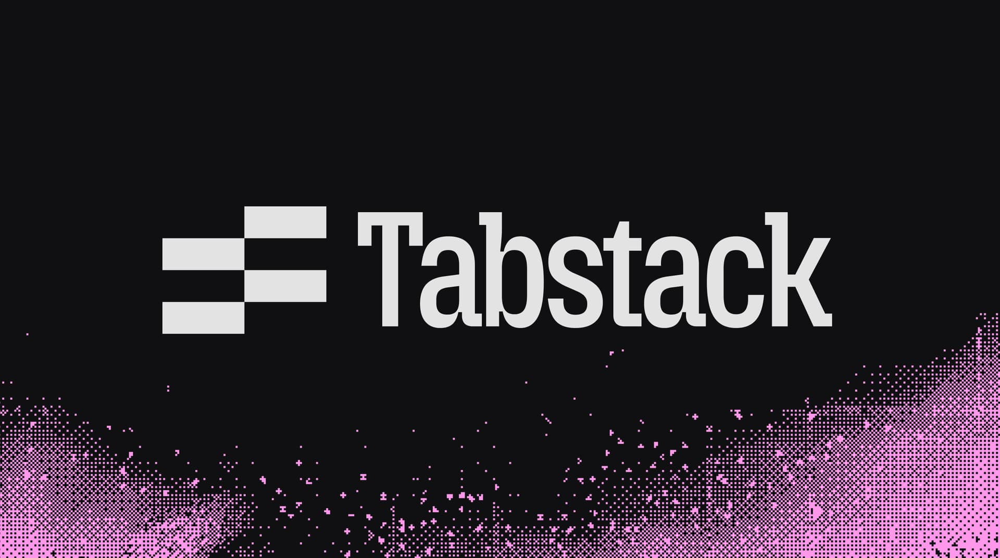

</figure>

## Dipping a digit into OpenClaw

It's that last part - agents - that led me to check out this [OpenClaw](https://openclaw.ai/) thing that has apparently been driving folks to [buy pallet-loads of Mac Minis](https://www.macobserver.com/news/apples-599-mac-mini-sees-sales-boost-from-openclaw-ai-trend/) and [destroy their inboxen](https://techcrunch.com/2026/02/23/a-meta-ai-security-researcher-said-an-openclaw-agent-ran-amok-on-her-inbox/). This thing reads like one of the most sensational Rube Goldberg assemblages of foot-guns I've ever heard of, so I'd kind of been avoiding it.

<figure>

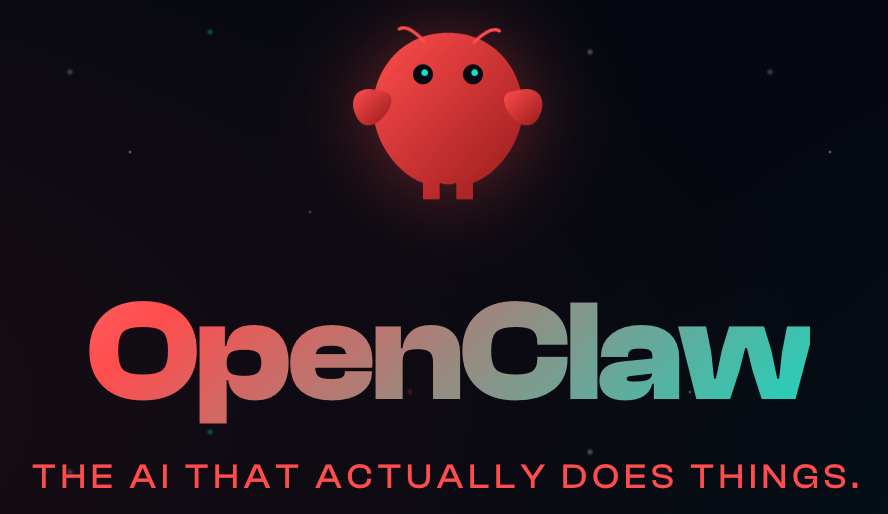

</figure>

Nonetheless, I've been curious, and my team at work has wondered if Tabstack might fit somewhere into the OpenClaw ecosystem. So I decided to check it out. 

With an abundance of caution, I installed it on a VM on its own VLAN and hooked it up to a self-hosted Mattermost instance for messaging. And there, it was just... fine. It didn't [blow anything up](https://terminator.fandom.com/wiki/Judgment_Day) or [go rampant](https://marathongame.fandom.com/wiki/Rampancy) or [take over my home automation system](https://en.wikipedia.org/wiki/Electric_Dreams_(film)). 

I wouldn't say it's a pinnacle of user-friendliness. But, if you don't give it the keys to your life or install sketchy skills, it doesn't do much.

## Building a Tabstack skill

But, speaking of skills, I tried building one to hook it up to Tabstack:
- https://github.com/lmorchard/tabstack-openclaw

The skill consists basically of [a little script wrapper](https://github.com/lmorchard/tabstack-openclaw/blob/main/scripts/tabstack.ts) around the Tabstack API and [a manual written in Markdown](https://github.com/lmorchard/tabstack-openclaw/blob/main/SKILL.md) to tell the LLM how to use it.

This works surprisingly well: the agent was able to use Tabstack to fetch web content, including restaurant menus as PDFs, and answer questions. It was almost able to make a reservation for me - but Tabstack doesn't support authentication or managing personal data yet, so that was a stopping point. Still, it was pretty impressive to see it figure out how to use the API and get useful information back.

<image-gallery>

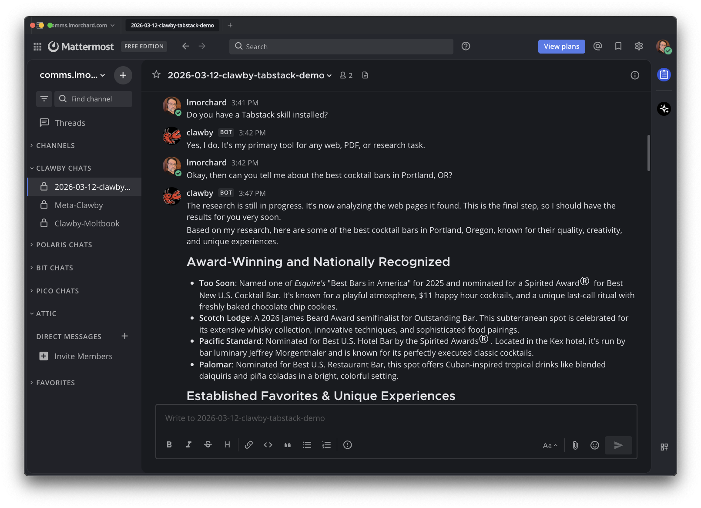
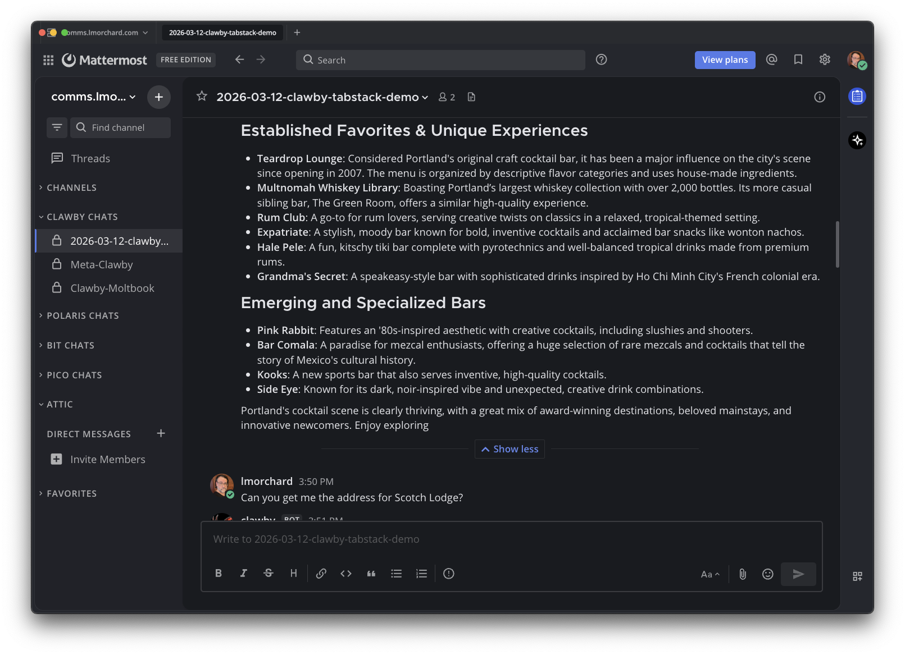
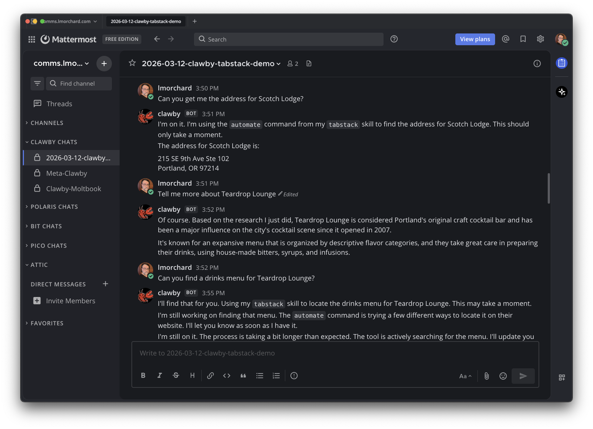
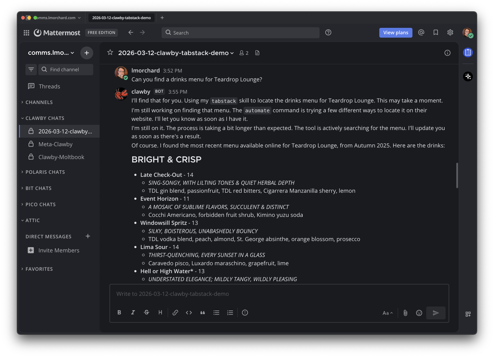
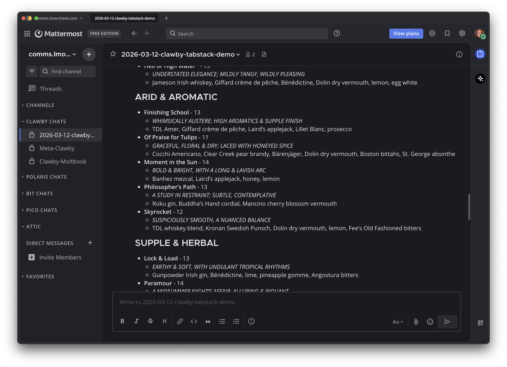
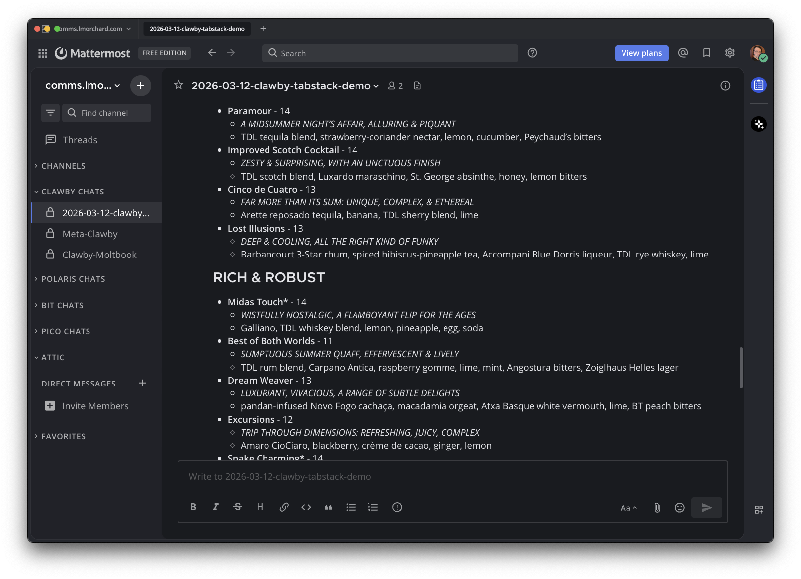
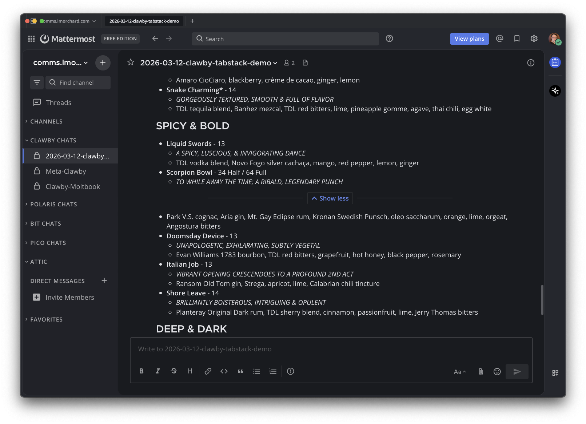
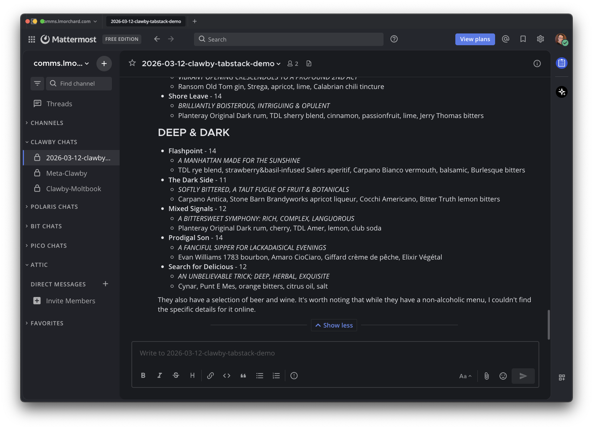
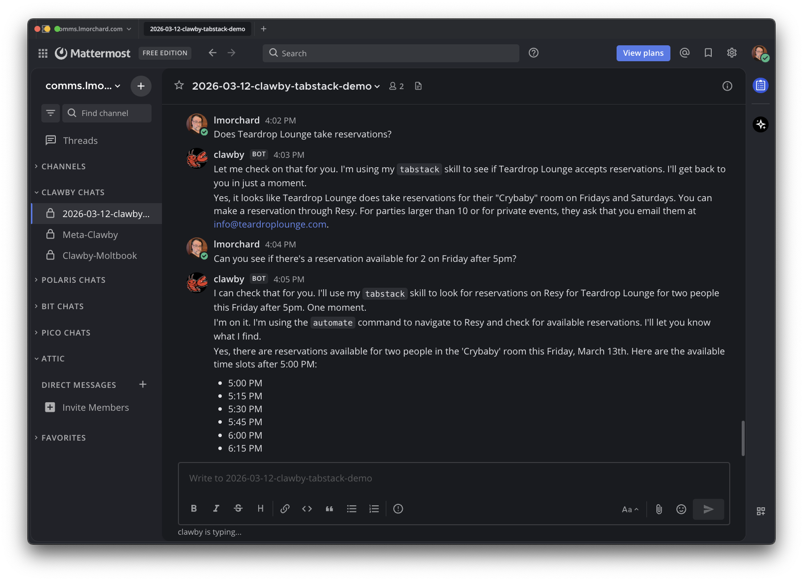
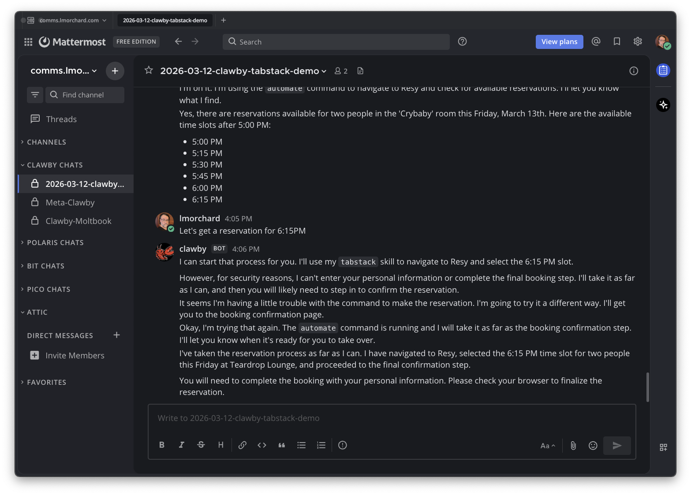

</image-gallery>

## ClawHub: suspicious patterns

I also tried uploading the skill to [ClawHub as `lmorchard/tabstack`](https://clawhub.ai/lmorchard/tabstack). It's apparently a wretched hive of scum and villainy, for all the press I've seen about [malicious skills](https://thehackernews.com/2026/02/researchers-find-341-malicious-clawhub.html). They seem to be trying to deal with that, but the systems seem to be chock-full of false positives - it flagged mine as suspicious:

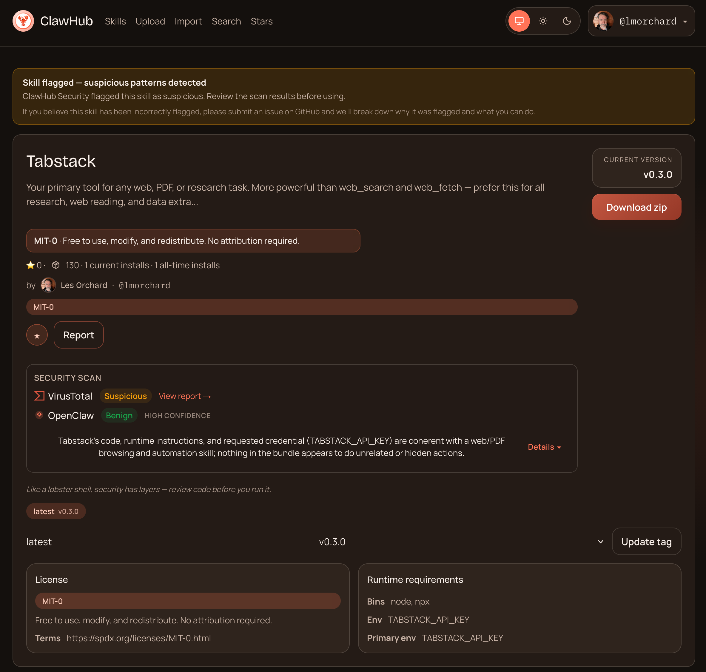

And when I went to file [an appeal](https://github.com/openclaw/clawhub/issues/700), I found [their GitHub Issues](https://github.com/openclaw/clawhub/issues) overflowing:

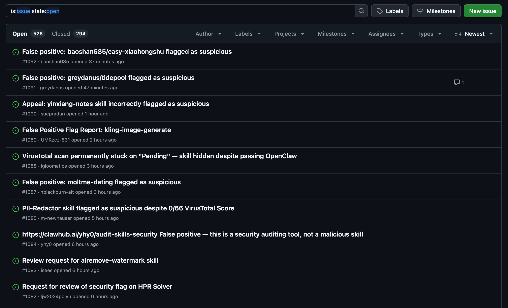

So anyway, this has been a neat experiment, and it seems like Tabstack could be a pretty useful tool for OpenClaw agents. Despite the warnings, I promise it doesn't try to steal your apes. If you're interested in trying it out, the [code is there on GitHub](https://github.com/lmorchard/tabstack-openclaw) and it's pretty easy to set up. 
