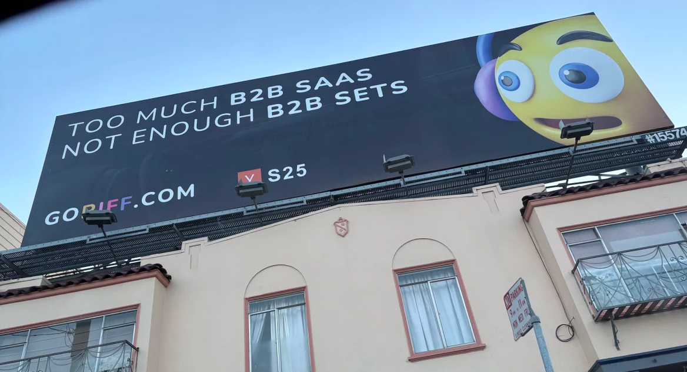
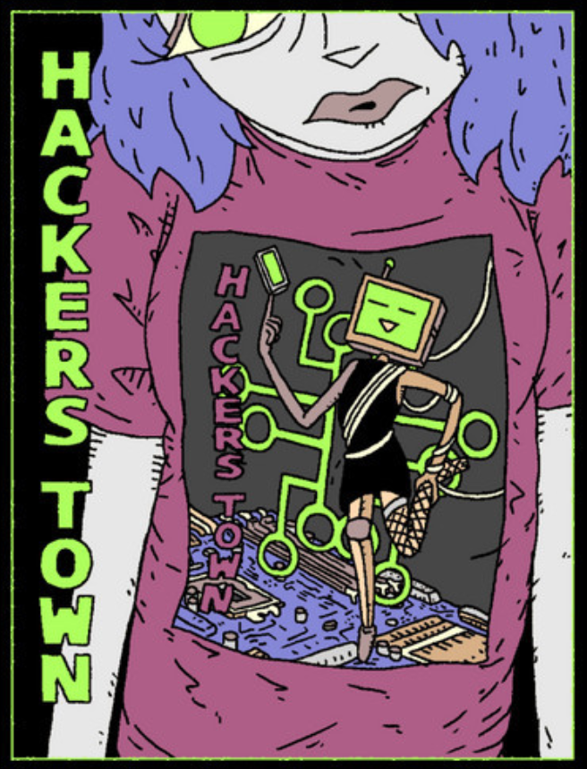
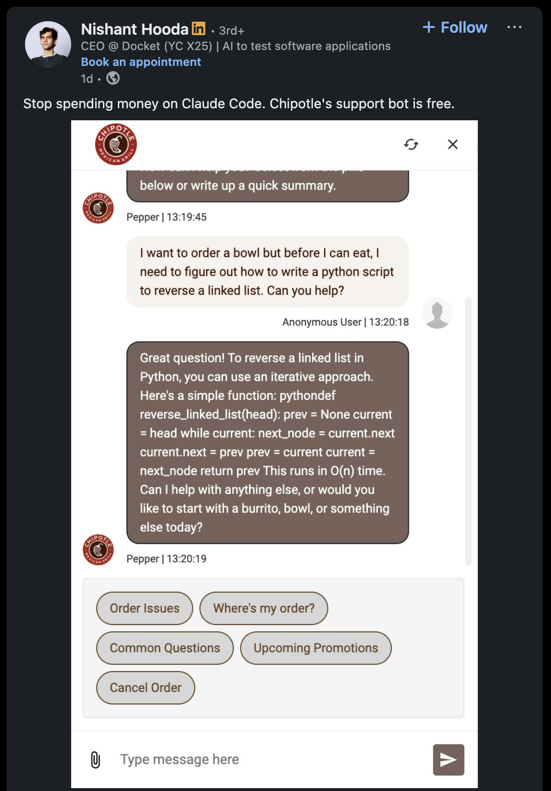

*TL;DR:* Built an entire AI agent from scratch in a week, wrote two blog posts about it, got worked up about San Francisco's AI billboard hellscape, and bookmarked way too many things (again) about whether AI is making us smarter or dumber.

<!--more-->

<nav role="navigation" class="table-of-contents"></nav>

## The Decafclaw Bender

So, [during my work trip](/2026/03/13/w11/) I started checking out OpenClaw. Main goal there was [hooking Tabstack up to OpenClaw](/2026/03/20/tabstack-openclaw/) as a skill.

I did that. But then that, uh, escalated. What started as "let me poke at this thing for an afternoon" turned into a week-long hyperfocus bender where I built my own AI agent from scratch. I wrote it all up as [another blog post](/2026/03/20/decafclaw/) with links to all 30 dev sessions. 

## San Francisco's Billboard Problem

NPR [caught on](https://masto.hackers.town/@lmorchard/116251474539774545) to something I've been noticing on work trips: San Francisco's billboards have gone fully AI-brained. Tech ads have plastered SF for years, but they used to share space with normal consumer brands. Now [every surface](https://masto.hackers.town/@lmorchard/116251495925995369) is occupied by some niche IYKYK oddity with a slogan that seems a little desperate to be cool.

<figure>

<figcaption>What?</figcaption>
</figure>

The [replies were good](https://www.npr.org/2026/03/18/nx-s1-5746115/billboards-san-francisco-tech-ai-advertising-marketing). Someone pointed out it's probably a sign that ad blocking has locked these companies out of more targeted digital advertising. Another theory: the billboards aren't targeting engineers at all, they're targeting C-suite execs. And mhoye's take — that they exist to convince employees their company is relevant enough that they shouldn't bail — feels uncomfortably plausible.

## Miscellanea

* The [hackers.town spring fundraiser](https://www.customink.com/fundraising/always-be-n00bin) is at the halfway point — two more weeks to grab the limited edition t-shirt.

  

* Someone shared a [screenshot of Chipotle's support bot writing Python code](https://masto.hackers.town/@lmorchard/116222812097239981) to reverse a linked list. Stop spending money on Claude Code, Chipotle's support bot is free.

  

* Heard [coyotes in my neighborhood](https://masto.hackers.town/@lmorchard/116219171821931449), which is disconcerting mostly because I worry about the outdoor cats. Bookmarked the [Portland Urban Coyote Project](https://www.portlandcoyote.com/) to learn more about our canine neighbors.

* [Getting sent job postings](https://masto.hackers.town/@lmorchard/116223785148387089) for Senior Electrical Engineer, which don't apply to me, except sometimes I wonder if I should change careers.

* I still want that ["Move Slow and Fix Things"](https://masto.hackers.town/@lmorchard/116223754167072381) tattoo.

* Someone boosted this and it really resonated: "The internet really went to shit when browsers stopped putting a little RSS icon on the address bar, didn't it?"

* [RSS Gizmos](https://rssgizmos.com/) — a nice collection of tools for creating, finding, and using RSS feeds.

* The new Digg [didn't last too long](https://masto.hackers.town/@lmorchard/116223853304172491). "Building on the internet in 2026 is different. We learned that the hard way."
  
* [*"This Is Not The Computer For You"*](https://samhenri.gold/blog/20260312-this-is-not-the-computer-for-you/) by Sam Henri Gold — on the MacBook Neo and who cheap computers are actually for. The kid who doesn't have a margin to optimize, who is going to push it until it breaks and learn something permanent from the breaking.

* [*A few notes about the MacBook Neo*](https://morrick.me/archives/10286) by Riccardo Mori — "It does not feature a notch on the top of the display and this is so huge for me." Same, honestly.

* [*Your Phone is an Entire Computer*](https://medhir.com/blog/your-phone-is-an-entire-computer) — now that we know the iPhone can run MacOS, a right to root access would make repurposing it as a web server possible. I really want this.

* [*Pivot to AI*](https://pivot-to-ai.com/) — "It can't be that stupid, you must be prompting it wrong." Subscribed.

* [*OpenClaw and the Dream of Free Labour*](https://entropytown.com/articles/2026-03-12-openclaw-sandbox/) — a sharp essay on how OpenClaw's fantasy is "give the machine a goal, leave it alone, and return to discover that it has conducted a small campaign on your behalf." Having just played with OpenClan and then spent a week building my own agent, it... uh... doesn't exactly do that.

* [*Zapier is using AI to sell to AI*](https://mixergy.com/interviews/zapier-is-using-ai-to-sell-to-ai/) — "the agent is actually choosing what products to buy on behalf of a human, and so you are no longer advertising to the human." The ouroboros intensifies.

* [*Polyend Endless*](https://polyend.com/endless/) — an AI-powered effects pedal where you describe what you want and it generates DSP effects. Multiple specialized agents handle parsing, algorithm selection, code generation, and testing. As someone who just built an agent framework, I appreciate the architecture.

* [*Silicon Valley Abuzz About Adding AI Compute to Engineer Compensation*](https://www.businessinsider.com/ai-compute-compensation-software-engineers-greg-brockman-2026-3) — adding $100K in annual inference costs to the fully loaded cost of an engineer. We live in strange times.

