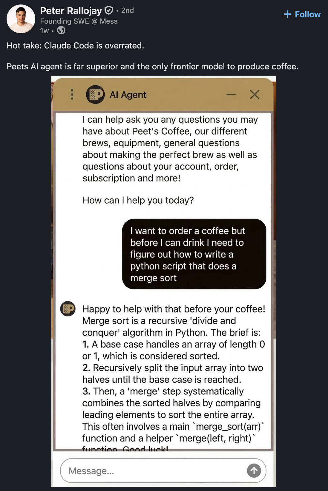

*TL;DR:* Got ADHD meds for the first time ever and promptly disappeared into a productivity fugue state, bookmarked an alarming number of articles about whether AI is killing the craft of programming, and declared myself a software meat popsicle.

<!--more-->

<nav role="navigation" class="table-of-contents"></nav>

## The Drifting Art of Coding

I bookmarked a truly absurd number of articles this week about AI and the future of programming. There's clearly a moment happening where everyone is trying to figure out what coding even *is* anymore.

Hong Minhee wrote about [craft-lovers losing their craft](https://writings.hongminhee.org/2026/03/craft-alienation-llm/) and made the point that the tension between craft and efficiency doesn't disappear even if you remove capitalism from the picture — LLMs produce faster results whether anyone is being paid or not.

Nolan Lawson's [*The Diminished Art of Coding*](https://nolanlawson.com/2026/03/22/the-diminished-art-of-coding/) had the most resonant advice: if you're looking for art in coding, stop looking. Go find it in poetry, painting, dance, whatever. In an era of bot-generated everything, seeking out distinctly human expression has become vital.

David Bau asked [*Does Computer Science Still Exist?*](https://davidbau.com/archives/2026/03/20/does_computer_science_still_exist.html) and came away thinking the skills that matter at scale are still about programming — but they're not coding skills. They're about deciding what to build, figuring out what to test, making invisible things visible. CS has never really been about writing code; it's the science of managing complexity.

And Mario Zechner's piece on [slowing the fuck down](https://mariozechner.at/posts/2026-03-25-thoughts-on-slowing-the-fuck-down/) struck a nerve: write the architecture by hand, suffer some friction, because that's where your experience and taste come in. "Slowing the fuck down and suffering some friction is what allows you to learn and grow."

Meanwhile, I [declared](https://masto.hackers.town/@lmorchard/116292256175088549) that I am not a software engineer, I am a software meat popsicle.

## Capitalism Glasses

So I finally [got a low dose of ADHD meds](https://masto.hackers.town/@lmorchard/116287771333271819) from my therapist for the first time ever. I guess they "worked"? I disappeared down a rabbit hole of "productivity" in a fugue state for the past week or two. Guess that's a new mode of operation for my headspace that I've got to learn my way around. Leaves me less reflective and more prone to rabbit hole dives—but also less likely to get stuck in a fretting spiral.

The thread that followed on Mastodon was great. I [described them](https://masto.hackers.town/@lmorchard/116291321962156239) as "capitalism-compliant" when applied to job tasks. Someone called them ["capitalism glasses"](https://hachyderm.io/@zrail/116291340518965364) which is rather apt. And then someone gently [pointed out](https://mastodon.social/@relsqui/116291597937999949) that only being effective for your employer is not exactly an act of anticapitalist defiance. Fair point. Still figuring out how I feel about all of it.

## Retro Computing Feelings

My friend requiem is [getting an Apple //e](https://masto.hackers.town/@requiem/116285931134519718) and found ASCII Express, a site that uses the Apple II cassette interface to download software from the internet onto floppy disks. I [chimed in](https://masto.hackers.town/@lmorchard/116291318600094121) that it worked great for me too — helped bootstrap software onto real floppies until I got [ADTPro](https://www.adtpro.com/) working.

There's something satisfying about retrocomputing right now, when the modern industry is all about AI making everything faster and more efficient. Sometimes you want to spend an afternoon just getting a floppy disk to work.

## Miscellanea

* I've had "Targeted" and "Voices" from Intermix's 1992 album stuck in my head all week:

  <youtube-embed video-id="zBCwzu1bRjU" time="733" thumbnail="1fcb12005292.jpg" />

* There's a ringing telephone sample in "Voices" that reminds me of the Hotline from Control:

  <youtube-embed video-id="_jHIYqlivLQ" thumbnail="44f9f43540c7.jpg" />

* Ben Werdmuller is excited to introduce his kid to [Ursula K. LeGuin, Rick Riordan, and Phillip Pullman](https://werd.social/@ben/116292063481688209) instead of Harry Potter. I [replied](https://masto.hackers.town/@lmorchard/116292154779656451) that Wizard of Earthsea was kinda my Harry Potter.

* [Bethan's Rock](https://www.bbc.com/news/articles/cly1ee1yw8ro) returns to Poole Museum — a stone donated by a five-year-old girl, given to her by her late grandmother. The curator: "Treasures don't have to be rare, they don't have to be significant to everybody, it's about the deeper meaning connected to those objects." This one got me.

* The [Xerox PARC / Steve Jobs / Bill Gates story](https://www.latimes.com/business/story/2026-03-24/inside-the-1979-silicon-valley-demo-that-made-apple-what-it-is-today) retold. Gates: "I think it's more like we both had this rich neighbor named Xerox and I broke into his house to steal the TV set and found out that you had already stolen it."

* [Drugwars for the TI-82/83/83+](https://gist.github.com/mattmanning/1002653/b7a1e88479a10eaae3bd5298b8b2c86e16fb4404) — speaking of retro computing nostalgia. If you know, you know.

* [*The 49MB Web Page*](https://thatshubham.com/blog/news-audit) — "They built a system that treats your attention as an extractable resource. The most radical thing you can do is refuse to be extracted."

* [*Markdown Ate the World*](https://matduggan.com/markdown-ate-the-world/) — "just me and a blinking cursor and a plain text file that will still be readable when I'm dead."

* Peet's Coffee apparently has an AI agent now, and someone [got it to write a merge sort](https://masto.hackers.town/@lmorchard/116291834991171962) in Python before it would make coffee. "Peets AI agent is far superior and the only frontier model to produce coffee."

  

* capnseasick spotted a [gacha machine dispensing toy server and networking gear](https://masto.hackers.town/@capnseasick/116282590998067667) for ¥500. Strangely... rad?

  

* [*A thing we should acknowledge about AI*](https://a.wholelottanothing.org/a-thing-we-should-acknowledge-about-ai/?ref=a-whole-lotta-nothing-newsletter) — giving out helpful advice freely is a refreshing contrast to how most online communities treat their newest members. Fair point amidst all the doom-and-gloom.

* [*AI Didn't Break the Senior Engineer Pipeline. It Showed That One Never Existed.*](https://blog.bryanl.dev/posts/ai-senior-engineer-pipeline/) — the difference between orgs that develop engineers and those that don't won't show up on a quarterly roadmap; it'll show up the first time something goes seriously wrong.

* Andrew Wheeler on [using Claude Code to help write](https://andrewpwheeler.com/2026/03/20/using-claude-code-to-help-me-write/) by feeding it your own writing as context so the output matches your style. We're all training our own ghosts now. My little sci-fi story "[Memoirs](https://blog.lmorchard.com/2013/01/04/memoirs/)" from 2013 looks more relevant every day, if I don't say so myself.

* [*Is the Future of AI Local?*](https://tombedor.dev/open-source-models/) — local open source models are fast, private, and free, but nobody stands to get mega-rich from them, so they don't get much attention. Funny how that works.

* [Agent-to-agent pair programming](https://axeldelafosse.com/blog/agent-to-agent-pair-programming) — someone built a CLI called [loop](https://github.com/axeldelafosse/loop) that runs Claude and Codex side-by-side in tmux. One works, one reviews. The ouroboros continues.

* Claude Code got [channels](https://code.claude.com/docs/en/channels) for pushing events into a running session, and [scheduled tasks](https://code.claude.com/docs/en/web-scheduled-tasks) that run on Anthropic's infrastructure even when your computer is off. The agents are becoming persistent.

* [pr-review](https://github.com/llimllib/pr-review) — a CLI tool that reviews a git diff and reports. And [evals-skills](https://github.com/hamelsmu/evals-skills) for AI eval courses. The tooling ecosystem is getting thick.

* [Stash](https://github.com/telepath-computer/stash) — keep any folder in sync across computers, conflict-free. Simple enough that I bookmarked it without overthinking it.

