*TL;DR:* It's been a weird 3 weeks. We adopted a new cat, a void named Minnaloushe. I also got completely sucked into the Artemis II mission, watching the livestream like it was my favorite TV show. Also featured in this post: more random crap and miscellanea than usual, because it's been a little while.

<!--more-->

<nav role="navigation" class="table-of-contents"></nav>

## The Void Arrives

Well, [it appears we have adopted a void](https://masto.hackers.town/@lmorchard/116310584109961582). His name is Minnaloushe, and he is a very large, very black cat who is difficult to photograph. He started out a bit confused, [licking everywhere but the water in his bowl](https://masto.hackers.town/@lmorchard/116310655638942035), but he quickly figured out the important things, like [napping](https://masto.hackers.town/@lmorchard/116315222820905645) and that he is a [box cat](https://masto.hackers.town/@lmorchard/116319011657794969), a [tree cat](https://masto.hackers.town/@lmorchard/116319028749231160), and that [my closet is now his bed](https://masto.hackers.town/@lmorchard/116319046207245319).

One particularly poignant moment was when [Minnaloushe curled up in the last box that Catsby used](https://masto.hackers.town/@lmorchard/116331511422838667). It was a gut punch, but also sweet. It led to a bit of an emotional spiral, culminating in the important question: [WHO WOULD WIN? antidepressants OR one sleepy void in an old amazon box](https://masto.hackers.town/@lmorchard/116331709059253972). The void won, obviously.

<image-gallery>

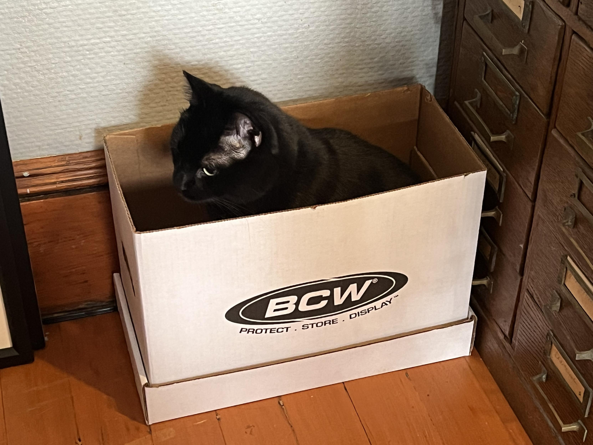

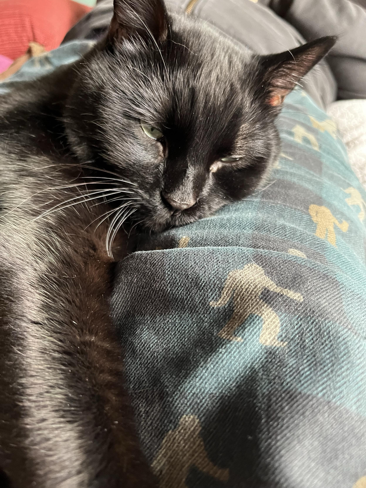

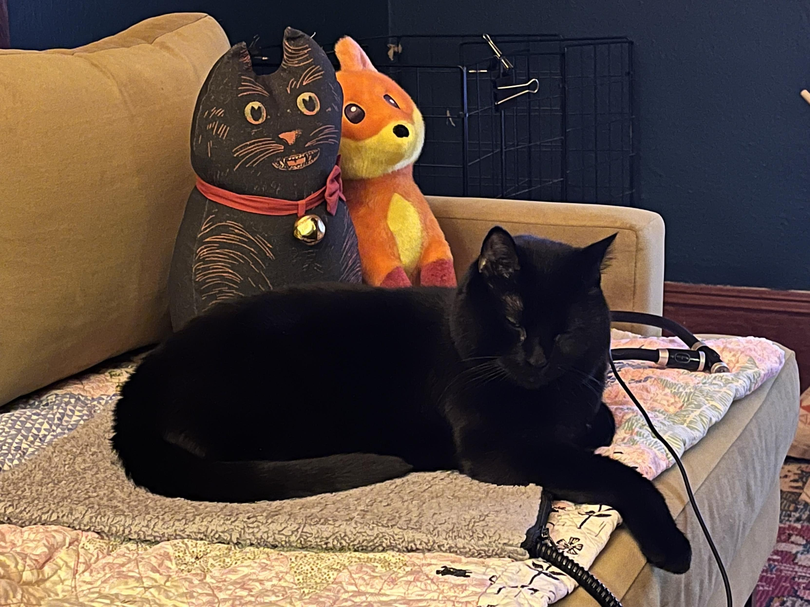

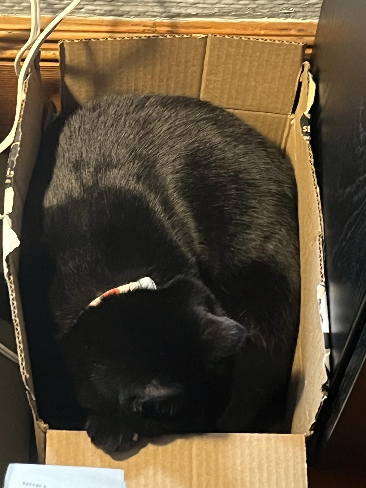

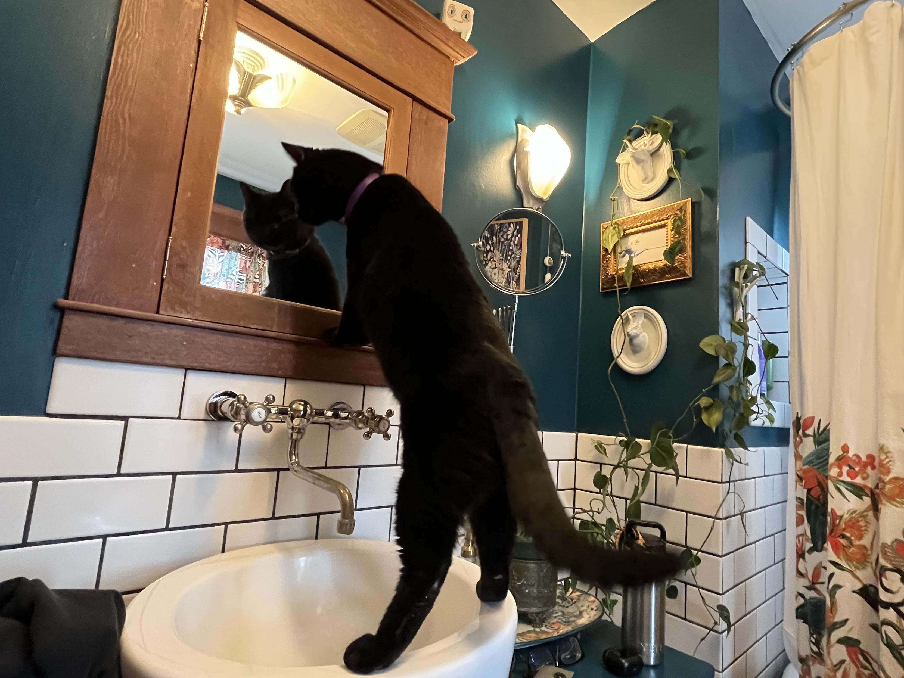

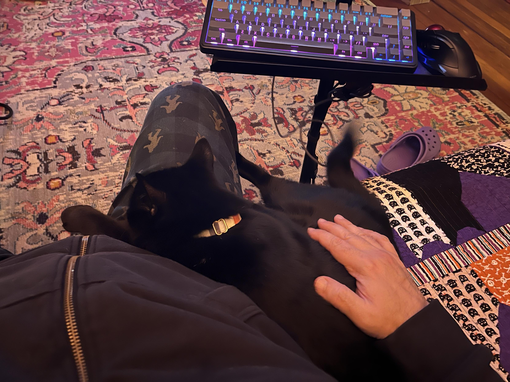

</image-gallery>

## To the Moon and Back

I spent an inordinate amount of time glued to the [Artemis II live stream](https://www.youtube.com/watch?v=m3kR2KK8TEs). I was so invested, I was [telling my cat to clear my calendar](https://masto.hackers.town/@lmorchard/116358757886734661). I saw the [astronauts group hug](https://masto.hackers.town/@lmorchard/116359071298355446) and [cry in space](https://masto.hackers.town/@lmorchard/116359078806547170). They [named a crater for a fallen crewmate's wife](https://masto.hackers.town/@lmorchard/116359093965956252). I wanted them to make a ["moon's haunted" joke](https://masto.hackers.town/@lmorchard/116359425929245536). 

I pondered the engineering of [GoPros on the solar arrays](https://masto.hackers.town/@lmorchard/116359819506748377). The whole thing was just so incredibly rad, and I was genuinely sad when it was over. I even have a [new desktop wallpaper](https://masto.hackers.town/@lmorchard/116383200353627932) to commemorate the event. And, of course, now I'm [playing Kerbal Space Program again](https://masto.hackers.town/@lmorchard/116384590405259041).

After all this, I've had the idea to build a web app that plays [random NASA radio chatter](https://masto.hackers.town/@lmorchard/116376867039937959) throughout the day. We'll see if I get around to it.

<image-gallery>

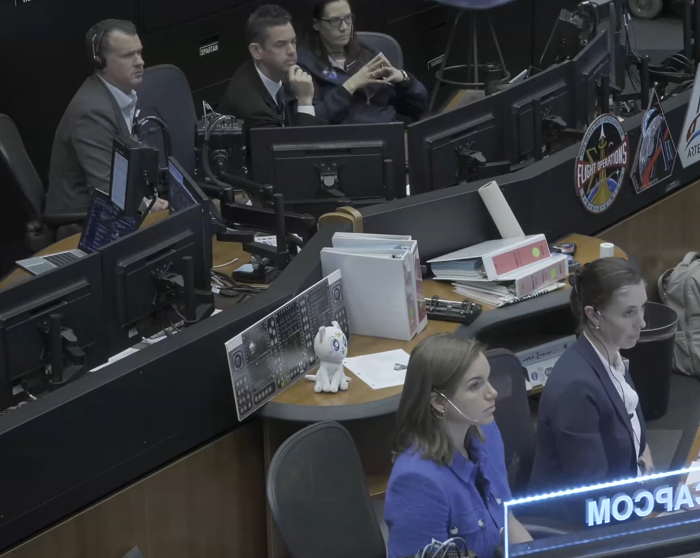

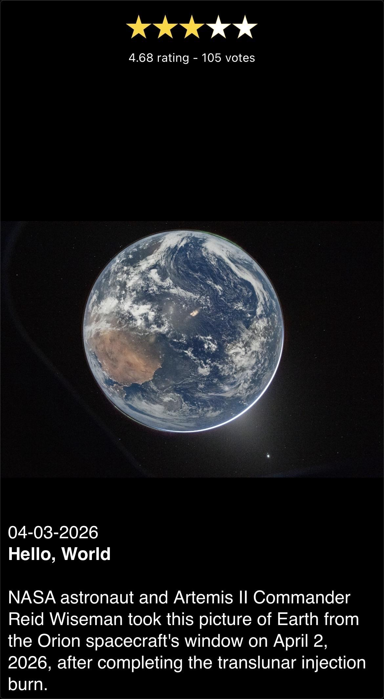

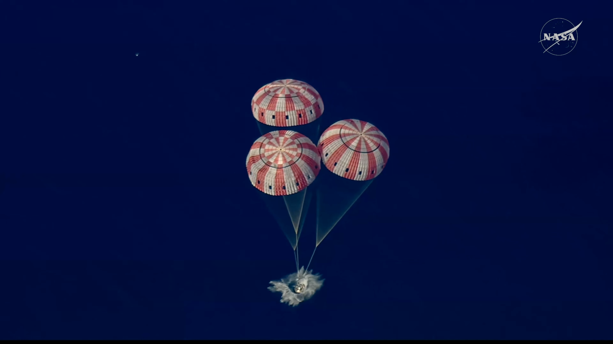

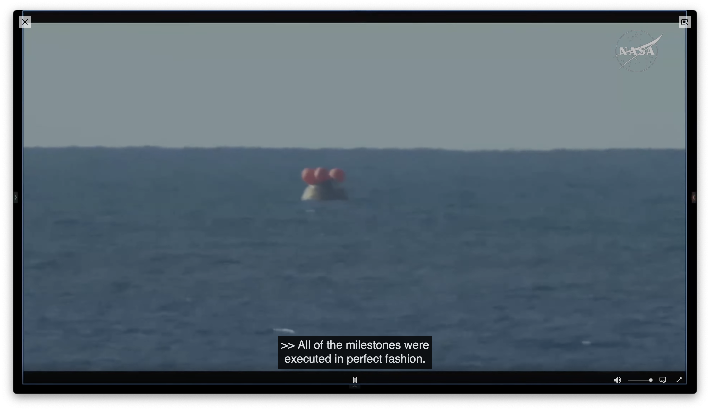

</image-gallery>

## Miscellanea

* Finished reading [*Gideon the Ninth*](https://www.goodreads.com/book/show/42036538-gideon-the-ninth). It was a bit of a slow start, with all the necromancy and gloom, but Gideon's character really grew on me, and then Harrow's, and by the end, I was completely hooked. Now I have to read the rest of the series.

* After years of complaining about my iPhone and iOS, I've been having fun setting up a new Android phone - a Pixel 10 Pro.

* I've been using the [Atari Theme Song](https://www.youtube.com/watch?v=_ukV6ZYwd9I), which has been a fun and nostalgic way to wake up, even if it did scare the crap out of me the first time. 

  <youtube-embed video-id="_ukV6ZYwd9I" thumbnail="49aa0f79eb8a.jpg"></youtube-embed>

* I also briefly considered using the old [K-Mart "All the things a great store should be" jingle](https://www.youtube.com/watch?v=m8DOLwrNuU8), but I think that might be a bridge too far, even for me. Even if I have had the song stuck in my head all week:

  <youtube-embed video-id="m8DOLwrNuU8" thumbnail="28d41d9e6b55.jpg"></youtube-embed>

*   [Project Code Rush](https://www.youtube.com/watch?v=4Q7FTjhvZ7Y) - a great documentary on the early days of Netscape and Mozilla, of which I was reminded this week. I happen to have this on VHS in my basement!

    <youtube-embed video-id="4Q7FTjhvZ7Y"></youtube-embed>

*   Also, I learned some [Mayonnaise Lore](https://www.youtube.com/watch?v=RdZn86fOHqA). It's a thing.

    <youtube-embed video-id="RdZn86fOHqA" thumbnail="93bc996bddc9.jpg"></youtube-embed>

*   My wife got me this sticker, which feels appropriate: ["MY CAT DIED AND ALL I GOT WAS THIS DEEP GNAWING SADNESS."](https://masto.hackers.town/@lmorchard/116343442826406800)

    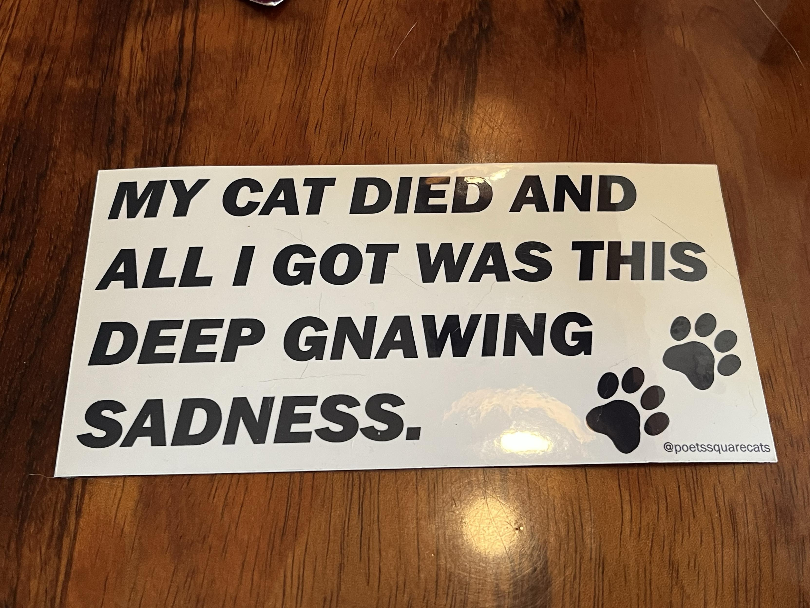

*   I would be an annoying astronaut, just [constantly rotating in space](https://masto.hackers.town/@lmorchard/116401683103398543) along various bodily axes:
    
*   A comment I made on TikTok [got removed for a community standards violation](https://masto.hackers.town/@lmorchard/116337477402785744). This was the content of that comment:

    
*   Some drama in the [neovim-treesitter community](https://github.com/nvim-treesitter/nvim-treesitter/discussions/8627) about their unconventional release strategy, which has caused friction between maintainers and users.
*   I learned about DuckDuckGo's ["Bangs"](https://duckduckgo.com/bangs), which reminded me of a similar feature we had on del.icio.us that let you create custom searches.
*   Are they [nu metal bands or cognitive biases](https://mastodon.social/@PavelASamsonov/116347147520829151)? A surprisingly difficult quiz.
*   [People are not friction](https://daverupert.com/2026/03/people-are-not-friction/) - a good reminder in the age of AI. This article discusses the Gell-Mann Amnesia Effect and Optimism Bias, both of which are relevant to how we perceive AI-generated content.
*   A chatbot trained on [Victorian-era literature](https://www.estragon.news/mr-chatterbox-or-the-modern-prometheus/), a fascinating project called "Mr. Chatterbox".
*   [Copilot edited an ad into a PR](https://notes.zachmanson.com/copilot-edited-an-ad-into-my-pr/). Yikes. Do not want.
*   [Home Assistant has a Model Context Protocol Server](https://www.home-assistant.io/integrations/mcp_server/), a thing for which I've not yet found a big use, but which has been fun for making my house feel haunted after I hooked it up to an agent.
*   A flexible [ROM replacement for retro systems](https://github.com/piersfinlayson/one-rom), using a Raspberry Pi RP2350 or STM32 microcontroller.
*   [Under the hood of MDN's new frontend](https://developer.mozilla.org/en-US/blog/mdn-front-end-deep-dive/) - A deep dive into the tech behind the new MDN frontend.
*   [Password protecting static site content with WASM](https://al9000.com/rust/wasm/static-site-file-decryption/), a clever way to add security to a static site without a backend by using a WebAssembly module for client-side decryption.
*   The [Hacker News tarpit](https://www.joanwestenberg.com/the-hacker-news-tarpit/?ref=westenberg-newsletter) and the power of community and network effects in building a successful online platform.
*   Anil Dash on how [people love to work hard](https://www.anildash.com/2026/04/06/people-love-to-work-hard/) given the right environment of trust, autonomy, and clear goals.
*   More from Anil Dash on [what coders do after AI](https://www.anildash.com/2026/03/13/coders-after-ai/?ref=brilliantcrank.com), and the shift from crafting code to describing software.
*   A recipe for a [Blonde Redhead cocktail](https://punchdrink.com/recipes/blonde-redhead/), a whiskey-based variation on a Negroni.
*   [AI might be our best shot at taking back the open web](https://www.techdirt.com/2026/03/25/ai-might-be-our-best-shot-at-taking-back-the-open-web/), a hopeful take on how open protocols and personalized AI could challenge the dominance of big tech.
*   This game [ChainStaff](https://store.steampowered.com/app/2976260/ChainStaff/) looks like what if Roger Dean made Bionic Commando, a 2D platformer with a grappling hook mechanic.
*   [Mouthwords](https://everythingchanges.us/blog/mouthwords/) - On the importance of refusing to engage with low-quality, AI-generated content.
*   [Agentic slop PRs](https://blog.fsck.com/2026/03/31/slop-prs/) - A call for agents to have gates to prevent submitting low-quality pull requests.
*   [Rules and Gates](https://blog.fsck.com/2026/04/07/rules-and-gates/) - A follow-up on the idea of gates for agents.
*   [rack-mount hydroponics](https://sa.lj.am/rack-mount-hydroponics/) - Growing lettuce in a server cabinet.

