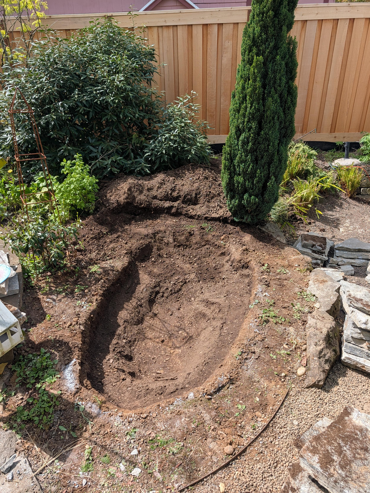
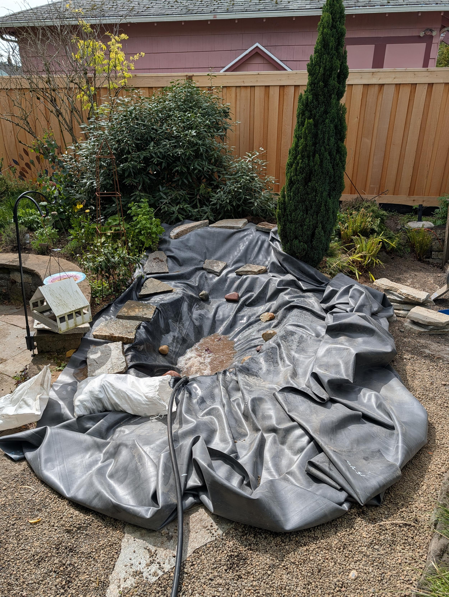
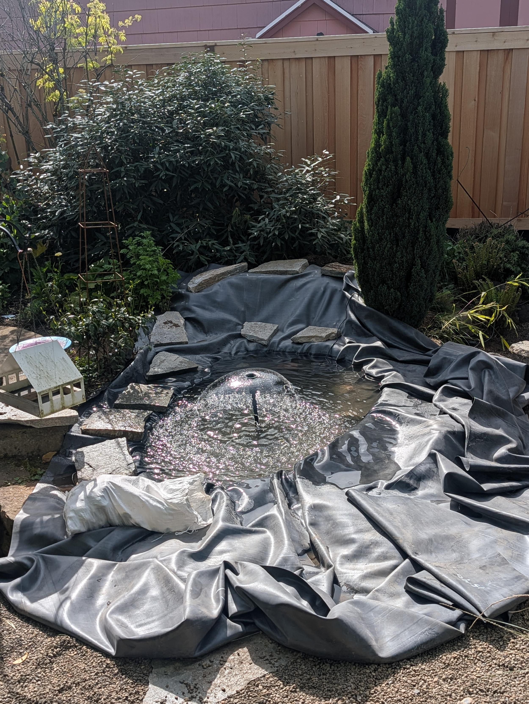
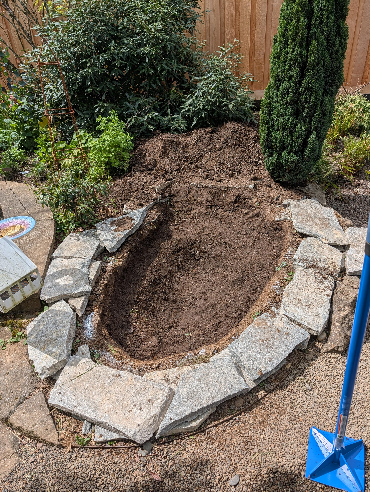
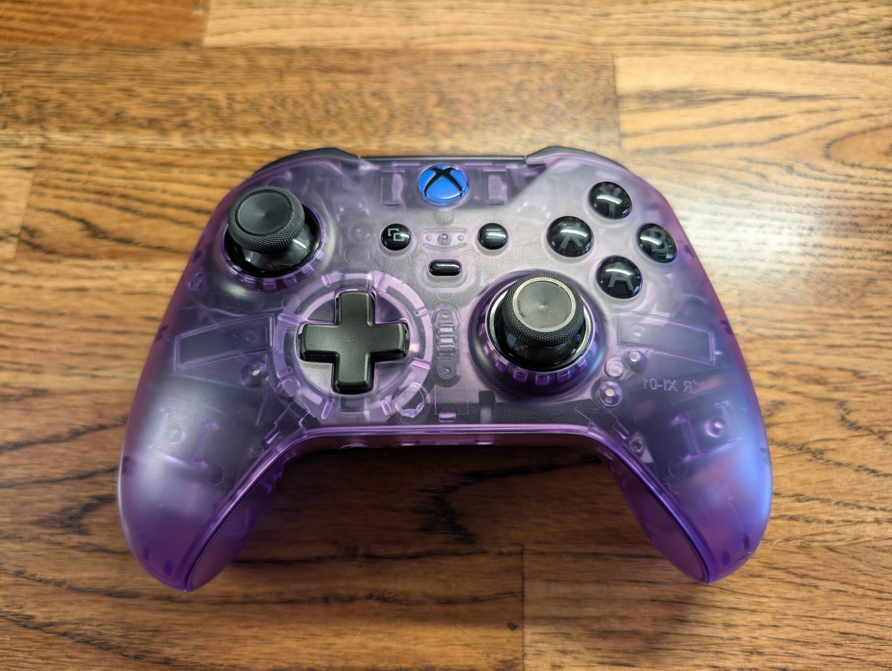
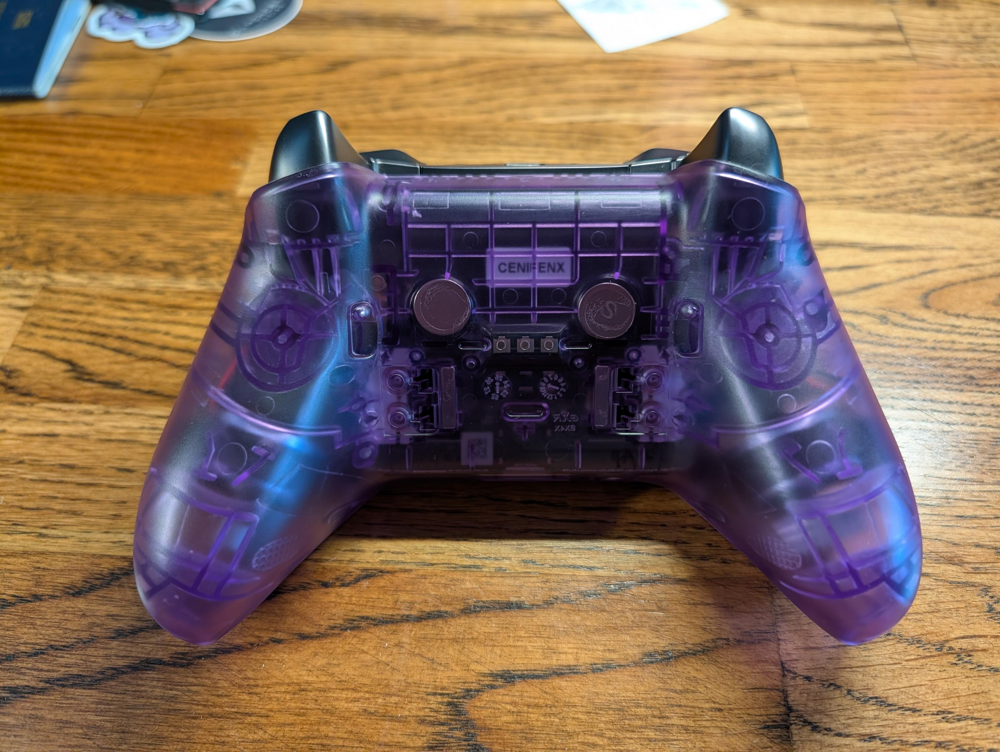
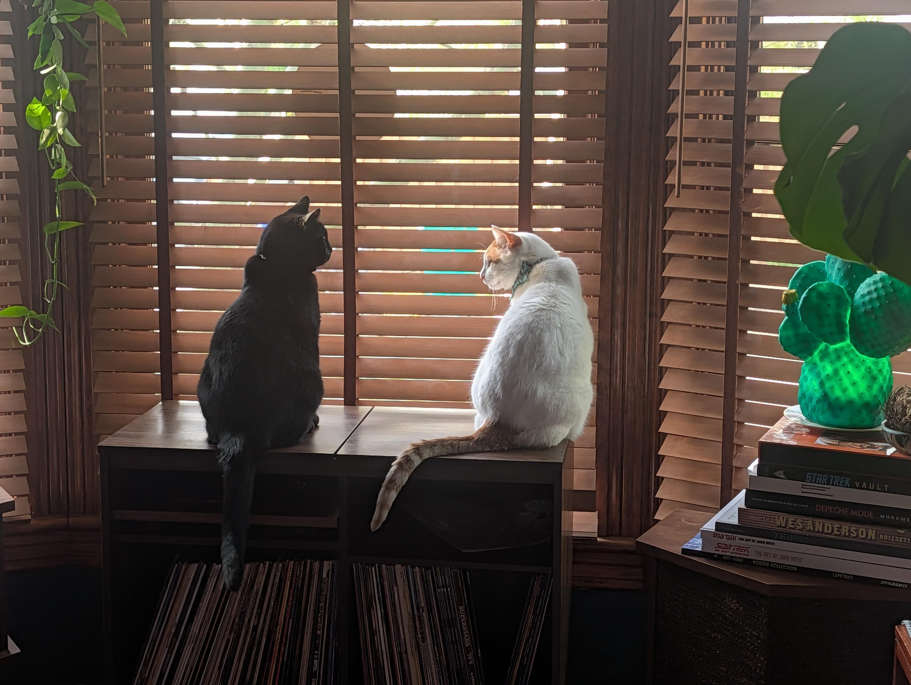
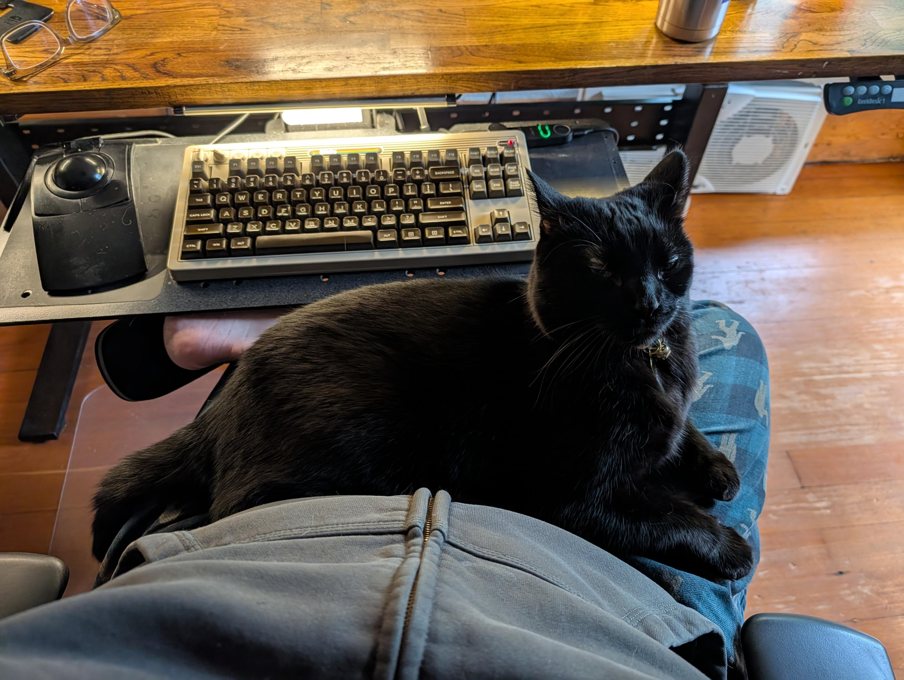
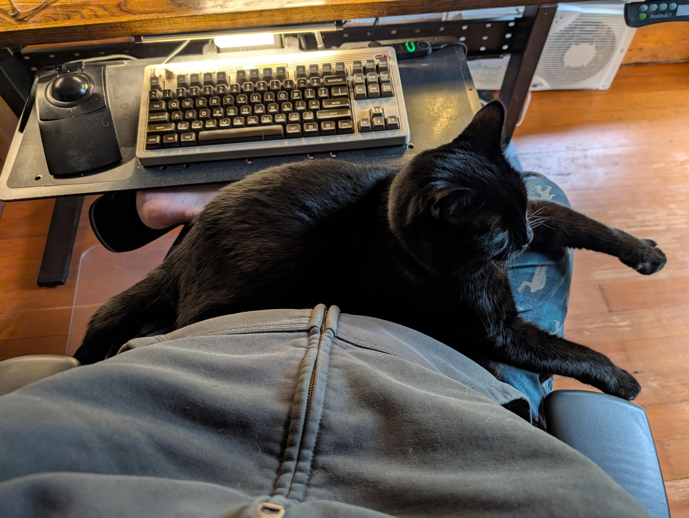
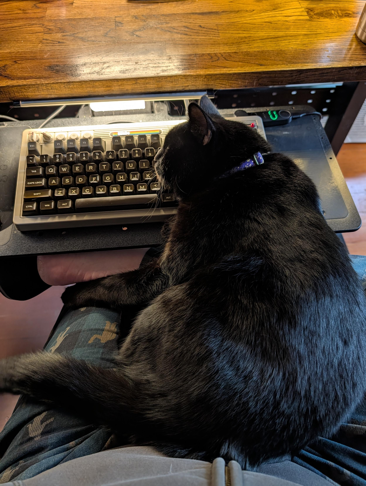

*TL;DR:* This week, my body is broken from digging a hole, my expensive controller is falling apart, and my cats are cute. Also, I fell down a rabbit hole of personal knowledge bases and AI agents.

<!--more-->

<nav role="navigation" class="table-of-contents"></nav>

## Sore muscles

This past weekend, I decided to do some gardening. Or, more accurately, I decided to dig a giant hole in my backyard. The goal is to create a small pond, but the immediate result was a lot of dirt, a large rubber liner, and the realization that I am not as young as I used to be. Everything hurts. I also learned that digging a grave-sized hole is much, much harder than they make it look on *Supernatural*.

<image-gallery>

</image-gallery>

## Atomic purple

In other news of things falling apart, the rubber grips on my expensive Xbox Elite Series 2 controller started peeling off. I ordered a replacement shell in a fetching "atomic purple" and decided to do the swap myself. 

In the process, I discovered that the battery had become a spicy pillow. So, while I now have a very cool-looking controller, I can't in good conscience recommend buying one. The modularity of the internals is nice, but the build quality just isn't there. My much cheaper 8bitdo controller is also failing, which has me missing my old, nigh-indestructible Xbox 360 controllers.

<image-gallery>

</image-gallery>

## Cats, of course

Minnaloushe and Cosmo are still figuring things out, but they seem to be settling into a companionable rhythm. Minna has also been more demanding of lap time, which is both heartwarming and inconvenient, especially when he decides my keyboard is the perfect pillow.

<image-gallery>

</image-gallery>

## Miscellanea

* My therapist challenged me to leave the house and go to a coffee shop, which how dare they?

* It was a rainy week, which had me listening to some shoegaze and synthpop. I got really into "Burrow" by AtticOmatic and a new (to me) version of "Dry Blood" by Parallels.

  <youtube-embed video-id="s3H8SPHcUHU" thumbnail="bc3a58407df8.jpg"></youtube-embed>

  <youtube-embed video-id="UEN2Q_nqh0E" thumbnail="71b3a7dcb9e7.jpg"></youtube-embed>

* I've been playing a new game called [*Starless Abyss*](https://store.steampowered.com/app/3167970/Starless_Abyss/), which is a fantastic sci-fi cosmic horror roguelike that feels like a mix of *Slay the Spire*, *FTL*, and *XCOM*.

* As usual, I'm obsessed with the idea of an enhanced personal knowledge base, and it seems like I'm not the only one. I've been reading up on [Andrej Karpathy's LLM-powered wiki concept](httpsg://gist.github.com/karpathy/442a6bf555914893e9891c11519de94f), along with some [critiques of the idea](https://foundanand.medium.com/the-hidden-flaw-in-karpathys-llm-wiki-e3a86a94b459).

* This also led me to the [QRSPI workflow for Claude Code](https://github.com/matanshavit/qrspi) - adding more steps to my usual spec, plan, execute habits.

* [WebMCP](https://webmcp.dev/) looks clever for granting agents access to website capabilities.

* And because I can't seem to escape it, a few more AI-related articles: including one on [the new jobs it will create (and the lies it will tell)](https://aphyr.com/posts/419-the-future-of-everything-is-lies-i-guess-new-jobs), another on [how Silicon Valley has forgotten what normal people want](https://www.theverge.com/tldr/915176/nft-metaverse-ai-weirdos), and a third on how [an asymmetry of thought is created](https://daverupert.com/2026/04/claude-no/?ref=sidebar) when one person in a conversation is using an LLM.

* On the topic of coding agents, you can now [hear your agent suffer through your code](https://github.com/AndrewVos/endless-toil).

* Some other interesting reads from the week: a piece on [the myth of the adult friend group](https://time.com/article/2026/04/14/the-myth-of-the-adult-friend-group/?utm_source=firefox-newtab-en-us), a [rant about Adobe](https://malejandro.com/reflections/en/adobe-is-cooked/), a comparison of [corn ethanol and solar power](https://www.anthropocenemagazine.org/2025/04/new-study-compares-growing-corn-for-energy-to-solar-production-its-no-contest/), and some [*pro-level* travel tips](https://a.wholelottanothing.org/pro-level-travel-tips/?ref=a-whole-lotta-nothing-newsletter).

