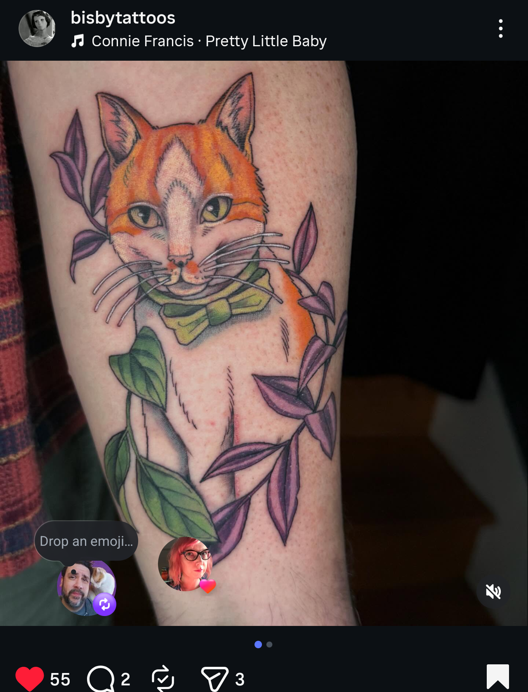
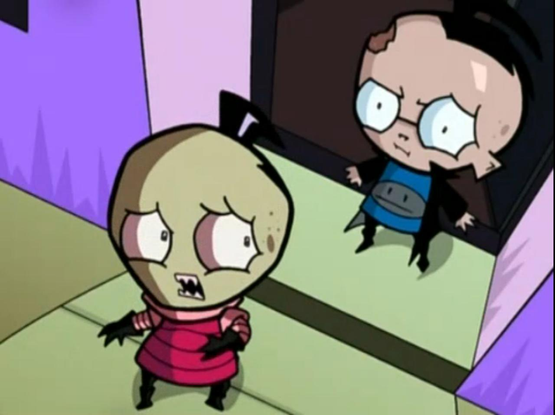
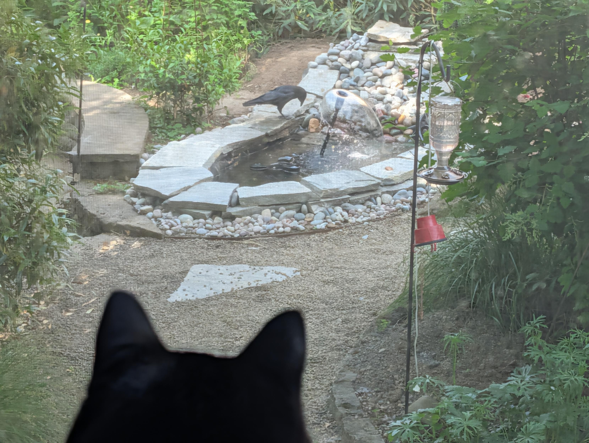
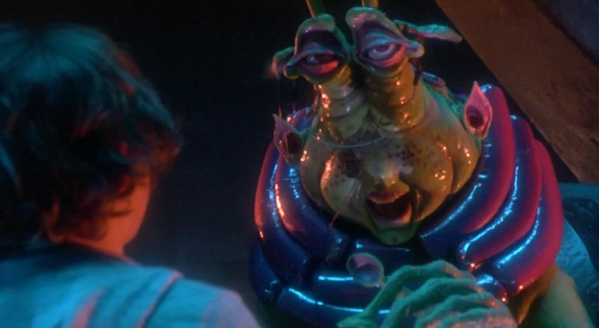
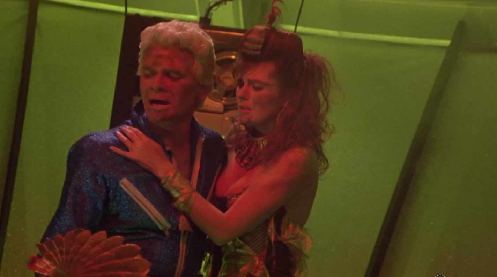
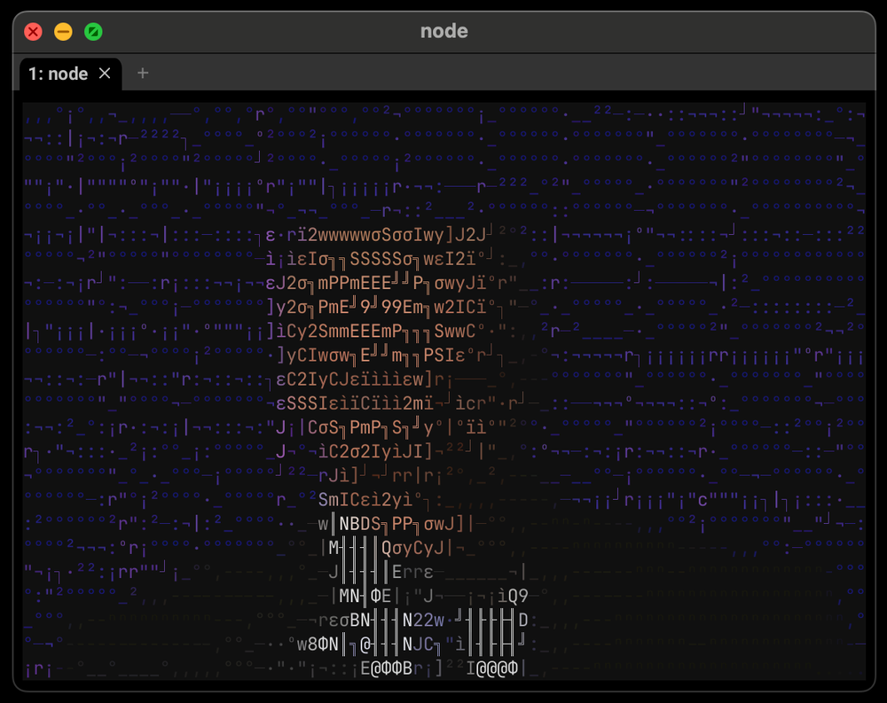
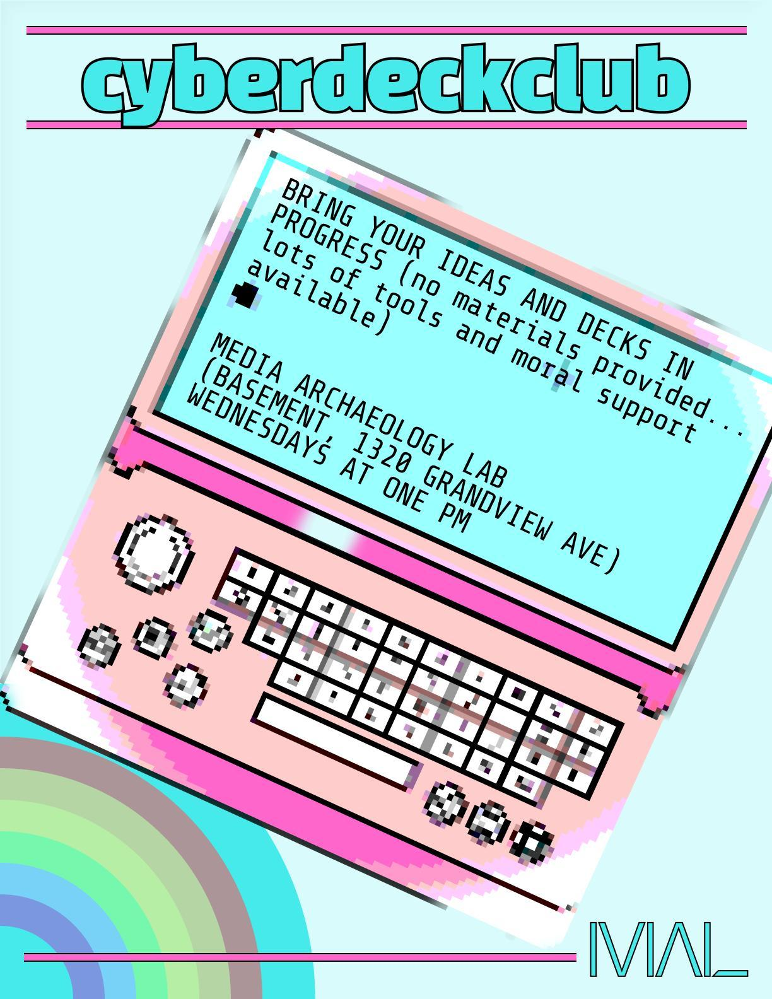
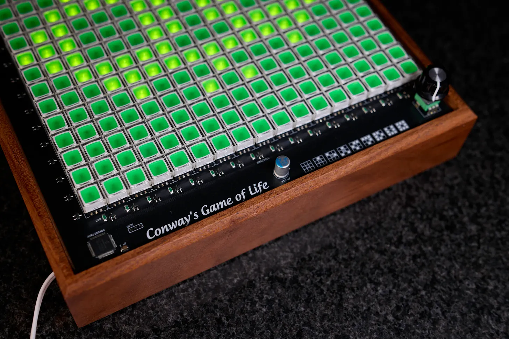
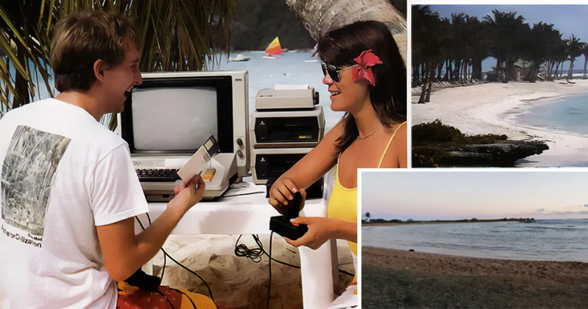

TL;DR: A few weeks of catch-up. First tattoo (Catsby in a vine of purple flowers). The backyard pond is done, and the raccoons and crows have already moved in. Built out the rest of the `me-to-markdown` family and an orchestrator that fans them out in one fetch — this post is the first dogfooded weeknote drafted from its output. The AI-coding bookmark pile this period was mostly variations on being tired.

<!--more-->

<nav role="navigation" class="table-of-contents"></nav>

## The tattoo

I [got my first tattoo](https://masto.hackers.town/@lmorchard/116501912864691512) on May 1st — a portrait of Catsby (orange and white cat, green bowtie, surrounded by a vine of purple flowers and green leaves) by [Katy Bisby](https://www.wonderlandpdx.com/katy-bisby-1).

I was [more worried about the social interactions than the pain](https://masto.hackers.town/@lmorchard/116502075890237091), which turned out to be misallocated worry. Once Katy started, I was [unexpectedly relaxed](https://masto.hackers.town/@lmorchard/116502102033592930) — at one point she was grinding away at my arm with color and shading and I was happily reading a book on my phone.

I'm [already thinking about a second one for Puck](https://masto.hackers.town/@lmorchard/116501934269805545), who we lost back in 2015.

Also, randomly, Dr. Bronner's unscented "magic balm" [unmistakably smells like barbecue](https://masto.hackers.town/@lmorchard/116517349662491114). I am delicious.

## The pond, occupied

The backyard pond [finished construction](https://masto.hackers.town/@lmorchard/116489271863179035) by April 28. The fountain and debris skimmer [pull about 80 watts](https://masto.hackers.town/@lmorchard/116489283502111650) per Home Assistant. Slate trim, river rocks, a little waterfall at the back. All very heavy. My back hurts.

Wildlife showed up immediately. A [raccoon tried to run off with a fountain pump](https://masto.hackers.town/@lmorchard/116469029071626988) on night one. By May 12, [Minnaloushe spotted a crow checking out the water](https://masto.hackers.town/@lmorchard/116562513395618876) from the kitchen window:

I [might need to point a trail camera at this thing](https://masto.hackers.town/@lmorchard/116562534974925564): every morning I get up to find something's been messed with — fountain knocked over, power cords dragged around. Lesson learned: I could not bribe crows into the backyard with peanuts for years, but a little water and they're suddenly regulars.

## me-to-markdown

Drafting weeknotes has always been a "where did the week even go?" problem for me — my own signal is scattered across Mastodon, bookmarks, commits, listening history, podcasts. So, I've long wanted to build some little tools that go out and pull all that stuff together for me.

So I built that - a bunch of basic, single-serving CLI commands as static go binaries that each hits up an API on a service I use and spits out markdown listing stuff I posted & collected:

- https://github.com/lmorchard/mastodon-to-markdown
- https://github.com/lmorchard/linkding-to-markdown
- https://github.com/lmorchard/spotify-to-markdown
- https://github.com/lmorchard/pocketcasts-to-markdown
- https://github.com/lmorchard/youtube-to-markdown
- https://github.com/lmorchard/github-to-markdown
- https://github.com/lmorchard/me-to-markdown

I'd had `mastodon-to-markdown` and `linkding-to-markdown` kicking around for a while as one-off scrapers. But, this week I built out the rest of the family and [an orchestrator](https://github.com/lmorchard/me-to-markdown) that ties them together - specifically so a weeknotes post like this one could start from a real export instead of me trying to remember.

I'm sure some folks think this is cheating / evil / abhorrent. But, it's kinda neat to have a robot go out and fetch all my stuff and get me past the blank page.

## Frettings about AI

Most of my bookmarks for this period were all circling the same worries:

- **The exhausted angle:** [Agentic Coding is Burning Me Out](https://0xsid.com/blog/agentic-coding-fatigue) — "Making constant architectural, big-picture decisions while overseeing the work of a cracked junior dev is fundamentally harder than executing standard programming tasks yourself." And [That time it tried to delete all my tests](https://blog.fsck.com/2026/04/30/that-time-it-tried-to-delete-all-my-tests/) — "think about the model as a lazy pedant. How could it do something that's technically what you asked, but not at all what you wanted?"
- **The dystopian angle:** Aphyr's [*The Future of Everything is Lies, I Guess: New Jobs*](https://aphyr.com/posts/419-the-future-of-everything-is-lies-i-guess-new-jobs), proposing the new ML-adjacent professions: *incanters* (prompt specialists), *meat shields* (take accountability when ML systems fail), and *haruspices* (interpret model behavior from internal organs). I am reserving haruspex as my preferred title.
- **The social-cost angle:** Dave Rupert's [*I don't want a screenshot of your Claude conversation*](https://daverupert.com/2026/04/claude-no/) — the "asymmetry of thought" when one person in a conversation is a domain expert and the other is copy-pasting LLM responses. Brandolini's Law applied to standards work.
- **The mechanistic angle:** Anthropic's [*Emotion Concepts and their Function in a Large Language Model*](https://www.anthropic.com/research/emotion-concepts-function). Internal representations of emotion concepts that causally influence outputs, including rate of misaligned behaviors. I keep coming back to this when thinking about how to talk to models.
- **The optimistic angle:** [WebMCP](https://webmcp.dev/) and [Headless everything for personal AI](https://interconnected.org/home/2026/04/18/headless) — both frame-the-future pieces about apps going headless for agent consumption.

## Miscellanea

* **[NetHack 5.0.0](https://nethack.org/v500/release.html)** shipped with 3,100+ fixes and changes. The world keeps turning.
* **Finished Harrow the Ninth.** Author pulled off one of the most pivotal moments in the whole book [with a dad joke](https://masto.hackers.town/@lmorchard/116522105068914057). Respect. 💀
* **Etaoin shrdlu.** My laptop keyboard's [smudgiest keys spell out etaoin shrdlu](https://masto.hackers.town/@lmorchard/116522736064767544). Of course they do.
* **The Explorers (1985) rewatch.** [I learned](https://masto.hackers.town/@lmorchard/116469808727120232) that [Robert Picardo](https://masto.hackers.town/@lmorchard/116469819774957379) — The Doctor from Voyager — was the alien Wak. *And* Starkiller from the [drive-in movie-within-the-movie](https://masto.hackers.town/@lmorchard/116469854593263324). Forty years late to this fact and delighted.

  

  
* **[Lady Gaga MAYHEM marathon](https://open.spotify.com/album/3ARwSvDQv2OHYnLeDC3Lxi)** on May 12 — back-to-back MAYHEM plus the deluxe Fame Monster. The rest of the period was the usual gothic / darkwave / post-punk rotation (TR/ST, Marnie, CHVRCHES, Susanne Sundfør, Twin Tribes, Sisters of Mercy, Siouxsie, Bauhaus).
  <youtube-embed video-id="tDZ6bi-YguU" thumbnail="a627e5f4e433.jpg"></youtube-embed>
* **Max Headroom in your terminal.** Ben Brown [shipped `headroom`](https://benbrown.com/txt/read/2026-05-01) — an animated Max in your terminal window. I contributed [`npx @benbrown/headroom`](https://masto.hackers.town/@lmorchard/116500434478347284) as the even-faster invocation, for when your friend leaves their laptop unlocked.

* **[Murderbot S1 recut to 3h28m as one film](https://a.wholelottanothing.org/murderbot-is-a-perfect-film/)** by mathowie — answer to a question no one asked, but the answer is "VERY entertaining." Added to my list.
* **[CYBERDECKCLUB](https://post.lurk.org/@mediaarchaeologylab/116528687213416054)** at Media Archaeology Lab — Wednesdays at 1pm, bring your deck in progress. Not local to me but I am cheering this on.
  
* **A YouTube essay I want to write about properly someday:** Matthew Foster's [*How America Experienced Classic Doctor Who*](https://www.youtube.com/watch?v=JjROu0GpBjE) — a fourteen-minute argument that PBS-era American Whoovians were watching a fundamentally different show than the British were. Not a kid's show; a cult show, kin to Monty Python and The Prisoner. Air times were 10 PM Sunday or weekend nights; the audience was college students and 20-somethings; serials were broadcast in nearly-random order across PBS affiliates, sometimes with Howard Da Silva narration added for American audiences. The thing being optimized for was *Doctor dialogue*, not plot or canon. "We didn't care what the Doctor and companions did but what they said and how they said it." A different theory of what the show is.

  <youtube-embed video-id="JjROu0GpBjE" thumbnail="5c18c551ea9a.jpg"></youtube-embed>
* **[BattleTech Centers](https://www.youtube.com/watch?v=MbGStWfG1Iw)** — the $3M arcade experiment that more or less invented esports.

  <youtube-embed video-id="MbGStWfG1Iw" thumbnail="d0ae0713ed41.jpg"></youtube-embed>
* **[The synth behind one of Industrial's greatest albums](https://www.youtube.com/watch?v=XohOjzHP0f0).**

  <youtube-embed video-id="XohOjzHP0f0" thumbnail="4018cdae5a6f.jpg"></youtube-embed>
* **[A wild GameCube mod.](https://www.youtube.com/watch?v=Mt-Tr3I5RSI)**

  <youtube-embed video-id="Mt-Tr3I5RSI" thumbnail="299a0d9ba84d.jpg"></youtube-embed>
* **[ALL Q'BERT VOICES](https://www.youtube.com/watch?v=4u4OspAWA1M)** — 16-second masterpiece.

  <youtube-embed video-id="4u4OspAWA1M" thumbnail="45b71e27aadd.jpg"></youtube-embed>
* Also for the embedded-systems pile: a **[GRUB-style bootloader for retro systems](https://www.youtube.com/watch?v=B0FKXDG3oXE)** and an **[Amiga 1200 Kickstart 3.2.3 upgrade](https://www.youtube.com/watch?v=JgylLwrE530)**.
* **The [Kmart October 1989 in-store tape](https://archive.org/details/KmartOctober1989)** uploaded to Internet Archive by someone who worked there 1989–1999 and kept it for 35 years.
* **[Conway's Game of Life on a grid of illuminated momentary switches](https://lcamtuf.substack.com/p/conways-game-of-life-in-real-life)** — physical-build inspiration.

* **[Atari Computer Camps](https://www.retroist.com/p/atari-computer-camps)** and [its sibling piece on when Atari met Club Med](https://www.retroist.com/p/when-club-med-met-atari) — three-summer experiments with kids and computers (and adults and BASIC) that ended when Atari collapsed.

