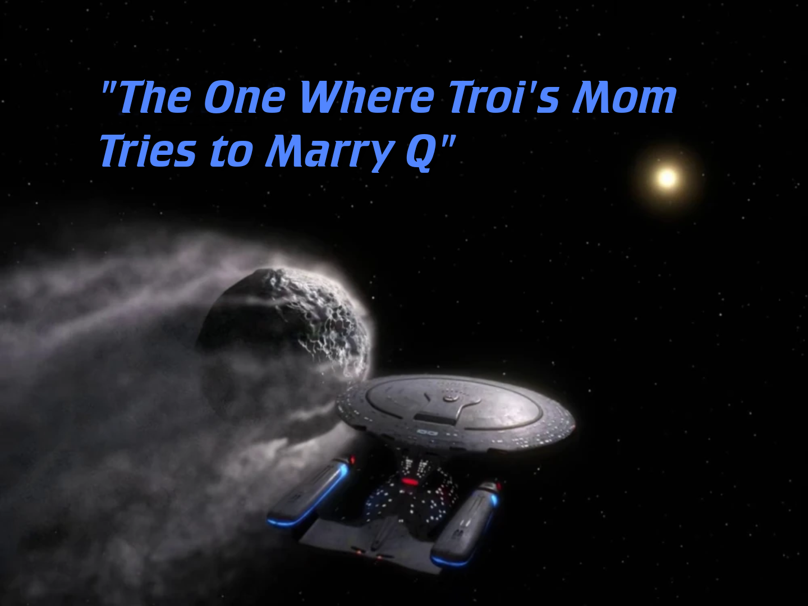
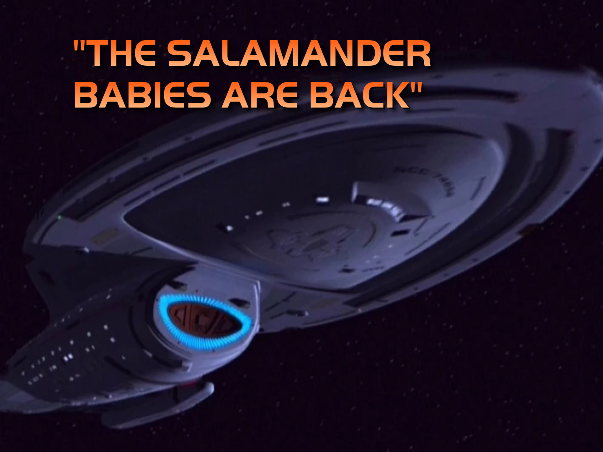
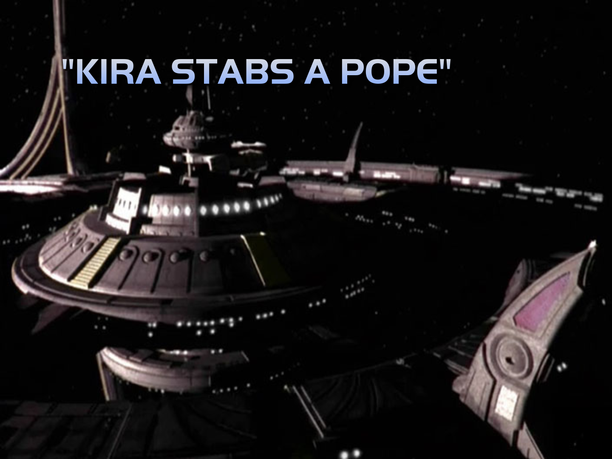
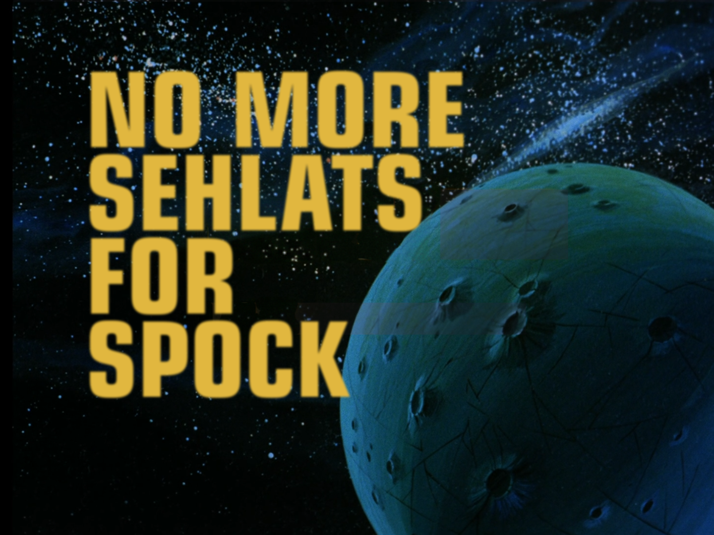
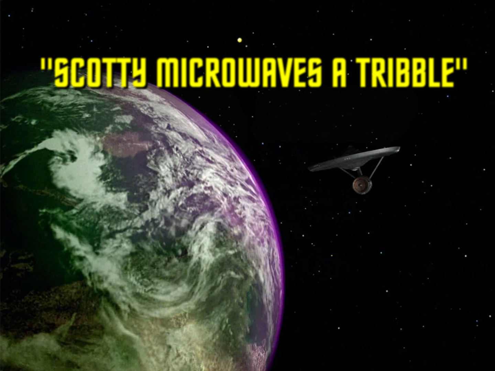
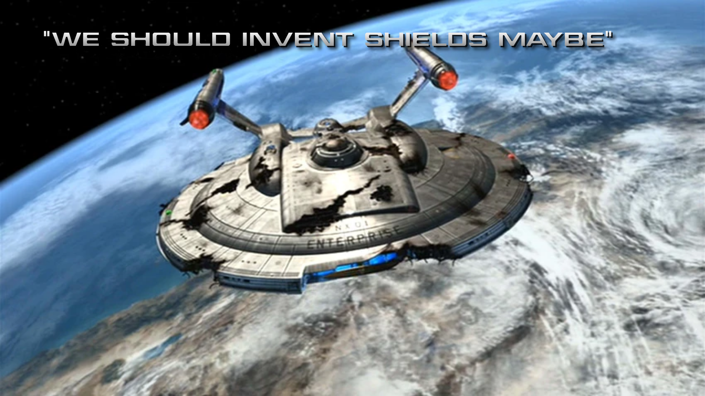

*TL;DR:* A week that felt like nothing but Star Trek shitposts. Underneath that: two videos about being a nervous introvert, a serious darkwave bender, and an unreasonable craving for a Junji Ito horror-manga cardigan. About on brand, honestly.

<!--more-->

<nav role="navigation" class="table-of-contents"></nav>

## A whole fake season of Star Trek

There's a little title-card generator going around, [trek.epicrandomness.com](https://trek.epicrandomness.com/), that stamps your own text onto a Star Trek episode title screen. Glyph [said](https://mastodon.social/@glyph/116627380777606520): "I feel there is a risk I might slightly overuse this thing." For a solid day, every third post in my timeline was someone discovering it and then immediately proving him right.

I proved him right too. I [opened with](https://masto.hackers.town/@lmorchard/116627455545890889) a cautious "Is this anything?" and then could not stop:

<image-gallery>

</image-gallery>

## Still chewing on the social thing

Last week I confessed I was more anxious about the *social* parts of getting a tattoo than the needle. My brain is evidently still gnawing on it, because the only two YouTube videos I bothered to like all week were How to ADHD's ["Social Events Don't Have to be SO Overwhelming!"](https://www.youtube.com/watch?v=2CCwm2WteZI) and a London Web Standards talk, ["The Art of Connection: How to Thrive at Work and Beyond as an Introvert."](https://www.youtube.com/watch?v=ZrgGPx2wt8M)

<youtube-embed video-id="2CCwm2WteZI" title="How to ADHD: Social Events Don't Have to be SO Overwhelming!"></youtube-embed>

<youtube-embed video-id="ZrgGPx2wt8M" title="The Art of Connection: How to Thrive at Work and Beyond as an Introvert."></youtube-embed>

## On heavy rotation

I was neck-deep in a darkwave/goth/synthpop hole this week: lots of [VNV Nation](https://open.spotify.com/artist/4KlYg0F5KG9QNDFKaeTNAy) (Construct apparently on a loop), [Sisters of Mercy](https://open.spotify.com/artist/4HxBVyHaUa60eCSsJWxwWR), [Clan of Xymox](https://open.spotify.com/artist/1wHmR7I0UlF58WFQexCPha), [TR/ST](https://open.spotify.com/artist/64NhyHqRKYhV0IZylrElWu), Siouxsie, and Killing Joke, with newer-to-me [ACTORS](https://open.spotify.com/artist/2Gs4t6zBT69DSluLvaEBWK) and Empathy Test in the mix. Ideal music for digging holes and fixing bugs.

Podcasts were the usual: [*Up First*](https://pocketcasts.com/podcast/up-first-from-npr/0d90e750-fab5-0134-ec6b-4114446340cb) and the NPR hourlies for the steady drip of news-dread, the Verge family ([*Vergecast*](https://www.theverge.com/the-vergecast), [*Decoder*](https://www.theverge.com/decoder-podcast-with-nilay-patel)) circling the post-search-Google / Jony-Ive-Ferrari cycle, and [*Daily Tech News Show*](https://dailytechnewsshow.com/). Palate cleansers from [*My Brother, My Brother and Me*](https://pocketcasts.com/podcast/my-brother-my-brother-and-me/d57114a0-1c5a-012e-0122-00163e1b201c), [*Lovett or Leave It*](https://pocketcasts.com/podcast/lovett-or-leave-it/dba7efa0-ecaf-0134-ec5e-4114446340cb), [*The Retro Hour*](https://pocketcasts.com/podcast/the-retro-hour-retro-gaming-podcast/66fce970-9a31-0133-2dbd-6dc413d6d41d), and a [*Eurovangelists*](https://pocketcasts.com/podcast/eurovangelists/2b9f7fc0-9142-013c-958d-0e76ec147af9) Eurovision 2026 recap.

I'm starting to think I should cut the news part out of my rotation entirely and just listen to the fun stuff.

## Miscellanea

* I learned [Steady Hands makes an Amigara Fault cardigan](https://masto.hackers.town/@lmorchard/116659980313011658) and immediately spiraled: "oof, I don't need this do I? (I kinda do, it's my cardigan!)" The replies were correct — [mhoye](https://cosocial.ca/@mhoye/116659985723951371): "This is my arm hole! It was made for me!"
* [How the Vectrex game console sunk a 124-year-old company](https://dfarq.homeip.net/how-the-vectrex-game-console-sunk-a-124-year-old-company/) — one bad bet at the worst possible moment took down the maker of Battleship.
* [golanlevin/p5-single-line-font-resources](https://github.com/golanlevin/p5-single-line-font-resources/) — an archive of monoline vector fonts plus p5.js to render them. Filed away for some future plotter/SVG tinkering.
* [No Juniors Today, No Seniors in 2031](https://www.fbritoferreira.com/blog/no-juniors-today-no-seniors-in-2031/) — the spoiler's in the post title. Cynically, I kind of hope that means my job security will last a few more years. But, ugh.
* [My favorite adversarial review prompt](https://blog.fsck.com/2026/05/01/adversarial-review/) — "Look at this again with fresh eyes." Apparently that one sentence does a startling amount of work.
* [Kentucky's Bourbon problem](https://a.wholelottanothing.org/kentuckys-bourbon-problem/) — the bourbon bubble has burst, leaving millions of barrels nobody wants. I wonder what will happen to the data centers?

