*TL;DR:* It's been about three weeks since the last weeknote, so this is a catchup. The short version: our newest cat tried to murder one of the other cats and broke my heart a little, a raccoon declared war on our backyard pond, I learned the hard way that ASA needs a brim, and I poured an absurd amount of agent-driven coding into a procedural cyberpunk hacking game called starnet. Also Technology Connections made an hour-long video about ceiling fans and I was *delighted.*

<!--more-->

<nav role="navigation" class="table-of-contents"></nav>

## The Minnaloushe situation

We [adopted Minnaloushe](/2026/04/17/w14-w15-w16/#the-void-arrives) a couple months back. We're his third home; he'd been bounced around a bit. He'd been settling in okay, a little hair-trigger about his boundaries but never aggressive.

Then, [out of nowhere](https://masto.hackers.town/@lmorchard/116698475697187954), he decided Cosmo needed his ass kicked. Claws out, blood drawn, stalking him through the house repeatedly over several days. Not play. I spent a genuinely awful few days [wondering](https://masto.hackers.town/@lmorchard/116698502272537443) if he needed to be a solo cat in a quieter home, and feeling terrible about the prospect of bouncing him to his *fourth* placement.

It didn't help that I'm running real low on tolerance for pet drama [right now](https://masto.hackers.town/@lmorchard/116705523193542623), after half a year of hospice for and then losing Catsby earlier this year.

We've thrown the whole kit at it: gabapentin, Feliway diffusers in half the rooms, and now Prozac. As of [this week](https://masto.hackers.town/@lmorchard/116769399737830089) he's living in my home office for a few weeks (cozy, doped, played-with, basically on a stability vacation), and the vet's optimistic that we just reintroduced him to the house too fast the first time:

<image-gallery>

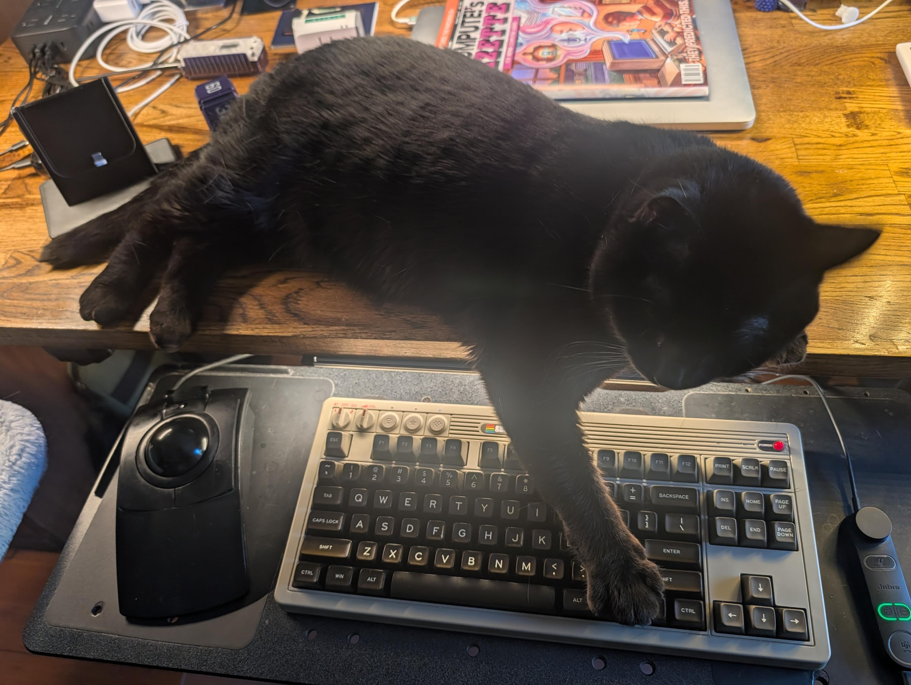

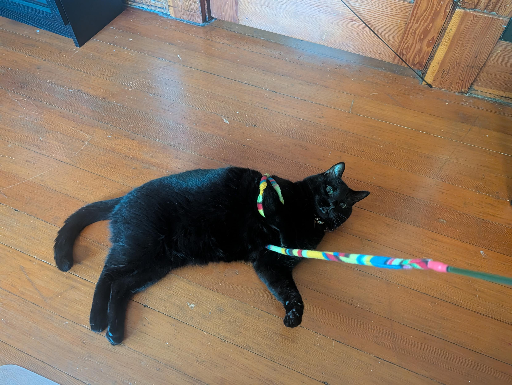

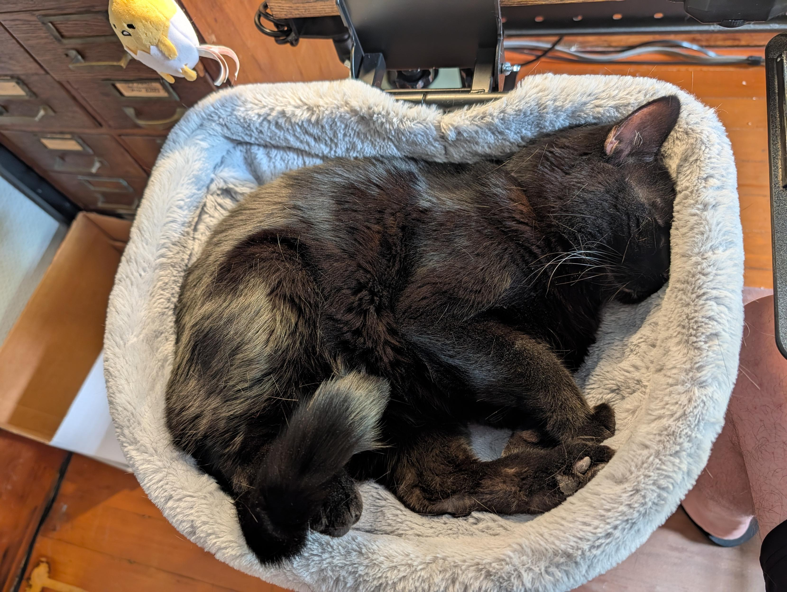

</image-gallery>

The bitter little irony, which I [told my wife](https://masto.hackers.town/@lmorchard/116769402935317140): after Catsby passed, I said I wanted another cat as anxious as me to be my buddy. Careful what you wish for.

When he's calm, Minnaloushe is a giant dopey teddy bear who flops directly into my lap and purrs, and I'm just trying to convince him that everybody here is cool to hang out with. Meanwhile Cosmo and Miss Biscuits are out there [holding paws](https://masto.hackers.town/@lmorchard/116773500563700215) on a towel like nothing happened.

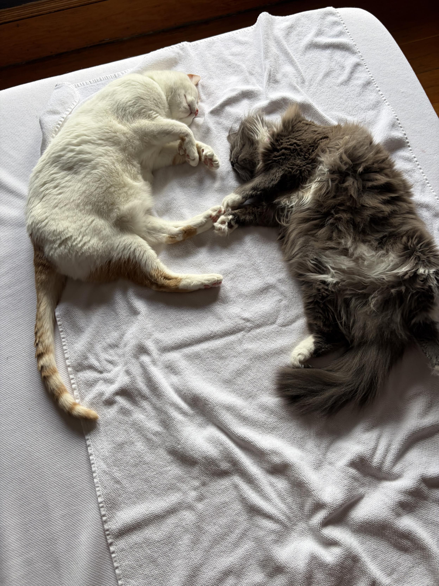

(Also: Chewy mailed us a card wishing [Cosmo a happy 9th birthday](https://masto.hackers.town/@lmorchard/116769457142539713) and I said "how very dare you?" That cat is still twelve weeks old, like the day we adopted him, and always will be.)

## The pond bandit and other animal friends

Lighter fare. We put some plants and a little fountain setup in the backyard pond, and woke up the next day to find it all shredded and the pump hoses yanked out of the water. So I put up a camera and [caught the culprit](https://masto.hackers.town/@lmorchard/116681414211130354): a raccoon. The pond bandit. 🦝

<figure>
  <video controls>
    <source src="./raccoon-pond-bandit.mp4" type="video/mp4" />
    <a href="./raccoon-pond-bandit.mp4">raccoon-pond-bandit.mp4</a>
  </video>
  <figcaption>The pond bandit, caught on camera making off with the waterworks.</figcaption>
</figure>

Part of me wants to be mad. Those plants weren't free, and it keeps pulling the cords up. But [it looks like they're having so much fun?](https://masto.hackers.town/@lmorchard/116681423589284116) The floating skimmer especially seems to be a favorite, which I figure must function as a little buffet bucket of tasty pond goodies. The bandit [came back for a full pond party](https://masto.hackers.town/@lmorchard/116754709306023033) a couple weeks later, so I think we live here now and they let us stay.

<figure>
  <video controls>
    <source src="./raccoon-pond-party.mp4" type="video/mp4" />
    <a href="./raccoon-pond-party.mp4">raccoon-pond-party.mp4</a>
  </video>
  <figcaption>Back for more. The pond party continues.</figcaption>
</figure>

The pond also kicked off one of my dumber 3D-printing schemes: I found [busts of Data and Picard](https://masto.hackers.town/@lmorchard/116677724657724581) and got it into my head to turn them into molds and cast concrete spitters for the pond. (I even liked a [whole tutorial](https://www.youtube.com/watch?v=tiydT2_OVLs) on making concrete statues from 3D prints, so it's basically inevitable now.)

In between all this I've been roasting coffee out on the deck and eating lunch out there, where, as the raccoon thread foreshadowed, I am [not always alone](https://masto.hackers.town/@lmorchard/116693687350671406):

<image-gallery>

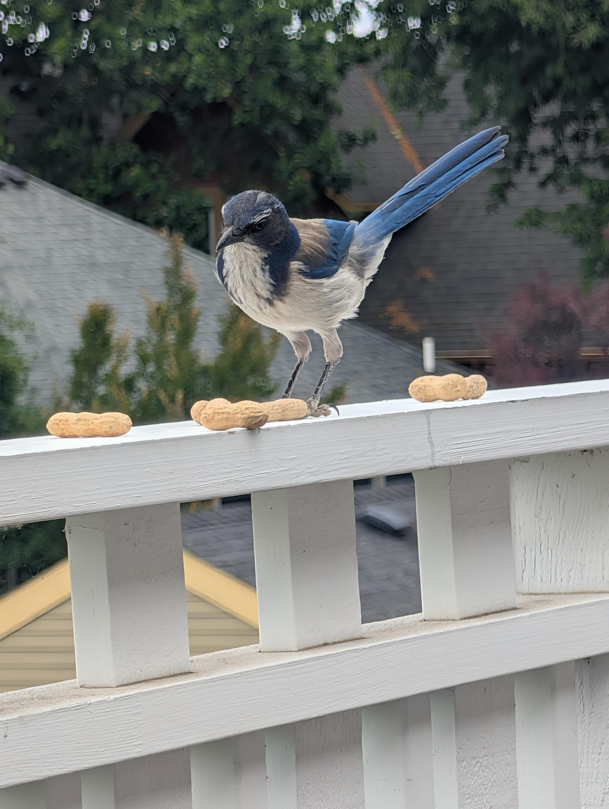

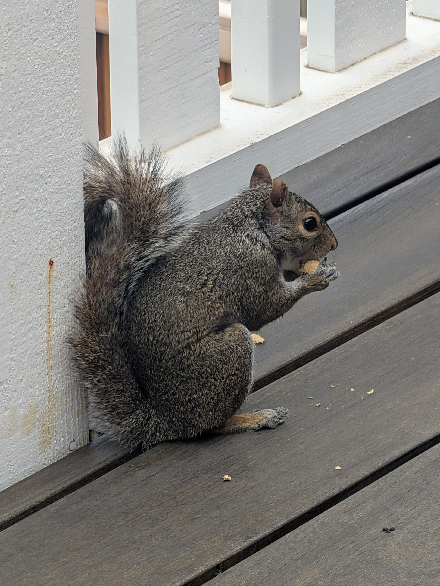

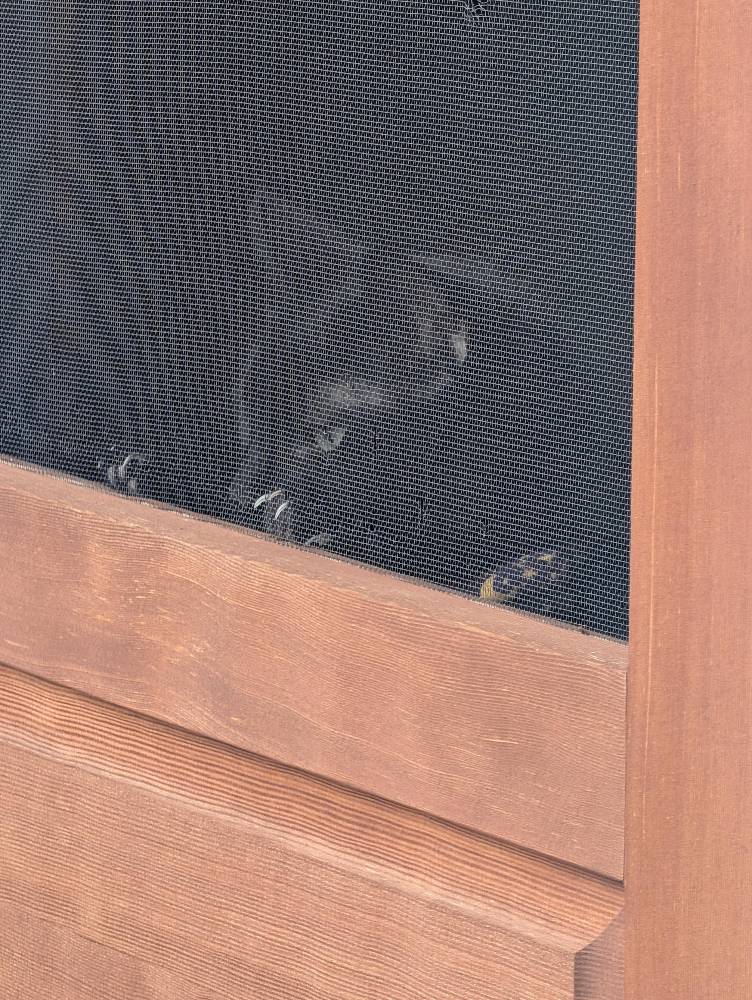

</image-gallery>

The scrub jay and the squirrel split the peanut concession; Minnaloushe supervised from behind the screen door, claws hooked in, deeply invested.

## A voyage of 3D printing discovery

The other maker thread was 3D printing, specifically my ongoing education in materials I don't understand yet.

I've got a Prusa MK4S with an MMU3, which apparently means [full-color CMYKW printing](https://masto.hackers.town/@lmorchard/116755323076189502) is coming via some ColorMix software updates. Ludicrously wasteful of filament (the waste tower can be [bigger than the print](https://fosstodon.org/@castaway/116762358607113287), I'm told), but for the occasional special little geegaw, nifty. And I do love a special little geegaw:

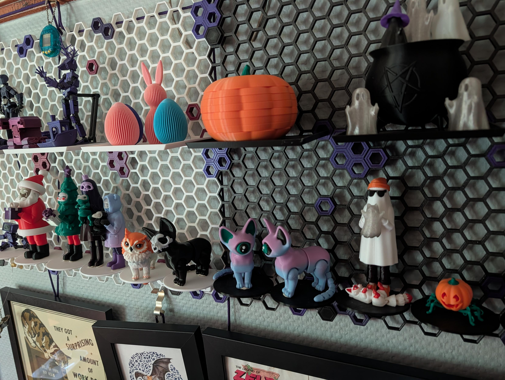

Then I built a BentoBox filter + enclosure so I could try ASA without stinking up the basement, and [yolo'd my first Benchy](https://masto.hackers.town/@lmorchard/116767890001274750) with no brim. Reader, you need a brim. [Third time, with a brim, was the charm](https://masto.hackers.town/@lmorchard/116768966221051320), though the last couple attempts have this odd little defect in the bow that the helpful folks on Mastodon tell me is a speed/cooling thing:

<image-gallery>

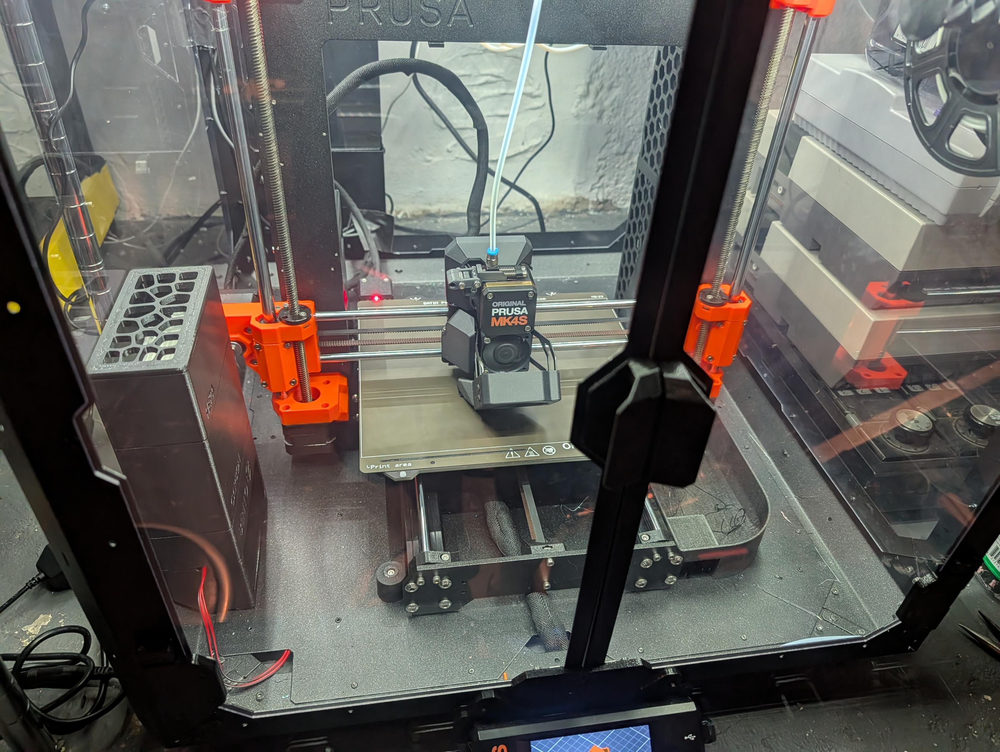

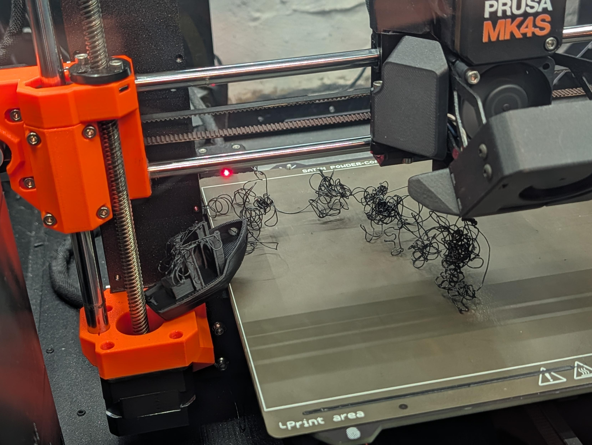

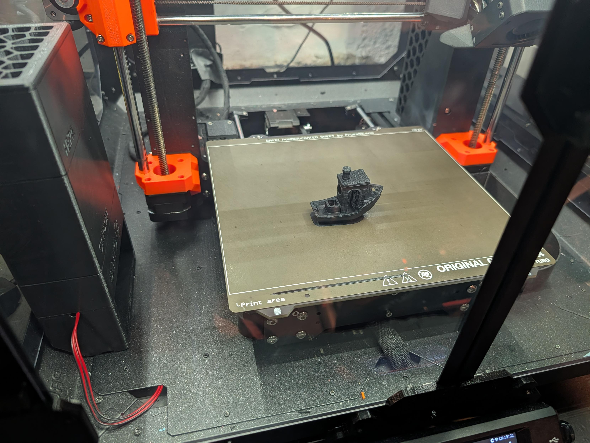

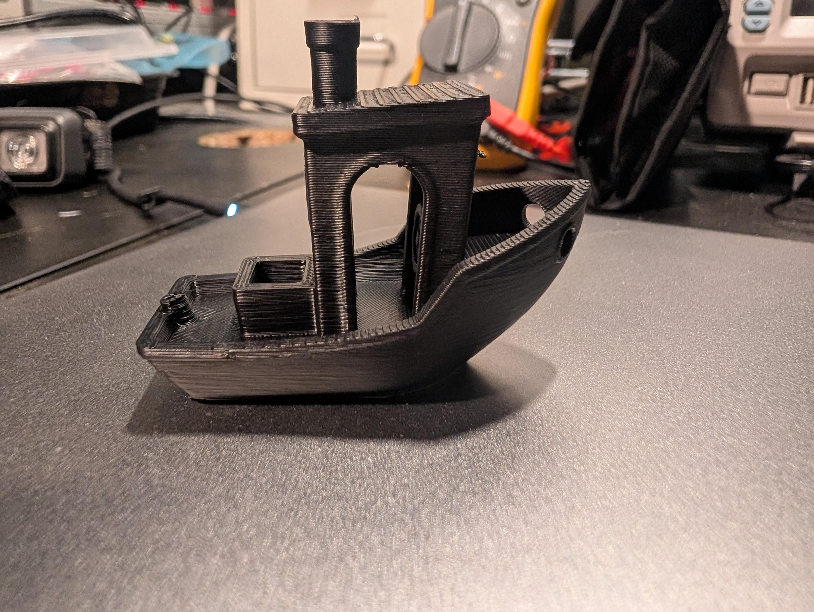

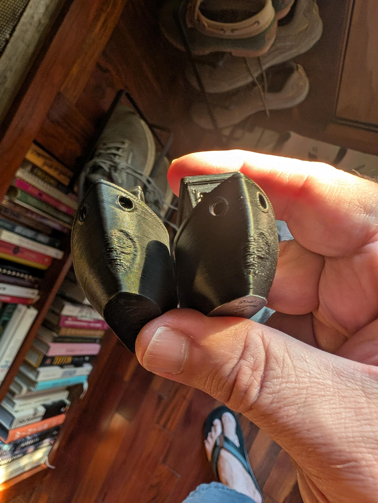

</image-gallery>

The filter, at least, did its job; I didn't smell a thing. The whiff of ASA I *did* catch reminded me powerfully of burning things I shouldn't have as a kid.

## starnet ate the month

If you went by my GitHub activity, you'd think I did exactly one thing for three weeks. You'd be mostly right. There's this project I started called [**starnet**](https://github.com/lmorchard/starnet). It aims to grow up to be a procedural, roguelike-ish cyberpunk hacking game, very much in the lineage of Uplink and every "jack into the mainframe" fantasy I absorbed as a kid.

If you want to poke at it, there's a very rough in-progress build:
- https://lmorchard.github.io/starnet/

And here's what it looks like as of this week:

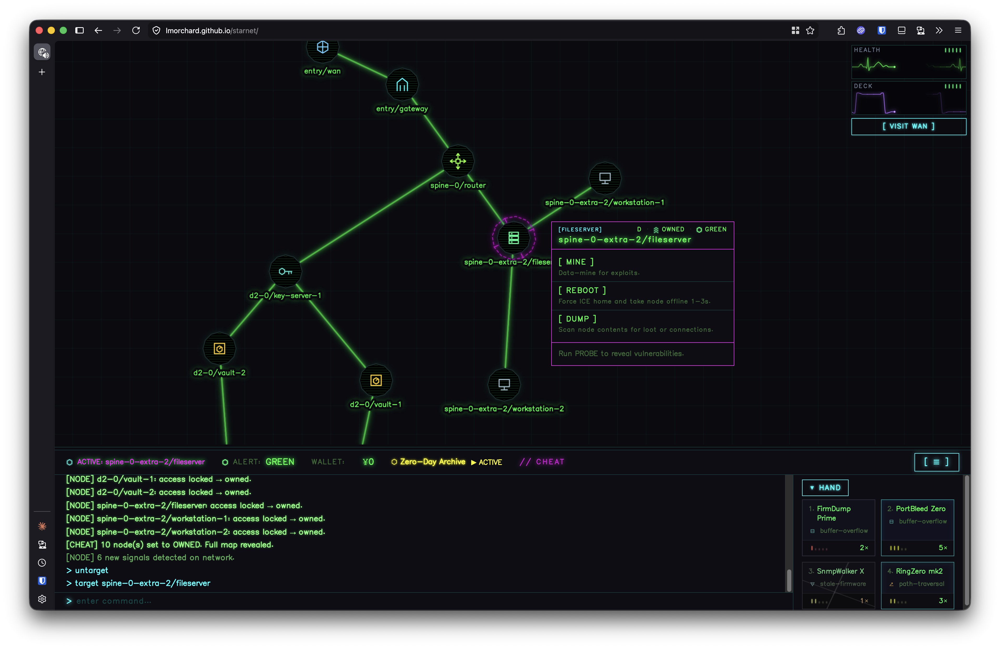

I won't enumerate the PR firehose (it's genuinely embarrassing; I think I closed something like a dozen issues and merged thirty-some branches), but the shape of it: I built an audio engine using [Tone.js](https://tonejs.github.io/) this stretch, starting with [reactive procedural music](https://github.com/lmorchard/starnet/pull/226), then [event SFX for game actions](https://github.com/lmorchard/starnet/issues/229).

A part that made me grin when I got it working: the game renders machine and connection health as little **ECG-style readouts**, blips and flatlines.

Which is funny, because earlier in this same stretch I fell down a [Zoids on the C64](https://masto.hackers.town/@lmorchard/116733332238921073) rabbit hole and the thing I kept marveling at was how that game rendered your mech's health as *EEG graphs with lubb-dubb sound effects.* Eleven-year-old me filed that away as The Coolest Possible Way To Show Damage and never let go.

The thing I keep circling, though: this is *all* agent-driven. I run a bank of agents in worktrees; they propose designs and give me knobs to tweak. I review, I merge, I queue the next thing. I've even been trying to act like a product manager with [a GitHub project board](https://github.com/users/lmorchard/projects/7/views/1) and everything.

<image-gallery>

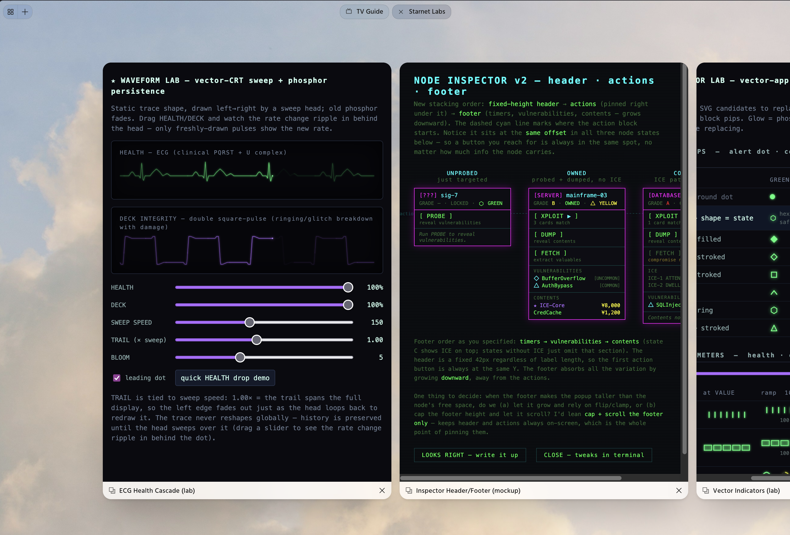

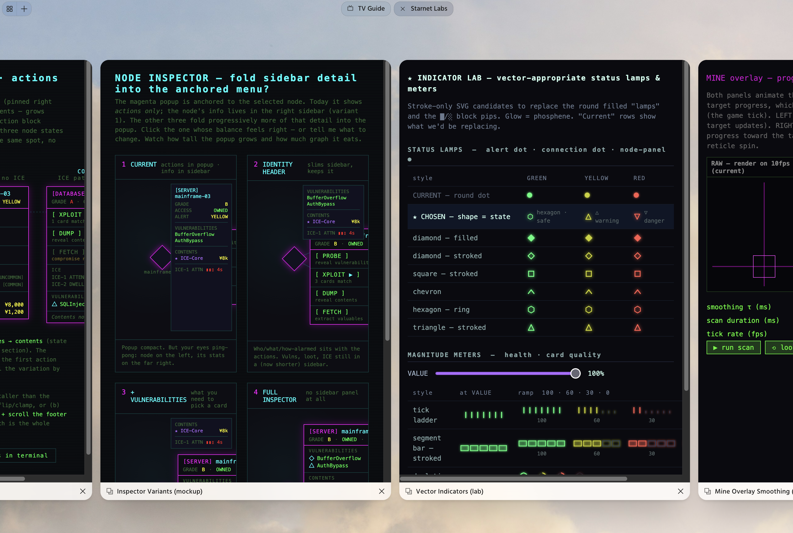

</image-gallery>

It moves fast, and I've spent the month bookmarking what feels like every essay being written about exactly that sensation: the "AI brain fry," the discipline problem, the thermonuclear ADHD amplifier. (Those are all down in Miscellanea, and I clearly have feelings.) I don't have a tidy conclusion. starnet is the most fun I've had building something in ages *and* I can feel the way it lets me skate along the surface of my own codebase. Both things are true. I'm sitting with it.

## Retro rabbit holes

I already confessed the Zoids thing up above, but it deserves its own beat.

<youtube-embed video-id="e1tjnD9Q8yA" thumbnail="8a57673ba258.jpg"></youtube-embed>

I genuinely cannot get over [how much that 1986 C64 game crammed in](https://masto.hackers.town/@lmorchard/116733345418451710): overworld navigation, railgun combat, missile guidance, shield and damage management, *a Fourier-synthesis minigame to jam enemy radio signals.* All in real time, all on a one-button Atari joystick, all while the rest of the hazards keep pummeling you. Eleven-year-old me was simply not the same afterward.

<image-gallery>

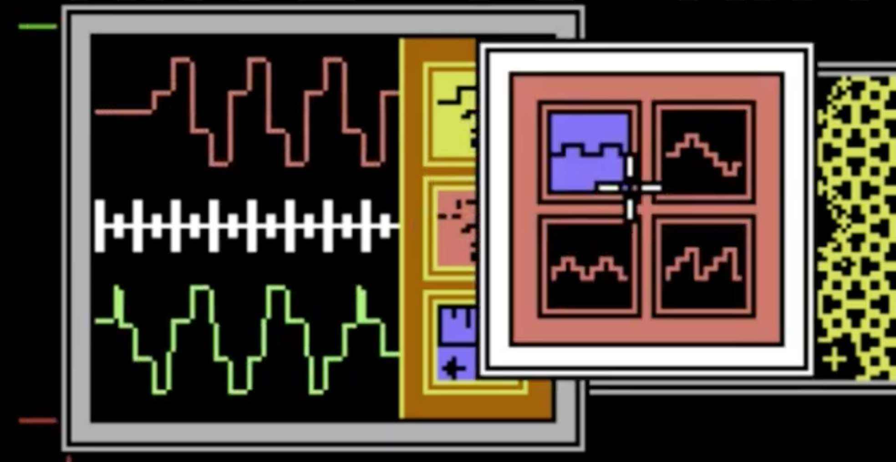

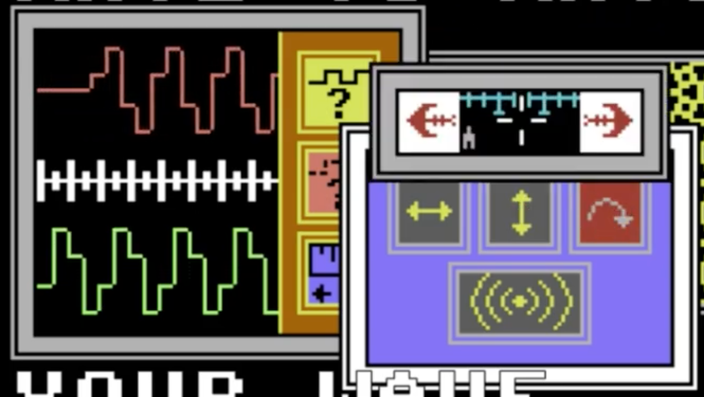

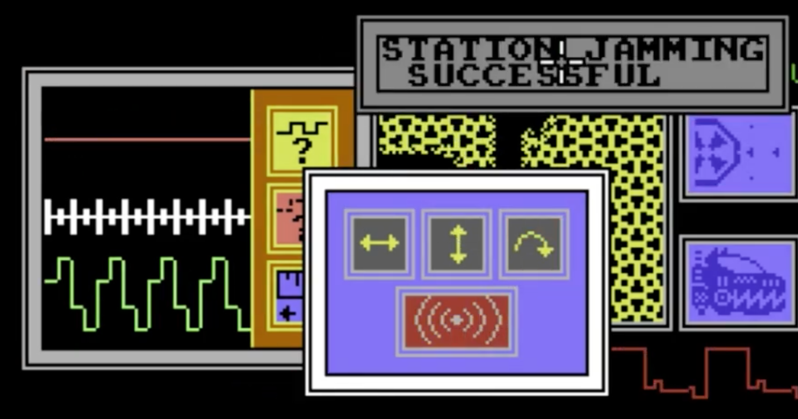

</image-gallery>

I also [finished Castlevania: Symphony of the Night again](https://masto.hackers.town/@lmorchard/116745400654839779) and had completely forgotten about the 90s adult-contemporary end-credits ballad, ["I Am the Wind."](https://castlevania.fandom.com/wiki/I_am_the_Wind) As Alucard would say: "What?!"

<youtube-embed video-id="ywAg5UJGvfs" thumbnail="a4238cd75836.jpg"></youtube-embed>

## Miscellanea

* The AI-coding-and-your-brain reading pile that I mentioned up top: Simon Willison on [cancelling his AI subscription](https://simonwillison.net/2026/May/31/the-solution-might-be-cancelling-my-ai-subscription/#atom-everything) ("the critical skill to develop here is discipline," bad news for both of us, Simon); the [original post](https://thoughts.hmmz.org/2026-05-31.html) that prompted it, calling the tech "a thermonuclear ADHD amplifier"; joe.dev on [the new 20% time](https://joe.dev/posts/new-20pct-time/) and "AI brain fry" (*"the thing that gives out is your own capacity to hold context and decide"*); and Ethan Mollick on [co-existence and the end of co-intelligence](https://www.oneusefulthing.org/p/co-existence-and-the-end-of-co-intelligence). For extra credit, a 2009 paper on [attention residue](https://ideas.repec.org/a/eee/jobhdp/v109y2009i2p168-181.html) when switching between tasks. I am, as they say, in this picture and I do not like it.
* On the funnier end of the same theme: [chipotlai-max](https://github.com/cyberpapiii/chipotlai-max), "the AI coding agent that runs on stolen Chipotle compute," and [performative-ui](https://vorpus.github.io/performativeUI/), AI-native React components that "signal how oversubscribed your funding round is."
* [Banned Book Library](https://www.richardosgood.com/posts/banned-book-library/): reprogram a cheap ESP32 WiFi lightbulb into a web server hosting banned books and screw it in wherever. A cyberpunk dead drop. "You can't stop the signal."
* [PaulaNET](https://github.com/RobSmithDev/PaulaNET): Amiga WiFi internet access *via the floppy drive port*, which is exactly the kind of beautiful nonsense I needed to see while eyeing my A1200.
* [LEGO Batman's Commodore 64 BASIC easter egg](https://waxy.org/2026/06/lego-batmans-commodore-64-basic-easter-egg/) (audio on), and [Catlantean 3D](https://staniks.github.io/articles/catlantean-3d-blog-1/), one person building a complete FPS "like it's 1993."
* Two single-line/vector font finds for future plotter tinkering: Jürg Lehni's [Hektor](https://juerglehni.com/works/hektor), a spray-can drawing machine, and [Hershey Noailles](https://hershey-noailles.luuse.io/www/), the classic Hershey vector fonts reworked as CSS strokes.
* [How building an HTML-first site doubled our users overnight](https://mohkohn.co.uk/writing/html-first/): "build a web application that works on a PlayStation Portable on a 3G connection." Yes. Pairs well with [Obs.js](https://csswizardry.com/Obs.js/demo/), which adapts delivery based on battery and connection signals.
* [Doctor When](https://orbitaloperations.beehiiv.com/p/doctor-when?utm_source=orbitaloperations.beehiiv.com): a melancholy take that old sci-fi IP (Who, Trek, Stargate, the MCU) is hitting a hiatus point, while the two biggest films of the month were made for under a million each by directors in their twenties.
* [Look, just fucking use Mastodon already](https://giants-club.net/articles/just-use-mastodon/): the escape-hatch argument for the fediverse, delivered with feeling.
* And the genuinely lovely thing of the month: [Technology Connections made a 71-minute video about ceiling fans](https://www.youtube.com/watch?v=_KWdCqpXB7A). My exact reaction was "okay everybody shut the fuck up, Technology Connections is on." There is, of course, a ceiling fan collector community.

<youtube-embed video-id="_KWdCqpXB7A" thumbnail="b37fb9aa18c6.jpg"></youtube-embed>

