*TL;DR:* I spent a good chunk of this week trying to drag a 14-year-old MacBook Pro into the present by way of every Linux distro that would boot, got a screen full of static for my trouble, and eventually clawed my way to a working Fedora install. Also: my Benchy finally floats, purple gaming gear keeps breeding on my desk, and I scheduled a memorial tattoo for Puck (lost in 2015).

<!--more-->

<nav role="navigation" class="table-of-contents"></nav>

## A masochist and his MacBook

The sudden ADHD-driven side-project of my week was a mid-2012 Retina MacBook Pro that macOS has long since [given up on](https://masto.hackers.town/@lmorchard/116796321955213327). Still in decent shape physically - although I *did* [print some new feet for it](https://www.printables.com/model/804933-macbook-pro-feet-a1398).

<image-gallery>

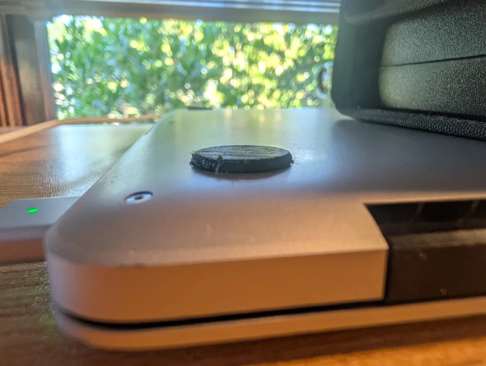

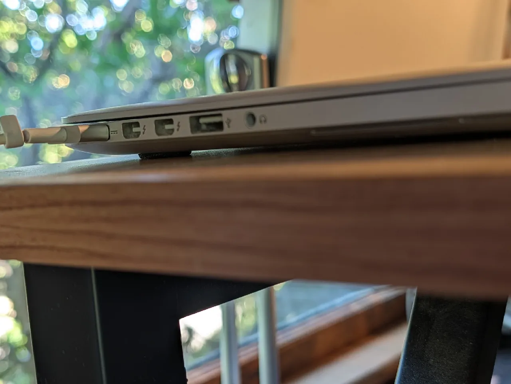

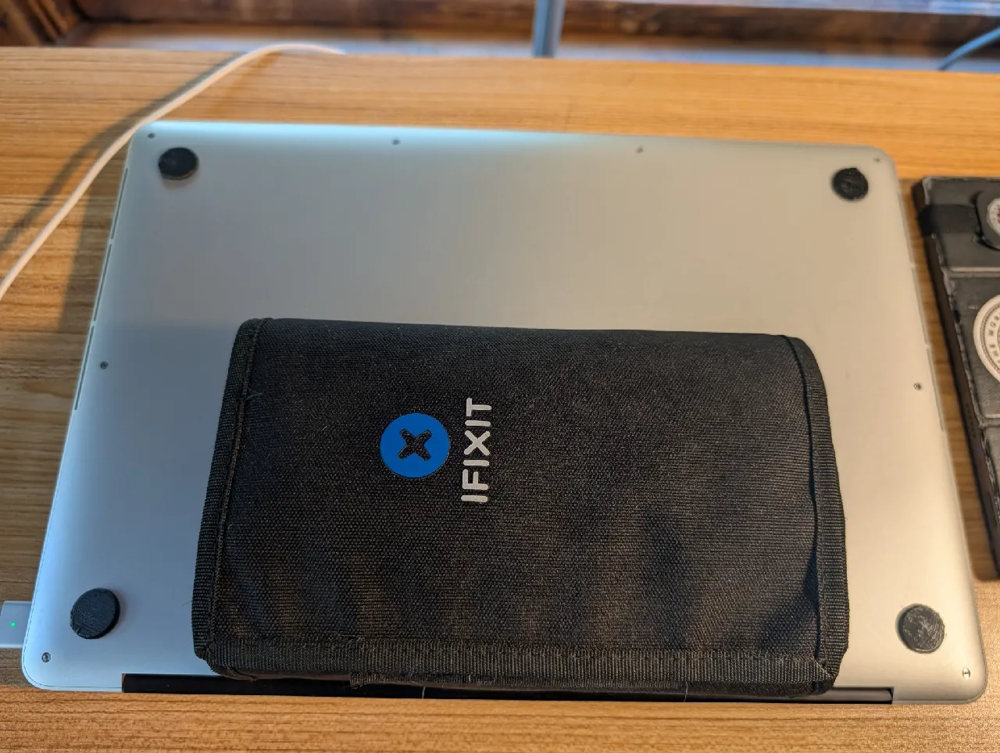

</image-gallery>

But, it's been abandoned by Apple for OS updates. I got it into my head that I could give it a few more years of life as a basement word processor or a tinkering terminal, and proceeded to spend the week learning exactly how stubborn that idea was.

The tour: the latest Ubuntu LTS installer gave me [nothing but a green screen](https://masto.hackers.town/@lmorchard/116790622035814330) (probably nvidia drivers). Linux Mint installed in safe mode, got me wifi and a touchpad, but never figured out suspend.

So I figured I'd back out and try a network reinstall of macOS instead, which is how I [ended up face to face with Mountain Lion](https://masto.hackers.town/@lmorchard/116790565742610954) again - which I guess was near enough to the original OS with which this thing shipped:

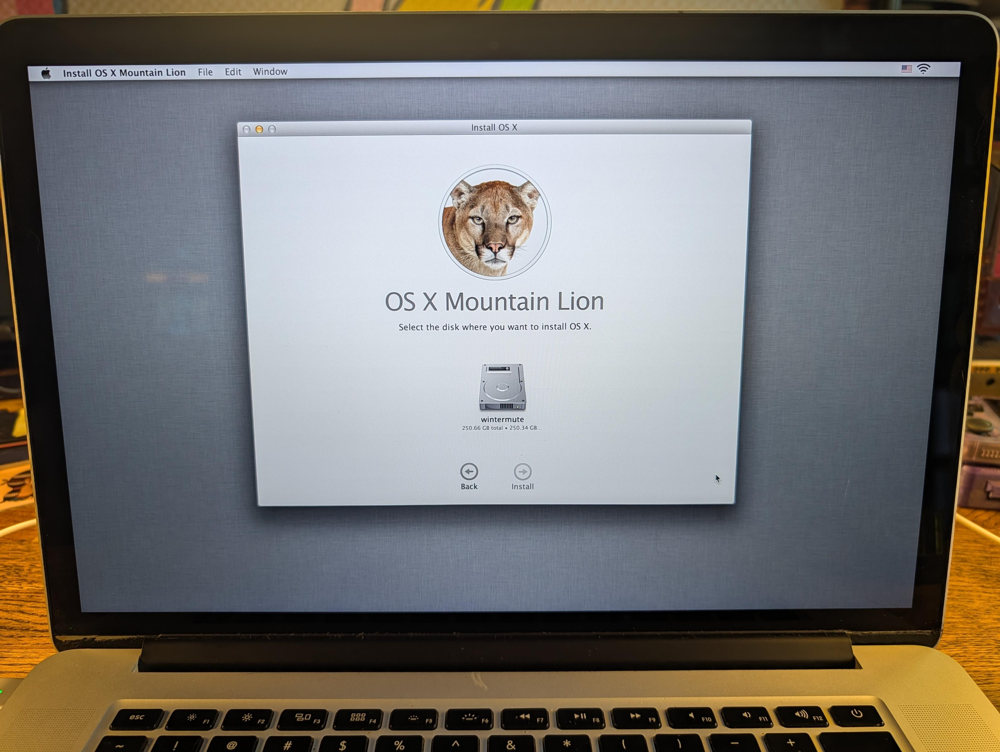

Which, of course, turned out to be [too old](https://masto.hackers.town/@lmorchard/116790662969313014). Too old for what? Yes.

Being a [masochist](https://masto.hackers.town/@lmorchard/116796157295712397), I clawed the thing up to Catalina. That's newish-enough to run the latest version of Firefox and many other apps - but things are moving on from that version of macOS.

So then I went for a Fedora KDE desktop dual-boot. The live ISO behaved better than Mint did, right up until the installer segfaulted on me.

Turns out it's [a known bug](https://bugzilla.redhat.com/show_bug.cgi?id=2411887): Fedora's new web-based installer (codenamed "slitherer") crashes on nvidia hardware, and the [workaround](https://discussion.fedoraproject.org/t/installer-crashes-in-storage-editor-in-all-live-environments-except-workstation/192590) is to point Anaconda at Firefox instead. After that, [cute dragons](https://masto.hackers.town/@lmorchard/116796172731330834):

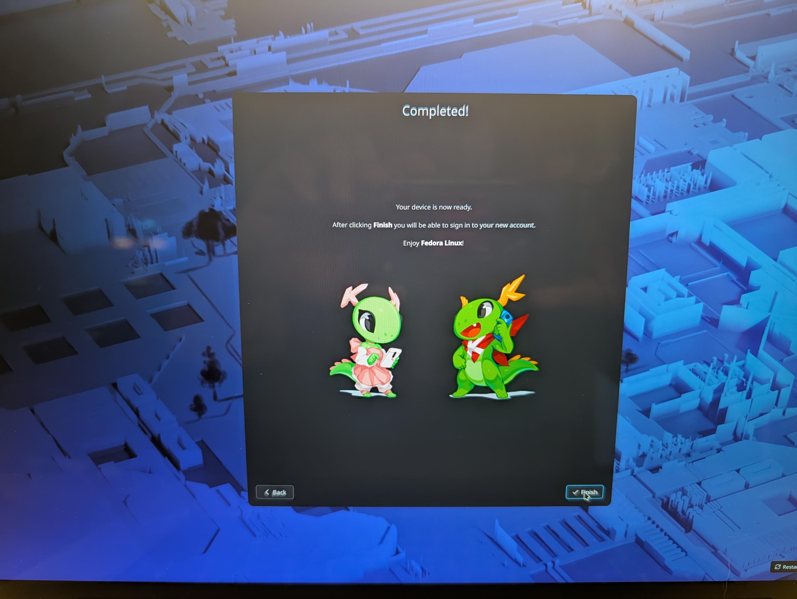

The other unsung hero was a [cheap USB Ethernet widget](https://masto.hackers.town/@lmorchard/116796233709650271), because it turns out every Linux distro on earth hates the wifi hardware in every Apple laptop:

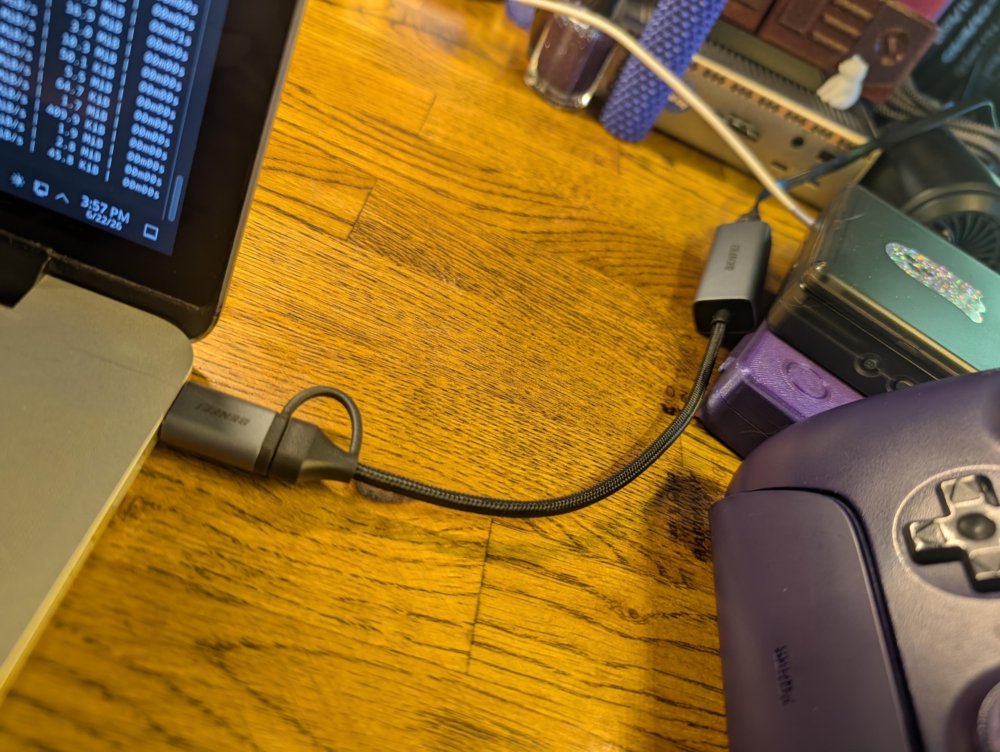

So where did I land, after all that? Tallying it up: Ubuntu didn't work at all, Mint *mostly* worked (wifi yes, suspend never), and [Fedora KDE worked](https://masto.hackers.town/@lmorchard/116796342079498672) including suspend but not wifi, until I activated some non-free repos to chase the wifi drivers, did a software upgrade, rebooted, and got this:

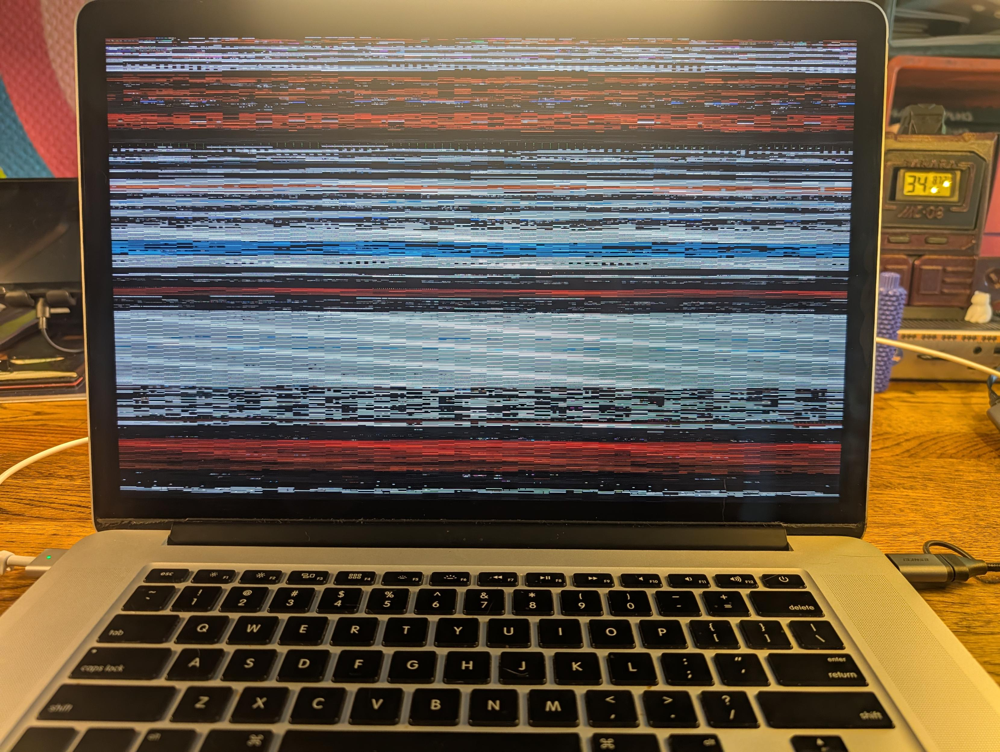

I suspect I [dragged in some bum nvidia drivers](https://masto.hackers.town/@lmorchard/116796330498710257) along with the wifi ones.

From here, I learned about `dnf history list` and `dnf history undo`, along with more carefully segmenting the list of needful updates. I kind of applied a `git bisect` algorithm to the whole thing, danced with `dnf update` and `dnf history undo` to pare down the updates repeatedly in a rough binary search until things stopped breaking.

Oddly enough, it wasn't nvidia drivers - it was something in KDE or Qt, which I've got version locked for now until I deign to wrestle with all this again.

Now I have a working Fedora install. The wifi works, after a struggle with the open-source driver causing display glitches under heavy network traffic. Suspend works. The trackpad works. The keyboard works. The screen works. Probably a few things left not working, but this seems good enough for now.

This can be a fine homelab terminal and word processor for a few more years, and I can stop trying to make it do more than it wants to. Oh, and I still have this older install of macOS Catalina on a separate partition, just in case.

## Boats that (sometimes) float

The [3D printing](https://masto.hackers.town/@lmorchard/116806580746594691) continues, and I have learned that a Benchy makes a deeply unconvincing boat. The standard one capsizes immediately. But I'm still learning this ASA stuff (continuing last week's adventures in materials I don't fully understand), and by the end of the week I'd printed [one that actually floats](https://masto.hackers.town/@lmorchard/116813343483915806), listing a bit to port, with a smokestack that got a little mangled in the print:

<image-gallery>

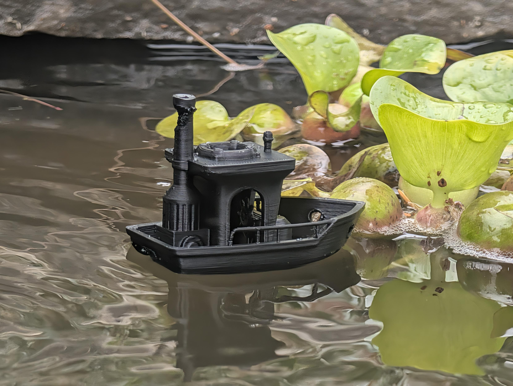

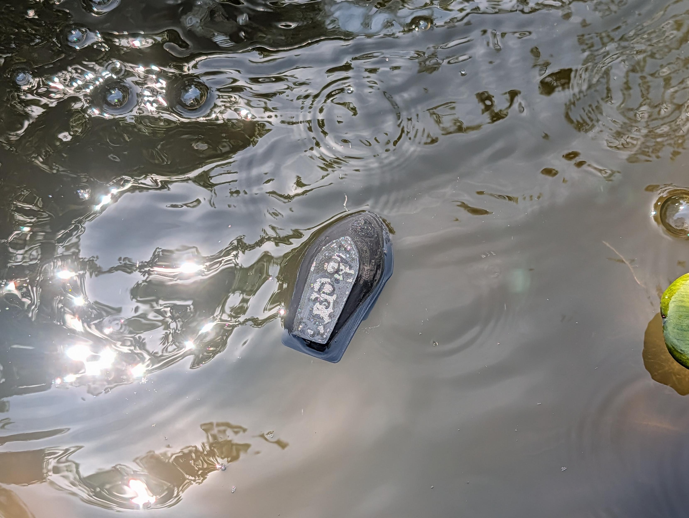

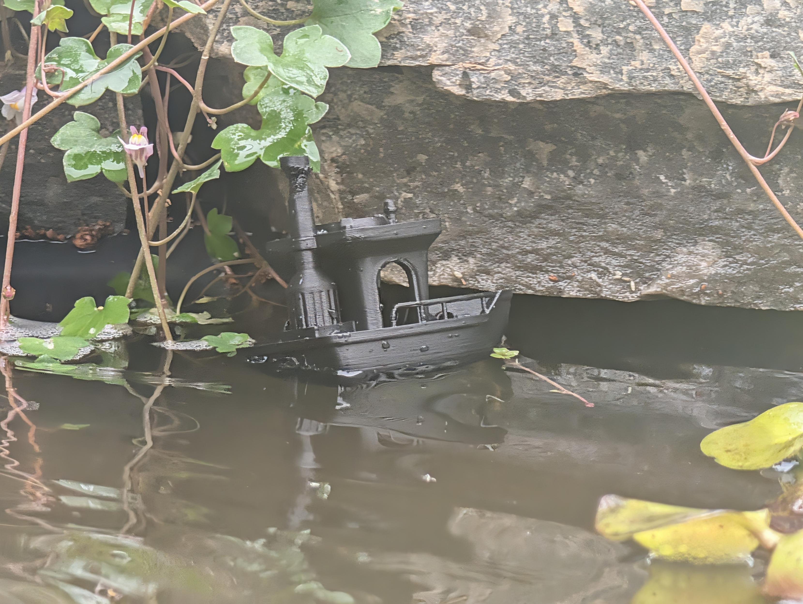

</image-gallery>

## Gaming gear that (always) breeds

Gaming gear is [accumulating on my desk](https://masto.hackers.town/@lmorchard/116812195025654947) again, apparently of its own accord, and apparently within [a fairly specific color range](https://masto.hackers.town/@lmorchard/116812353664926556):

<image-gallery>

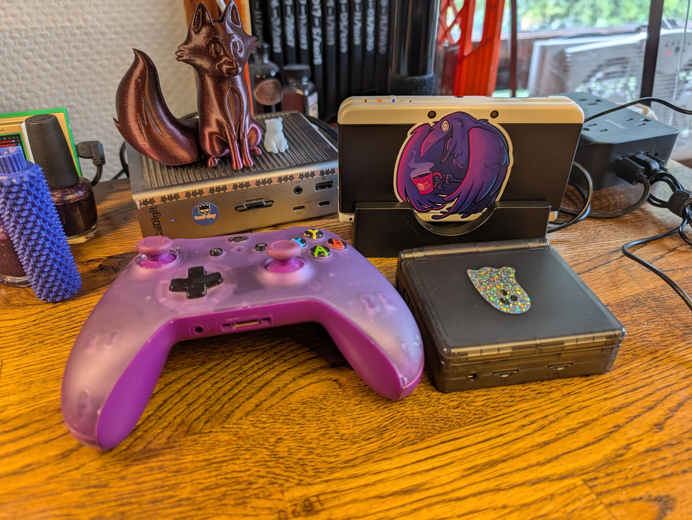

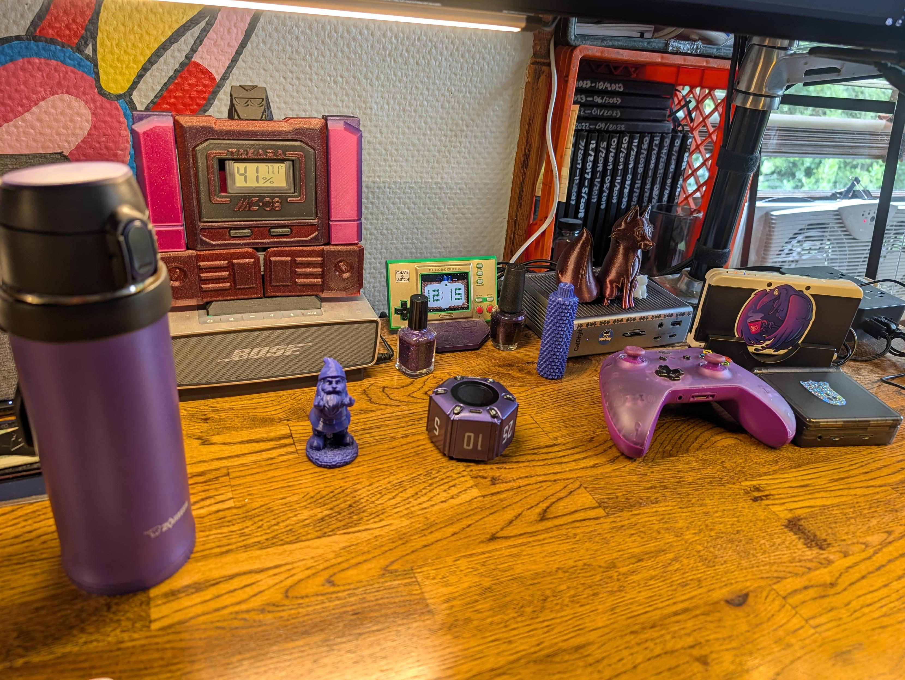

</image-gallery>

The culprit, I think, is that a [random brain ping](https://masto.hackers.town/@lmorchard/116791781636246649) from a YouTube video gave me a sudden hankering to play Devil's Crush for the TurboGrafx-16 on my little Anbernic. Which led to Pokémon Pinball on the GBA, which led to wanting Metroid Prime Pinball on the DS. I've never much cared for video-game pinball before, and I'm [genuinely terrible](https://masto.hackers.town/@lmorchard/116791785182491534) at the physical kind, but suddenly it has its hooks in me. Weird brain.

## A tattoo for Puck

I [scheduled my second tattoo](https://masto.hackers.town/@lmorchard/116789633870344909) this week, this one for Puck. [I lost him back in 2015](https://blog.lmorchard.com/2015/04/15/goodbye-puck/), and he was an unbelievably good pal.

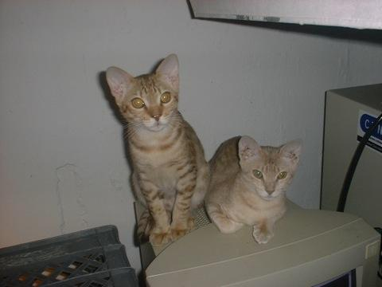

Puck and his sister Inanna were the [first cats I took care of](https://masto.hackers.town/@lmorchard/116789808337846838) as an adult. They'd both purr and start kneading the moment I walked into a room. Puck would jump straight from the floor up onto my shoulders and go to sleep there. Eleven years gone, but worth a permanent mark now that I've [broken the seal with Catsby](/2026/05/21/w18-w19-w20-w21/).

The current crew is doing fine, for the record. The trackball [remains undefeated](https://masto.hackers.town/@lmorchard/116796486680027860) as the superior pointing device for the discerning cat caretaker, mostly because it leaves a free hand for the cat asleep on your arm.

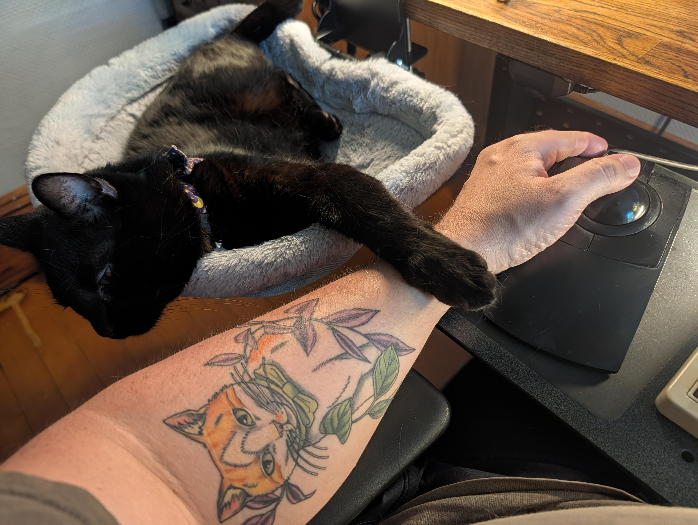

## Miscellanea

* On the YouTube side, my one like of the week was a retro-TV rabbit hole: [*That's Incredible! The Most Sadistic Show on TV (and We LOVED It)*](https://www.youtube.com/watch?v=153U7Kwl_cg), on the 1980s ABC phenomenon that paraded bizarre people and dangerous stunts across Monday nights.
  <youtube-embed video-id="153U7Kwl_cg" title="That's Incredible! The Most Sadistic Show on TV (and We LOVED It)" thumbnail="d55cf49ddf91.jpg"></youtube-embed>
* And a happy one for the podcast feed: [the STARLOG Podcast is back, with Annalee Newitz](https://pocketcasts.com/podcast/c32c37c0-5206-013f-1f83-0e98e27f20d9). Always glad when good things come back from the dead, which, given the rest of this week, is apparently the theme.
* [eipi.boo](https://www.pwnwriter.me/syndications/eipi-boo-ssh): an anonymous confession board that lives entirely in your terminal over SSH. The terminal-as-app aesthetic gets me every time.
* A small cluster of personal-website craft: [The Website Specification](https://specification.website/), a platform-agnostic checklist of the technical features every decent website should have (for humans *and* agents), and [JSON-LD Explained for Personal Websites](https://hawksley.dev/blog/json-ld-explained-for-personal-websites/) on adding structured data so crawlers understand your pages.
* On the blogging-mechanics front: [a blog written entirely by hand](https://handwritten.danieljanus.pl/), and a very practical [how-to on managing a Hugo site from an Android phone in 2026](https://foosel.net/til/how-to-manage-this-page-from-my-phone-in-2026/), which I keep meaning to sort out for myself.
* [prop-for-that](https://github.com/argyleink/prop-for-that): what JavaScript knows (pointer position, viewport size, battery, network), now exposed to CSS via custom properties, batched down to one `setProperty` per frame. Nifty.
* For the gamedev shelf: [Correlated randomness in Slay the Spire 2](https://tck.mn/blog/correlated-randomness-sts2/), a great deep-dive on how shared PRNG seeds leaked future-randomness info to crafty players, and [Rivalis](https://rivalis.dev/), an open-source real-time multiplayer framework for browser games.
* The Vergecast had me thinking about hardware this week, which lined up neatly with two bookmarks: [My Steam Machine is a 50ft HDMI Cable](https://blog.matthewbrunelle.com/my-steam-machine-is-a-50ft-hdmi-cable/) (couch gaming via a comically long cable plus Bazzite) and a [takedown of the current crop of tacky smart glasses](https://manualdousuario.net/en/smart-glasses-ugly-tacky/), which can't hide the chips and batteries yet so they all have those thick Larry-David's-dad rims.
* Handheld retro adjacency: [Starboard](https://get-starboard.app/) brings the Portmaster catalogue of community game ports to Android handhelds by running them in a real Linux environment under the hood.
* Two on the agentic-web-and-gadgets theme: Richard MacManus on [building "Ask Ricmac"](https://ricmac.org/2026/03/06/building-ask-ricmac-my-first-experiment-in-the-agentic-web-stack/), an AI chatbot trained on his own years of writing, and [xteink-tamagotchi](https://github.com/maddiedreese/xteink-tamagotchi), which displays your AI assistant's activity on a portable e-ink screen like a little digital pet.
* Soundtrack for all of the above was the usual darkwave/synth rotation in heavy use: Clan of Xymox, VNV Nation, ACTORS, Kite, Ladytron, and TR/ST. And for some reason this week, I feel like throwing a bunch of video embeds in here, if only for me to listen to again.

  <youtube-embed video-id="e89waZJbuQ0" thumbnail="30b7881f1f0f.jpg"></youtube-embed>

  <youtube-embed video-id="72A9nFNhdOM" thumbnail="ee43ea11c657.jpg"></youtube-embed>

  <youtube-embed video-id="CuiKeaqERTU" thumbnail="18e43f5b3b6a.jpg"></youtube-embed>

  <youtube-embed video-id="mbmZ5XEHkHA" thumbnail="a07031c0f7ac.jpg"></youtube-embed>

  <youtube-embed video-id="ZmIRYHoj6So" thumbnail="182e3faa91b2.jpg"></youtube-embed>

  <youtube-embed video-id="gtqvXw7vFO0" thumbnail="0a3eb759d3e4.jpg"></youtube-embed>

Somehow this is Week 26, which means we're halfway through 2026 already. I refuse to discuss it further.
