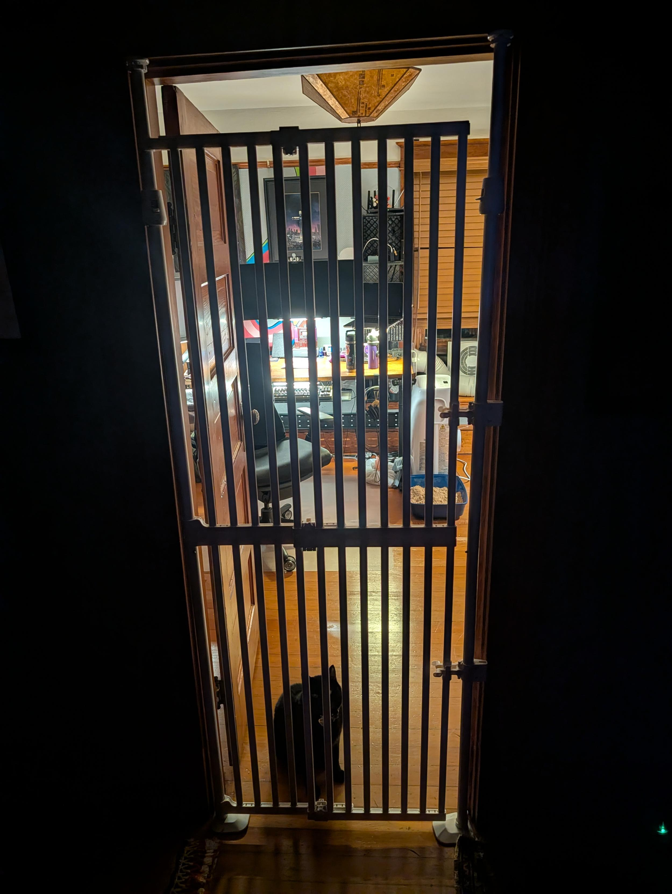
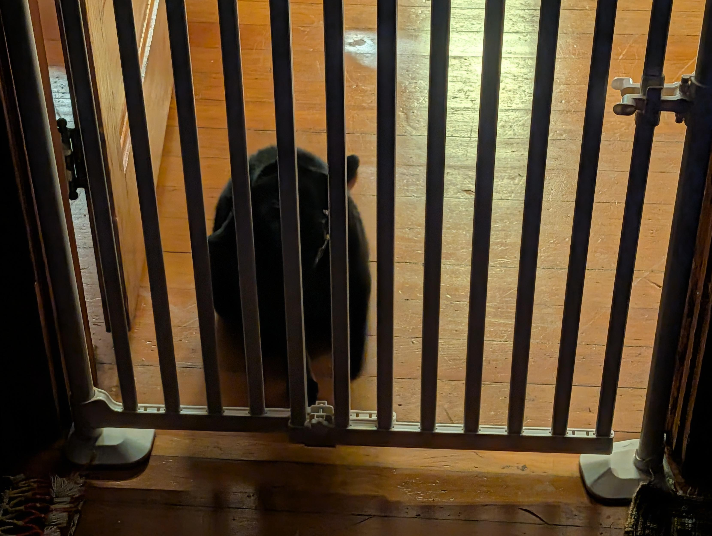
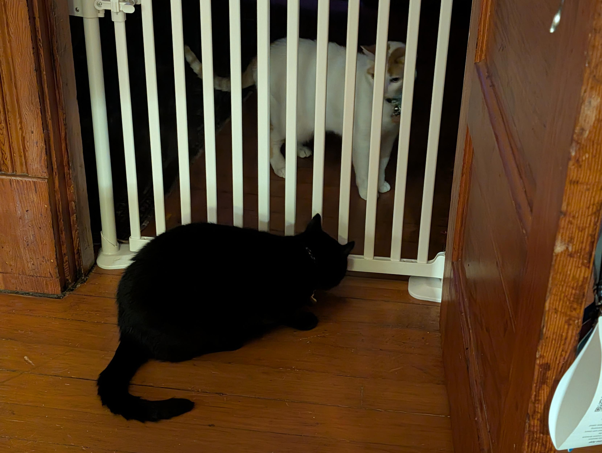
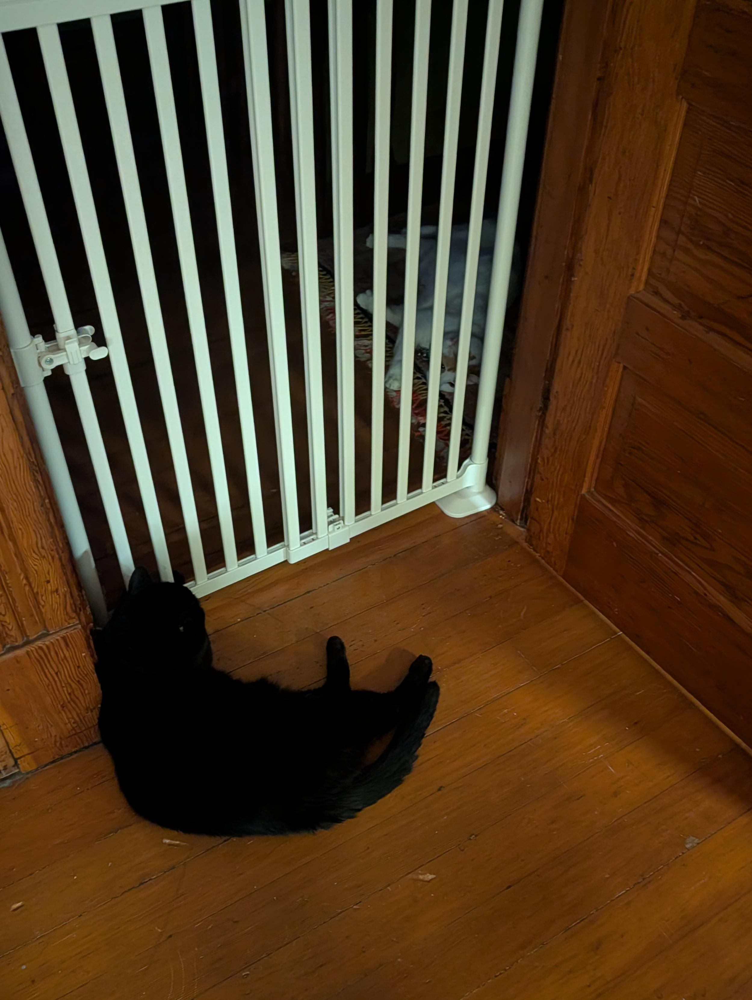
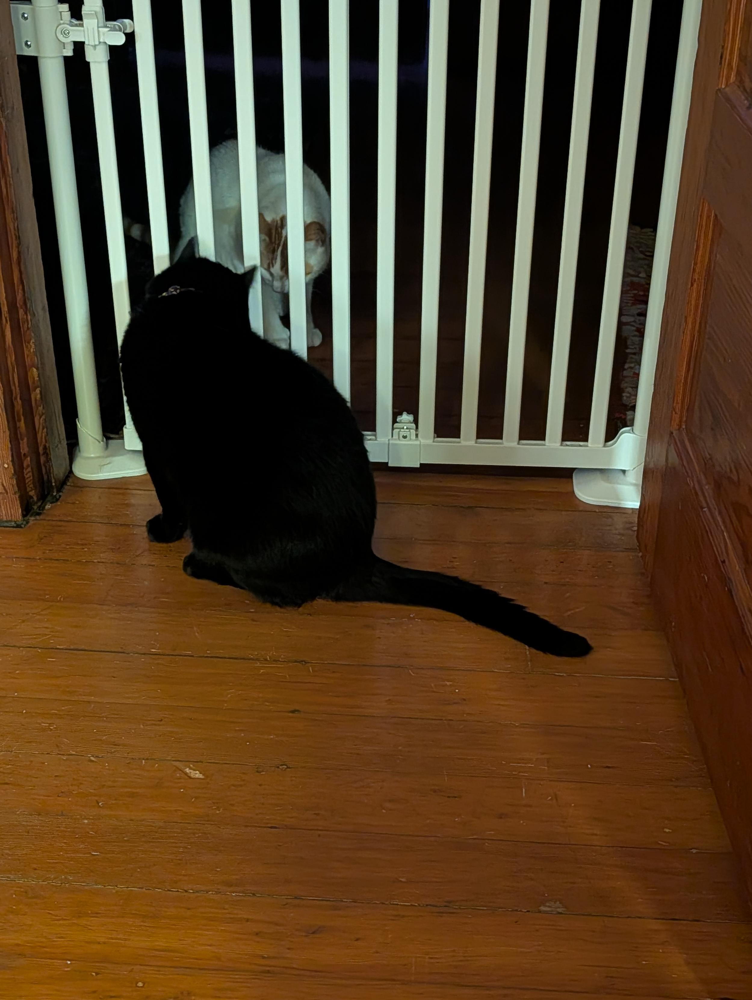
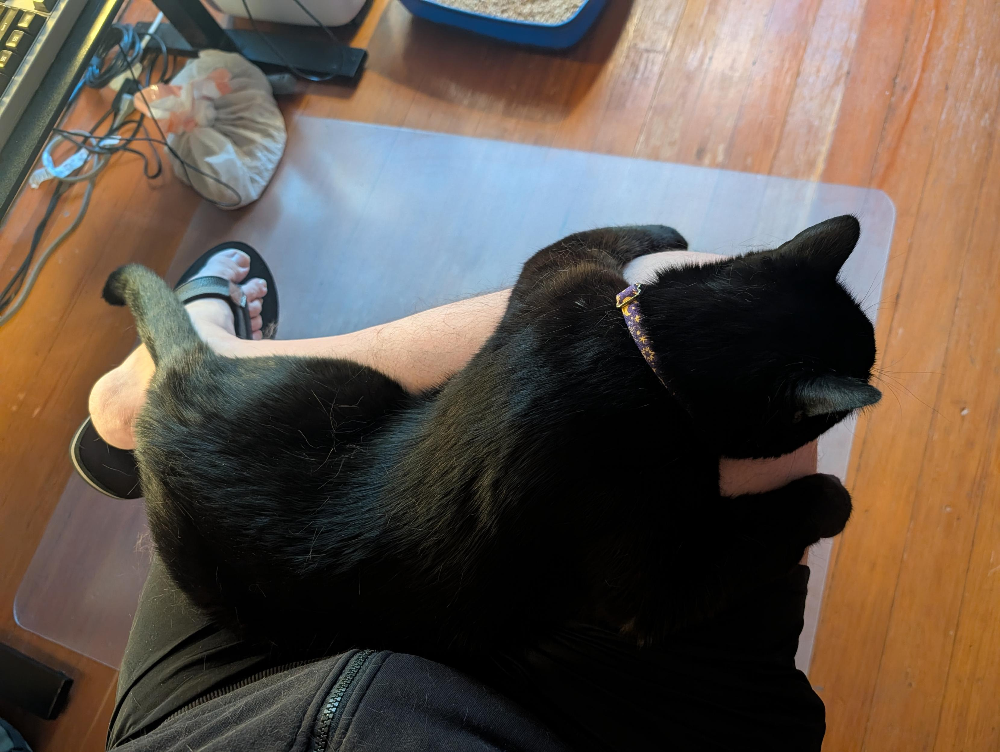
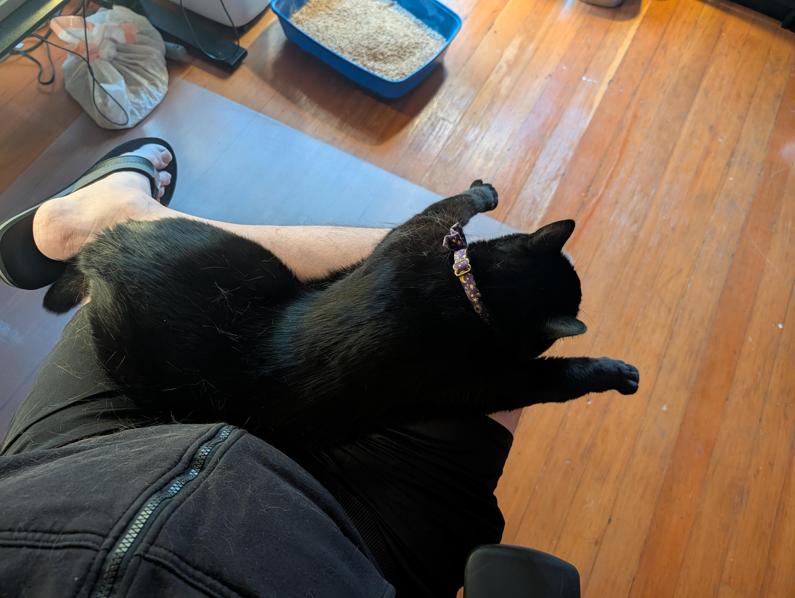
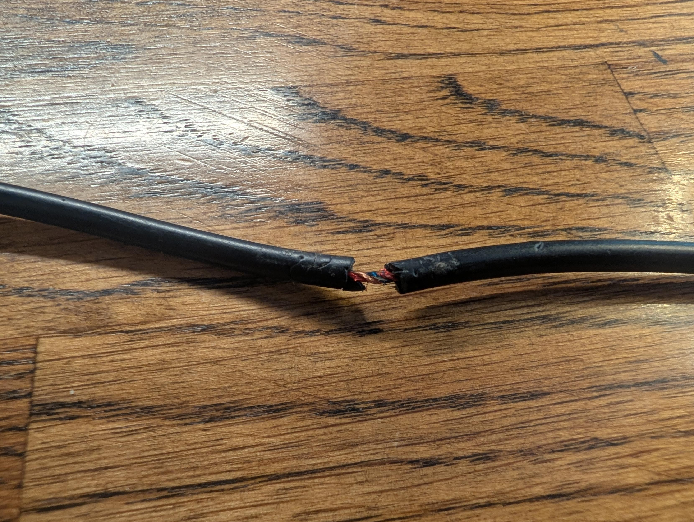
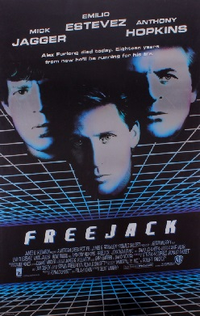
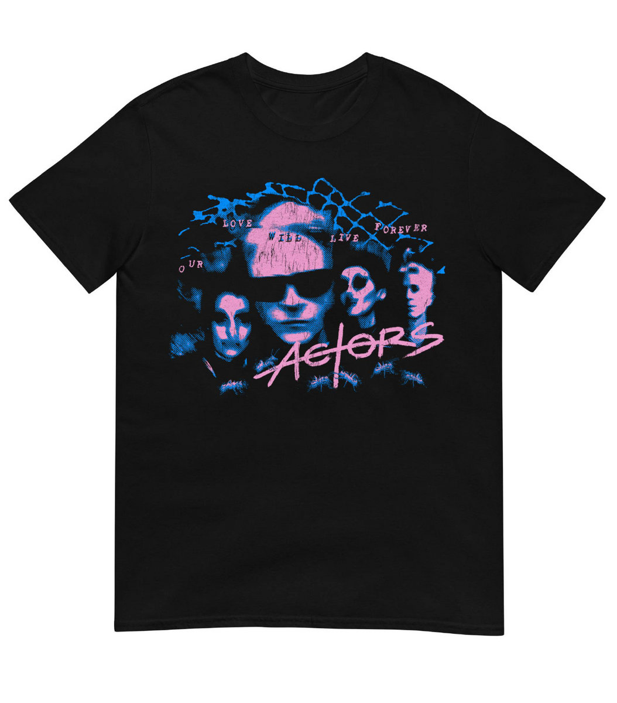

TL;DR: This week saw Minnaloushe's 'cat jail' reintroduction process, deep dives into live-coding music with strudel.cc (including a cover!), and a major overhaul of the `starnet` project's audio engine and core mechanics. Plus, reflections on the web's evolution, LLMs, and other miscellanea.

<!--more-->

<nav role="navigation" class="table-of-contents"></nav>

## Minnaloushe in cat jail

Minnaloushe has been in [cat jail](https://masto.hackers.town/@lmorchard/116846831115580133) - i.e. behind a tall pet gate, confined to my office. We're hoping to reboot the introduction process that resulted in ass-kicking and bloodletting almost a month ago. It's been [surprisingly calm](https://masto.hackers.town/@lmorchard/116854461930439847) so far, with Cosmo still showing a desire to be friends. We're hoping the gate is tall enough to prevent any escapes, even from a [big cat](https://masto.hackers.town/@lmorchard/116854518471453483) like Minnaloushe.

<image-gallery>

\

</image-gallery>

## Live-Coding Music with Strudel.cc

I've been really digging into [strudel.cc](https://strudel.cc/), a live-coding music environment, finding it clicks with my brain in a way old-school trackers used to. 

I spent some time [throwing together a cover](https://masto.hackers.town/@lmorchard/116845715446881682) of the intro to "Stripdown" by Agent Side Grinder, which has been stuck in my head for weeks. You can check out my [strudel.cc link](https://strudel.cc/#Ly8gUHJlYmFrZSBzY3JpcHQKLy8KLy8gVGhpcyBpcyBjb2RlIHRoYXQgaXMgbG9hZGVkIGJlZm9yZSB5b3VyIHBhdHRlcm4gaXMgcnVuLgovLyBZb3UgY2FuIHVzZSBpdCB0byBkZWZpbmUgY3VzdG9tIGZ1bmN0aW9ucyB0byB1c2UgaW4gYW55IHBhdHRlcm4uCi8vIAovLyBUaGlzIGlzIGFuIGluaXRpYWwgZXhhbXBsZSBzY3JpcHQuIFlvdSBjYW4gZWRpdCBpdCB0byBhZGQgCi8vIHlvdXIgb3duIGZ1bnRpb25zLgovLwovLyBUbyB1c2UgYSBzY3JpcHQgc2hhcmVkIGJ5IHNvbWUgb3RoZXIgdXNlciB5b3UgY2FuIHVzZQovLyB0aGUgaW1wb3J0LWJ1dHRvbiBvciBwYXN0ZSB0aGUgc2NyaXB0IGluIHRoaXMgZWRpdG9yLgoKY29uc3QgcmF0Y2hldCA9IHJlZ2lzdGVyKCdyYXRjaGV0JywgKHBhdCkgPT4gcGF0LnNvbWV0aW1lcyhwbHkoMikpKQoKLy8gU3Rhcm5ldCDigJQgc3RydWRlbC5jYyBQUkVCQUtFICAob25lLXBhc3RlIGF1dGhvcmluZyBibG9jaykKLy8gPT09PT09PT09PT09PT09PT09PT09PT09PT09PT09PT09PT09PT09PT09PT09PT09PT09PT09PT09PT09PT09PT09PT09PT09PT09PT09PT09PT09PQovLyBBVVRPLUdFTkVSQVRFRCBieSBgbWFrZSBnZW4tcHJlYmFrZWAgZnJvbSBhdWRpby1jb250ZW50L3NvdW5kZm9udHMvbWFuaWZlc3QuanMuCi8vIERvIG5vdCBlZGl0IGJ5IGhhbmQg4oCUIGVkaXQgdGhlIG1hbmlmZXN0IG9yIHNjcmlwdHMvZ2VuLXByZWJha2UuanMgaW5zdGVhZC4KLy8KLy8gUGFzdGUgdGhpcyBPTkNFIGludG8gc3RydWRlbC5jYyDihpIgU2V0dGluZ3Mg4oaSICJwcmViYWtlIiAodGhlIHNjcmlwdCB0aGF0IHJ1bnMgYmVmb3JlIGV2ZXJ5Ci8vIHNvbmcpLiBJdCBzZXRzIHVwIEJPVEggaGFsdmVzIG9mIHRoZSBnYW1lJ3Mgc291bmQgd29ybGQgc28gYSBTdGFybmV0IHNvbmcgY29waWVkIHN0cmFpZ2h0IG91dAovLyBvZiB0aGUgcmVwbyBwbGF5cyBVTkNIQU5HRUQgaW4gdGhlIGVkaXRvcjoKLy8KLy8gICAxLiBJbnN0cnVtZW50cyDigJQgdGhlIGdhbWUncyBzb3VuZGZvbnQgcHJlc2V0cyBwZXIgZm9udCAoZ3VzXyosIG1zZ18qLCDigKYpLgovLyAgICAgIEVhY2ggaXMgYSBESVNUSU5DVCBzZXQsIE5PVCBzdHJ1ZGVsJ3MgYnVpbHQtaW4gZ21fKjsgZG8gbm90IHN1YnN0aXR1dGUuCi8vICAgMi4gU2lnbmFscyDigJQgdGhlIGxpdmUgZ2FtZSB2YXJpYWJsZXMgYGdhbWVQcm9ncmVzc2AgLyBgZ2FtZVRocmVhdGAsIHN0dWJiZWQgaGVyZSBhcyBzbGlkZXJzCi8vICAgICAgeW91IGRyYWcgdG8gaGVhciBhIHNvbmcgcmVhY3QuCi8vCi8vIEluIHRoZSBnYW1lIHRoZXNlIHNhbWUgbmFtZXMgYXJlIHByb3ZpZGVkIGJ5IHRoZSBlbmdpbmUgKGpzL2F1ZGlvL3N0cnVkZWwvc291bmRmb250LmpzIHJlZ2lzdGVycwovLyB0aGUgaWRlbnRpY2FsIHByZXNldHM7IGpzL2F1ZGlvL3N0cnVkZWwvc2lnbmFsLWJyaWRnZS5qcyBpbmplY3RzIHRoZSBzYW1lIHNpZ25hbHMpLCBzbyBzb25nIGZpbGVzCi8vIGNhcnJ5IG5vIHNldHVwIG9mIHRoZWlyIG93biDigJQgdGhpcyBwcmViYWtlIGlzIHRoZSBlZGl0b3Itc2lkZSBtaXJyb3Igb2YgdGhhdCBjb250cmFjdC4KCi8vIOKUgOKUgCAwLiBGaXJlZm94IHNvdW5kZm9udC1yZWxlYXNlIGZpeCDilIDilIAKLy8gRmlyZWZveCBkb2VzIG5vdCBpbXBsZW1lbnQgQXVkaW9QYXJhbS5jYW5jZWxBbmRIb2xkQXRUaW1lLCB3aGljaCB0aGUgU0YyIHBsYXllciBjYWxscyBvbiBldmVyeQovLyBzb3VuZGZvbnQgbm90ZS1vZmYuIFdpdGhvdXQgaXQgbm90ZS1vZmZzIHRocm93IGluIEZpcmVmb3gg4oaSIHNvdW5kZm9udCB2b2ljZXMgbmV2ZXIgcmVsZWFzZSAobm90ZXMKLy8gcmluZyBmb3JldmVyLCB2b2ljZXMgcGlsZSB1cCkuIFBvbHlmaWxsIGl0IChob2xkLWN1cnJlbnQtdmFsdWUpIGJlZm9yZSBhbnl0aGluZyBwbGF5cy4gTm8tb3AgaW4KLy8gQ2hyb21lLCBhbmQgbm8tb3AgaW4gdGhlIGdhbWUgKHRoZSBlbmdpbmUncyBydW50aW1lIGluc3RhbGxzIHRoZSBzYW1lIHNoaW0pLiBNaXJyb3JzIHJ1bnRpbWUuanMuCmlmICh0eXBlb2YgQXVkaW9QYXJhbSAhPT0gJ3VuZGVmaW5lZCcgJiYgdHlwZW9mIEF1ZGlvUGFyYW0ucHJvdG90eXBlLmNhbmNlbEFuZEhvbGRBdFRpbWUgIT09ICdmdW5jdGlvbicpIHsKICBBdWRpb1BhcmFtLnByb3RvdHlwZS5jYW5jZWxBbmRIb2xkQXRUaW1lID0gZnVuY3Rpb24gKHQpIHsKICAgIGNvbnN0IGhlbGQgPSB0aGlzLnZhbHVlOwogICAgdHJ5IHsgdGhpcy5jYW5jZWxTY2hlZHVsZWRWYWx1ZXModCk7IH0gY2F0Y2ggKF8pIHsgLyogaWdub3JlICovIH0KICAgIHRyeSB7IHRoaXMuc2V0VmFsdWVBdFRpbWUoaGVsZCwgdCk7IH0gY2F0Y2ggKF8pIHsgLyogaWdub3JlICovIH0KICAgIHJldHVybiB0aGlzOwogIH07Cn0KCi8vIOKUgOKUgCAxLiBJbnN0cnVtZW50czogcmVnaXN0ZXIgZXZlcnkgZm9udCdzIHByZXNldHMgdW5kZXIgaXRzIHByZWZpeCDilIDilIAKLy8gTG9hZHMgZWFjaCBmdWxsIGF1dGhvcmluZyBTRjIgKENPUlMtZW5hYmxlZCBob3N0KSBzbyB0aGUgc291bmQgc2V0IGlzIGJ5dGUtaWRlbnRpY2FsIHRvIHdoYXQKLy8gY29tcG9zZXJzIHdvcmsgd2l0aC4gVGhlIG5hbWluZyAoc2FuaXRpemUgKyBkZWR1cCkgYW5kIHRoZSBub3RlIHRyaWdnZXIgTUlSUk9SCi8vIGpzL2F1ZGlvL3N0cnVkZWwvc291bmRmb250LmpzIGV4YWN0bHk7IGtlZXAgdGhlbSBpbiBzeW5jIGlmIHRoYXQgZmlsZSBjaGFuZ2VzLgovLyBgZm9udHM6IFtdYCBsZXRzIHN0cnVkZWwuY2MncyBzb3VuZGZvbnQgVUkgcmVuZGVyIHRoZSBlbnRyeSAoaXQgcmVhZHMgb3B0aW9ucy5mb250cy5sZW5ndGgpOwovLyBvdXIgdHJpZ2dlciBjbG9zZXMgb3ZlciBgcHJlc2V0YCwgc28gdGhlIGFycmF5IGl0c2VsZiBpcyB1bnVzZWQgZm9yIGF1ZGlvLgphc3luYyBmdW5jdGlvbiByZWdpc3RlclNvdW5kZm9udCh1cmwsIHByZWZpeCkgewogIGNvbnN0IHNmID0gYXdhaXQgbG9hZFNvdW5kZm9udCh1cmwpOwogIGNvbnN0IHVzZWQgPSBuZXcgU2V0KCk7CiAgc2YucHJlc2V0cy5mb3JFYWNoKChwcmVzZXQsIGkpID0%2BIHsKICAgIGNvbnN0IGNsZWFuZWQgPSBTdHJpbmcocHJlc2V0LmhlYWRlcj8ubmFtZSB8fCAnJykudG9Mb3dlckNhc2UoKS5yZXBsYWNlKC9bXmEtejAtOV0rL2csICdfJykucmVwbGFjZSgvXl8rfF8rJC9nLCAnJyk7CiAgICBsZXQgbmFtZSA9IHByZWZpeCArIChjbGVhbmVkIHx8ICdwcmVzZXRfJyArIGkpOwogICAgaWYgKHVzZWQuaGFzKG5hbWUpKSB7IGNvbnN0IGJhc2UgPSBuYW1lOyBsZXQgbiA9IDI7IHdoaWxlICh1c2VkLmhhcyhuYW1lKSkgbmFtZSA9IGJhc2UgKyAnXycgKyBuKys7IH0KICAgIHVzZWQuYWRkKG5hbWUpOwogICAgcmVnaXN0ZXJTb3VuZChuYW1lLCAodGltZSwgdmFsdWUpID0%2BIHsKICAgICAgLy8gUm91dGUgdGhlIHZvaWNlIGludG8gb3VyIG93biBnYWluIG5vZGUgYW5kIFJFVFVSTiBpdCBzbyBzdXBlcmRvdWdoIGFwcGxpZXMgaXRzIEZYIGNoYWluCiAgICAgIC8vIChnYWluL3Jvb20vbHBmL3Bhbi%2FigKYpIOKAlCBpdCBvbmx5IHdpcmVzIGVmZmVjdHMgb250byB0aGUgcmV0dXJuZWQgbm9kZSwgYW5kIGJhaWxzIG9uIG5vbmUuCiAgICAgIC8vIHNmdW1hdG8ncyBzdGFydFByZXNldE5vdGUgc2VsZi1jb25uZWN0cyB0byBjdHguZGVzdGluYXRpb24sIHNvIHByb3h5IHRoZSBjdHggdG8gcmVkaXJlY3QKICAgICAgLy8gLmRlc3RpbmF0aW9uIHRvIG91ciB0YXAgbm9kZTsgc3VwZXJkb3VnaCB0aGVuIGhhbmRsZXMgbm90ZS1vZmYgKHJhbXBzIG5vZGUuZ2FpbiwgY2FsbHMgc3RvcCkuCiAgICAgIGNvbnN0IGN0eCA9IGdldEF1ZGlvQ29udGV4dCgpOwogICAgICBjb25zdCBub3RlID0gdmFsdWU%2FLm5vdGUgPz8gJ2MzJzsKICAgICAgY29uc3QgbWlkaSA9IHR5cGVvZiBub3RlID09PSAnbnVtYmVyJyA%2FIG5vdGUgOiBub3RlVG9NaWRpKG5vdGUpOwogICAgICBjb25zdCBvdXQgPSBjdHguY3JlYXRlR2FpbigpOwogICAgICBjb25zdCBwcm94aWVkID0gbmV3IFByb3h5KGN0eCwgewogICAgICAgIGdldCh0YXJnZXQsIHByb3ApIHsKICAgICAgICAgIGlmIChwcm9wID09PSAnZGVzdGluYXRpb24nKSByZXR1cm4gb3V0OwogICAgICAgICAgY29uc3QgdiA9IHRhcmdldFtwcm9wXTsKICAgICAgICAgIHJldHVybiB0eXBlb2YgdiA9PT0gJ2Z1bmN0aW9uJyA%2FIHYuYmluZCh0YXJnZXQpIDogdjsKICAgICAgICB9LAogICAgICB9KTsKICAgICAgY29uc3Qgc3RvcCA9IHN0YXJ0UHJlc2V0Tm90ZShwcm94aWVkLCBwcmVzZXQsIG1pZGksIHRpbWUpOwogICAgICByZXR1cm4geyBub2RlOiBvdXQsIHN0b3AgfTsKICAgIH0sIHsgdHlwZTogJ3NvdW5kZm9udCcsIHByZWJha2U6IGZhbHNlLCBmb250czogW10gfSk7CiAgfSk7Cn0KCmF3YWl0IFByb21pc2UuYWxsKFsKICByZWdpc3RlclNvdW5kZm9udCgnaHR0cHM6Ly9yYXcuZ2l0aHVidXNlcmNvbnRlbnQuY29tL2xtb3JjaGFyZC9zdGFybmV0L21haW4vYXVkaW8tY29udGVudC9zb3VuZGZvbnRzL0dlbmVyYWxVc2VyLUdTLnNmMicsICdndXNfJyksIC8vIGd1cwogIHJlZ2lzdGVyU291bmRmb250KCdodHRwczovL3Jhdy5naXRodWJ1c2VyY29udGVudC5jb20vbG1vcmNoYXJkL3N0YXJuZXQvbWFpbi9hdWRpby1jb250ZW50L3NvdW5kZm9udHMvTXVzZVNjb3JlLVBhZC5zZjInLCAnbXNncGFkXycpLCAvLyBtc2dwYWQKICByZWdpc3RlclNvdW5kZm9udCgnaHR0cHM6Ly9yYXcuZ2l0aHVidXNlcmNvbnRlbnQuY29tL2xtb3JjaGFyZC9zdGFybmV0L21haW4vYXVkaW8tY29udGVudC9zb3VuZGZvbnRzL011c2VTY29yZS1MZWFkLnNmMicsICdtc2dsZWFkXycpLCAvLyBtc2dsZWFkCiAgcmVnaXN0ZXJTb3VuZGZvbnQoJ2h0dHBzOi8vcmF3LmdpdGh1YnVzZXJjb250ZW50LmNvbS9sbW9yY2hhcmQvc3Rhcm5ldC9tYWluL2F1ZGlvLWNvbnRlbnQvc291bmRmb250cy9NdXNlU2NvcmUtRlguc2YyJywgJ21zZ2Z4XycpLCAvLyBtc2dmeAogIHJlZ2lzdGVyU291bmRmb250KCdodHRwczovL3Jhdy5naXRodWJ1c2VyY29udGVudC5jb20vbG1vcmNoYXJkL3N0YXJuZXQvbWFpbi9hdWRpby1jb250ZW50L3NvdW5kZm9udHMvTXVzZVNjb3JlLUJhc3Muc2YyJywgJ21zZ2Jhc3NfJyksIC8vIG1zZ2Jhc3MKICByZWdpc3RlclNvdW5kZm9udCgnaHR0cHM6Ly9yYXcuZ2l0aHVidXNlcmNvbnRlbnQuY29tL2xtb3JjaGFyZC9zdGFybmV0L21haW4vYXVkaW8tY29udGVudC9zb3VuZGZvbnRzL011c2VTY29yZS1LZXlzLnNmMicsICdtc2drZXlzXycpLCAvLyBtc2drZXlzCiAgcmVnaXN0ZXJTb3VuZGZvbnQoJ2h0dHBzOi8vcmF3LmdpdGh1YnVzZXJjb250ZW50LmNvbS9sbW9yY2hhcmQvc3Rhcm5ldC9tYWluL2F1ZGlvLWNvbnRlbnQvc291bmRmb250cy9NdXNlU2NvcmUtT3JnYW4uc2YyJywgJ21zZ29yZ18nKSwgLy8gbXNnb3JnCiAgcmVnaXN0ZXJTb3VuZGZvbnQoJ2h0dHBzOi8vcmF3LmdpdGh1YnVzZXJjb250ZW50LmNvbS9sbW9yY2hhcmQvc3Rhcm5ldC9tYWluL2F1ZGlvLWNvbnRlbnQvc291bmRmb250cy9NdXNlU2NvcmUtR3VpdGFyLnNmMicsICdtc2dndHJfJyksIC8vIG1zZ2d0cgogIHJlZ2lzdGVyU291bmRmb250KCdodHRwczovL3Jhdy5naXRodWJ1c2VyY29udGVudC5jb20vbG1vcmNoYXJkL3N0YXJuZXQvbWFpbi9hdWRpby1jb250ZW50L3NvdW5kZm9udHMvTXVzZVNjb3JlLURydW1zLnNmMicsICdtc2dkcnVtXycpLCAvLyBtc2dkcnVtCl0pOwoKLy8g4pSA4pSAIDIuIFNpZ25hbHM6IHN0dWIgZ2FtZVByb2dyZXNzIC8gZ2FtZVRocmVhdCBzbyByZWFjdGl2ZSBzb25ncyBwbGF5ICsgcmVhY3Qgd2hpbGUgYXV0aG9yaW5nIOKUgOKUgAovLyBLZWVwIHRoaXMgbGlzdCBpbiBzeW5jIHdpdGgganMvYXVkaW8vc2lnbmFsLXJlZ2lzdHJ5LmpzIChjdXJyZW50bHk6IGdhbWVQcm9ncmVzcywgZ2FtZVRocmVhdCkuCi8vIEFzc2lnbmVkIG9udG8gYHdpbmRvdy5gIOKAlCBOT1QgYGxldGAgKGEgbGV0IGJpbmRpbmcgd291bGRuJ3QgYmUgdmlzaWJsZSB0byB0aGUgc2VwYXJhdGVseS1ldmFsdWF0ZWQKLy8gc29uZywgYW5kIGJhcmUgYXNzaWdubWVudCB0aHJvd3MgdW5kZXIgc3RyaWN0IG1vZGUpLiBEZWZhdWx0IGlzIHNsaWRlcnMgKGRyYWdnYWJsZSB3aWRnZXRzKTsKLy8gc3dhcCB0byBzd2VlcCBvciBtb3VzZSBiZWxvdyBmb3IgaGFuZHMtZnJlZSAvIHBvaW50ZXIgY29udHJvbC4KCi8vIC0tLSBzbGlkZXJzIChkZWZhdWx0KTogZHJhZ2dhYmxlIHdpZGdldHMgZm9yIGRlbGliZXJhdGUgdmFsdWVzIC0tLS0tLS0tLS0tLS0tLS0tLS0tLS0tLS0tLS0tLS0tCndpbmRvdy5nYW1lUHJvZ3Jlc3MgPSBzbGlkZXIoMC41LCAwLCAxKQp3aW5kb3cuZ2FtZVRocmVhdCAgID0gc2xpZGVyKDAuNSwgMCwgMSkKCi8vIC0tLSBhdXRvLXN3ZWVwOiBwaGFzZWQgc2luZXMgZHJpZnQgdGhlIHR3byBheGVzIGFjcm9zcyB0aGVpciByYW5nZSBoYW5kcy1mcmVlIC0tLS0tLS0tLS0tLS0tLS0tLQovLyB3aW5kb3cuZ2FtZVByb2dyZXNzID0gc2luZS5yYW5nZSgwLCAxKS5zbG93KDY0KQovLyB3aW5kb3cuZ2FtZVRocmVhdCAgID0gc2luZS5yYW5nZSgwLCAxKS5zbG93KDM3KQoKLy8gLS0tIG1vdXNlIGRyaXZlOiBYID0gZ2FtZVByb2dyZXNzLCBZID0gZ2FtZVRocmVhdCAobW92ZSB0aGUgcG9pbnRlciB0byBzdGVlcikgLS0tLS0tLS0tLS0tLS0tLS0tCi8vIHdpbmRvdy5nYW1lUHJvZ3Jlc3MgPSBtb3VzZXgKLy8gd2luZG93LmdhbWVUaHJlYXQgICA9IG1vdXNleQoKLyogQHRpdGxlICAgIFN0cmlwZG93biBpbnRybyAoQWdlbnQgU2lkZSBHcmluZGVyIGNvdmVyKQogICBAYnkgICAgICAgbG1vcmNoYXJkCiAgIEBsaWNlbnNlICBDQyBCWS1OQy1TQSAoaHR0cHM6Ly9jcmVhdGl2ZWNvbW1vbnMub3JnL2xpY2Vuc2VzL2J5LW5jLXNhLzQuMC8pCiovCnNldGNwbSgxMjIvNCkKCmxldCBkcnVtcyA9IHNvdW5kKCJbYmQgc2RdKjIiKQogIC5wYW4oIlswLjQgMC41XSoyIikKICAubHBmKDcwMDApCiAgLnJvb20oMS4xMjUpCgpsZXQgaGF0cyA9IHNvdW5kKGA8W2hoKjggLSo4XSBbLSoxNl0%2BYCkKICAucGFuKHNpbmUuZmFzdCgxKSkKICAvLy52b3dlbCgiPGEgZSBpIDxvIHU%2BPiIpCiAgLnJvb20oMS4yNSkuZ2FpbigxLjApCgpsZXQgYmFzcyA9IG5vdGUoYAogICAgPAogICAgICBbCiAgICAgICAgRTIhNyBEMgogICAgICAgIEQyITcgRTIKICAgICAgICBFMiEzIEQyITQgQyMyCiAgICAgICAgQyMyITMgQzIhNQogICAgICBdITMKICAgICAgWwogICAgICAgIEUyITcgRDIKICAgICAgICBEMiE3IEExCiAgICAgICAgQTEhMyBCMSE0IEMyCiAgICAgICAgQzIhMyBEMiE1CiAgICAgIF0KICAgID4KICBgKQogIC5zbG93KDQpCiAgLnNvdW5kKCJnbV9zeW50aF9iYXNzXzIiKQogIC5nYWluKCJbMS4wIDAuNzVdKjQiKQogIC5yb29tKDAuNzUpCiAgLmxwZigyNTAwKQogIC5kaXN0b3J0KDAuNzUpCgpsZXQga2V5cyA9IG5vdGUoYAogICAgPAogICAgICBbCiAgICAgICAgRTMgfiAgRzMgRTMgRzMgRyMzIEEzIEQzCiAgICAgICAgfiBEMyB%2BIEQzIEEzIH4gRzMgfgogICAgICAgIEUzIEYjMyBHMyBEMyB%2BIEYjMyBHMyBDIzMKICAgICAgICB%2BIEYjMyBHMyBGIzMgQTMgfiBHMyB%2BCiAgICAgIF0hMwogICAgICBbCiAgICAgICAgRTMgfiAgRzMgRTMgRzMgRyMzIEEzIEQzCiAgICAgICAgfiBEMyB%2BIEQzIEEzIH4gRzMgfgogICAgICAgIEUzIEYjMyBHMyBEMyB%2BIEYjMyBHMyBDCiAgICAgICAgfiBGIzMgRzMgRiMzIEEzIH4gRzMgfgogICAgICBdCiAgICA%2BCiAgYCkuc2xvdyg0KQoKbGV0IGVwaWFubyA9IGtleXMKICAuc291bmQoImdtX2VwaWFubzIiKQogIC5wYW4oMC41NSkKICAucm9vbSgzLjApCiAgLmxwZig0MDAwKQogIC5lY2hvKDEsIDEvNiwgLjgpCiAgLnZpYig1KS52aWJtb2QoMC4xMikKCmxldCBwYWQgPSBrZXlzCiAgLnNvdW5kKCJnbV9wYWRfd2FybSIpCiAgLnBhbigwLjQ1KQogIC5yb29tKDIuMCkKICAuYXR0YWNrKDAuMCkucmVsZWFzZSgwLjAxKQogIC5lY2hvKDEsIDEvNiwgLjgpCiAgLnN1cGVyaW1wb3NlKAogICAgeCA9PiB4LmFkZChub3RlKDAuMTIpKS5wYW4oMC4yKSwKICAgIHggPT4geC5hZGQobm90ZSgtMC4xMikpLnBhbigwLjgpLAogICkKICAuZ2FpbigwLjc1KQoKJDogYXJyYW5nZSgKICBbOCwgc3RhY2soYmFzcywgZHJ1bXMsIGhhdHMpXSwgICAgICAgICAgICAgICAgLy8gZHJvcCB0aGUgYmVhdCBpbgogIFszMiwgc3RhY2soYmFzcywgZHJ1bXMsIGhhdHMsIGVwaWFubywgcGFkKV0sICAgLy8gZnVsbCB0ZXh0dXJlICh0d28gcGhyYXNlIGxvb3BzKQopCg%3D%3D) and listen to my take. The original track is also worth a listen, [here](https://www.youtube.com/watch?v=9Il1mZd6ZQ4). 

<strudel-repl>
<!--
/* @title    Stripdown intro (Agent Side Grinder cover)
   @by       lmorchard
   @license  CC BY-NC-SA (https://creativecommons.org/licenses/by-nc-sa/4.0/)
*/
setcpm(122/4)
let drums = sound("[bd sd]*2")
  .pan("[0.4 0.5]*2")
  .lpf(7000)
  .room(1.125)
let hats = sound(`<[hh*8 -*8] [-*16]>`)
  .pan(sine.fast(1))
  //.vowel("<a e i <o u>>")
  .room(1.25).gain(1.0)
let bass = note(`
    <
      [
        E2!7 D2
        D2!7 E2
        E2!3 D2!4 C#2
        C#2!3 C2!5
      ]!3
      [
        E2!7 D2
        D2!7 A1
        A1!3 B1!4 C2
        C2!3 D2!5
      ]
    >
  `)
  .slow(4)
  .sound("gm_synth_bass_2")
  .gain("[1.0 0.75]*4")
  .room(0.75)
  .lpf(2500)
  .distort(0.75)
let keys = note(`
    <
      [
        E3 ~  G3 E3 G3 G#3 A3 D3
        ~ D3 ~ D3 A3 ~ G3 ~
        E3 F#3 G3 D3 ~ F#3 G3 C#3
        ~ F#3 G3 F#3 A3 ~ G3 ~
      ]!3
      [
        E3 ~  G3 E3 G3 G#3 A3 D3
        ~ D3 ~ D3 A3 ~ G3 ~
        E3 F#3 G3 D3 ~ F#3 G3 C
        ~ F#3 G3 F#3 A3 ~ G3 ~
      ]
    >
  `).slow(4)
let epiano = keys
  .sound("gm_epiano2")
  .pan(0.55)
  .room(3.0)
  .lpf(4000)
  .echo(1, 1/6, .8)
  .vib(5).vibmod(0.12)
let pad = keys
  .sound("gm_pad_warm")
  .pan(0.45)
  .room(2.0)
  .attack(0.0).release(0.01)
  .echo(1, 1/6, .8)
  .superimpose(
    x => x.add(note(0.12)).pan(0.2),
    x => x.add(note(-0.12)).pan(0.8),
  )
  .gain(0.75)
$: arrange(
  [8, stack(bass, drums, hats)],                // drop the beat in
  [32, stack(bass, drums, hats, epiano, pad)],   // full texture (two phrase loops)
)
-->
</strudel-repl>

<youtube-embed video-id="jus3XxWoVnI" thumbnail="9168e8151af4.jpg"></youtube-embed>

## Starnet Tinkering

That strudel.cc noodling led me down a further rabbit hole: Turns out, it's not too hard [to embed Strudel as a library in your own project](https://strudel.cc/technical-manual/project-start/) and Starnet was looking for a music & audio engine.

I'd had an initial version of an audio engine working with Tone.js, but I realized that I was starting to reinvent all kinds of wheels. So, I went from a kind of "hey claude, I wonder if we could..." session and ended with a [complete overhaul of the audio engine](https://github.com/lmorchard/starnet/issues/254).

I'm not sure if this game will ever really get to a point where it's worth making much noise about (hah, get it, sound) but I'm having some fun finally hacking on this idea I've had for years.

## Miscellanea

  *   Kind of along the same vein as strudel.cc, I found a visual livecoding tool made in Picotron called [Magpie](https://illomens.itch.io/magpie).
*   My 15-year-old Audio-Technica ATH-M30 headphones are still going strong, despite a [cat-nibbled cable](https://masto.hackers.town/@lmorchard/116847194529514348). I'm almost daring it to fail now.

    

* I want this t-shirt from the band ACTORS, but it kinda reminds me of the Freejack movie poster. 
    <image-gallery>

    

    

    </image-gallery>

*   Neat article on [crows and their relationship with humans](https://www.audubon.org/magazine/are-crows-really-our-friends?utm_source=firefox-newtab-en-us) from Audubon - I still kind of like to think I can be friends with crows.
*   A dive into web history with "[The Descent — What Happened to the Frontend While You Weren't Watching](https://davidpoblador.com/deep-dives/the-descent/)" - from HTML to jQuery to React to whatever this mess is that we're trying to deploy in 2026.
*   Musing on the "[Legibility of Effort](https://eieio.games/blog/legibility-of-effort/?ref=sidebar)" in the age of LLMs - and how just because something *looks* like it took care & effort doesn't mean it benefitted from either, and so may not be worth your time & attention.
*   A link to [sneakerweb](https://sneakerweb.org/), a CLI tool for browsing and maintaining a local collection of "sneakerwebsites." It's like a pocket-universe web where you have to actually, like, meet people in the real world to exchange packets.
*   A recreation and modernization of the original web forum, [WIT (W3 Interactive Talk)](https://github.com/readtedium/WIT), dating back to June 1994.
*   [OpenTools / OpenPrinter](https://www.opentools.studio/), aiming for a repairable, compact, and robust printer design.

