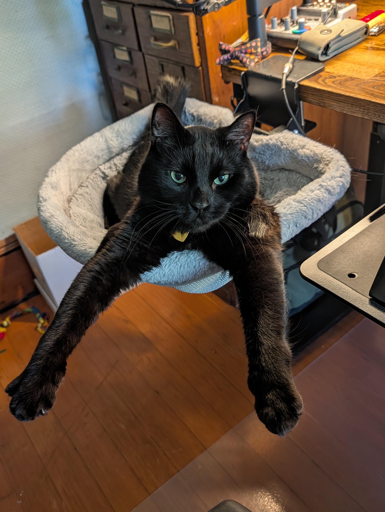
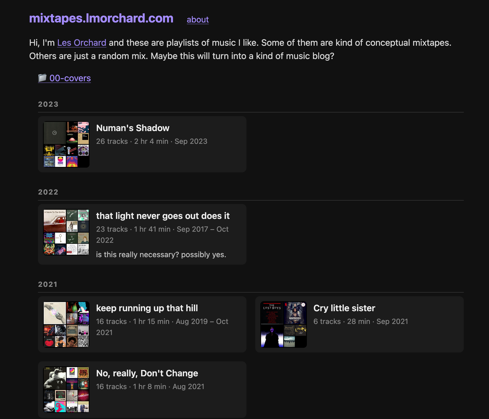
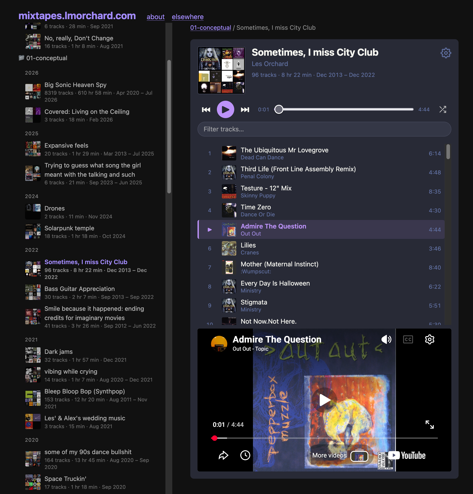
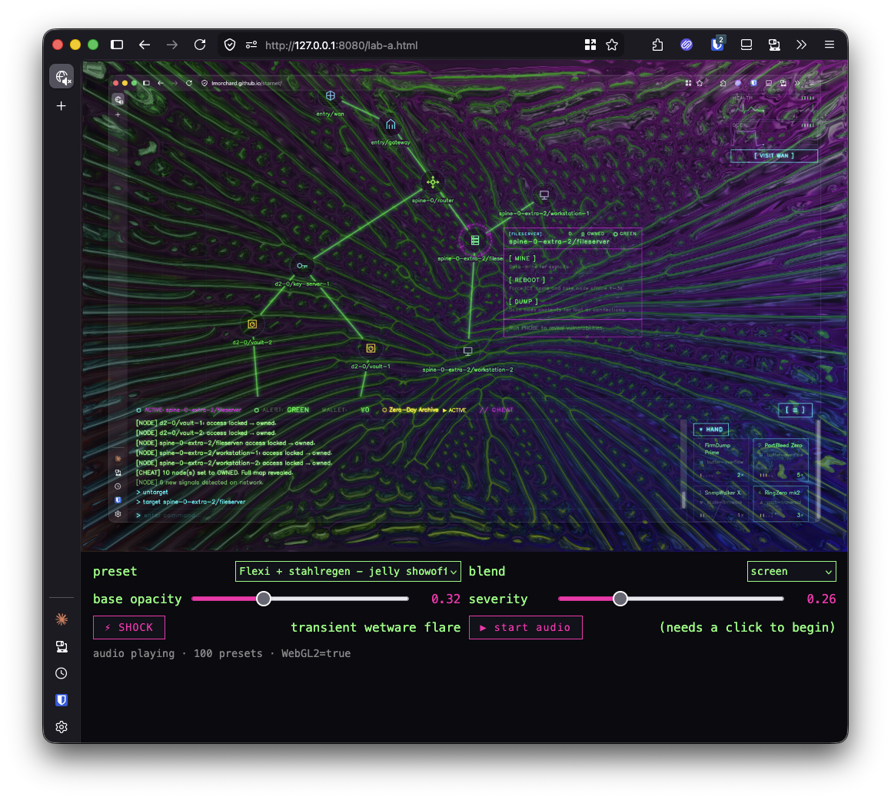
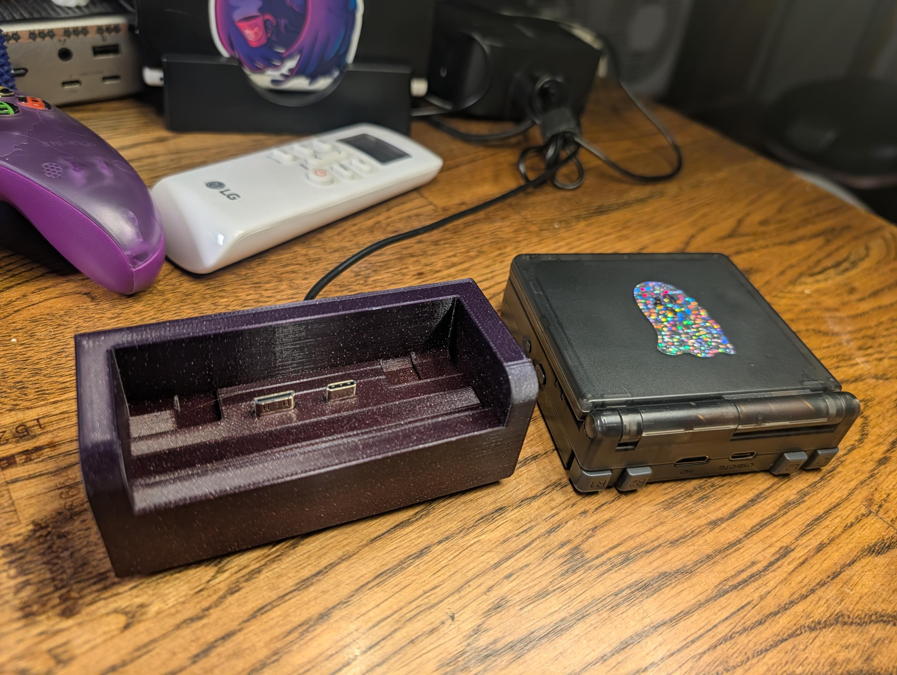
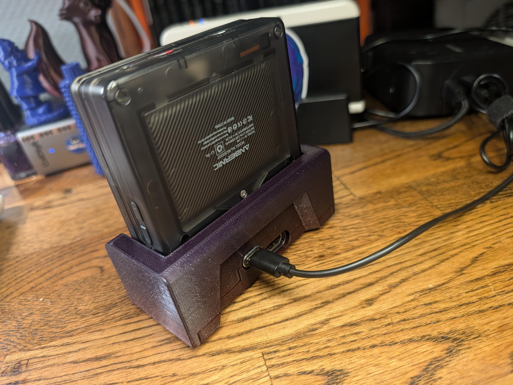
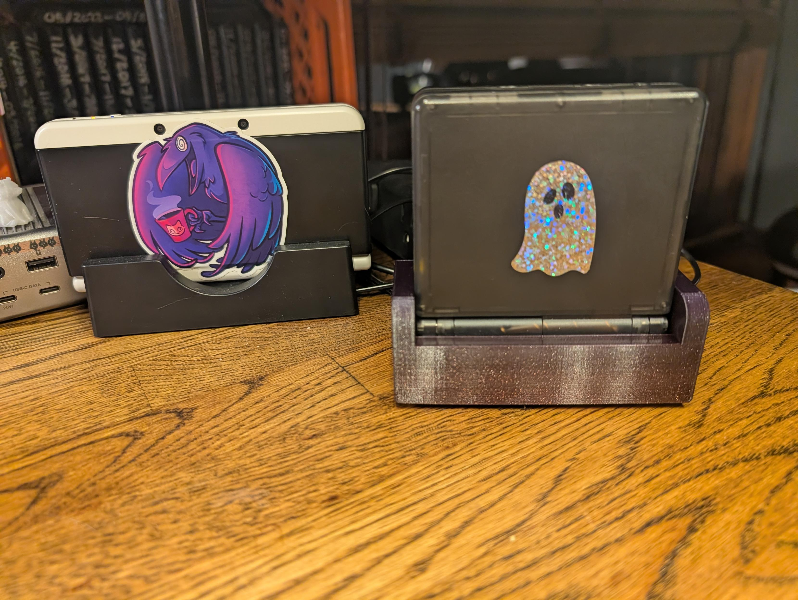

TL;DR: I built [mixtapes.lmorchard.com](https://mixtapes.lmorchard.com) to publish playlists on my own domain instead of leaving them trapped in Spotify, which spun off two new repos (`byom-sync` and `byom-player`). Plus more `starnet` gamedev (an exploit-barrage mini-game with a Butterchurn "brain damage" overlay), I finally ditched Disqus for remark42 after almost 20 years, and Minnaloushe is inching toward parole from cat jail.

<!--more-->

<nav role="navigation" class="table-of-contents"></nav>

## Minnaloushe makes parole soon?

Minnaloushe has been in cat jail for about a month now, behind a tall gate in my office while we reboot the introduction process. He's still got a couple weeks left, though [he's getting acknowledgement for good behavior](https://masto.hackers.town/@lmorchard/116875570677609551). He's clearly had a horrible time of it.

In adjacent cat-and-machine news: I told Miss Biscuits she's pretty and incredibly treasured, and [Gemini on my phone overheard](https://masto.hackers.town/@lmorchard/116864692778423347) and said "that's incredibly sweet of you to say and I'm glad to be here with you." So, you know, maybe Skynet will go easy on me.

## Somewhere to stash my mixtapes

So, I made a thing this week: [mixtapes.lmorchard.com](https://mixtapes.lmorchard.com).

<image-gallery>

  

  

</image-gallery>

And, if this isn't broken, an embedded playlist should appear here:

<iframe src="https://mixtapes.lmorchard.com/00-conceptual/big-sonic-heaven-spy/embed/" width="100%" height="950" frameborder="0" allowtransparency="true" allow="autoplay; clipboard-write; encrypted-media; fullscreen; picture-in-picture"></iframe>

This one started sideways. I spent some time [reviving my Big Sonic Heaven Spy bot](https://masto.hackers.town/@lmorchard/116875598639707807), a little thing that watches what's playing at bigsonicheaven.com and appends new songs to a Spotify playlist. [BSH is all ethereal, shoegaze, dreampop, and post-punk](https://bigsonicheaven.com) from a DJ I've been listening to since high school. The playlist is past 8000 songs now, and Spotify caps playlists at 10000. So, I'm going to hit a wall before too long.

This got me grumbling. I really need a place to stash playlists and mixtapes - one that isn't locked inside somebody else's app. I've been meaning to do this for literally years, but this week I finally got around to starting it with two new repos:

- [`byom-sync`](https://github.com/lmorchard/byom-sync) is a Go CLI that pulls my Spotify playlists down into Git-friendly YAML files. From there it compiles out to [JSPF](https://www.xspf.org/jspf) for the web player and Markdown for static sites. It'll even build the whole browsable site, which is exactly what [mixtapes.lmorchard.com](https://mixtapes.lmorchard.com) is.

- [`byom-player`](https://github.com/lmorchard/byom-player) is a framework-agnostic [Lit](https://lit.dev/) web component that plays those JSPF playlists through swappable audio providers.

Along the way I [discovered Navidrome and the OpenSubsonic API](https://masto.hackers.town/@lmorchard/116887252588644809), which turns out to be a lovely way to expose a personal music library to a web app, provided the browser can reach the server through Tailscale, a VPN, or a reverse proxy. I've got exactly that hacked together in my basement homelab.

That sent me spelunking through the wider ecosystem of Subsonic-compatible servers - bringing me to [Psysonic](https://www.psysonic.de/) (a Winamp-inspired Navidrome desktop client), [gonic](https://github.com/sentriz/gonic), [smolsonic](https://github.com/tsirysndr/smolsonic), [LMS](https://github.com/epoupon/lms), and [Funkwhale's Subsonic support](https://docs.funkwhale.audio/user/subsonic/index.html).

All of this jibes with what a bookmark I saved this week names outright: [be a gardener, not a tenant](https://www.lireo.com/be-a-gardener-not-a-tenant/), because cloud services are not forever, and neither, apparently, is a Spotify playlist with a hard cap on it.

## Back on my gamedev bullshit

`starnet`, my long-simmering cyberpunk netrunning RPG, got some more attention too. This week I was [ginning up an arcadey sci-fi visualization](https://masto.hackers.town/@lmorchard/116880753323673946) of a metasploit-inspired exploit barrage against a network node.

<figure>
  <video controls loop muted playsinline>
    <source src="./exploit-barrage.mp4" type="video/mp4" />
    <a href="./exploit-barrage.mp4">exploit-barrage.mp4</a>
  </video>
  <figcaption>The exploit barrage in motion: belts of exploits orbiting a target node while its shields wear down.</figcaption>
</figure>

There's a target node in the center, surrounded by defensive shields. Orbiting the target are a couple of concentric belts of exploits you've queued up. When the barrage starts, the shields wear down, your exploits occasionally get burned or disclosed or used up, and a detection-risk "noise" level climbs.

I'm [stealing some juice from Star Castle](https://masto.hackers.town/@lmorchard/116880778548043503) here, which apparently lit up a few people's nostalgia circuits the moment they saw the screenshots.

The other weird bit was wiring up a Butterchurn (a web port of the trippy old Milkdrop music visualizer) overlay as a way to [depict brain injury in a cyberdeck jockey](https://masto.hackers.town/@lmorchard/116887129462221814) who's been pushing their luck. There's a whole trove of [Milkdrop presets converted for Butterchurn](https://github.com/jberg/butterchurn-presets) to draw from, which is delightfully more raw material than I could ever use.

I still have no idea whether this game ever becomes a thing worth "releasing" - but I'm having a genuinely good time hacking on an idea I've been carrying around for years.

## Disqus, gone after 20 years

This felt overdue: after almost 20 years, I [finally switched my blog comments away from Disqus](https://masto.hackers.town/@lmorchard/116875431657598358). I'm running [remark42](https://remark42.com/) for now and we'll see how I like it.

The final straw was they turned on [a spammy chumbox](https://www.byrosanna.co.uk/blog/watch-out-for-ads-disqus-comments-have-gone-premium) at the bottom of every comment thread. What's a [chumbox](https://en.wikipedia.org/wiki/Chumbox)? This is a chumbox:

Complete garbage. I mean, sure, I was freeloading comments off Disqus most of this time. But inserting ads for vitamin supplements and crypto scams and boner pills on my blog is unacceptable. That convinced me to get over the hump of figuring out self-hosting, rather than pony up for a paid plan.

The part I'm quietly pleased about is that I got the Remark42 comments to [lazy-load only when they're scrolled into view](https://masto.hackers.town/@lmorchard/116875436382858423) and to follow theme changes along with the rest of the page.

A [nice writeup on automatic remark42 theme-switching](https://hndrk.blog/comments-are-there/) did a lot of the heavy lifting there. Still on my wishlist: figuring out whether there's [any way to get remark42 talking to indielogin.com](https://masto.hackers.town/@lmorchard/116875447236422858) for authentication. If anyone's done that, I'm all ears.

## Miscellanea

* I printed [a little charging dock for my Anbernic RG35XXSP](https://masto.hackers.town/@lmorchard/116894157260109707), which even has a micro-HDMI-to-HDMI adapter built in for the day I feel masochistic enough to use the thing as a console. The [Printables model](https://www.printables.com/model/1412822-anbernic-rg35xxsp-dock-usb-c-hdmi/) has space in the base for metal weights so it doesn't topple over. #gamedad

    <image-gallery>

    

    

    

    </image-gallery>

* The raccoon is back. [We thought we'd been forsaken](https://masto.hackers.town/@lmorchard/116880163397827126) after nearly a month, but no, they've returned and they are hungry for lily pad and electrical cords.

    <figure>
      <video controls loop muted playsinline>
        <source src="./raccoon-return.mp4" type="video/mp4" />
        <a href="./raccoon-return.mp4">raccoon-return.mp4</a>
      </video>
      <figcaption>The pond bandit, returned from a month's absence and back on the electrical cords.</figcaption>
    </figure>

* A cluster of "the AI bill is coming due" reading this week: [The AI Hype Reckoning Is Upon Us](https://karlbode.com/the-ai-hype-reckoning-is-upon-us/) on the chasm between useful automation and technofascist hucksterism, [Ford rehiring human engineers](https://www.bbc.com/news/articles/cgrkd41n2v9o?ref=karlbode.com) after AI failed the quality checks ("Mistakenly, we thought that by just introducing artificial intelligence... that would produce a high-quality product"), and [Zuckerberg 'admitting' Meta's layoffs were ineffective](https://eshumarneedi.com/2026/07/03/zuckerberg-admits-metas-layoffs-were.html). Someone on Mastodon also passed around a Futurism headline about [execs being horrified by their huge AI bills](https://masto.hackers.town/@cypnk/116891029640761359) after assuming they could replace workers for free, which, hah.
* Two on the state of gaming as a business: [The console wars have been lost](https://xeiaso.net/notes/2026/console-wars-lost/) (Valve winning by doing nothing while everyone else shoots themselves in the head) and [World historic amounts of gamedev talent thrown out to rot](https://blog.lauramichet.com/world-historic-amounts-of-gamedev-talent-thrown-out-to-rot/), which is a genuinely sad read about hemorrhaging not just people but the trust and momentum that make good teams.
* [What does Jeff Bezos think is going to happen?](https://reprog.wordpress.com/2026/07/05/what-does-jeff-bezos-think-is-going-to-happen/) on the logic of DRM'd Kindle books eventually just pushing people to pirate the things they've already paid for.
* Apple shipped a [Safari MCP server for web developers](https://webkit.org/blog/18136/introducing-the-safari-mcp-server-for-web-developers/), which lets an agent see how your code actually renders in the browser.
* The EFF wrote a nice reminder that [RSS is one of the tools you've been looking for](https://www.eff.org/deeplinks/2026/06/hate-algorithm-rss-one-tools-youve-been-looking) if you hate "the algorithm."
* A small, sharp piece of advice: [leave a failing test before you go on vacation](https://freek.dev/3156-leave-a-failing-test-before-you-go-on-vacation) so future-you has somewhere obvious to pick back up.
* [The Tragedy of the Engineering Commons](https://ianreppel.org/the-tragedy-of-the-engineering-commons/): "The surest way to ruin an engineering team is to believe it will survive whatever you do to it."
* Conan O'Brien [surprising Jordan Schlansky with Geddy Lee](https://www.youtube.com/watch?v=tzs7901FSzY) so he can interrogate the man about a specific mastering of "Tom Sawyer" is exactly the kind of nonsense I needed.

    <youtube-embed video-id="tzs7901FSzY" thumbnail="d106834063a7.jpg"></youtube-embed>

* Podcast-wise it was a good week for retro and sci-fi: the Retro Hour on the [Commodore 64 as a cultural icon](https://pocketcasts.com/podcast/f025c170-ae7d-013b-f3af-0acc26574db2), the STARLOG Podcast talking [science and storytelling with Dr. Erin Macdonald](https://pocketcasts.com/podcast/c32c37c0-5206-013f-1f83-0e98e27f20d9), Aftermath Hours on the slow death of [physical media](https://pocketcasts.com/podcast/16283670-9d16-013c-74fe-027201e7e97f), and Never Post on ["inheritance posting"](https://pocketcasts.com/podcast/bb3ac9f0-728c-013c-dc63-0e76ec147af9) as a new kind of grief.
* Songs that were stuck in my head, for the record: Parralox's [cover of "Sirius / Eye in the Sky"](https://www.youtube.com/watch?v=GTrndr1gqdc), Battery's cover of Depeche Mode's "Shame" (["it all seems so stupid, it makes me want to give up"](https://www.youtube.com/watch?v=fBXGfHuMtMA)), and, unfortunately right before bed, the hyperactive ["MEOW" by Anamanaguchi](https://www.youtube.com/watch?v=vc3JWo2iiGc).

  You know, I should put these in a playlist. Hmm.

    <youtube-embed video-id="GTrndr1gqdc" thumbnail="27e44e8832eb.jpg"></youtube-embed>

    <youtube-embed video-id="fBXGfHuMtMA" thumbnail="ee5172cec627.jpg"></youtube-embed>

    <youtube-embed video-id="vc3JWo2iiGc" thumbnail="c5b38195c2e8.jpg"></youtube-embed>

None of this was especially planned. A dead Spotify playlist cap turned into two new repos, a game about breaking into computers grew a way to render brain damage, and my blog quietly shed a service it had carried since roughly the Bush administration. That's about the right ratio of accident to intent for a good week around here.
