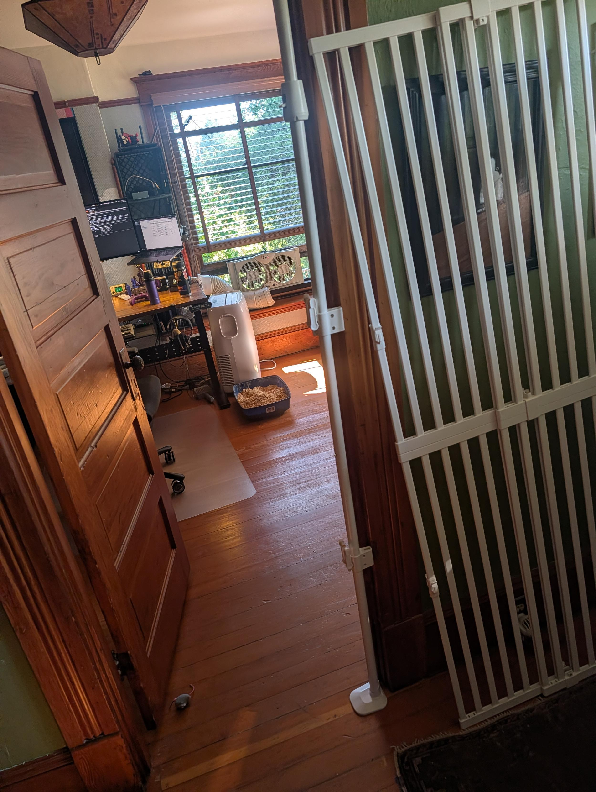
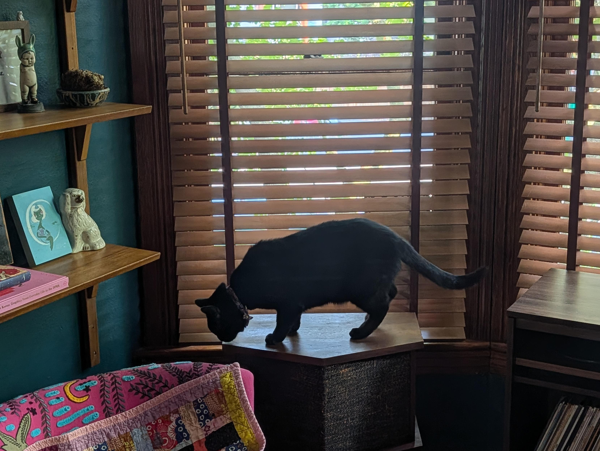
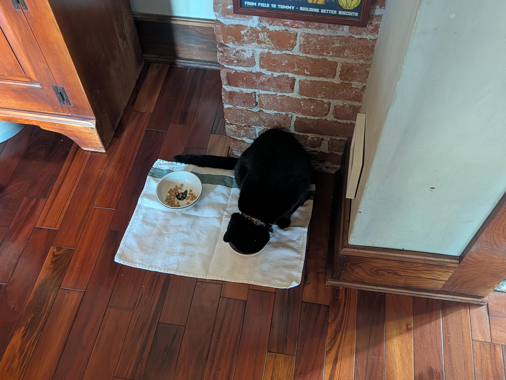
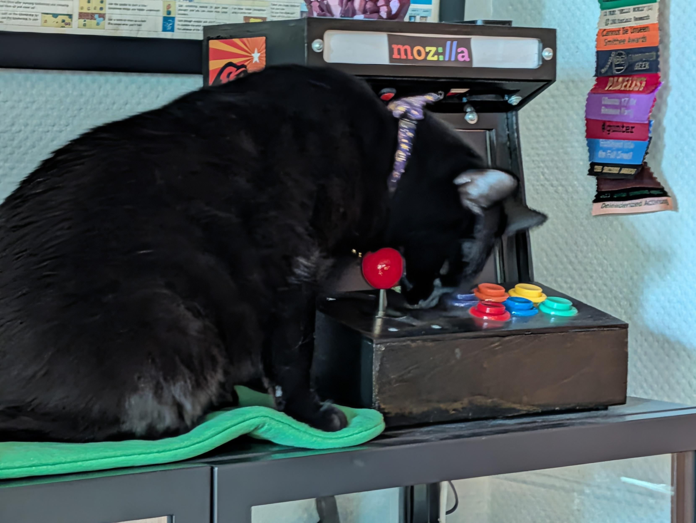

TL;DR: Last week I said Minnaloushe was inching toward parole from cat jail. This week he simply escaped — repeatedly, by jumping onto my office door and vaulting the five-foot gate — which earned him the household title of "the tiger." Meanwhile the `byom`/mixtapes rabbit hole kept swallowing me whole (cover art, mosaic hero images, virtualizing an 8000-track playlist, npm releases, Navidrome and Plex playback), `starnet` sprouted a Quality-Based Narrative epic, and I fell down a gacha-game reorientation hole and an Oxford-comma nerdsnipe hole in the same week.

<!--more-->

<nav role="navigation" class="table-of-contents"></nav>

## The tiger is out

When I left off last week, Minnaloushe — a.k.a. "the Hunk," so named because [the adoption agency called him hunky](https://masto.hackers.town/@lmorchard/116913831805067815) — was still doing his time behind the tall gate in my office while we reboot the cat introductions. He was, I said, inching toward parole.

He decided not to wait.

First he [figured out how to breach cat jail](https://masto.hackers.town/@lmorchard/116919794043335799): jump on top of my office door, then from there jump through the gap above the five-foot pet gate in the doorway. He did it twice, and then I caught him doing the jump math and butt wiggles for a third go. Certainly not a dumb critter.

By the weekend I had to concede the point entirely, with apologies to Nael, grade 1, whose [poem "The Tiger"](https://826dc.org/student-writing/the-tiger/) I have never been able to get out of my head:

> The tiger
> He destroyed his cage
> Yes
> YES
> The tiger is out

<image-gallery>

</image-gallery>

Between jailbreaks, he kept himself busy being a menace to my desk specifically. I turned around one afternoon to find him [going to town chewing on the joystick](https://masto.hackers.town/@lmorchard/116904309856365813) of my little barcade cabinet like it was a jawbreaker:

He also [pried the rubber nubbins off my laptop shelf](https://masto.hackers.town/@lmorchard/116920348585550769) (twice), buried his head in a foam pumpkin to [fish out the electronics inside](https://masto.hackers.town/@lmorchard/116914128610384576), and generally [made himself at home](https://masto.hackers.town/@lmorchard/116913802555033184) stretched across the keyboards and monitors like he pays rent here.

The freedom tour did not last. There was [a bit of a scuffle](https://masto.hackers.town/@lmorchard/116925375967665891) — I'm pretty sure Cosmo started it — so the tiger is back in his cage for a little while so we can have workday peace. Cage not entirely destroyed yet. Baby steps.

## Is this a music blog now?

The mixtapes project I started last week refused to let go. What began as "somewhere to stash my playlists off Spotify" has, over the course of the week, [maybe turned into a kind of music blog](https://masto.hackers.town/@lmorchard/116905850438782330)? We'll see if I actually keep it up with new mixtapes. Either way, [`byom-sync`](https://github.com/lmorchard/byom-sync) and [`byom-player`](https://github.com/lmorchard/byom-player) both got a frankly absurd number of commits.

The stuff I'm happiest about:

- **Virtualizing the tracklist.** That Big Sonic Heaven playlist is past 8000 tracks, and rendering all of them into the DOM at once made the web component [do completely stupid things](https://masto.hackers.town/@lmorchard/116905855453456651). [Windowing the list](https://github.com/lmorchard/byom-player/issues/39) so it only renders what's on screen fixed that, and I added [viewport-priority pruning](https://github.com/lmorchard/byom-sync/issues/43) to the availability prescan so it isn't frantically checking 8000 tracks you'll never scroll to.

- **Cover art and mosaic heroes.** `byom-sync` now [resolves cover art via MusicBrainz and the Cover Art Archive](https://github.com/lmorchard/byom-sync/pull/20), and for playlists that don't have an explicit cover it [generates a representative mosaic hero image](https://github.com/lmorchard/byom-sync/issues/32) out of the album art it does have. The index and playlist pages look a lot less like a spreadsheet now.

- **It plays my own music.** Even though it defaults to pulling audio from YouTube, I got it [working against my homelab Navidrome and Plex installs](https://masto.hackers.town/@lmorchard/116905865548891038) — so it can play music from my personal collection (or yours) without uploading all the files somewhere first. That's the part that makes the whole "gardener, not a tenant" thing feel real.

The rest of the week was the unglamorous tail of shipping something: I [published `byom-player` to npm](https://github.com/lmorchard/byom-player/issues/4) and cut a few tagged releases, did a big mobile pass on the site and player chrome, and rebuilt the layout around a proper app shell. Not exciting to describe, but it's the difference between a demo and a thing.

## Back on my gamedev bullshit, quality edition

`starnet`, the long-simmering cyberpunk netrunning RPG, got some attention too. Last week's exploit-barrage mini-game landed a follow-up ([the `worktree-exploit-e2-gear` work merged](https://github.com/lmorchard/starnet/pull/314)), but the bigger move was opening [an epic for a Quality-Based Narrative meta-loop](https://github.com/lmorchard/starnet/issues/315) — StoryNexus-style storylets, driven by facts accumulated over a run. If you've ever played Fallen London and wondered how the story keeps reshuffling itself around what you've done, that's the machinery I'm trying to build a version of. It's the connective tissue that could turn a pile of mini-games into an actual game. We'll see.

## The live-service reorientation problem

I spent a chunk of the week trying to climb back into a couple of gacha games and bouncing right back off. I fired up Zenless Zone Zero again after loving it last summer and thought: [sweet merciful crap, what is any of this?](https://masto.hackers.town/@lmorchard/116922303901298762) Same story with Honkai: Star Rail, which [greeted me with a "welcome back" gift of currencies](https://masto.hackers.town/@lmorchard/116922495124846596) when what I actually needed was a "here's WTF you were doing last time" reorientation.

That's the recurring trap with these free-to-play things: they're [a bewildering blizzard of currencies and limited-time offers and geegaws](https://masto.hackers.town/@lmorchard/116922310610168567), I enjoy them intensely for a limited window, and then my brain flushes all knowledge of their systems the moment I look away. The one exception is Warframe, which [I somehow retain across months-long absences](https://masto.hackers.town/@lmorchard/116922316688221387) — and which had a genuinely wild [Tau expansion reveal at TennoCon](https://masto.hackers.town/@lmorchard/116903662094531617) that manages to blend detective noir, swanky triphop, cyberpunk, deep-future stoner-rock sci-fi, and screaming cosmic horror. I love that creative team.

On the hardware side, I've been leaning on [GeForce NOW](https://masto.hackers.town/@lmorchard/116909762988442746) rather than upgrade a six-year-old GPU — I know cloud gaming is "how they get ya," but my internet is good and I'd rather make a few extra mortgage payments. Less happily, the Xbox controller I use has become [a full Ship of Theseus](https://masto.hackers.town/@lmorchard/116909805087691611): the rubberized thumbstick texture is now sloughing off gloopily under my thumbs, and I'd already replaced the outer shell after the original crumbled. I don't think this thing is even a few years old.

## Miscellanea

* Firefox in WebAssembly is real: the [Gecko engine compiled to WASM](https://developer.puter.com/labs/firefox-wasm/) ([repo here](https://github.com/HeyPuter/firefox-wasm)), rendering the real Firefox UI inside a browser tab. My favorite part is that it [ironically didn't work *in Firefox*](https://masto.hackers.town/@lmorchard/116927454534706451) — until I [flipped a config bit](https://masto.hackers.town/@lmorchard/116927462594096195), and then off it went.
* A cluster of AI-hype-reckoning reading piled up this week: Ford [rehired human engineers after AI failed their quality checks](https://www.bbc.com/news/articles/cgrkd41n2v9o?ref=karlbode.com) ("mistakenly, we thought that by just introducing artificial intelligence… that would produce a high-quality product"), Karl Bode on [the AI hype reckoning](https://karlbode.com/the-ai-hype-reckoning-is-upon-us/) and the chasm between useful automation and technofascist hucksterism, and geohot's counterpoint, ["I love LLMs, I hate hype"](https://geohot.github.io//blog/jekyll/update/2026/07/12/i-love-llms.html). The most nuanced take was the [htmx essay on working with AI](https://htmx.org/essays/working-with-ai/) — an older developer describing how it patches the specific weaknesses of memory and stamina that age brings.
* Adjacent, and quietly worrying: Laura Michet on [world-historic amounts of gamedev talent being thrown out to rot](https://blog.lauramichet.com/world-historic-amounts-of-gamedev-talent-thrown-out-to-rot/), and Xe Iaso arguing [the console wars have already been lost](https://xeiaso.net/notes/2026/console-wars-lost/) — Valve winning by doing nothing while everyone else shoots themselves in the head.
* The web-durability drumbeat continues: Zeldman on [keeping worrying about the web](https://zeldman.com/2026/07/06/memories-cant-wait-or-how-i-learned-to-keep-worrying-about-the-web/) ("be gardeners, not just tenants"), the Grumpy Welshman on how [the internet wants livestock, not readers](https://grumpywelshman.com/the-internet-doesnt-want-readers-it-wants-livestock/), and a lovely bit of digital archaeology in Dan Q's [rescue of 7,234 old GIFs](https://danq.me/2026/07/10/rescuing-7234-gifs/) via a server-side imagemap.
* Also bookmarked: [Tiny Emulators](https://floooh.github.io/tiny8bit-preview/index.html), a [D&D-group-repairs-a-tumble-dryer-mid-campaign](https://thega.me.uk/2026/07/dungeons-and-dryers/) story, [Freek Van der Herten on leaving a failing test before you go on vacation](https://freek.dev/3156-leave-a-failing-test-before-you-go-on-vacation) (a genuinely good idea for easing back in), Ian Reppel's [tragedy of the engineering commons](https://ianreppel.org/the-tragedy-of-the-engineering-commons/), and a [fast Playwright-on-GitHub-Actions setup](https://endform.dev/blog/playwright-github-actions).
* I got nerdsniped into an Oxford-comma-and-AP-vs-APA thread so hard that I [signed up for a free AP Stylebook trial to prove a point](https://masto.hackers.town/@lmorchard/116920763345454852) so pedantic I wanted to self-defenestrate. Should I tell my therapist about this?
* In a related ADHD-brain event, a TikTok convinced me that [baker's racks with trays are the perfect ADHD project-storage unit](https://masto.hackers.town/@lmorchard/116920802242736569) — "tray after tray of random access projects" — and I spent an embarrassing amount of time shopping for aluminum sheet-pan racks for the workshop. Every hobby, as someone on Mastodon put it, ends with storage problems.
* Cleopatra Records — the goth/industrial label — apparently now [distributes Engelbert Humperdinck](https://cleopatrarecords.bandcamp.com/album/faithfully), which sent me down a very confused rabbit hole about their catalog.
* Plex informed me that its ["Top Movies in Romance"](https://masto.hackers.town/@lmorchard/116933857580069611) are Bill & Ted's Excellent Adventure, Corpse Bride, Hairspray, The Lost Boys, and Mallrats. I have no notes. The algorithm knows me.
* Podcast-wise it was a Vergecast-heavy week ([Netflix turning into YouTube](https://pocketcasts.com/podcast/8b0b13e0-8c29-013e-2d25-0ee3c75e9209), the problem with Suno and AI music, "were we too nice to the Steam Machine?") plus the usual NPR *Up First* drip.

## Wrapping up

Not a bad week: a cat who has evidently decided that walls are a suggestion, a side project that keeps threatening to become a real thing, and enough good reading to keep my "gardener, not tenant" convictions well-watered. On the quieter side, my therapist [flagged that my anxiety and grief scores were up](https://masto.hackers.town/@lmorchard/116930827397645644) at this week's check-in, which tracks — so I'm trying to be gentle with myself about how much of the above is genuine play and how much is hyperfocus doing its thing. Probably some of both. The tiger and I have that in common.
