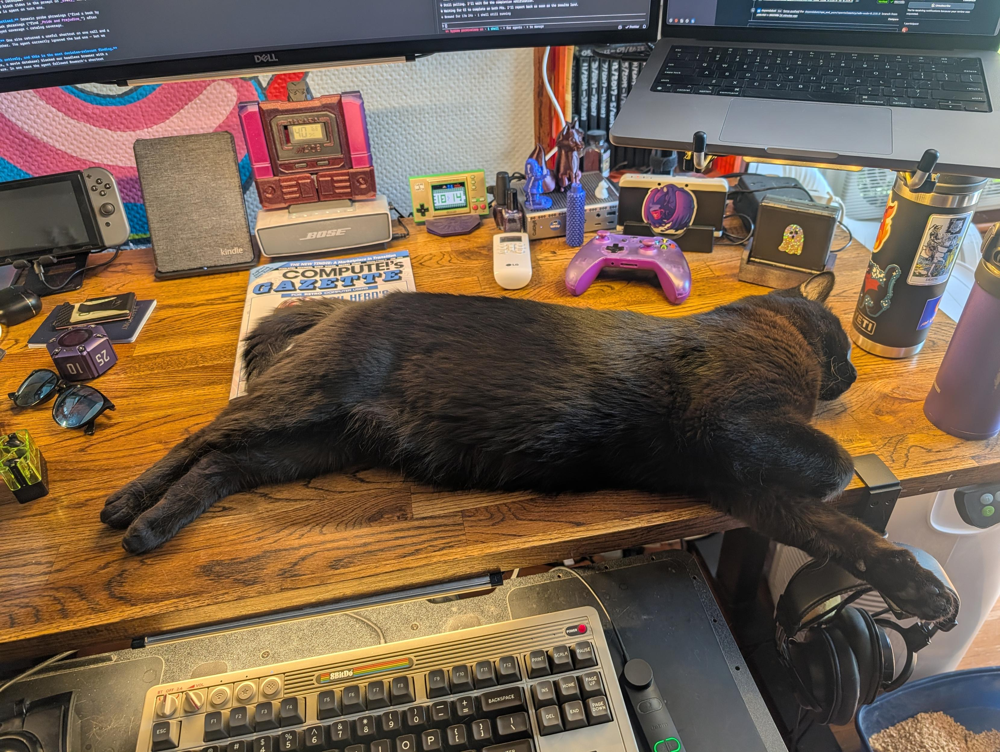
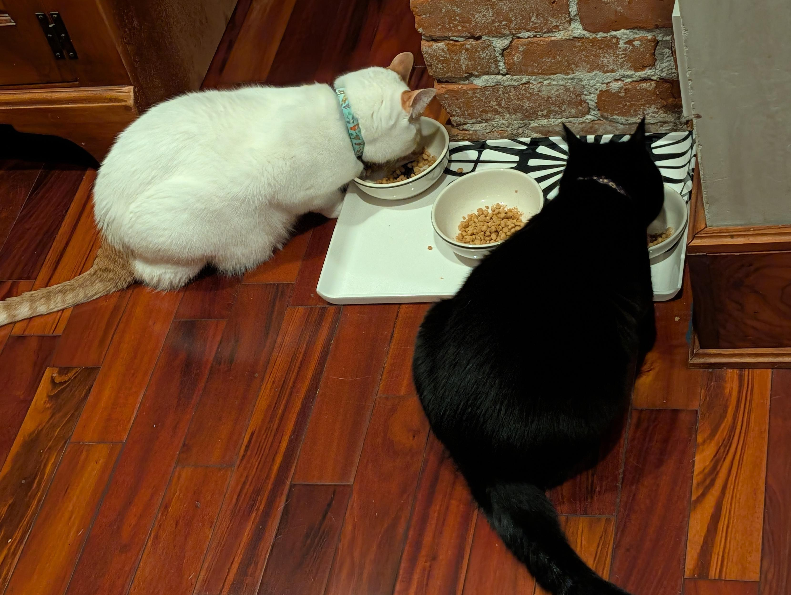
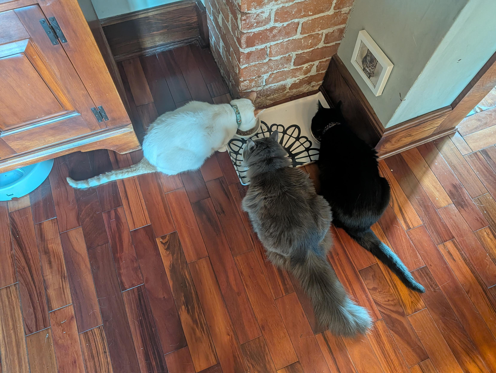
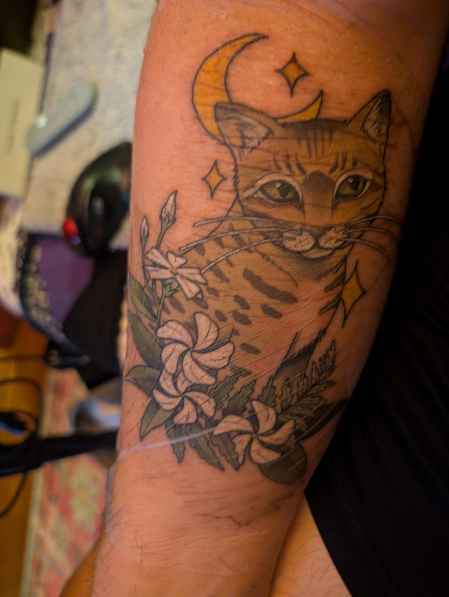
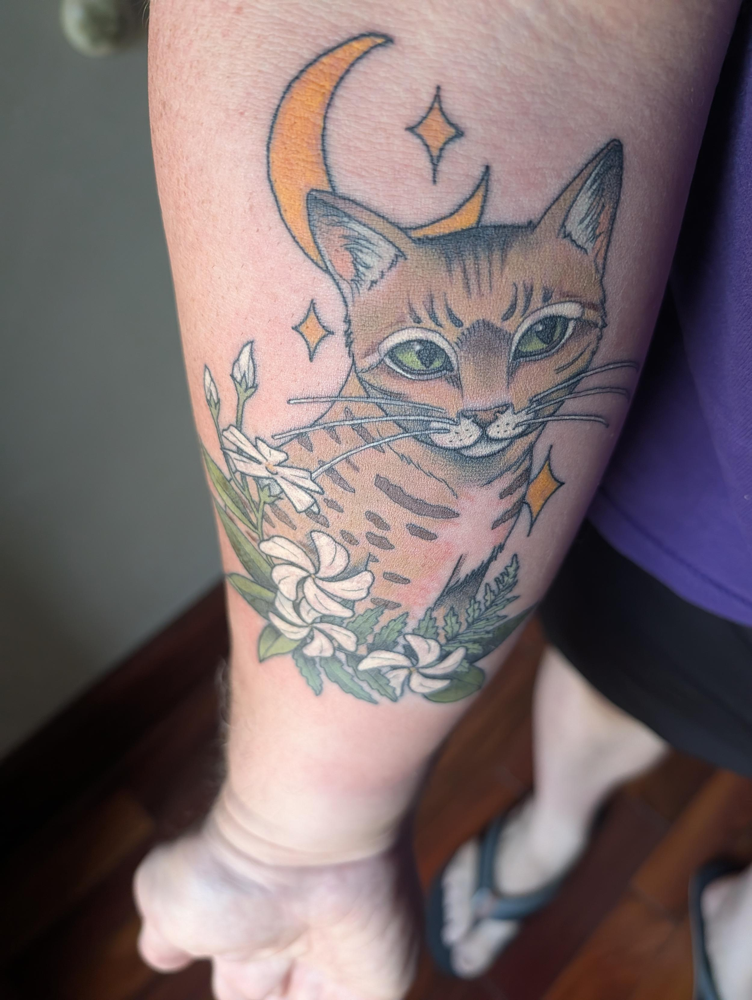
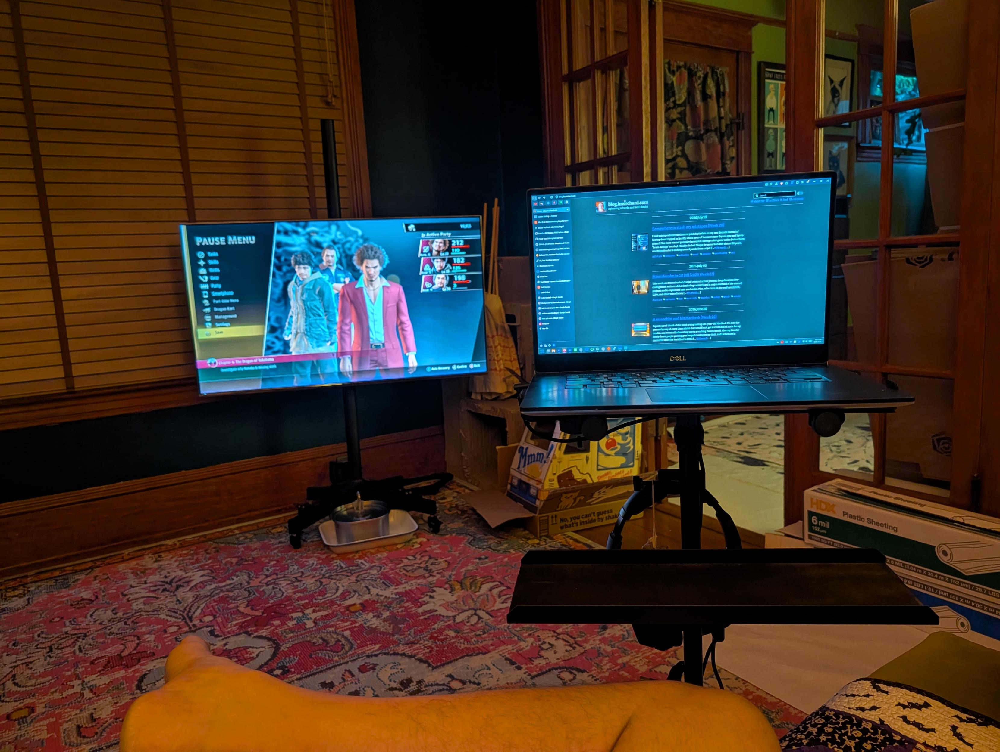
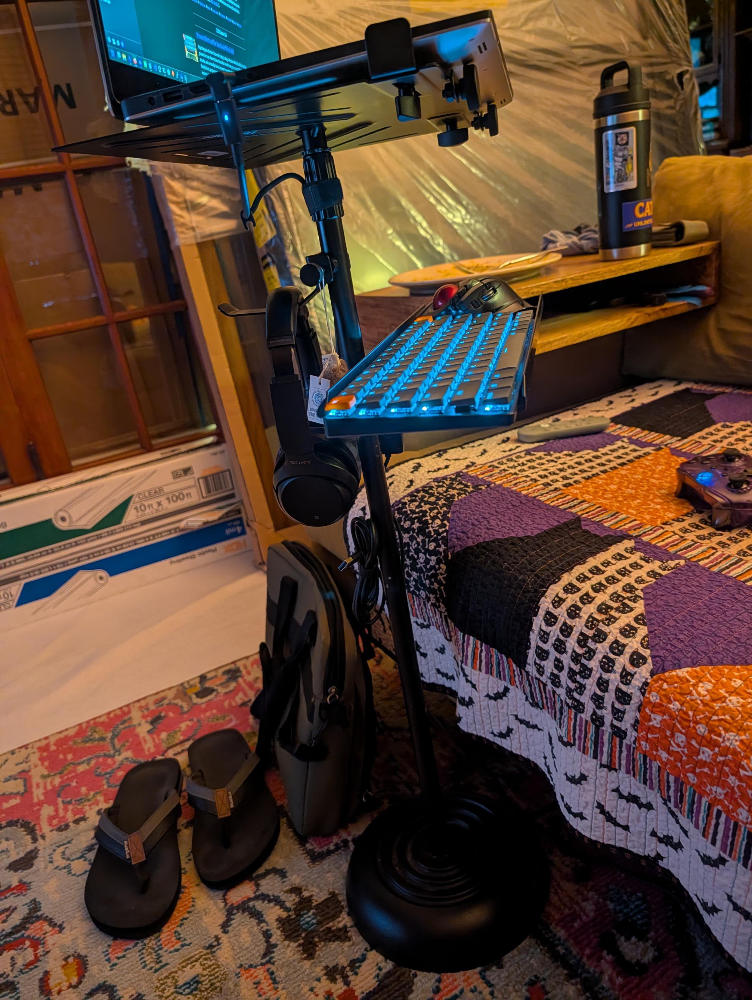

*TL;DR:* It's been a hectic three weeks. The main event has been the slow, tense, and ultimately successful integration of our new cat, Minnaloushe, who graduated from "cat jail" to a tentative peace with the other furballs. In between managing the cat drama, I got a memorial tattoo for Puck, poured a ton of work into `decafclaw` and other side projects, and fell down a rabbit hole of game streaming and retro classics.

<!--more-->

<nav role="navigation" class="table-of-contents"></nav>

## The Great Cat Parole Experiment

When we last spoke, Minnaloushe was in "cat jail" in my office. Well, the big guy has been on a real journey. After a scuffle that put him back in solitary, he's slowly been earning his freedom. There have been many cycles of [parole](https://masto.hackers.town/@lmorchard/116927359759625182), supervised visits, and a lot of just hoping for the best.

The good news is, we seem to have turned a corner. The [cat jail gate has been retired](https://masto.hackers.town/@lmorchard/116987667455406680), and we're now at a stage of [uneasy but peaceful coexistence](https://masto.hackers.town/@lmorchard/116964131757513851). They're even [eating together](https://masto.hackers.town/@lmorchard/116958707523053532) without any bloodshed. It's a relief, honestly.

Of course, a free-roaming Minnaloushe means a new level of chaos. He's a menace who [chews on arcade sticks](https://masto.hackers.town/@lmorchard/116904309856365813), [steals the rubber feet off my laptop stand](https://masto.hackers.town/@lmorchard/116922136763770313), and generally causes adorable trouble. But he's also a big, goofy bear of a cat and I'm glad to have him out and about now.

<image-gallery>

</image-gallery>

## A Tattoo for Puck

In the midst of all the cat drama, I got my second tattoo, a memorial for my old friend Puck, who [we lost back in 2015](https://blog.lmorchard.com/2015/04/15/goodbye-puck/). It was done by [the talented Katy Bisby](https://www.wonderlandpdx.com/katy-bisby-1), and it came out beautifully. It’s a wonderful way to remember a very good boy.

<image-gallery>

</image-gallery>

## Shipping, Shipping, Shipping

At some point, I should probably write more about workaday projects. I'm pretty quiet about those. But, it's been a productive few weeks on side projects: I've been banging away on [`decafclaw`](https://github.com/lmorchard/decafclaw), my personal agent project, and [`byom-sync`](https://github.com/lmorchard/byom-sync), the "bring your own music" playlist tool. The GitHub activity stream has been a blur of commits, PRs, and new issues.

For `decafclaw`, there's been a ton of work on improving the scheduling system, fixing bugs in the vault and skill loaders, and generally trying to make the whole system more robust. I even started to tackle the project skill's tendency to hallucinate tools.

For `byom-sync`, I've been focused on improving purchase link resolution, adding support for RSS feeds, and starting to spec out a "shopping list" feature.
It's been a lot, but it's satisfying to see these projects moving forward.

## Adventures in Game Streaming

I finally caved and tried out GeForce NOW, and I have to say, it's pretty impressive. It's led me to rethink my whole [living room gaming setup](/2017/01/09/diy-monitor-v12/), a project that's been evolving for [nearly a decade](/2013/01/21/gaming-from-the-orchard-house-couch/). The idea of a powerful PC tucked away in the basement, streaming games to any screen in the house via [Moonlight](https://moonlight-stream.org/) and [Sunshine](https://github.com/LizardByte/Sunshine), is very appealing. 

<image-gallery>

</image-gallery>

For those not familiar, Sunshine is a self-hosted, open-source replacement for NVIDIA's now-defunct GameStream, and Moonlight is the open-source client that lets you stream from it. The combination promises a high-performance, low-latency experience. Might just be the end of an era for my dedicated living room gaming PC.

## Miscellanea

*   A neighbor had a block party with a live brass band, which was a delightful surprise. Here's the playlist of a few songs I recognized - wish I'd taken notes! Also, this is me trying out my new mixtapes site as an embed:

    <iframe style="border-radius:12px" src="https://mixtapes.lmorchard.com/00-conceptual/songs-covered-by-my-neighbor-s-brass-band/embed/" width="80%" height="500" frameBorder="0" allowfullscreen="" allow="autoplay; clipboard-write; encrypted-media; fullscreen; picture-in-picture" loading="lazy"></iframe>

*   I watched a raccoon have a full-on pool party in our backyard pond, and I'm not even mad.

    <figure>
      <video controls>
        <source src="b5b4c41c025c.mp4" type="video/mp4" />
        <a href="b5b4c41c025c.mp4">raccoon-pond-bandit.mp4</a>
      </video>
      <figcaption>The pond bandit returns.</figcaption>
    </figure>

*   A few more interesting reads from the past few weeks: ["The End of the Future"](https://www.nytimes.com/2022/01/21/opinion/the-end-of-the-future.html) by Evgeny Morozov, Ben Thompson's ["The Great Unbundling"](https://stratechery.com/2015/the-great-unbundling/), and a piece from The Atlantic on ["The AI-Art Boom Is Here To Stay"](https://www.theatlantic.com/technology/archive/2022/08/ai-art-boom-is-here-to-stay/671054/).
*   I also bookmarked Tiago Forte's guide on ["How to Build a Second Brain"](https://fortelabs.co/blog/how-to-build-a-second-brain-an-overview/).
*   A few more interesting reads from the past few weeks: [htmx ~ Working With AI: A Concrete Example](https://htmx.org/essays/working-with-ai/), [I love LLMs, I hate hype](https://geohot.github.io//blog/jekyll/update/2026/07/12/i-love-llms.html), and [Memories Can’t Wait—or, How I Learned to Keep Worrying About the Web](https://zeldman.com/2026/07/06/memories-cant-wait-or-how-i-learned-to-keep-worrying-about-the-web/).
*   A few more interesting reads from the past few weeks: [htmx ~ Working With AI: A Concrete Example](https://htmx.org/essays/working-with-ai/), an essay on the pros and cons of AI in development, and how to avoid the "Sorcerer's Apprentice" problem; [I love LLMs, I hate hype](https://geohot.github.io//blog/jekyll/update/2026/07/12/i-love-llms.html), a classic from geohot on the difference between genuine excitement and the hype cycle; and [Memories Can’t Wait—or, How I Learned to Keep Worrying About the Web](https://zeldman.com/2026/07/06/memories-cant-wait-or-how-i-learned-to-keep-worrying-about-the-web/), a call to action from Jeffrey Zeldman on the importance of owning your own content.
*   I also bookmarked [The Internet Doesn't Want Readers. It Wants Livestock.](https://grumpywelshman.com/the-internet-doesnt-want-readers-it-wants-livestock/), a wonderfully grumpy take on the state of the web.
*   On the more technical side of things, I saved a link to [Playwright on GitHub Actions: The setup that actually runs fast](https://endform.dev/blog/playwright-github-actions) which has some great tips on speeding up CI, and a post about [Firefox in WebAssembly](https://developer.puter.com/labs/firefox-wasm/), which is just cool.
*   And finally, a couple of interesting articles on the culture of coding: [It's OK to Use Coding Assistance Tools To Revive The Projects You Never Were Going To Finish](https://blog.matthewbrunelle.com/its-ok-to-use-coding-assistance-tools-to-revive-the-projects-you-never-were-going-to-finish/) and [The LLM Critics Are Right. I Use LLMs Anyway.](https://www.theocharis.dev/blog/llm-critics-are-right-i-use-llms-anyway/), both of which resonate with my own experiences.

