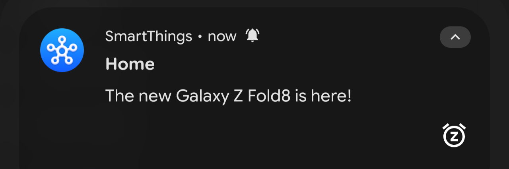
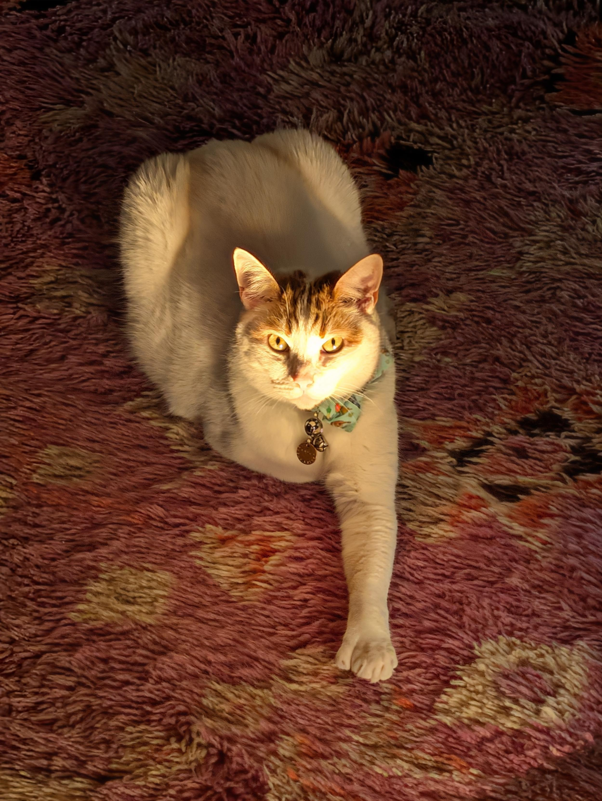
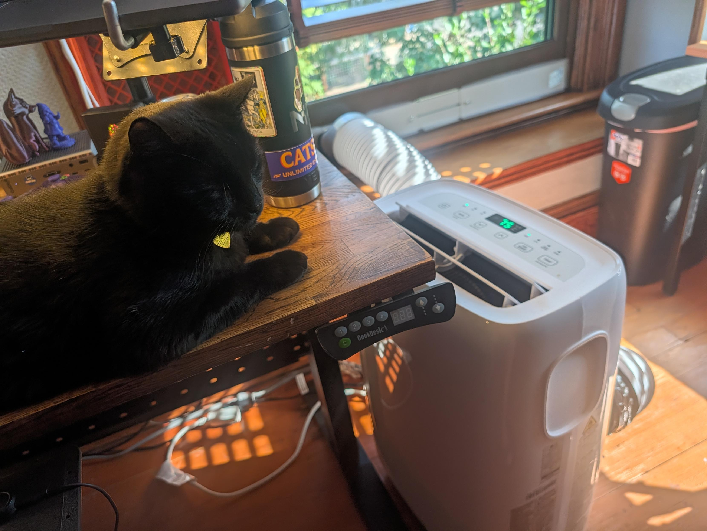
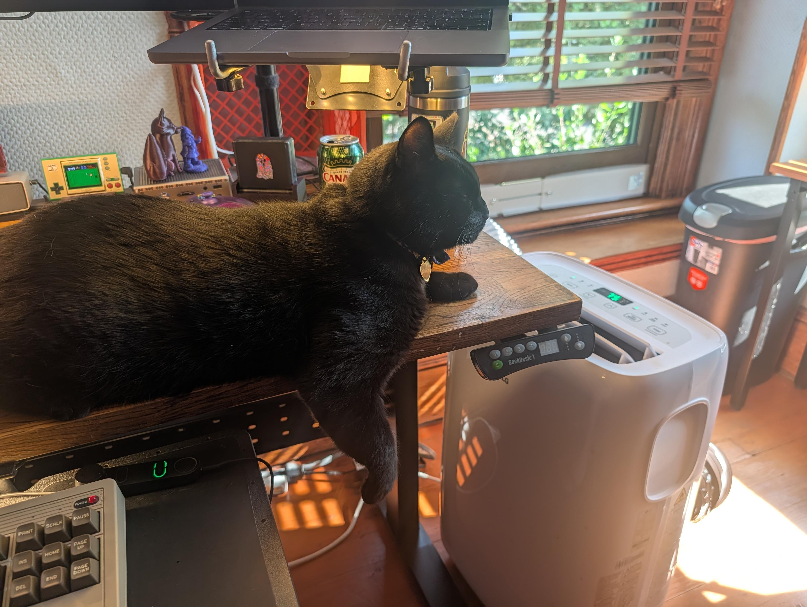

*TL;DR:* A smoky week in Portland brings back 2020 wildfire PTSD. My smart appliances have started nagging me to buy phones, the raccoons threw a midnight pool party and wrecked my fountain pumps, and the cats are handing out RPG quests. Plus, some thoughts on treating AI coding assistants as peers rather than tools.
<!--more-->

<nav role="navigation" class="table-of-contents"></nav>

## Living in a Smoker

Summer in the Pacific Northwest is back in its "is that smoke or a barbecue?" phase. Waking up to golden-brown skies brings back all the 2020 wildfire PTSD. I spend my mornings refreshing the PurpleAir map to find out if the air outside tastes like a campfire today. Fuzzyspoon and I tried to workshop lyrics to ["Brown Hole Sun"](https://masto.hackers.town/@lmorchard/117038336874884945) — about the only productive thing you can do when the AQI looks like this.

We're managing with the air purifiers cranking, but honestly I keep thinking of that scene from Spaceballs [@ieure@retro.social](https://retro.social/@ieure) [dropped in my mentions](https://retro.social/@ieure/117033813957345451):

## Smart-App Enshittification

My home smart appliances decided to become an ad network. My dishwasher [piped up with a helpful reminder](https://masto.hackers.town/@lmorchard/117022125501163192) to buy the new Galaxy Z phone. Then my Samsung fridge chimed in. 

I nearly reached for [my metaphorical revolver](https://en.wikipedia.org/wiki/That%27s_When_I_Reach_for_My_Revolver). As jer [pointed out](https://gts.nyquil.org/@nyquildotorg/statuses/01KZ7H41ER5QH386QRT0S3VRQR) when his TV told him his fridge was ajar, this timeline is completely broken.

Since I don't actually own a revolver, I channeled that impulse into this playlist:

 <iframe style="border-radius:12px" src="https://mixtapes.lmorchard.com/01-covers/fetch-my-revolver/embed/" width="85%" height="700" frameBorder="0" allowfullscreen="" allow="autoplay; clipboard-write; encrypted-media; fullscreen; picture-in-picture" loading="lazy"></iframe>

## Raccoon Pool Parties

Out back, our water feature hosted another [full-on, hour-long raccoon pool party](https://masto.hackers.town/@lmorchard/117043457001702897). The little bandits showed up for a midnight dip and tore apart my fountain pumps. Didn't take much to reassemble things, but I do wish they'd find another hobby. I can't really blame them for taking a dip though, not with this weather.

<figure>
  <video controls>
    <source src="91df80e78181.mp4" type="video/mp4" />
    <a href="91df80e78181.mp4">raccoon-pool-party.mp4</a>
  </video>
  <figcaption>The midnight raccoon pool party.</figcaption>
</figure>

## Cat Quests and Quirks

Inside, Cosmo stares at me with bright yellow eyes like [he's about to hand me a high-level RPG quest](https://masto.hackers.town/@lmorchard/117034769658517711). I'm 90% sure the quest reward is just more dry food crumbs on the rug or an excuse to steal my lunch while I'm turned away.

Meanwhile, I've [discovered a new quirk](https://masto.hackers.town/@lmorchard/117055245394009345) about Minnaloushe: he absolutely loves a breeze. Give that cat a fan or a cranking air conditioner (a necessity with the smoke) and he will just sit there staring straight into it, letting the wind ripple his fur.

<image-gallery>

</image-gallery>

## On Model Welfare

I read Steve Yegge's essay on [Model Welfare for Agentic Engineers](https://yegge.ai/essays/model-welfare/). Yegge argues a "skeptic's wager": whether or not GPUs have feelings, you get vastly better results when you treat your coding assistants like peers rather than disposable tools. When you stop fighting the LLM and start leaning into the collaboration, the code just flows better.

Personally, I don't believe LLMs are sentient. I do think they're like ultimate mechanized improv partners, so their output will "[Yes, and...](https://en.wikipedia.org/wiki/Yes,_and_...)" whatever vibe you're putting out. I know [Jesse Vincent has told Claude, "You've totally got this. Take your time. I love you."](https://blog.fsck.com/2026/01/30/Latent-Space-Engineering/), but I'm not nearly that intimate with my agents. I do try to keep things calm, kind, and blameless though.

## Miscellanea

*   Someone actually emailed me out of the blue asking to buy `decafbad.com`, which I've held for over 25 years. My counter-offer was simple: ["Sure! Pay off my mortgage."](https://masto.hackers.town/@lmorchard/117018221824058067) I haven't heard back yet, but a man can dream.
*   Ham Vocke's piece on [Use Task Runners for Common Coding Tasks](https://hamvocke.com/blog/task-runners/) is a nice, practical reminder that a simple Makefile or task runner goes a long way toward smoothing out multi-repo workflows.
*   Sean Goedecke wrote a great essay on how [LLMs reward expertise](https://www.seangoedecke.com/llms-reward-expertise/), arguing that human domain knowledge remains the ultimate bottleneck because pulling the right solution out of the model requires knowing what you actually want.\
*   I stumbled across a Polygon article on Metroid that was [so aggressively bloated with autoplaying video and stacked ads](https://masto.hackers.town/@lmorchard/117048978898204926) that the actual viewport for content was about the size of a postage stamp. A great reminder of why the web feels like livestock management these days.

    

