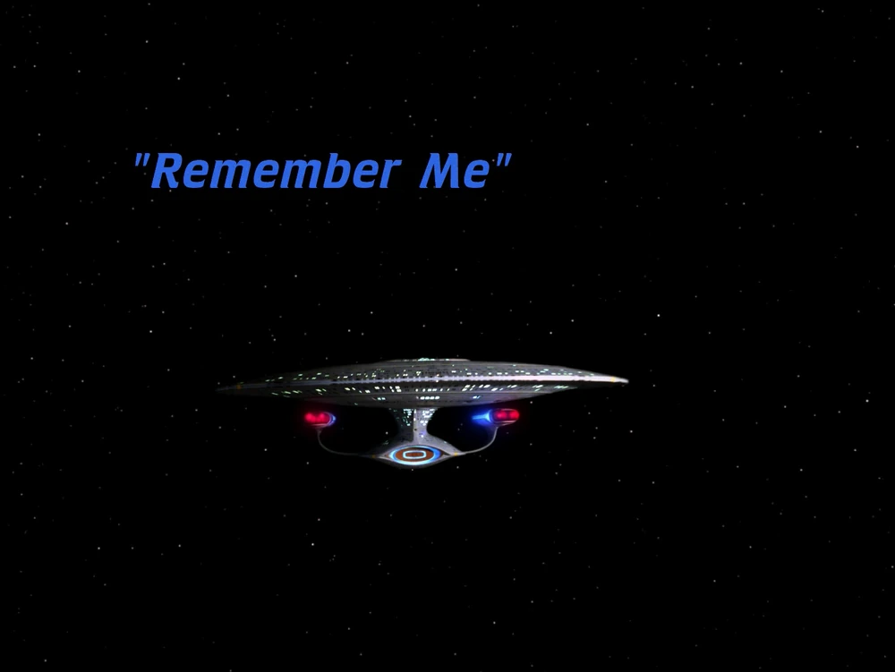
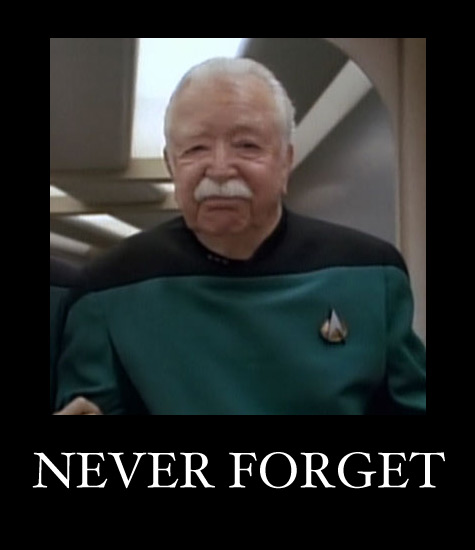
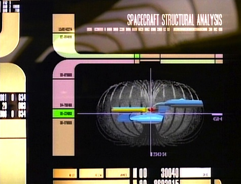
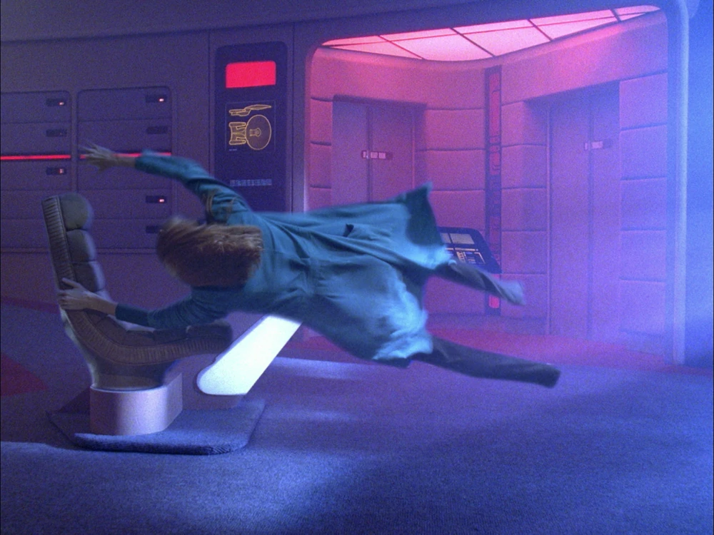

**TL;DR**: My self-hosted feed reading stack quietly shrank from hundreds of feeds down to 33 over the course of a year, and I didn't notice until my reading list got eerily quiet. The culprit: an unpaginated API call that turned "the 1000 most recent bookmarks" into a silent ceiling on my subscription list. I had been unsubscribing myself, one bookmark at a time.

<!--more-->

<figure class="fullwidth">

<figcaption>
  Star Trek: The Next Generation, <a href="https://memory-alpha.fandom.com/wiki/Remember_Me_(episode)">S04E05, "Remember Me"</a>
</figcaption>
</figure>

<nav role="navigation" class="table-of-contents"></nav>

## Rube Goldberg feed reader

So, I have what I think is a fun little self-hosted Rube Goldberg stack powering my feed reading these days. (And you know [I love](https://blog.lmorchard.com/2025/06/02/obsidian-rube-goldberg/) Rube Goldberg machines.)

First, I use [Linkding](https://linkding.link/) to collect bookmarks. My feed subscriptions live in there, tagged [feeds:subscriptions](https://links.lmorchard.com/bookmarks?q=%23feeds%3Asubscriptions).

Next, I use [linkding-to-opml](https://github.com/lmorchard/linkding-to-opml) to produce an OPML file from those bookmarks. This is [a little Go CLI tool I built](/2025/10/25/miscellanea/). It iterates through the tagged Linkding bookmarks, fetches the links, and figures out whether those links are themselves feeds or whether it needs to autodetect feeds from HTML pages. Then it builds an OPML file as a subscription list. I run this on a crontab schedule every half hour, so my subscription list stays current with my bookmarks.

Then, I use [feedspool-go](https://github.com/lmorchard/feedspool-go) - [another Go CLI tool that I built](https://blog.lmorchard.com/2026/01/26/feedspool-go-v0-2-0/) - to fetch feeds from that OPML subscription list and build a static website as my personal RSS newspaper. I run this on the same half-hour schedule - every 30 minutes, a fresh build.

<figure>
<mermaid-diagram>
graph TD
  A[Me, saving bookmarks] --> B[(Linkding)]
  B -->|tagged feeds:subscriptions| C[linkding-to-opml]
  C -->|cron, every 30 min| D[subscriptions.opml]
  D --> E[feedspool-go]
  E -->|cron, every 30 min| G[Static HTML newspaper]
  G -->|I read something good| A
</mermaid-diagram>
<figcaption>
  The stack, and the loop that turned out to matter
</figcaption>
</figure>

This stack has served me pretty well for the past year or so, with just occasional bug fixes and tweaks along the way. For the most part, the cronjobs percolated away on one of my basement homelab machines and I never bothered to peek at the logs or otherwise check up on them.

## The quiet

But lately I'd noticed that my reading list seemed to be getting quieter and quieter.

It was gradual enough that it took me until just last night to realize I was missing quite a few feeds from the regular rotation. It was kind of like that episode of Star Trek: The Next Generation - [S04E05, "Remember Me"](https://en.wikipedia.org/wiki/Remember_Me_(Star_Trek:_The_Next_Generation)) - where Dr. Crusher steadily loses people off the Enterprise but takes a while to work out that the problem is with her universe rather than her memory. 😅

<figure>

<figcaption>
  <a href="https://reactormag.com/star-trek-the-next-generation-rewatch-remember-me/">Pour one out for Dalen Quaice</a>, and for whichever feed went first.
</figcaption>
</figure>

Finally I ssh'd into the VM running the stack and took a look: only 33 feeds were getting fetched and published. I have 792 bookmarks tagged `feeds:subscriptions`. Where did they all go?!

Granted, a good chunk of those subscriptions are rather ancient. I've been accumulating and shedding RSS feeds for decades now, and more than a few of those sites have dropped off the web in that time. But a drop from hundreds to 33 seems a bit much.

## The bug

After a few hours of frustrated code-staring, I found it. Here's what `FetchBookmarks` looked like in linkding-to-opml:

```go
// Use linkding client to fetch bookmarks
// For now, we'll get all bookmarks and filter client-side
// The go-linkding library may support server-side filtering in the future
bookmarkList, err := c.client.ListBookmarks(linkding.ListBookmarksParams{
	Limit:  1000, // Get lots of bookmarks (adjust as needed)
	Offset: 0,
})
```

Past me left a comment describing the bug and then shipped it anyway. 🤦‍♂️

<figure>

<figcaption>
  <a href="https://memory-alpha.fandom.com/wiki/Remember_Me_(episode)">LCARS console.</a> Roughly what an hour of staring at <code>client.go</code> felt like.
</figcaption>
</figure>

Two things are wrong here, and they compound. The first is that this asks for a single page of 1000 bookmarks and then ignores the API's `next` link entirely. Linkding never returns the whole collection in one response - it pages everything - so any bookmark outside the 1000 most recently added was simply invisible to the exporter.

The second is that tag filtering ran *client-side*, over that already-truncated page. I never wired the tag search into the API query at all. So the page size wasn't just a limit on how much I fetched, it was a hard ceiling on how many tagged results could possibly come out the other end.

I have 34,568 bookmarks in Linkding. The exporter was looking at 1000 of them. Of those, 33 happened to carry the `feeds:subscriptions` tag.

And nothing errored. Nothing warned. The log line even reported a cheerful `total_fetched`, which looks perfectly healthy right up until you notice it was counting the length of the final page rather than the number of records actually read.

## Unsubscribing one bookmark at a time

Here's the part I find genuinely funny: that 1000-bookmark window is sorted newest-first, so it *slides*. When I first set this stack up, all my feed subscriptions happened to fall inside the window and everything worked great. But every new bookmark I saved pushed the oldest one out the back.

<figure>

<figcaption>
  "<a href="https://memory-alpha.fandom.com/wiki/Remember_Me_(episode)">Computer, how many feeds are in my subscription list?</a>"
</figcaption>
</figure>

So for the past year, every time I bookmarked an article, I had a chance of silently unsubscribing myself from a feed. I wasn't losing feeds because sites died. I was losing them because I kept adding new stuff.

The fix is boring: page until the collection is exhausted, advance the offset by the number of records actually received rather than the number requested (so a server that caps `limit` still pages correctly), and stop on an empty page as well as on reaching the reported count, so a wrong count can't spin the loop forever.

I also pushed the tag filter into the API query while I was in there. It turns out, despite my earlier comment, the golang library supported that just fine. 🤷‍♂️ Linkding treats a `#tag` token as an exact match, ANDs multiple tokens together, and ignores case - the same contract my client-side `matchesTags` was implementing. So the filter can run server-side and transfer 792 records instead of 34,568. I kept `matchesTags` running over every result anyway, so if Linkding's query semantics ever drift from my assumptions, the failure mode is slow instead of wrong.

## The bug behind the bug

Then, with pagination fixed, a second bug immediately surfaced.

`GenerateOPML` emitted one outline per successful feed discovery. But multiple bookmarks on the same site normally resolve to that site's single feed - three articles I saved from one blog are three bookmarks pointing at one `feed.xml`. So the OPML had duplicates, and any reader importing it would see the same feed listed several times.

This had been latent the whole time. With 33 results, a collision was unlikely enough that I never saw it. Across 792 bookmarks, 159 feed URLs repeat, which produced 628 outlines for 464 distinct feeds. Fixing the first bug is what made the second one big enough to trip over.

That one's fixed too now - keep the first result for each feed URL, so the `htmlUrl` a reader displays stays stable between runs.

## Anyway

Nice to solve a mystery, even if it's one I set for myself months ago. 464 feeds, and my reading list is nice and noisy again.

The thing I keep turning over is how *comfortable* the failure was. A crashed cronjob would have gotten my attention in a day. A cronjob that succeeds, exits zero, logs a cheerful `total_fetched`, and produces a slightly smaller OPML file every week is invisible for a year. The stack never stopped working. It just kept working a little bit less, and I adjusted my expectations to match right along with it.

Which is, come to think of it, exactly Dr. Crusher's problem.

<figure class="fullwidth">

<figcaption>
  <a href="https://memory-alpha.fandom.com/wiki/Remember_Me_(episode)">The static warp bubble collapses.</a> Eventually.
</figcaption>
</figure>

