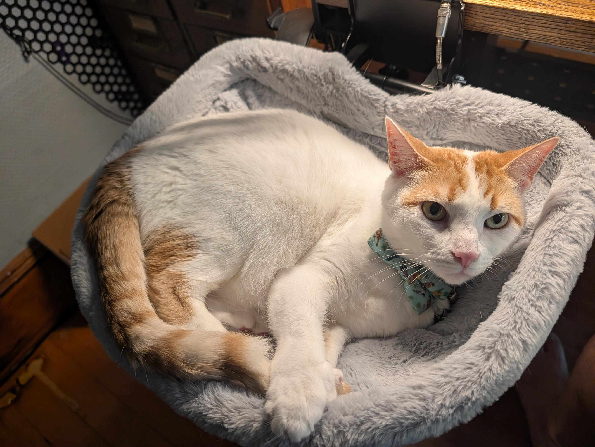
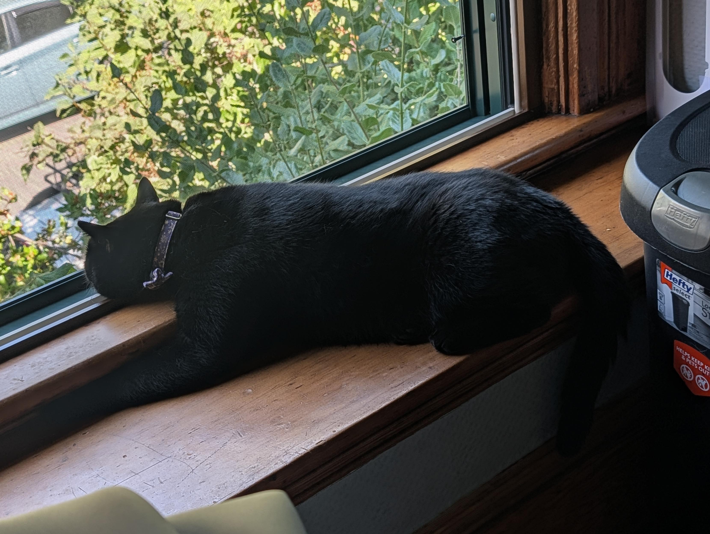
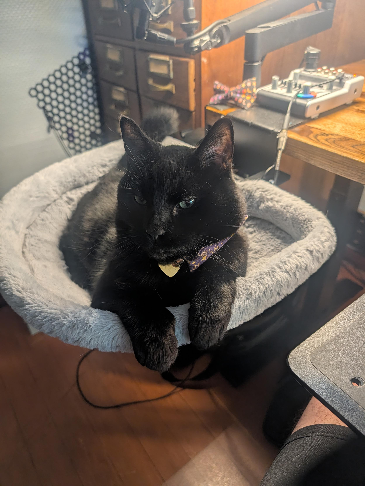
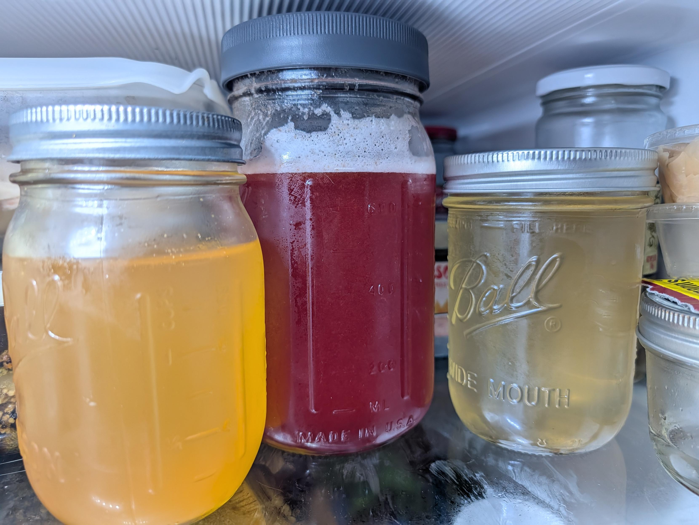
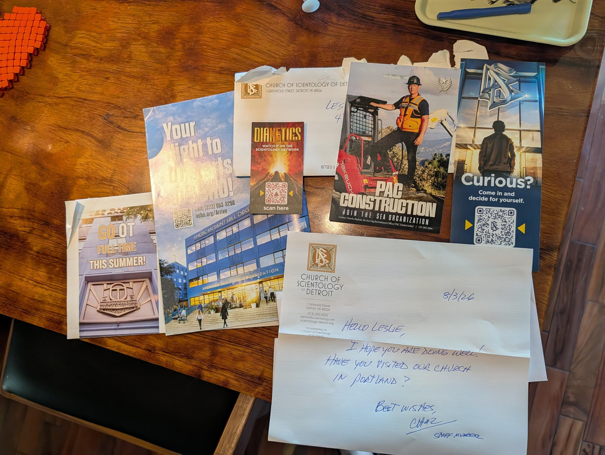

TL;DR: Catching up on a sprawling few weeks of infrastructure rebuilding—from porting C64 BASIC maze generators for the blog to rewriting my RSS feed reader in pure-Go SQLite—along with building a Fediverse ActivityPub bot in a day, resuming my Persona 5 Royal save on a jailbroken Switch via Moonlight, making street plum shrub, and receiving surprise mail from the Church of Scientology.

<!--more-->

<nav role="navigation" class="table-of-contents"></nav>

## 10 PRINT Backgrounds and Infrastructure

I tinkered a bit on the blog. I [ported a classic C64 BASIC maze generator](https://masto.hackers.town/@lmorchard/117124910950607264)—`10 PRINT CHR$(205.5+RND(1)); : GOTO 10`—into a background, which gives the site a different maze design every time you reload it.

Alongside that aesthetic update, I'm thinking about migrating the domain off the current AWS Cloudfront/S3 setup. Moving to an inexpensive cloud VM with config stored in a private git repo would let me support more dorky bells & whistles — like running my own `finger` server, auto-publishing `.plan` files straight from GitHub.

## Persona 5 Inception

One night's nerdy-ass activity involved taking advantage of the Steam sale to buy Persona 5 Royale for PC—I've bought this game like three times now. Since I already had over 40 hours into it on my Switch, I was inspired by [Matthew Brunelle recovering his save from a PS4](https://blog.matthewbrunelle.com/converting-a-ps4-persona-5-royal-ng-save-to-steam-with-adversarial-interoperability/) to take a look at extracting my saves.

Since the Switch is jailbroken, I was able to back up my save files. Believe it or not, the Switch saves are fully compatible with the PC version! No decoding, decrypting, or anything. I copied the files over to the approriate obscure Steam directory and seamlessly picked up my 40-hour save on the desktop. 

But it gets better. Or maybe weirder. The gaming PC lives down in the basement, running Sunshine so I can access it remotely with Moonlight. There happens to be [a homebrew Moonlight client for the Switch](https://github.com/XITRIX/Moonlight-Switch). So naturally, I started [playing P5R again on my Switch, via Moonlight, streamed from my gaming PC in the basement](https://masto.hackers.town/@lmorchard/117080401657039451). Why not? 

It did occur to me that I could take this one step further by firing up a Switch emulator on the gaming PC, and playing my old backup copy of P5R via Moonlight on the real Switch. But that'd just be gratuitous.

## Building a Fediverse Oracle

I also fell down a massive rabbit hole this week, getting back on my Fediverse bullshit. I started reviving my ancient [botpub](https://github.com/lmorchard/botpub) exploration—this was a thing where I was trying to see how much of a Fediverse thingy I could build with flat files, cloud storage, and serverless functions. No database, very minimal server processing.

Well, I still think it was a good idea. And I also kind of want to take a crack at building a kind of Fediverse Oracle, inspired by ye olde [Internet Oracle (aka Usenet Oracle)](https://internetoracle.org/) where folks submitted questions to the "oracle" and secretly answered other folks questions in the background anonymously.

It's still a mess, but I started a new [fediverse-oracle](https://github.com/lmorchard/fediverse-oracle) repo with the work so far.

The real fun, of course, was in the ActivityPub protocol quirks. And, I didn't do myself any favors by starting with GoToSocial as my initial test partner. GoToSocial is incredibly strict about, well, everything. (Not that that's a bad thing.)

I spent an inordinate amount of time fighting with Fastify to serve `.well-known` webfinger endpoints properly (it required an `onRequest` hook for static path rewriting so the dotfiles would resolve). Then I had to track down 401 errors caused by `keyId` assignment during outbox signing, and appease GoToSocial's incredibly strict parser requirements (it turns out it really wants the original Follow URI on Accept, not the full object). 

But it works, HTTP signatures are enforced, and it's running natively on Node. I might try tinkering with some Cloudflare deployments next?

## Feedspool Burn-down

On the topic of infrastructure, after finally solving [the mystery of my vanishing RSS feeds](https://blog.lmorchard.com/2026/08/22/vanishing-feeds/) (TL;DR: a tag query bug was slowly unsubscribing me from everything over the course of a year), bringing 400 feeds rushing back kicked off a massive development burn-down on `feedspool-go`.

I merged a dozen PRs this week to get the reader into fighting shape. The biggest architectural shift was ripping out the old in-memory filtering and migrating to a pure-Go SQLite setup, which let me implement robust full-text search using SQLite's FTS5 (complete with BM25 relevance sorting).

I also finalized an HTTP API for JSON read/write access, added multi-arch Docker support, and shipped a ton of quality-of-life features: atomic HTML rendering, per-feed User-Agent overrides, item annotations, and an HTML scraper feed type so I can finally follow sites that refuse to provide proper RSS feeds. 

On a broader level, a lot of this recent `feedspool-go` API work is me quietly laying the groundwork to make the reader much more accessible to AI agents. The end goal is to have an AI agent plug directly into the JSON feed API to produce daily personal newsletters that curate the firehose.

## Bring Your Own Music (BYOM) Updates

Between the fediverse and feedspool work, I also managed to cut some new releases for my [BYOM (Bring Your Own Music) Player](https://github.com/lmorchard/byom-player) and [Sync](https://github.com/lmorchard/byom-sync) tools. These power my little [mixtapes.lmorchard.com](https://mixtapes.lmorchard.com) site. Not sure if many folks are visiting it yet, but I'm personally using it more and more instead of Spotify.

I pushed v1.2.1 of the player this week, squashing some bugs around markdown emphasis anchors and making sure descriptions are properly preserved during syncs. I also finally landed support for index card links and description links, which makes the whole interface feel a lot more cohesive when you're browsing through massive media libraries.

And speaking of music, since I've been spinning so much synth-pop this month, here is exactly the kind of massive playlist I built the BYOM tools for in the first place:

<iframe style="border-radius:12px" src="https://mixtapes.lmorchard.com/zz-not-mine/the-25-best-synthpop-songs-of-2026-so-far/embed" width="85%" height="700" frameBorder="0" allowfullscreen="" allow="autoplay; clipboard-write; encrypted-media; fullscreen; picture-in-picture" loading="lazy"></iframe>

## Of Cats

Minnaloushe (the Hunk) and Cosmo are getting along thankfully well, with only a few sprints through the house chasing each other. I [posted a few photos](https://masto.hackers.town/@lmorchard/117130193195491929) of them taking over the fluffy grey cat beds and wooden windowsills. 

<image-gallery>

</image-gallery>

## Of Cars

I also [fell down a bit of a rabbit hole](https://masto.hackers.town/@lmorchard/117085150846696636) looking at retro 1970s hatchbacks — specifically silver AMC Gremlin Xs with those ridiculous orange, pink, and yellow stripes. The aesthetic of the late 70s and early 80s remains undefeated.

That car rabbit hole spun out into [dreaming about EV conversions](https://masto.hackers.town/@lmorchard/117117932819711122). I don't have the disposable income for it, but I've been wishing for a Slate truck that I could cover in stickers like a laptop to take on 5-mile grocery runs. 

What I *really* want, though, is if I had infinite money, I'd pay someone to find me another pristine 1983 AMC Eagle Station Wagon (my first car, which had fake wood paneling and which I drove until a wheel literally fell off) and convert it to electric.

<image-gallery>

</image-gallery>

## Of Plums

We have fruit trees lining the street around our house. Usually, we just let the late-summer fruit fall onto the sidewalk as a cleanup chore, or give a thumbs-up to furtive folks who come by with ladders to pick them. But this weekend, I [collected some street plums and pairs for a change](https://masto.hackers.town/@lmorchard/117112631849074083). I cleaned them, chopped them up, and threw them in a jar with sugar to try making a shrub. I might end up infusing some vodka or gin. 

## Of Scientology

In weirder news, the Church of Scientology [sent me a big batch of mail](https://masto.hackers.town/@lmorchard/117078913847645230). I haven't had contact with them since about 1995 in Michigan, but they've sent me a steady stream of leaflets and letters since then. They've managed to chase me across 3 states and a dozen house moves.

## Miscellanea

  * This mad lad live-coded a machine language SID music player in C64 BASIC DATA statements with a grid-based tracker reading from screen character RAM for live editing and persistence as REM statements in the same BASIC program. Oh and he wrote the machine language in straight decimal numeric opcodes, no assembler.
  <youtube-embed video-id="ly5BhGOt2vE" thumbnail="b42a6731f35c.jpg"></youtube-embed>

* In college, I read Julian Jaynes's [*The Origin of Consciousness in the Breakdown of the Bicameral Mind*](https://masto.hackers.town/@lmorchard/117080615401297600), pondering the notion that human minds weren't always unified in introspective consciousness as they are now. Like, one part of the brain literally talked to another part of the brain like a resident god voice giving orders. I was kind of obsessed with it for a bit, but almost no one I knew had ever read it. Now, this:
  <youtube-embed video-id="Ado90kMT_FM" thumbnail="6954ff4f35aa.jpg"></youtube-embed>

* Finished reading both [_The Faith of Beasts_](https://en.wikipedia.org/wiki/The_Faith_of_Beasts) and [_Livesuit_](https://en.wikipedia.org/wiki/Livesuit) by James S. A. Corey, as well as [_Children of Strife_](https://bookshop.org/p/books/children-of-strife-adrian-tchaikovsky/a5faafb97f58dfb0) by Adrian Tchaikovsky in the past few weeks. Just absolutely snarfed them all down.

* [My review](https://masto.hackers.town/@lmorchard/117134784051770734) of Children of Strife goes like this:
  > Man... his Children of Time series, in between all the cosmic strangeness and body horror and high concept sci-fi, somehow ends up being as optimistic and sensawunda-ful as the best of Star Trek.

* I finally set up a minimal Finger daemon using my own little Python script. You can now `finger me@lmorchard.com` and get an ASCII cow saying "Just setting up my finger!" (This was part of the whole push to move off S3 and onto a cloud VM).
  
* [When online commenters 'detect' my art as AI](https://www.davidrevoy.com/article1164/when-online-commenters-detect-my-art-as-ai) - wherein AI witchhunts hurt real artists like David Revoy as collateral damage.

* [RIP Claude](https://randsinrepose.com/archives/rip-claude/) - Rands reflecting on what it means when almost every writing tool starts invisibly injecting text watermarks into your prose.
* [Astro's GitHub issue backlog is heading to zero](https://thenewstack.io/cloudflare-astro-triage-bot/) - A look at how Cloudflare's triage bot is actually keeping an open-source project above water.

* [Vibecoding isn't as fun as writing code by hand](https://www.autodidacts.io/vibecoding-isnt-as-fun-as-writing-code-by-hand/) - "Vibecoding is like being an executive of a large company that is barely under your control. You never feel like you really know what’s going on..." I feel this in my bones.

* [Why shaming people about AI slop isn’t enough to stop Big AI](https://www.anildash.com/2026/08/21/ai-slop-and-shame/) - Anil Dash with the spot-on take that individual shame isn't a substitute for structural regulation.

* [How I make my blog posts more resilient](https://michaelharley.net/posts/2026/08/05/how-i-make-my-blog-posts-more-resilient/) - Michael Harley noticing that the parts of his archives that survived 14 years were the parts he owned and kept simple.

* [The asteroid currently hitting frontend web development](https://nolanlawson.com/2026/08/23/the-asteroid-currently-hitting-frontend-web-development/) - Nolan Lawson observing how the advent of LLM coding tools is drastically lowering the cost of framework rewrites. But, at the same time, it's really shaking up the snowglobe of what web development and web developers are *for*.

* [talk: the P2P chat from 1983 that a VPN brought back to life](https://en.andros.dev/blog/03a4ffb9/talk-the-p2p-chat-from-1983-that-a-vpn-brought-back-to-life/) - A wonderful bit of digital archaeology getting the old UNIX `talk` command working over modern networks.

* And for a quick hit of nostalgia, I bookmarked [romm](https://github.com/rommapp/romm), a self-hosted ROM manager and player that looks genuinely beautiful.

* And speaking of retro, [TERMinator](https://deadmodemsociety.com/terminator/) is a very cool modern BBS terminal emulator built for connecting to legacy systems over Telnet.

