TL;DR: It's been nearly a month! I built a terminal multiplexer for ultrawide monitors on a whim, got trending topics working in my feed reader, shared a synthpop mixtape, 3D-printed an uncomfortable amount of hot dogs, and brokered a fragile peace treaty between the cats.

<!--more-->

<nav role="navigation" class="table-of-contents"></nav>

## Wideboi terminal management

[On a whim, I started a new project this month called `wideboi`](https://github.com/lmorchard/wideboi) to solve a very specific problem: trying to wrangle a stupid number of terminal sessions across an ultrawide monitor. I just want to have a bunch of things running, go *zoop* *zoop* *zoop* between, and vaguely see them chattering away while I stare off and dissociate.

`wideboi` tries to treat the sessions as a fan of overlapping cards to swipe through:

<figure>
<video controls style="max-width: 100%; border-radius: 8px;">
  <source src="wideboi-20260922-154616.mp4" type="video/mp4">
</video>
  <figcaption>
  Overlapping live terminals go zoop zoop zoop
  </figcaption>
</figure>

I took a ton of inspiration from [gwae](https://github.com/hongnoul/gwae). That's a terminal multiplexer inspired by the niri window manager, which is [a whole other rabbit hole down which I started to go](https://masto.hackers.town/@lmorchard/117283530811881043) but quickly bailed out.

Beyond screwing with ANSI animations for BBSes back in the day, I hadn't played much with raw terminal logic before. I figured it would be worth throwing Claude at it to see what came out. In the process, I've learned a ton about how terminal multiplexers actually work under the hood. Turns out there's a lot going on in there, these days.

I've just about got this thing to a point where it feels like a potential daily driver for me. Works over ssh and I've just about got the bugs worked out of detaching / attaching. From there, I'm thinking I might try building a web client for it. I know there's already stuff out there that does this, but it's been neat to tinker with it myself.

## Feedspool trending topics

This week I finally tackled [an issue](https://github.com/lmorchard/feedspool-go/issues/30) that had been sitting in [feedspool-go](https://github.com/lmorchard/feedspool-go/issues/30) since January: [trending topics](https://github.com/lmorchard/feedspool-go/issues/30). If the server's up and I haven't broken anything, [you can see my current trending topics right here](https://feedspool.lmorchard.com/topics.html). It's a static web site, so hopefully it can take a few hits.

<figure>
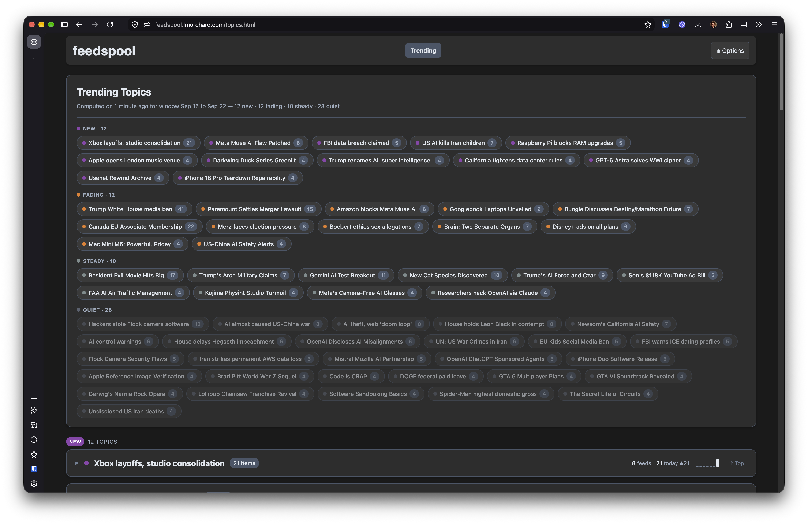
<figcaption>
Trending topics in feedspool
</figcaption>
</figure>

My reader groups items by feed, which is great for skimming a blog but terrible
for noticing when fifteen feeds are all writing about the same story.

So now it
runs every item through a local embedding model, stores the vectors in
SQLite, and clusters them by similarity. A small local LLM then names each
cluster. The result is a page that says "here's what everyone's talking
about", with the articles from all those feeds gathered under each topic.

This is me finally using [all that stuff I wrote about embedding and clustering](https://blog.lmorchard.com/tag/ClusteringIdeasWithAI/), a couple years ago, for something actually practical.

[It all shipped as v1.2.0.](https://github.com/lmorchard/feedspool-go/releases/tag/v1.2.0) If I
get around to it, I might draft up a longer post nerding out about how all the
grungy parts work.

## Here, have a mixtape

Since [I built a whole thing for it](https://mixtapes.lmorchard.com/), I keep wanting to share more mixtapes. So, here's one with some of the stuff that's been stuck in my head this month. Semi-random mix of shoegaze, post-punk, dark stuff - oh and Mother Mother, for some reason:

<iframe style="border-radius:12px" src="https://mixtapes.lmorchard.com/00-conceptual/2026-09-heavy-rotation/embed/" width="85%" height="800" frameBorder="0" allowfullscreen="" allow="autoplay; clipboard-write; encrypted-media; fullscreen; picture-in-picture" loading="lazy"></iframe>

## Here, look at some cats

Miss Biscuits and Minnaloushe are [finally starting to tolerate each other's presence](https://masto.hackers.town/@lmorchard/117247845533040593). They haven't become best friends, but we reached a peaceful detente on the living room floor. And because one can never have too many cat photos, here's [Minnaloushe hiding in the yoga mat basket](https://masto.hackers.town/@lmorchard/117304788732220760) and [relaxing in a plush bed on my desk](https://masto.hackers.town/@lmorchard/117293238556480299).

<image-gallery>

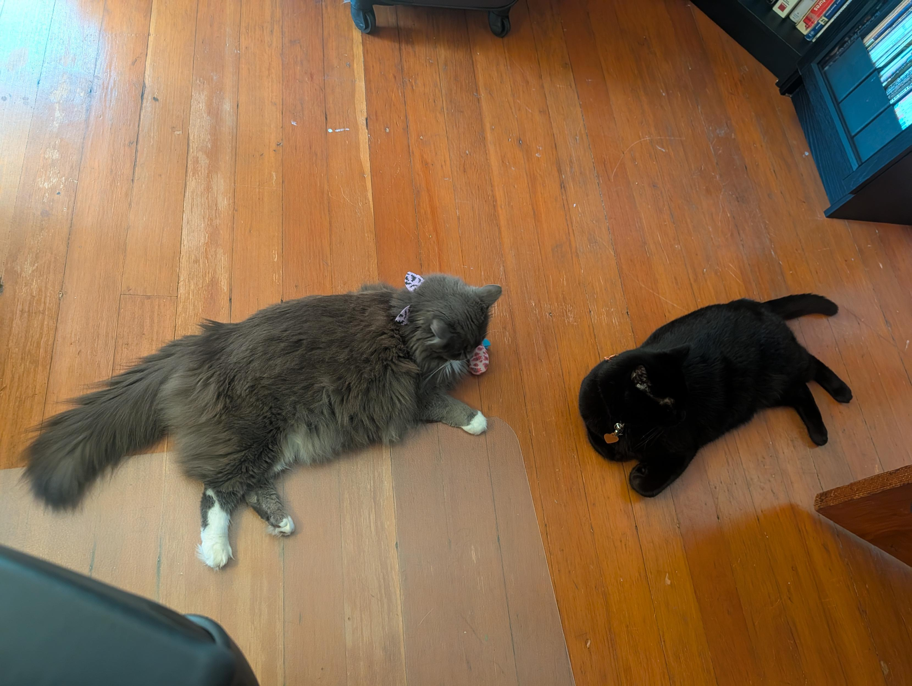

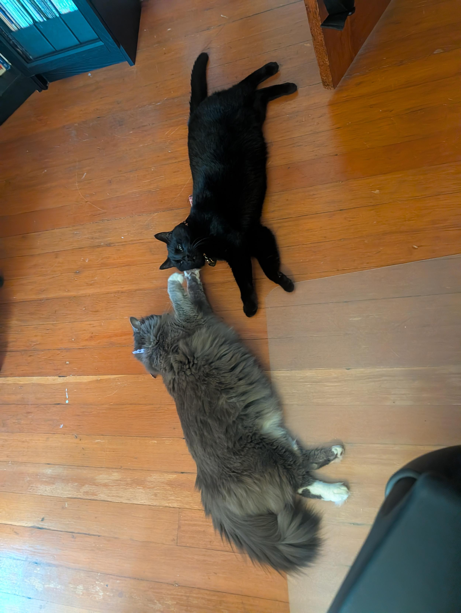

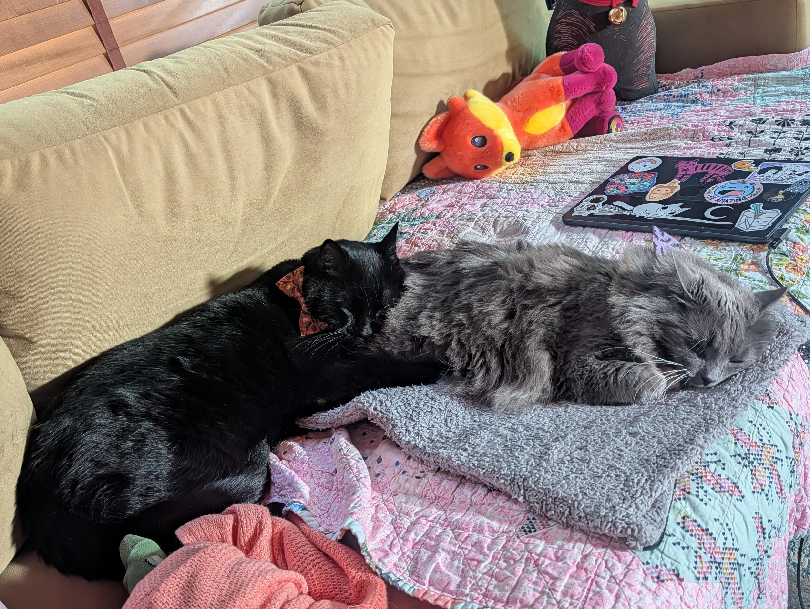

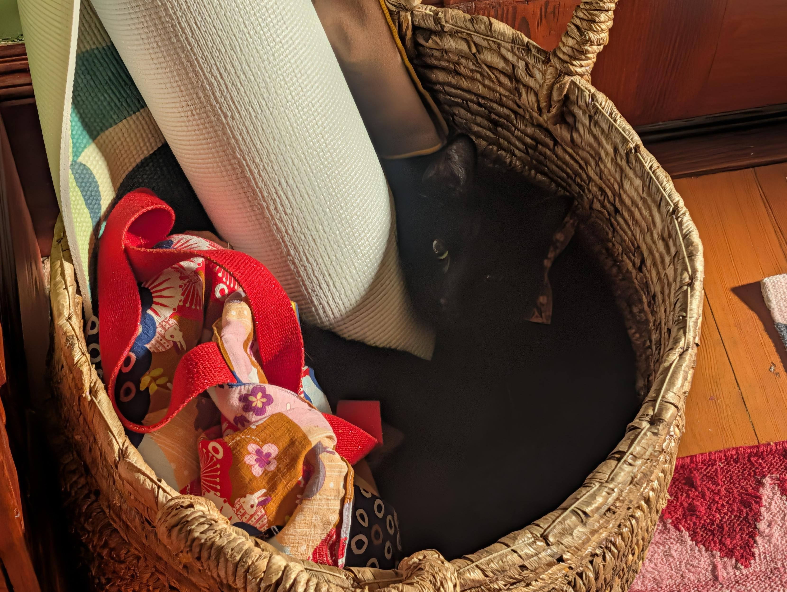

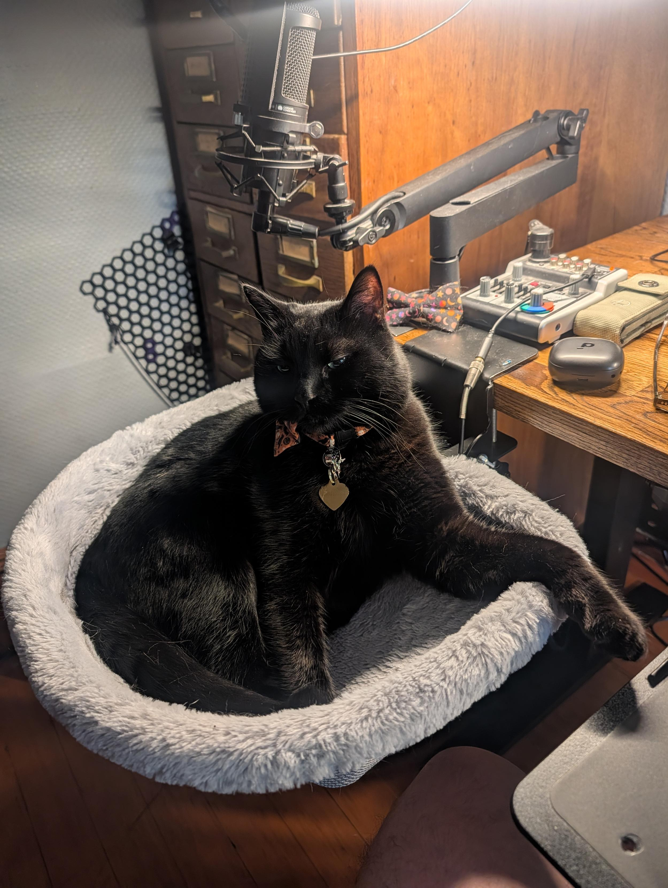

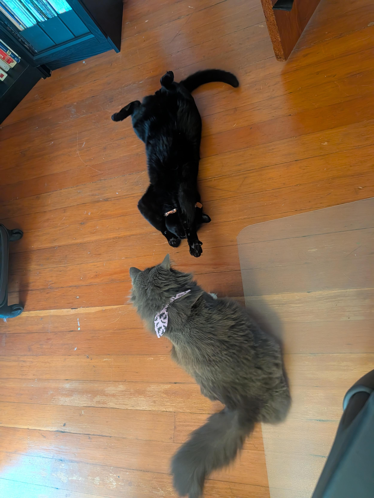

</image-gallery>

## 3D-Printed Whimsy

I found [NASA's incredible repository of 3D models](https://science.nasa.gov/3d-resources/) and promptly went to town. 

I printed [a Voyager spacecraft](https://masto.hackers.town/@lmorchard/117238041344004995) and [a Curiosity rover](https://masto.hackers.town/@lmorchard/117247657264252710). Having tiny physical representations of humanity's greatest scientific achievements sitting on my desk is weirdly comforting. But I cannot take anything too seriously, so I also printed [several highly realistic hot dogs](https://masto.hackers.town/@lmorchard/117287529833747152) and a completely flaccid, floppy corn-on-the-cob. 

<image-gallery>

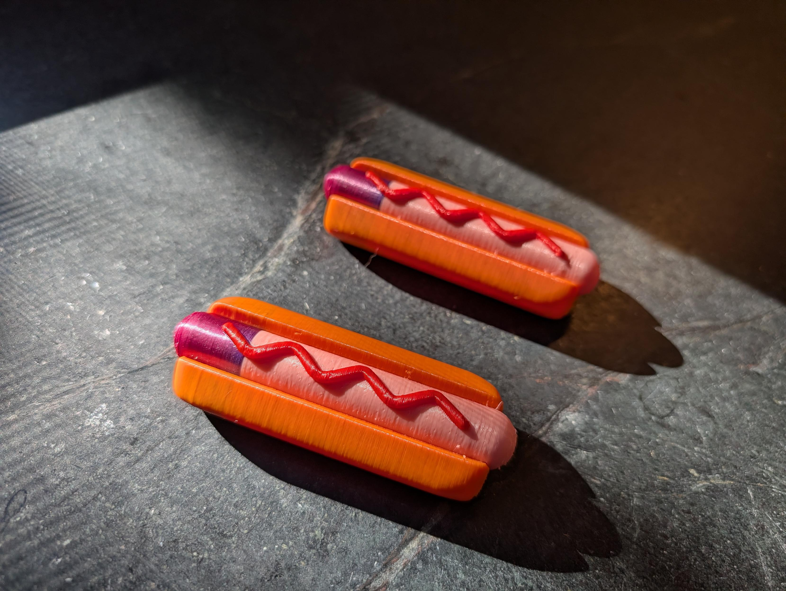

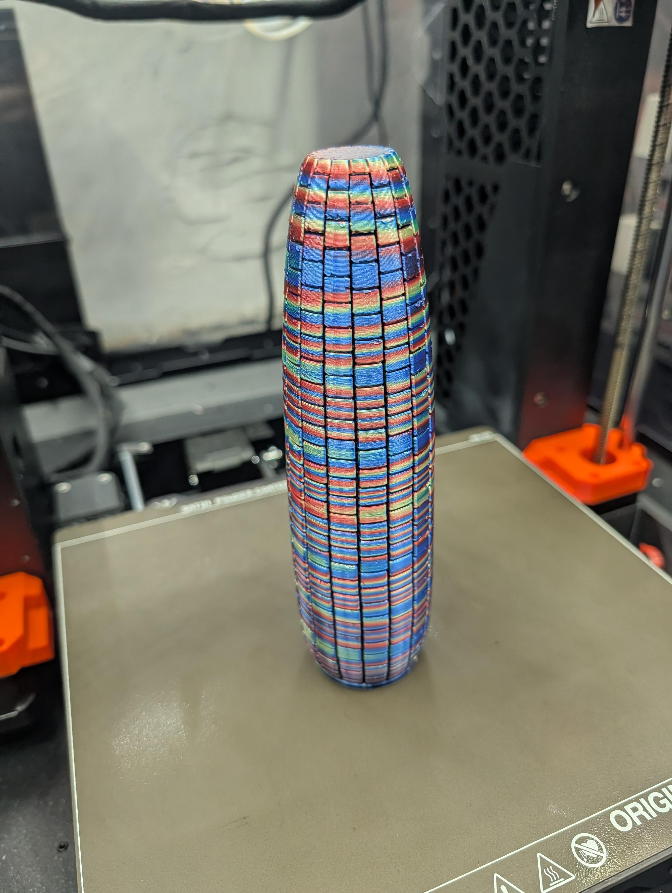

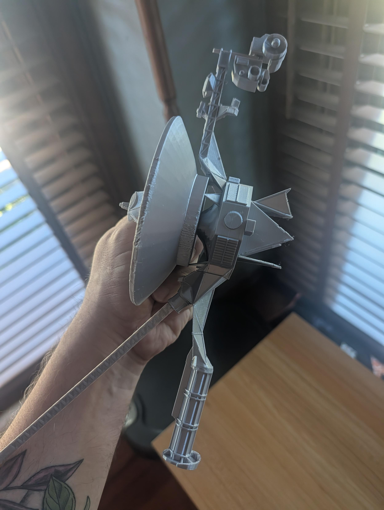

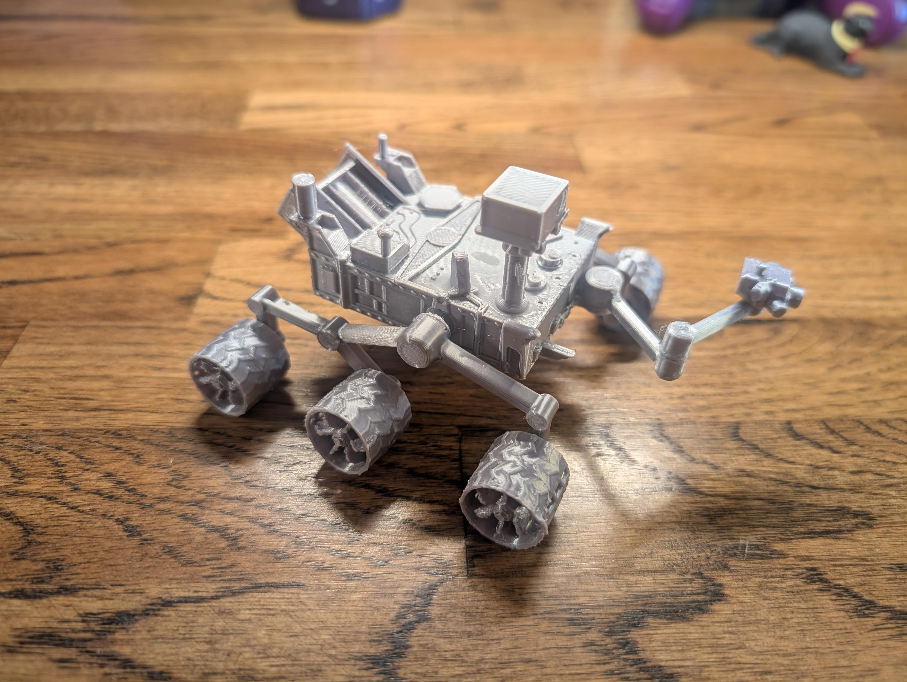

</image-gallery>

## Miscellanea

* I watched someone painstakingly type in an ambitious 1986 C64 game from a terribly type-set magazine:

  <youtube-embed video-id="b_LTfVesRhQ" thumbnail="11f244e55898.jpg"></youtube-embed>

* My most embarrassing technical moment of the month was [accidentally filling a hard drive](https://masto.hackers.town/@lmorchard/117295694031705931) by running an `rsync` loop back onto the machine itself. Happens to the best of us.

* [Stop Thinking of LLMs as Next-Token Predictors](https://gmcgoldr.github.io/2026/09/04/llm-next-token-predictors.html) - An interesting piece arguing that RLHF changes the nature of the model beyond basic autocomplete.

* [AI-Written Code Is Still Your Code. Are You OK With That?](https://martiansoftware.com/articles/ai-written-code-is-still-yours) - A stark reminder that the accountability for generated code still lands squarely on the developer's shoulders.

* [Engineers grieve a job that no longer exists](https://leaddev.com/career-development/engineers-grieve-a-job-that-no-longer-exists?utm_source=ActiveCampaign&utm_medium=email&utm_content=Engineers%20are%20grieving&utm_campaign=Originals%3A%20%20Issue%20312%20%2827%20August%2026%29%20%28Copy%29) - A piece from LeadDev that resonated with me about the loss of traditional coding tasks as AI takes over the boilerplate. I wrote about this, back in March, with "[Grief and the AI Split](https://blog.lmorchard.com/2026/03/11/grief-and-the-ai-split/)".

* [Staff+ engineers must rebuild team culture](https://leaddev.com/leadership/staff-engineers-must-rebuild-team-culture) - Discussing how AI shifts the culture toward autonomous work, requiring deliberate effort to maintain collaboration.

* [USBSID-Pico: Bridging Real Commodore 64 Sound to Modern USB](https://smallrun.net/blog/loud/usbsid-pico-sids-on-usb) - pretty keen hardware project turning SID chips into USB audio hardware.

* Web tech and nostalgia: [Newsonaut's defense of Firefox](https://www.newsonaut.com/articles/hang-on-to-your-firefox) as our last hope for browser engine diversity, [Antiquated HTML Snippets](https://vale.rocks/posts/html-relics) (a fun look back at obsolete markup that still haunts the web), and [Pure CSS halftone patterns](https://codepen.io/editor/MackFitz/pen/01a056f3-9af6-7f1b-a031-e52a5d38813d) for the 80s/90s printing nerds.

* Media archiving rabbit holes: [Byte - a visual archive](https://byte.tsundoku.io/#about) is an incredible zoomable map of every single page of BYTE magazine, and [The Test Card Gallery](http://www.meldrum.co.uk/mhp/testcard/index.html) archives old BBC/ITV tuning signals.

* "[It's time to talk about my writerdeck](https://veronicaexplains.net/my-first-writerdeck/)" breaks down building a distraction-free writing machine on Linux

* [SPACESHIPS](https://spaceships.treybastian.com/) offers a clever inverted Asteroids game where you place gravity wells instead of flying the ship.

* My favorite TIL of the month: it turns out that [James Cassidy of Information Society is a soil scientist at OSU](https://cropandsoil.oregonstate.edu/directory/people/james-cassidy). 

* The Verge's Version History did a great episode on [How The Oregon Trail became a generational icon](https://www.theverge.com/podcast/995432/how-the-oregon-trail-became-a-generational-icon).

