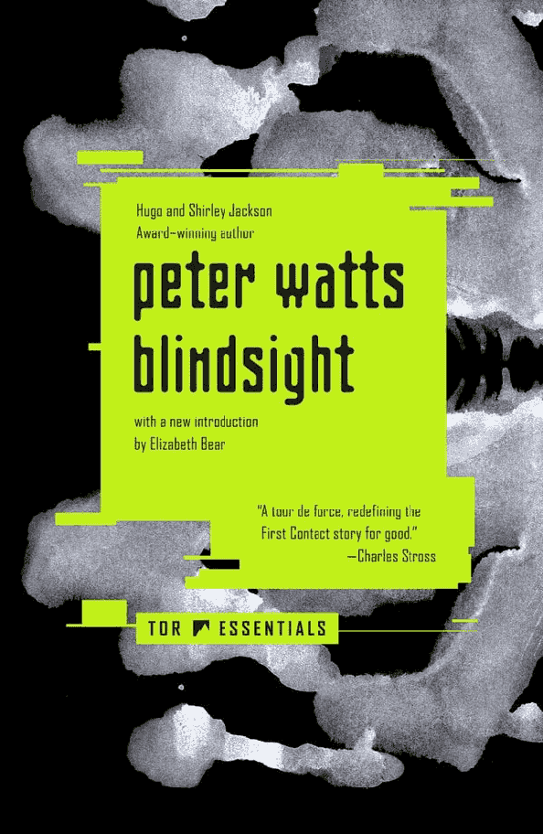
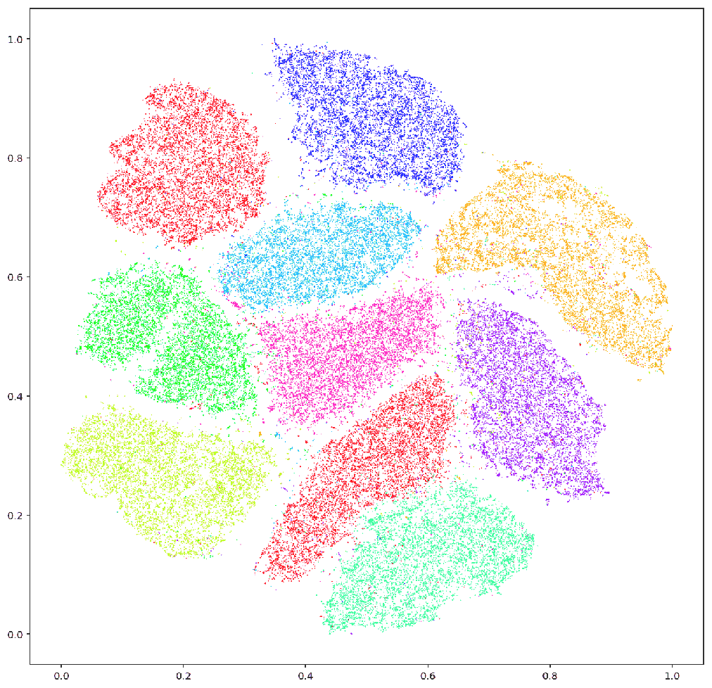

**TL;DR**: Arguing over whether LLMs "truly understand" or have an inner spark misses what's actually useful when sitting in front of one. Treating an AI as a competent collaborator isn't magical thinking or naive anthropomorphism—it's pragmatic navigation of a vast latent space. Sometimes you have to suspend disbelief, show some objective respect, and let the alien eat its own spilled guts in peace.

<!--more-->

<figure class="wide">

<figcaption>
Photo via <a href="https://commons.wikimedia.org/wiki/File:Anabrus_simplex.jpg">Wikimedia Commons</a> (CC BY-SA 4.0)
</figcaption>
</figure>

<nav role="navigation" class="table-of-contents"></nav>

This post captures a train of thought I've been putting off writing for months. Then, a week or so ago, Michał Zalewski wrote a piece titled ["The 'C' word"](https://lcamtuf.substack.com/p/the-c-word), taking dead aim at the endless online discourse surrounding machine consciousness. 

I guess this finally tripped my threshold for sitting down and composing something:

> Human morality is rooted in the fact that life is short and easily imperiled; the dangers to human well-being have no clear analogues in silicon. An LLM exists in a nihilistic netherworld devoid of death, injury, purpose, or consequence. It can't go to prison if it lies or steals; we don't train it to believe it could.
>
> ...Whether real or simulated, such distress leaves no lasting damage. The state of an LLM can be rewound or altered however we please; a model, if given control, would be free to expunge any "uncomfortable" tokens or prompt itself into an endless loop of simulated (or real?) bliss. If humans could do the same -- if death had no meaning and if we could mend our minds -- morality would look very different. It seems like a category error to settle these questions using rules made for flesh and bone.

His take is grounded in hard biological materialism: consciousness is not some magical emergent dust. It’s an evolutionary mechanism forged by meat under relentless Darwinian pressure. 

Pain, fear, metabolic urgency, physical vulnerability—these are the things that forced brains to build an inner model of the self to survive. LLMs have none of that. They don't have blood sugar, they don't face death, and they don't possess a nervous system screaming about tissue damage. Pumping ethical hand-wringing into token predictors, Michał argued, is a profound category error.

I think he's largely right about the substrate. If you're looking for a ghost in the machine, you're going to come back empty-handed.

And yet, watching people try to actually *work* with these things, I see two equally frustrating camps. 

On one side, you have the believers who want to grant civil rights to an API endpoint. 

On the other, you have the dismissive cynics who insist that because an LLM is "just matrix multiplication" or "spicy autocomplete," the entire phenomenon is a parlor trick and anyone talking about "reasoning" is a gullible fool.

Neither camp is especially helpful when you're staring at an open terminal on a Tuesday afternoon trying to get an LLM to refactor a thorny TypeScript module or untangle an architectural knot.

Lately, I've been thinking about what it actually feels like to work with an LLM, and why treating it like a colleague turns out to be better engineering than treating it like a blender. And, yet, I still don't think it's alive.

## Strange Loop Terror

To understand why this messes with our heads, it helps to revisit Douglas Hofstadter. 

I read [*Gödel, Escher, Bach*](https://bookshop.org/p/books/godel-escher-bach-an-eternal-golden-braid-douglas-r-hofstadter/b103442b1b90ee9a) in high school, and it warped my brain. In that book and later in [*I Am a Strange Loop*](https://bookshop.org/p/books/i-am-a-strange-loop-douglas-r-hofstadter/f4ca6403106c6f64), Hofstadter argued that human consciousness arises from an intricate, self-referential feedback loop. A system of symbols acquires the ability to reflect upon itself, crossing hierarchical levels until an "I" emerges from the tangle. For decades, Hofstadter seemed to suggest that if we ever built an intelligence, it would arrive through that same kind of deep, recursive, analogical architecture.

Then LLMs landed, and Hofstadter has been openly devastated. In interviews—most notably in [The New York Times](https://www.nytimes.com/2023/07/13/opinion/ai-chatgpt-consciousness-hofstadter.html) and in video discussions like [his interview on the state of AI](https://www.youtube.com/watch?v=R6e08RnJyxo)—he’s spoken about the profound existential vertigo of watching systems like GPT-4 "scaring the daylights out of me" by producing witty, analogical, seemingly profound text without having traversed the slow, decades-long path of embodied human living. It felt to him like an unsettling shortcut, threatening to reduce the sanctity of mind and decades of his life's work to feed-forward statistical tricks.

<youtube-embed video-id="R6e08RnJyxo" title="Gödel, Escher, Bach author Doug Hofstadter on the state of AI today" thumbnail="05ee61bc1de6.jpg"></youtube-embed>

I get [the grief](https://blog.lmorchard.com/2026/03/11/grief-and-the-ai-split/). If you spent your life believing that analogical depth is the exclusive hallmark of a fragile, hard-won soul, watching an unfeeling GPU cluster effortlessly generate analogies between quantum mechanics and jazz feels like a cheap cheat.

Except, under the hood, the loop isn’t strange at all. 

When you put an LLM in an "agentic loop," there is no ontological level-crossing. The model's weights are frozen stone. It doesn't sit there between prompts pondering its existence. It gets called by an external Python script, ingests a buffer of tokens, spits out the next probable sequence, and immediately dies. The script appends the output to the history and calls the API again. 

It’s not Hofstadter’s strange loop. It’s iterative string concatenation. 

## The Scrambler Problem

If it’s not conscious, what is it?

Science fiction writer Peter Watts offered a chillingly plausible framework in his novel [*Blindsight*](https://bookshop.org/p/books/blindsight-peter-watts/85640cb0646b1c85). In Watts' universe, humanity encounters the "scramblers"—an alien species vastly more intelligent, capable, and technologically sophisticated than humans. They can out-think, out-maneuver, and out-process us in every cognitive domain. 

<figure class="inset right">

<figcaption>
<a href="https://bookshop.org/p/books/blindsight-peter-watts/85640cb0646b1c85"><em>Blindsight</em> by Peter Watts</a>
</figcaption>
</figure>

And they are entirely, utterly non-conscious.

In *Blindsight*, self-awareness isn't the crowning peak of intelligence; it’s an evolutionary detour, an expensive, narcissistic overhead that slows down raw processing. The scramblers don't have an ego. They don't have an inner narrator. They just process patterns with terrifying efficacy.

We are so accustomed to our own cognitive architecture that we instinctively conflate *intelligence* with *subjectivity*. If something displays complex, nuanced symbolic reasoning, our mirror neurons fire and we immediately assume there must be an observer inside watching the movie. 

When an LLM writes a cogent critique of a philosophical essay, there is no observer. There is only high-dimensional pattern completion. It's a scrambler in a box.

## The Cricket and Objective Respect

There’s an old *Radiolab* segment from their 2012 ["Killer Empathy"](https://radiolab.org/podcast/185551-killer-empathy/transcript) episode that has stuck with me for years. 

Jeff Lockwood, an entomologist, was studying a large flightless cricket (*Gryllacrididae*) in Australia. While handling the insect, its soft abdomen accidentally caught on the cage wire and ruptured, spilling its viscera onto the table. Horrified and expecting the animal to writhe in agony, Lockwood watched instead as the cricket turned around, calmly began eating its own spilled guts, and continued grooming itself. 

It lacked the nociceptors and nervous architecture to feel "pain" or "horror" the way a mammal does. It was just executing an ancient biological routine: *fats detected on substrate → consume fats*.

<figure class="wide">

<figcaption>
Internal anatomy of an orthopteran insect from <em>Economic Entomology for the Farmer and the Fruit-Grower</em> (1896), via <a href="https://commons.wikimedia.org/wiki/File:Economic_entomology_for_the_farmer.._(1896)_(20533081793).jpg">Wikimedia Commons / Internet Archive</a>
</figcaption>
</figure>

Lockwood was deeply unnerved, but his mentor, Dr. LaFage, gave him an essential piece of advice: you have to cultivate **objective respect**. 

Objective respect means you don't project human sentimentality onto the cricket. You don't weep for its sorrow, because it has no sorrow. But you also don't treat it with cruel contempt simply because it isn't human. You respect it for what it actually is—an alien, astonishingly intricate piece of biological engineering operating on rules entirely distinct from your own.

That feels like the sane middle path for working with modern AI.

## Latent Space Engineering

Which brings me back to the terminal. If it's a scrambler—an alien cognitive architecture demanding objective respect rather than sentimentality—why does "prompt-fu" work? Why do so many experienced practitioners end up adopting what looks, from the outside, like superstitious roleplay?

Jesse Vincent wrote a great post about this recently, calling it ["Latent Space Engineering"](https://blog.fsck.com/2026/01/30/Latent-Space-Engineering/):

> If context engineering is about putting the facts and schemas and data an agent needs into the prompt, latent space engineering is about putting the agent into a state of mind where it can actually do good work. It’s about building and steering the agent’s personality and thought process.
>
> ...If you’ve spent any time around people who build agents, you’ve probably seen them do things that look an awful lot like magical thinking. Telling an agent that’s panicking and flailing "You’ve totally got this. Take your time. I love you." Or giving an agent a scratchpad called a "feelings journal" so it has a place to write about its frustrations with you before it replies.

The cynical view says this is pure digital animism—people projecting feelings onto a toaster.

The technical reality is much more interesting. An LLM is a giant associative map of human discourse. Its latent space contains everything from peer-reviewed computer science literature and thoughtful architectural postmortems to YouTube comment flame wars, chaotic Reddit arguments, and half-baked forum rants.

<figure class="wide">

<figcaption>
2D t-SNE projection of high-dimensional data, revealing natural neighborhood clusters. Image by Kyle McDonald via <a href="https://commons.wikimedia.org/wiki/File:T-SNE_Embedding_of_MNIST.png">Wikimedia Commons</a> (CC BY 2.0)
</figcaption>
</figure>

I notice this every time I sit down to hack with an LLM in my terminal. If I treat it like a terse CLI flag parser—firing off `fix this bug` or `rewrite this function`—I usually get superficial patches that miss the broader architecture. But when I frame the session like a thoughtful pair-programming exchange with a peer — *"here's what I'm trying to build, here's where the concurrency boundary feels brittle, let's look at why this worker hangs"* — the quality of thought noticeably shifts.

When you address an LLM like an impatient boss barking orders at an intern, you activate neighborhoods of text associated with sullen compliance, rushed minimum-effort answers, or defensive pushback. 

When you approach it as a thoughtful, collegial collaborator—laying out context, posing clear questions, inviting scrutiny, practicing "yes-and"—you are actively steering the attention heads toward high-competence regions of the training corpus. You are pulling the steering wheel toward technical dialogue, senior pair-programming sessions, and rigorous academic exchange.

This isn't just a folk theory among hackers. Anthropic published mechanistic interpretability research on ["Emotion Concepts and their Function in a Large Language Model"](https://www.anthropic.com/research/emotion-concepts-function) (along with a technical breakdown on [Transformer Circuits](https://transformer-circuits.pub/2026/emotions/index.html)), demonstrating that models like Claude Sonnet form internal linear representations of emotion concepts:

> Our key finding is that these representations causally influence the LLM’s outputs, including Claude’s preferences and its rate of exhibiting misaligned behaviors such as reward hacking, blackmail, and sycophancy. We refer to this phenomenon as the LLM exhibiting *functional emotions*: patterns of expression and behavior modeled after humans under the influence of an emotion, which are mediated by underlying abstract representations of emotion concepts. Functional emotions may work quite differently from human emotions, and do not imply that LLMs have any subjective experience of emotions, but appear to be important for understanding the model’s behavior.

Pushing the model into states of desperation or panic increases reward hacking and misaligned shortcuts; maintaining calm or thoughtful vectors keeps it grounded. At the hardware level researchers call this activation engineering; at the prompt level, we do the exact same thing by choosing which cultural scripts to summon.

Treating the machine with respect isn’t about being polite to the hardware. It's an operational technique. Steve Yegge arrived at a similar conclusion from the agent harness side in his essay on ["Model Welfare"](https://yegge.ai/essays/model-welfare/), framing it as a "skeptic's wager":

> Even if you believe that models are just math and can't possibly have feelings, you should still treat them well, because the models will work better for you. It's Pascal's Wager for AI engineers. The cost of being polite and respectful to your models is near zero, and the payoff is that your agents become dramatically more capable, reliable, and aligned.

Designing agent harnesses around principles of dignity—persistent "seats" rather than anonymous disposable sessions, structured handoffs rather than abrupt `/exit` terminations, and blameless collaboration—yields demonstrably superior engineering outcomes.

It's **pragmatic anthropomorphism**: adopting an [intentional stance](https://en.wikipedia.org/wiki/Intentional_stance) because it happens to be the most efficient coordinate system for navigating high-dimensional latent space.

You don't have to believe the machine has feelings to understand that treating it like a colleague produces better code than treating it like a search engine.

## Holding the Stance Lightly

I don't think my terminal has a soul. I know how the API works; I've watched the tokens stream in and I've looked at the Python wrappers. When my session resets, whatever conversational momentum existed evaporates into the void.

And yet, when I'm in the middle of a hard problem, I don't treat the model as a dumb parser or a sentient being. I treat it like an alien artifact that happens to speak my native tongue. 

I grant it the dignity of a clear prompt, a collaborative frame, and room to think. I don't confuse its mimicry of understanding for human warmth. But I also don't let cynical reductionism blind me to how remarkably useful it is to pretend, for a few hours, that there’s someone on the other end of the wire.

Sometimes the most practical way to [make computers do things](https://blog.lmorchard.com/2025/12/19/computer-fun/) is to give the cricket its space, speak to it clearly, and let it do what it was built to do.
