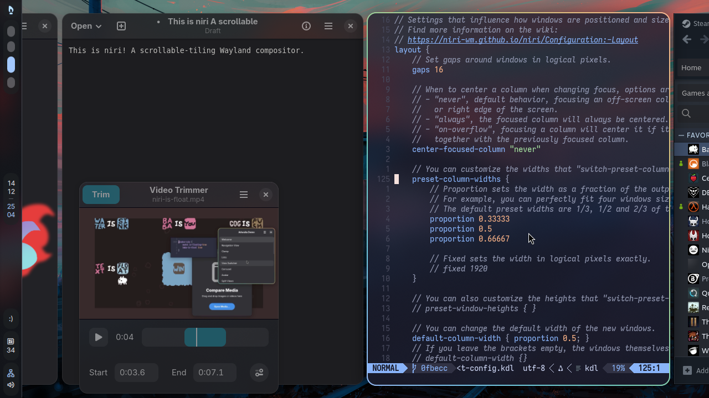
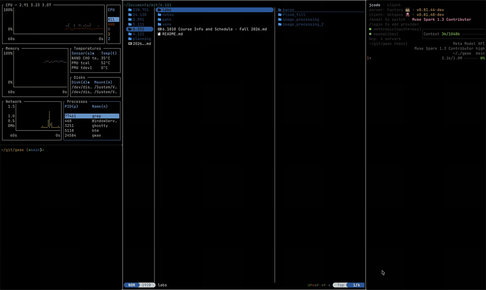
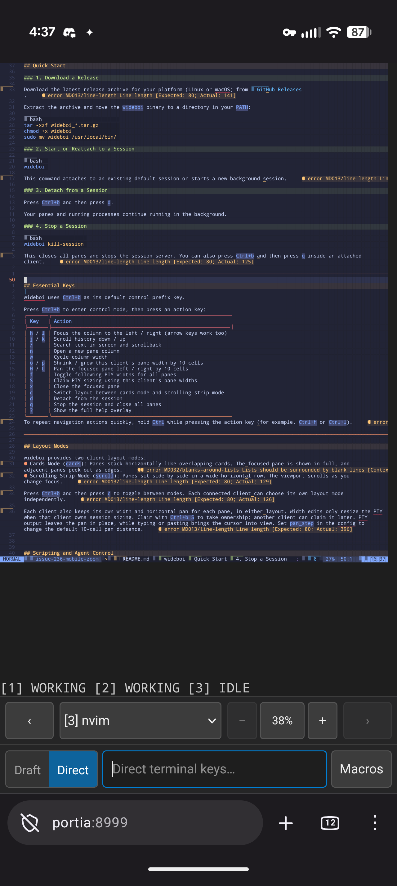
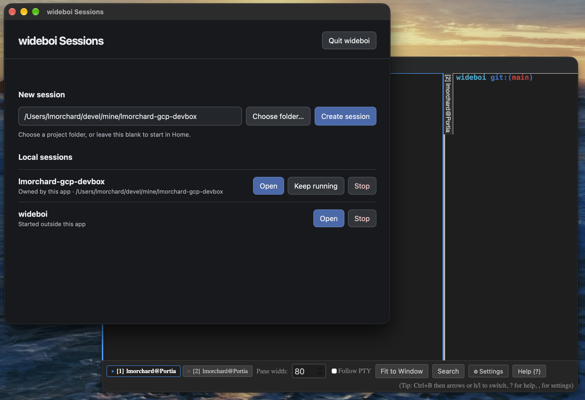

**TL;DR**: What started about ten days ago on a whim as an experiment in horizontally scrolling terminals across an ultrawide monitor turned into [wideboi](https://github.com/lmorchard/wideboi)—a terminal multiplexer with animated cards, an embedded web UI for phones, a desktop app, and a headless control surface for AI coding agents. This really didn't need to get made, except that I wanted to make it.

<!--more-->

<figure class="wide">
<video controls preload="metadata" style="width: 100%; border-radius: 8px;">
  <source src="wideboi-2.mp4#t=0.1" type="video/mp4">
</video>
<figcaption>
Overlapping live terminals go zoop zoop zoop
</figcaption>
</figure>

<nav role="navigation" class="table-of-contents"></nav>

## The Ultrawide Problem

I have [an ultrawide monitor](https://www.dell.com/support/product-details/en-ca/product/u3423we-monitor/resources/manuals) on my desk. Most terminal multiplexers—[`tmux`](https://github.com/tmux/tmux), [`screen`](https://www.gnu.org/software/screen/), [`zellij`](https://zellij.dev/)—seem convinced that monitors should be divided like graph paper. You split horizontally, you split vertically, you split again, and before long you're squinting at four 35-column slits where every shell command wraps into unreadable soup.

What I actually wanted was something much simpler: I want to have a bunch of terminals running at comfortable, readable widths, [go *zoop zoop zoop*](https://masto.hackers.town/@lmorchard/117317387148485076) between them with a keystroke, and vaguely see them chattering away while I stare off and dissociate.

About [two weeks ago](https://masto.hackers.town/@lmorchard/117283530811881043), I ran across [niri](https://github.com/YaLTeR/niri), a scrollable-tiling Wayland window manager for Linux. And then I found [gwae](https://github.com/hongnoul/gwae), which adapts niri's concept down to a terminal grid. The core idea is kinda dead simple: **panes tile but never shrink.** If you open another pane, you don't crush the existing ones down to slivers; you leave them full width and let the viewport scroll horizontally.

<figure class="wide">

<figcaption>
<a href="https://github.com/YaLTeR/niri">niri</a>: windows arranged in columns along an infinite horizontal strip.
</figcaption>
</figure>

<figure class="wide">

<figcaption>
<a href="https://github.com/hongnoul/gwae">gwae</a>: bringing that infinite scrolling strip into a terminal multiplexer.
</figcaption>
</figure>

I loved the idea and wanted to tinker with it myself. I hadn't done much low-level terminal plumbing since messing around with ANSI art and BBS doors decades ago. I've got Claude Code, though, so I started a new project called [`wideboi`](https://github.com/lmorchard/wideboi), and decided to see what could happen. I think I got kind of carried away as one thing after another seemed to work.

I had three departures in mind from the start:

1. Write it in Go instead of Rust, which gwae uses - [I'm really liking Go lately for little personal tools](https://blog.lmorchard.com/2025/10/25/miscellanea/).
2. Animate focus changes so moving between panes feels visually readable, rather than instantaneous.
3. Keep the architecture split cleanly in half, client & server from day one.

## The Seam

On Day 1, I drew up a spec with a deliberate list of non-goals: no daemon, no detaching, no reattaching, no card layouts, no configuration files, and no network sockets. Just an exploratory spike to see if Go could handle smooth terminal compositing without melting my CPU. Turns out it really, really can.

A lot of credit goes to the Charmbracelet ecosystem here. Under the hood, wideboi leans heavily on [`charmbracelet/ultraviolet`](https://github.com/charmbracelet/ultraviolet) for cell buffers and differential screen rendering, and [`charmbracelet/x/vt`](https://github.com/charmbracelet/x/tree/main/vt) for virtual terminal emulation. The upstream foundation is really solid.

The one architectural bet I *did* make up front was that third departure, which I called "The Seam." I borrowed the word from Claude: sometimes rolling with an agent's vocabulary helps get an idea across without three paragraphs of preamble.

In this case, it meant two isolated packages communicating strictly over Go channels:

- A **server** that owned the state and real processes: spawning PTYs, driving terminal emulators, tracking scrollback.

- A **client** that owned the physical host screen: putting the terminal into raw mode, decoding keystrokes, animating transitions, and blitting cell buffers.

That "seam" complicated things at first. But, the payoff came quick: when I decided I wanted real multiplexer ergonomics—detaching and running in the background—I didn't have to rewrite the core. I just pulled out the in-memory Go channel and dropped a Unix domain socket into the seam.

Almost overnight, `wideboi` graduated from a what-if into a real client/server daemon: `wideboi attach`, named sessions (`wideboi -L work`), and session listings with `wideboi ls`.

I had a little baby `screen` in no time.

## Going *Zoop Zoop Zoop*: Strips vs. Cards

The first layout mode was straightforward: a wide horizontal ribbon of full-sized panes where the camera pans left and right. Very gwae and niri.

It worked, but on an ultrawide screen, panning a vast panorama can feel like sitting in the front row of an IMAX theater. That led to the second layout: **Cards Mode**. Instead of sitting side-by-side on an infinite bench, panes stack horizontally like a hand of playing cards. They still don't crush down; instead, they slip under each other.

If you've used [Zellij's stacked panes](https://zellij.dev/features/#stacked-panes), it's a bit like that concept rotated ninety degrees. But while Zellij stacks vertically and collapses inactive panes down to title-bar tabs, wideboi stacks them horizontally and leaves a sliver of actual live terminal output exposed along the edges. I've been finding that that little partial vertical slice of live terminal is enough to let me oversee quite a few ongoing processes.

Adding directional wipes made navigating between them feel great. The newly focused card slides into view while its neighbors tuck underneath it. I can follow where my processes are as the cards shuffle around. That's a lot more UX than I expected to get working in a terminal.

<figure class="wide">
<video controls preload="metadata" style="width: 100%; border-radius: 8px;">
  <source src="wideboi.mp4#t=0.1" type="video/mp4">
</video>
<figcaption>
The initial cards mode prototype in action: fanning and wiping between overlapping live terminals.
</figcaption>
</figure>

## "Sometimes You Need to Check on Your Wideboi from a Smol Phone"

Once I had a multiplexer running long-lived jobs, I immediately ran into the classic problem faced by an agent addict with ADHD: I stepped away from my desk, went for a walk, and wanted to see if my build finished.

Because the server already spoke a clean, typed protocol across a socket, adding a remote client was surprisingly approachable. So I built an embedded web server straight into the Go binary.

Run `wideboi server --websocket <tailnet-ip>:8080`, and it spins up an HTTP/WebSocket server serving a single-page app built with Lit and HTML5 Canvas. It generates an ephemeral self-signed TLS cert on the fly and gives you a URL with a token.

A quick security note that I also put in big bold letters in the README: wideboi is *not* hardened against strangers, and its token URL is just a speed bump. Put it on a [Tailscale](https://tailscale.com/) tailnet or behind a private VPN rather than exposing raw shell access to the open internet.

I wanted the same cards and scrolling strip in the browser, but a phone needed a few concessions. On narrow screens, the cards give way to a single focused pane with swipe navigation. Quick-action buttons and a command palette save me from fighting the soft keyboard for control keys. The on-screen keyboard also needed room without truncating the terminal underneath it.

Getting there was an iterative blur of dogfooding: use it, notice something that needed tweaking, ask the agent to open an issue and then a PR, repeat. I can describe the result neatly now, but at the time it was a lot of little adjustments discovered by actually trying to use the thing. The [commit history](https://github.com/lmorchard/wideboi/commits/main/) tells that story.

<figure class="wide">
<video controls preload="metadata" style="width: 100%; border-radius: 8px;">
  <source src="wideboi-3.mp4#t=0.1" type="video/mp4">
</video>
<figcaption>
The web UI running in a desktop browser: cards mode and live terminal output streaming over WebSockets.
</figcaption>
</figure>

<figure>

<figcaption>
Checking in on wideboi from a phone: adapting down to a single pane with touch controls. 
Not a video, because I'm lazy. 🤷‍♂️
</figcaption>
</figure>

Not long after the web client landed, wrapping the web frontend into a not-quite-native desktop app using [Wails v3](https://v3.wails.io/) fell out naturally as well, giving `wideboi` dedicated desktop windows on macOS and Linux. I was vaguely tempted to try building an Electron app, just because I've never tried it before, though I'd heard complaints about its heaviness. I ended up trying Wails, and this thing worked out nicely.

<figure class="wide">

<figcaption>
The desktop wrapper using Wails v3, managing local sessions in their own dedicated application windows.
</figcaption>
</figure>

## The Agent Loop

While I was building all of this for myself, my daily workflow shifted. I wasn't just using terminals to run `git` and `vim`; I was using them to host AI coding agents like Claude Code and opencode.

I wanted agents to launch a job in a dedicated pane, wait for it to finish, and inspect the output without taking over the terminal I was using. Commands like `wideboi split --keep <cmd>`, `wideboi wait <id>`, and `wideboi capture <id>` made that possible. The `--keep` flag preserves a finished pane's screen buffer and exit code so an agent can inspect what happened before closing it.

I also wanted to know which panes needed *me*. Their headers now show `idle`, `working`, `needs_input`, or `done`, using OSC 133 prompt markers and OSC 9;4 progress notifications. A shell that announces it's sitting at a prompt reads as `needs_input`, and a program reporting progress reads as `working` until it says it's finished. That depends on the shell or program emitting those signals; the markers alone can't tell me what an arbitrary program is waiting for. Along the way, I've been learning a bunch about this weird [OSC ("operating system commands") sideband of control characters](https://iterm2.com/documentation-escape-codes.html) that many terminals apparently support.

## When Dogfooding Gets Weird

Here is where the project went recursive: I began using agents running *inside* `wideboi` to write features and fix bugs for `wideboi`.

Dogfooding your own terminal multiplexer in real time is an adventure. If you're building a web app and introduce a bug, a browser tab reloads or throws a console error. If you're building the multiplexer that hosts your own agent session and something goes sideways, the universe vanishes.

The agents and I ran into some spectacular failure modes:

- **The Suicide Test:** During a routine test run, an agent ran the test suite from inside a pane.

  One palette test dispatched a `quit` command without passing an explicit socket path. The multiplexer dutifully resolved the request against `config.DefaultSocketPath()`—which was the live session hosting the agent itself!

  The test passed, and simultaneously vaporized the agent's entire world.

  That gave us a concrete rule for developing inside the thing we were changing: every test harness needs its own isolated session. We also added an immortal `exits.log` black box flight recorder so we can see why a session died after the fact.

- **The SIGHUP Trap:** Initially, sessions were designed to exit when their owning terminal died.

  Then my SSH connection dropped while working remotely; when `sshd` cleaned up the stale TTY two minutes later, the SIGHUP tore down the whole session and all my running jobs.

  We quickly migrated to the classic `tmux` model: a severed connection detaches the session, leaving it humming safely in the background.

- **In-Place Upgrades:** When you're making fifty changes a day to a multiplexer you are actively living inside of, restarting the server every time you rebuild is unbearable.

  So we taught `wideboi` how to perform in-place binary upgrades via `syscall.Exec`, replacing the running program with the new binary while keeping the same process ID.

  This is where I ended up maintaining a temporary [fork of x/vt](https://github.com/lmorchard/x/tree/vt-scrollback-ring): I needed access to its internal scrollback ring buffers and cursor state to carry them over into the new binary.

  It snapshots pane states, serializes terminal emulators, execs the newly compiled binary, and rehydrates everything in milliseconds—without dropping open PTYs or killing active agent processes. The PTYs survive because file descriptors carry across an `exec` unless they're marked close-on-exec. So wideboi clears that flag on each pane's PTY, writes the descriptor numbers into its snapshot, and the new binary just picks them back up. Feels like a dirty POSIX trick, and I am delighted by it.

## Where It's At Now

Ten days in, `wideboi` has settled into something that feels, to me at least, surprisingly solid and comfy to use. If you're curious or have your own ultrawide monitor to waste, the code and prebuilt binaries for macOS and Linux are [over on GitHub](https://github.com/lmorchard/wideboi/releases).

It runs on my ultrawide desktop as a fluid deck of overlapping terminal cards. It runs in a browser tab on my laptop or phone when I'm away from my desk. It lets agents run parallel builds and notify me when they need review. And when I push a bug fix, it can reload its own brain mid-stride while my shell prompts keep blinking.

Remember that Day 1 list of non-goals? No daemon, no detaching, no card layouts, no configuration files, no network sockets. Yeah, I built all that.

Building your own tools to scratch your own peculiar itch seems like a good use of a coding agent. It was also a good way to learn a bunch about terminal stuff I'd always been curious about, including a few POSIX PTY horrors. And, best of all, now my terminals go *zoop zoop zoop*.

(I should actually add sound effects 🤔)
