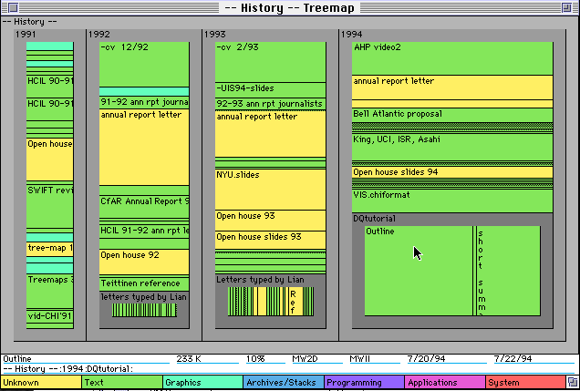

Another little test, this time trying to build something like a [Treemap][treemap], using CSS and semantic HTML.

The above image is an example of what I'm trying to go for.  Here's a sample of what I've got:

<a href="http://www.decafbad.com/2005/06/tree.html">http://www.decafbad.com/2005/06/tree.html</a>

Two things I can't seem to work around with my understanding of CSS:

1. Is there a way to clear the floats in the unordered lists without using a break?
2. Is there a way to even out the heights and widths of the columns / rows without some Javascript intervention?

[treemap]: http://www.cs.umd.edu/hcil/treemap-history/
[tree]: http://www.decafbad.com/2005/06/tree.html
<!--more-->
shortname=css_treemaps

            <h3>Archived Comments</h3>
            
        <ul class="comments">
            
        <li class="comment" id="comment-221082857">
            

                

                    
                    <a class="avatar name" rel="nofollow" 
                       href="http://trikuare.cx/">fluffy</a>
                

                <a href="#comment-221082857" class="permalink"><time datetime="2005-07-03T00:39:49">2005-07-03T00:39:49</time></a>
            

            
1. You can use a span whose style contains clear:both, or if you already have something which already goes after the list anyway you can set its style to clear:both

2. You can use container-relative sizes (e.g. width:33% height:25%) or font-relative sizes (width:15em height:10em).  Then you have to know how big they'll be in advance, though, or else things might overflow the box, though if you set overflow:auto then you'll get a handy little scrollbar.  (note that this is also one of the more annoying places if you want to support IE since it uses totally different semantics than the W3C standards.  unfortunately, even a vendor as major as my employer needs to cater to our 70% IE userbase, which is REALLY annoying with some of the CSS/DHTML tricks I'm working with right now.)

            
        </li>
    
        <li class="comment" id="comment-221082858">
            

                

                    
                    <a class="avatar name" rel="nofollow" 
                       href="http://annevankesteren.nl/">Anne</a>
                

                <a href="#comment-221082858" class="permalink"><time datetime="2005-07-03T05:48:13">2005-07-03T05:48:13</time></a>
            

            
For the first you can use generated content in combination with _height:1%; for Internet Explorer. Sometimes it's wise to use some other technique for clearing them though, depends on the situation.
(Other technique: http://annevankesteren.nl/2005/03/clearing-floats )

For the second, you either want to make smart use of background images or the CSS table module that isn't supported by Internet Explorer.

            
        </li>
    
        <li class="comment" id="comment-221082859">
            

                

                    
                    <a class="avatar name" rel="nofollow" 
                       href="http://www.drunkenblog.com">drunkenbatman</a>
                

                <a href="#comment-221082859" class="permalink"><time datetime="2005-07-13T16:59:04">2005-07-13T16:59:04</time></a>
            

            
very, very cool

            
        </li>
    
        <li class="comment" id="comment-221082860">
            

                

                    
                    <a class="avatar name" rel="nofollow" 
                       href="">vinod ts</a>
                

                <a href="#comment-221082860" class="permalink"><time datetime="2006-09-07T12:16:45">2006-09-07T12:16:45</time></a>
            

            

hi,

I was looking throught the sites for treemap using dom javascript  in browser. i am looking for something similar to the image in web page. i am getting the values like x,y cordinates and their respective width and height and their childs x,y cordinates and their width and height. Can u give some ideas how to start working on it.

Thanks in Advance.

Regards
Vinod T S

            
        </li>
    
        </ul>
    
        

    