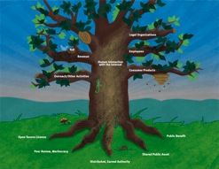

[caption id="attachment_1582" align="alignright" width="247" caption="The Mozilla Tree"][/caption]

Behind Firefox is Mozilla, and behind Mozilla is a community.  And the Mozilla community acts a lot like an ecosystem, which can be visualized [as a kind of living tree][tree]—not to confused with the [mozilla-central tree][mctree].  Oh yeah, and Mozilla is the name of [both a Foundation and a Corporation][mocofo].

Confused yet?  If not, then we should talk so you can explain it to me, because it all looks pretty tangly and [intertwingled][inter] to me.  Nonetheless, it seems to work, and produces a good chunk of my favorite software and technologies.

There are many efforts to track what's going on—including [planets][planet] and [newsletters][about] and [bugzillas][bugzilla] and [wikis][wikis] and [repositories][repos] and [tinderboxen][tinderbox].  Some of these resources report on, or are driven by, the activity occurring in the others.  Some are automated, and others are carefully stitched together by hand.  None offer a full picture of what's going on in the [Mozilla galaxy][galaxy] in a way that's casually comprehensible by a sane human being.

Of course, that's not a slight against any of these sites or the people maintaining them—extracting an overview from such an organic phenomenon is neither easy nor straightforward.  But, it might be fun to try.

As an infovore and avid practitioner of [continuous partial attention][firehose], my first impulse is to reach for a firehose and stick my head into the stream.  Relax, defocus, and try to let my pattern recognizers do their thing—sometimes those pattern recognizers are in my head, and [sometimes they're written in Python][popularlinks].

[caption id="attachment_1585" align="alignright" width="225" caption="Firefox Victory!"][/caption]

But, for Mozilla, I couldn't find a stream of sufficient volume or completeness to satisfy me or [my robots][myrobots].  Happily, though, my feeding urge found itself aligned with a project to discover the patterns of contribution in the Mozilla community and to find a way to thank the contributors responsible.

So, while we're still working on the thank-you angle, allow me to introduce you to [the Lizardfeeder][lizardfeeder].  The [LizardFeeder][lizardfeeder] is a feed aggregator, [whose source code][lizardcode] is built atop [Sam Ruby's Planet Venus][venus]. The [LizardFeeder][lizardfeeder] pulls together and archives activity streams from a wide variety of Mozilla community sources.  Beyond the usual human-readable pages produced by a [blog-gathering Planet][planet], the [LizardFeeder][lizardfeeder] accumulates [statistical and historical data][jsondata] meant for consumption and analysis by robots.

At present, the only robot navigating the [LizardFeeder][lizardfeeder] archives is an AJAX-ified user interface that animates the firehose as a near real-time or time-lapsed stream of events scrolling by.  

This is just meant as a conversation starter, though.  I'm hoping to [gather feedback and find more sources][requests], as well as to entice creative community members to come up with more sophisticated visualizations of this data.  

So, take a look, [check it out][lizardfeeder], and let me know what you think!

[myrobots]: http://www.digitpress.com/dpsoundz/destroyhimrobots.wav
[inter]: http://en.wikipedia.org/wiki/Intertwingularity
[mocofo]: http://www.mozilla.org/reorganization/
[mctree]: https://developer.mozilla.org/en/mozilla-central
[galaxy]: http://ascher.ca/blog/2008/06/19/whats-mozillas-scope-what-should-it-be/
[popularlinks]: http://decafbad.com/hgwebdir.cgi/hacking_rss_and_atom/file/f7a85b9fd48a/ch15_popular_links.py
[jsondata]: http://feeds.mozilla.com/archives/index.json
[lizardcode]: https://svn.mozilla.org/projects/lizardfeeder/trunk/
[venus]: http://www.intertwingly.net/code/venus/
[lizardfeeder]: http://feeds.mozilla.com/
[firehose]: http://decafbad.com/blog/2005/09/23/the-zen-of-firehose-drinking
[tinderbox]: http://tinderbox.mozilla.org/showbuilds.cgi?tree=Firefox
[repos]: http://hg.mozilla.org/
[wikis]: https://wiki.mozilla.org/WeeklyUpdates/2009-01-05
[bugzilla]: https://bugzilla.mozilla.org/
[planet]: http://planet.mozilla.org/
[about]: http://blog.mozilla.com/about_mozilla/
[tree]: http://blog.lizardwrangler.com/2008/07/29/the-mozilla-tree/
[requests]: https://bugzilla.mozilla.org/show_bug.cgi?id=469838

            <h3>Archived Comments</h3>
            
        <ul class="comments">
            
        <li class="comment" id="comment-221083355">
            

                

                    
                    <a class="avatar name" rel="nofollow" 
                       href="">dria</a>
                

                <a href="#comment-221083355" class="permalink"><time datetime="2009-01-06T01:26:18">2009-01-06T01:26:18</time></a>
            

            

Is there a list of what sources are already being read by the LizardFeeder anywhere?  I scanned through the various links here but didn't see anything obvious :)

            
        </li>
    
        <li class="comment" id="comment-221083356">
            

                

                    
                    <a class="avatar name" rel="nofollow" 
                       href="http://www.decafbad.com">l.m.orchard</a>
                

                <a href="#comment-221083356" class="permalink"><time datetime="2009-01-06T01:37:15">2009-01-06T01:37:15</time></a>
            

            

Yeah, that part could use some improvement.  There's a monster list here:

http://feeds.mozilla.com/sources.opml

            
        </li>
    
        <li class="comment" id="comment-221083358">
            

                

                    
                    <a class="avatar name" rel="nofollow" 
                       href="http://briks.si">Brian King</a>
                

                <a href="#comment-221083358" class="permalink"><time datetime="2009-01-06T10:11:46">2009-01-06T10:11:46</time></a>
            

            

Excellent stuff. I was going to ask about access to the list of sources for each category, but Dria beat me to it.

            
        </li>
    
        <li class="comment" id="comment-221083359">
            

                

                    
                    <a class="avatar name" rel="nofollow" 
                       href="http://www.decafbad.com">l.m.orchard</a>
                

                <a href="#comment-221083359" class="permalink"><time datetime="2009-01-06T15:26:50">2009-01-06T15:26:50</time></a>
            

            

Actually, it occurs to me that this config file might work as a more readable version of the list of sources:

https://svn.mozilla.org/projects/lizardfeeder/trunk/conf/config.ini-dist

There's also this, which is where most of the previous list came from: 

https://svn.mozilla.org/projects/lizardfeeder/trunk/conf/hg-feeds.opml-dist

            
        </li>
    
        <li class="comment" id="comment-221083360">
            

                

                    
                    <a class="avatar name" rel="nofollow" 
                       href="http://ozten.myopenid.com/">Austin King</a>
                

                <a href="#comment-221083360" class="permalink"><time datetime="2009-01-06T20:55:52">2009-01-06T20:55:52</time></a>
            

            

Thanks for the background surrounding lizard feeder. Great post!

+1 Dria and Brian

Maybe make the title of the link to the OPML more descriptive than just "Feeds" and/or link to it in the body of the UI too and write something around it to encourage other's visualizations.

Awesome work Les.

            
        </li>
    
        <li class="comment" id="comment-221083361">
            

                

                    
                    <a class="avatar name" rel="nofollow" 
                       href="">Sanjay Parekh</a>
                

                <a href="#comment-221083361" class="permalink"><time datetime="2009-02-04T20:38:04">2009-02-04T20:38:04</time></a>
            

            

Is the AJAX UI available anywhere for download?  I'd like to hack it for another use altogether.  Great visualization and great application.  Good job.

            
        </li>
    
        <li class="comment" id="comment-221083362">
            

                

                    
                    <a class="avatar name" rel="nofollow" 
                       href="">Deen Seth.</a>
                

                <a href="#comment-221083362" class="permalink"><time datetime="2009-09-16T18:21:02">2009-09-16T18:21:02</time></a>
            

            

This is a very good idea.  Can we accomplish the same result using Yahoo Pipe?  Do you plan to add events from Bugzilla, and mailing list to the feed?

I am more interested in development activities.  There aren't much in code category.

I am interested in analyzing development related events.

            
        </li>
    
        </ul>
    
        

    