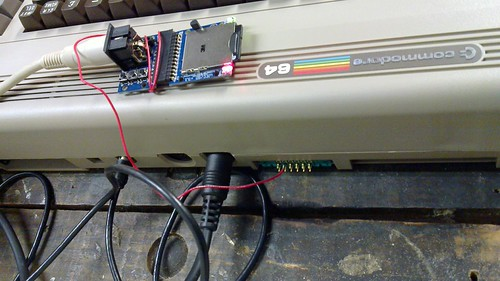
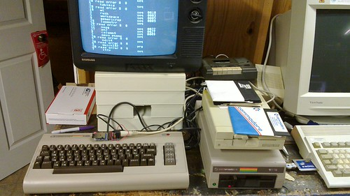

I've lived a very focused life. [From very early on][newlydigital], I've been learning to make computers do things.

[newlydigital]: http://decafbad.com/blog/2003/06/13/newly-digital

And being as introspective as I am, I like spending time considering how I got here.  I suppose this is nostalgia, but I like to think of it as recentering and recapitulation. Contemplating the story so far, as a means to consider the story yet to come.

One huge benefit of this habit is that I've become ever more appreciative of today.  It's easy to forget, but we're living in the future these days—at least, with respect to [who I was in 1983][newlydigital].

No flying cars yet, but for US$55 I was able to [buy a tiny gadget called a uIED/SD][uiec] that gives a [Commodore 64][c64] access to modern SD cards for storage.  And, of course, I have [Jason Scott's review of the more general-use FC5025 5.25? Floppy to USB Adapter][review] to blame in getting me started on this current mini-obsession.

You want to talk about a magical device? Screw the iPad—this is magic.  

This is what it looks like:

[][flickruiec]

[flickruiec]: http://www.flickr.com/photos/deusx/4486021528/
[review]: http://ascii.textfiles.com/archives/2503
[c64]: http://en.wikipedia.org/wiki/Commodore_64
[uiec]: http://www.jbrain.net/products/uIEC%7B47%7DSD.html
<!--more-->To put that in context, take a look at this thing alongside the [Commodore 1541][1541] drives it emulates:

[][flickruiec2]

If my math is right—and it often isn't—plonking a 1GB card into this thing is the equivalent of over 5700 old-school floppies.  That's nearly incomprehensible if you try to wrap your head around it in an appreciative context.  

I don't think I've ever touched that many floppies, even after getting my hands into huge (to me at the time) boxes of software shipped between friends and strangers across the country and overseas in a filesharing [sneakernet][] that made every month feel like Christmas. ([Never underestimate the bandwidth][bandwidth] of the postal service.)

[sneakernet]: http://en.wikipedia.org/wiki/Sneakernet
[bandwidth]: http://www.bpfh.net/sysadmin/never-underestimate-bandwidth.html

Today, all that stuff and more can be found [in torrents topping 20GB][giga] that offer brain-numbingly huge archives of both commercial abandonware and [freely-shared demoscene releases][demos].  I'm sure there are things left out, but you'd be hard pressed not to find everything you ever remembered seeing on a [Commodore 64][c64].  These archives are so large and uncurated that it's easier to do research online first  to come up with things to look.  Kind of like those huge boxes, but we had no web to search back in the day.

[giga]: http://www.google.com/search?q=c64+gigatorrent
[demos]: http://noname.c64.org/csdb/
[c64]: http://en.wikipedia.org/wiki/Commodore_64

And nearly all of it works on [this thing][uiec] after a quick drag-and-drop into the FAT-formatted filesystem of an SD card.  You just need to rediscover and dust off some old expertise with the [arcane DOS wedge commands of the Commodore era][doswedge], [sprinkle in some new additions][sdreadme] to navigate modern directory structures and disk images, and you're off.  Sure, you could just [use an emulator][vice] for this stuff—but if you don't get at least a little thrill from the original hardware, you probably never grew up with it.

[vice]: http://www.viceteam.org/
[doswedge]: http://en.wikipedia.org/wiki/DOS_Wedge
[sdreadme]: http://sd2iec.de/cgi-bin/gitweb.cgi?p=sd2iec.git;a=blob;f=README;hb=HEAD

For the floppies I *do* still possess, the [uIEC/SD][uiec] can write to as well as read from SD cards. So, the real magic is that I've been able to recover all kinds of data from 15-25 years ago: old BASIC and assembly programs; awkward poetry and short stories; embarrassing high school newspaper articles and columns; college application essays; archived message threads of religious debates and miscellaney from BBSes I used to call; even the memory-jogging lists of names and numbers to those BBSes that started so much for me.

In short, further fodder for introspection that I thought was long lost to bitrot and drive failure.  Luckily, all my old-school hardware and media seems to be in just enough working order to make one more transfer.  I can only hope to be in as decent shape myself someday, should the [Rapture of the Nerds][nerdrapture] ever come.

[nerdrapture]: http://www.metafilter.com/89307/The-Rapture-of-the-Nerds

Anyway, I wanted to get this breathless post off my chest first, but I'm thinking about writing a more in-depth account of using this thing, with links pointing at what to download first and how to use it.  You know, written to that recent-past self of mine who'd just opened the package and stared dumbfounded at the "<code>Ready.</code>" prompt again with serious intent for the first time in a decade or so.  

Let me know if that'd be of interest.

[uiec]: http://www.jbrain.net/products/uIEC%7B47%7DSD.html
[flickruiec2]: http://www.flickr.com/photos/deusx/4486021636/in/photostream/
[1541]: http://en.wikipedia.org/wiki/Commodore_1541

            <h3>Archived Comments</h3>
            
        <ul class="comments">
            
        <li class="comment" id="comment-221090738">
            

                

                    
                    <a class="avatar name" rel="nofollow" 
                       href="http://jclark.org/weblog/">Jason Clark</a>
                

                <a href="#comment-221090738" class="permalink"><time datetime="2010-04-08T02:37:43">2010-04-08T02:37:43</time></a>
            

            

There is, at this very moment, a box full of floppies (including plenty of manually hacked 'flippies' made with a hole punch) a 1541 Disk Drive, and at least one but possibly two functioning C-64s, plus various and sundry joysticks, modems, Fast Load Cartridges &amp;tc.,  sitting in my garage, just waiting to be called forth again into the light, as soon as I have an excuse and some time.  Time's in short supply right now, but a post with lots of details would surely be my excuse.

            
        </li>
    
        <li class="comment" id="comment-221090739">
            

                

                    
                    <a class="avatar name" rel="nofollow" 
                       href="">Metal Fatigue</a>
                

                <a href="#comment-221090739" class="permalink"><time datetime="2010-04-08T03:07:48">2010-04-08T03:07:48</time></a>
            

            

I'd definitely like to see a more in-depth post.

            
        </li>
    
        <li class="comment" id="comment-221090741">
            

                

                    
                    <a class="avatar name" rel="nofollow" 
                       href="http://kentbrewster.com/">Kent Brewster</a>
                

                <a href="#comment-221090741" class="permalink"><time datetime="2010-04-08T04:19:08">2010-04-08T04:19:08</time></a>
            

            

First program I ever sold was Typo Invaders, a VIC-20 game that appeared in Compute's Gazette in 1983 or so. I've found it online, but every copy has a syntax error on line 60 that I can't fix in the emulator because of keyboard differences. I would be very, very appreciative of a corrected copy, or even a plaintext listing ... I'm pretty sure I invented the learn-to-type-or-be-blown-to-bits game. :)

            
        </li>
    
        <li class="comment" id="comment-221090742">
            

                

                    
                    <a class="avatar name" rel="nofollow" 
                       href="http://www.decafbad.com">l.m.orchard</a>
                

                <a href="#comment-221090742" class="permalink"><time datetime="2010-04-08T04:43:21">2010-04-08T04:43:21</time></a>
            

            

@Kent: Is this what you're looking for?

http://decafbad.com/2010/04/typo-invaders/

I managed to convert the .prg to .txt using a petcat utility that comes with the Vice 64 emulator.  I think I see your syntax error - line 160 has a : that seems out of place.

The keyboard mapping on my Vice emulator under OS X seems not horrible - so if I figure out what that line should be, I could possibly fix it for you and send you a .d64 image with the corrected .prg

            
        </li>
    
        <li class="comment" id="comment-221090743">
            

                

                    
                    <a class="avatar name" rel="nofollow" 
                       href="http://www.decafbad.com">l.m.orchard</a>
                

                <a href="#comment-221090743" class="permalink"><time datetime="2010-04-08T05:00:22">2010-04-08T05:00:22</time></a>
            

            

@Kent: Also, I have a torrent of Compute's Gazette downloading now - claims to have all disks as .d64 and issues as .pdf.  Maybe I'll run across the issue with the original listing in it.

http://thepiratebay.org/torrent/4623812/

            
        </li>
    
        <li class="comment" id="comment-221090745">
            

                

                    
                    <a class="avatar name" rel="nofollow" 
                       href="http://ciarang.com/">CiaranG</a>
                

                <a href="#comment-221090745" class="permalink"><time datetime="2010-04-09T14:51:43">2010-04-09T14:51:43</time></a>
            

            

Interesting. You've sent me off on a similar obsessive search, and I found the following, which I now must have one of:

http://hxc2001.free.fr/floppy_drive_emulator/index.html

All my old machines are hooked up to PCs in various ways to allow software transfer, but having them standalone with an SD card looks much more interesting.

            
        </li>
    
        <li class="comment" id="comment-221090746">
            

                

                    
                    <a class="avatar name" rel="nofollow" 
                       href="http://www.jeriellsworth.com">Jeri Ellsworth</a>
                

                <a href="#comment-221090746" class="permalink"><time datetime="2010-08-03T20:46:09">2010-08-03T20:46:09</time></a>
            

            

Nice!

            
        </li>
    
        </ul>
    
        

    